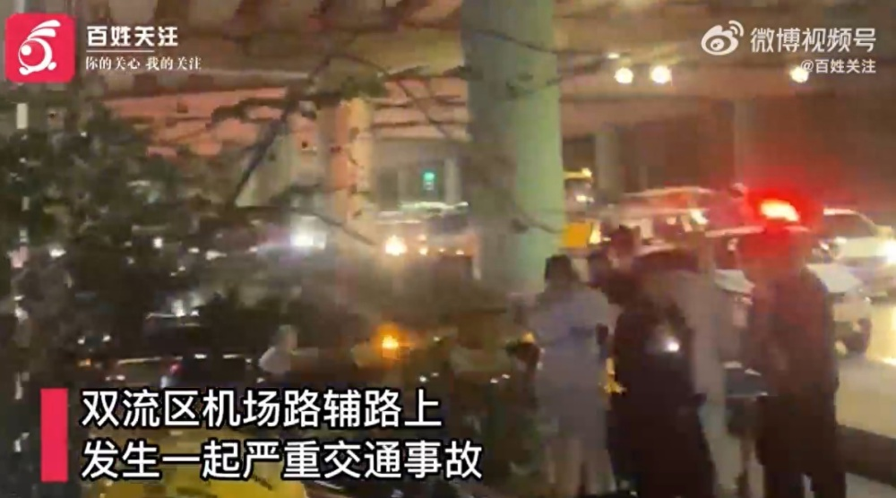
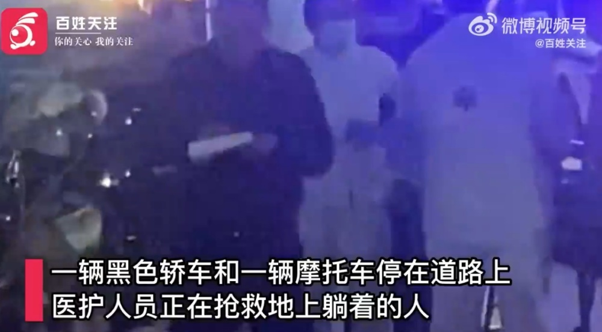
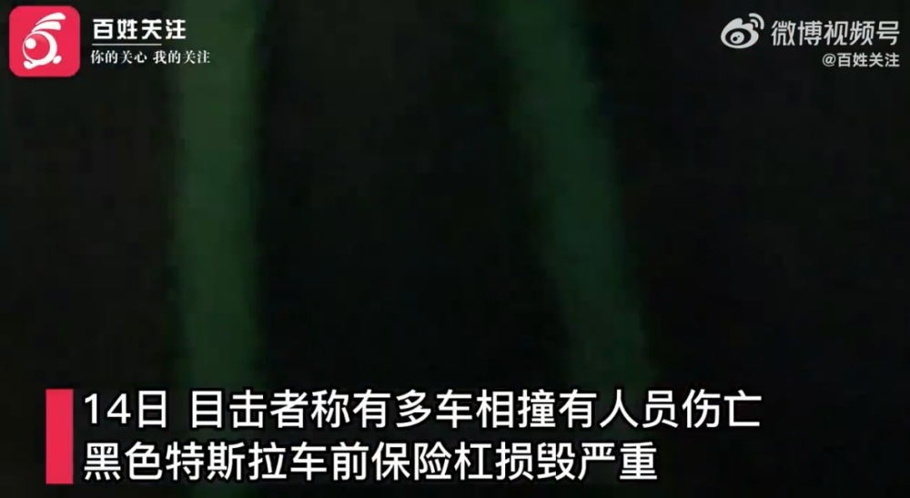
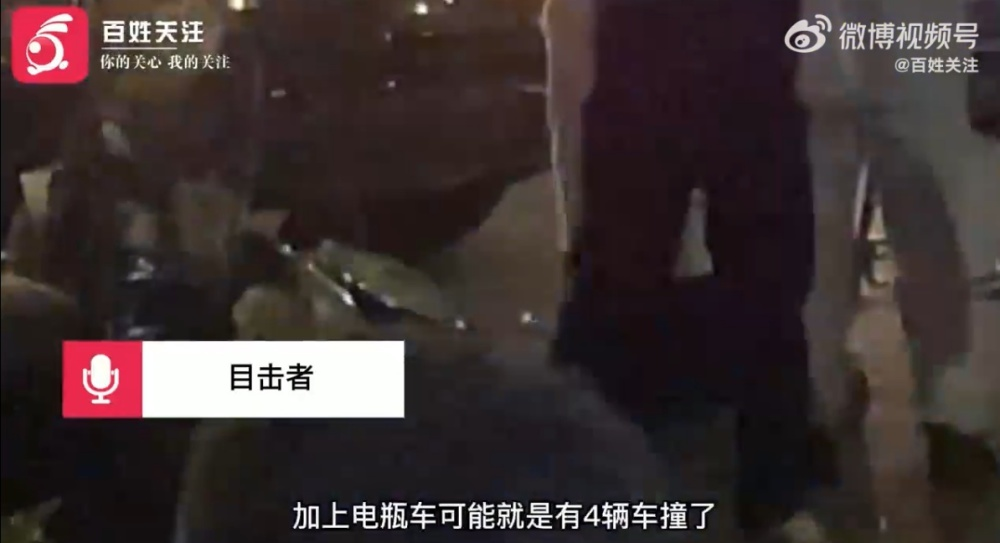
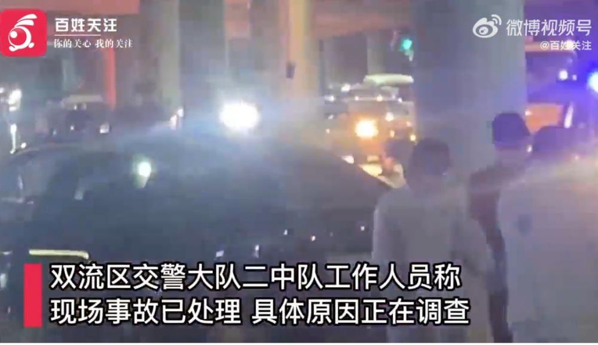

# 成都机场路辅路多车相撞有人伤亡？目击者称特斯拉逆行停放，警方回应

11月14日，据贵州广播电视台“百姓关注”报道，11月13日，四川省成都市双流区机场路辅路上，发生一起严重交通事故。

视频显示，辅路上停着一辆黑色轿车和一辆摩托车，有医护人员正在对躺在地上的人员实施抢救。

11月14日，有目击者称有多车相撞，
道路栏杆被撞坏，黑色特斯拉逆行停放，车前保险杠损毁严重，主路上还有一辆被撞的车打着双闪，特斯拉车主以及电瓶车上人员死亡。

双流区交警大队二中队工作人员称，现场事故已处理，具体原因正在调查。

**【来源：九派新闻综合贵州广播电视台“百姓关注”】**

