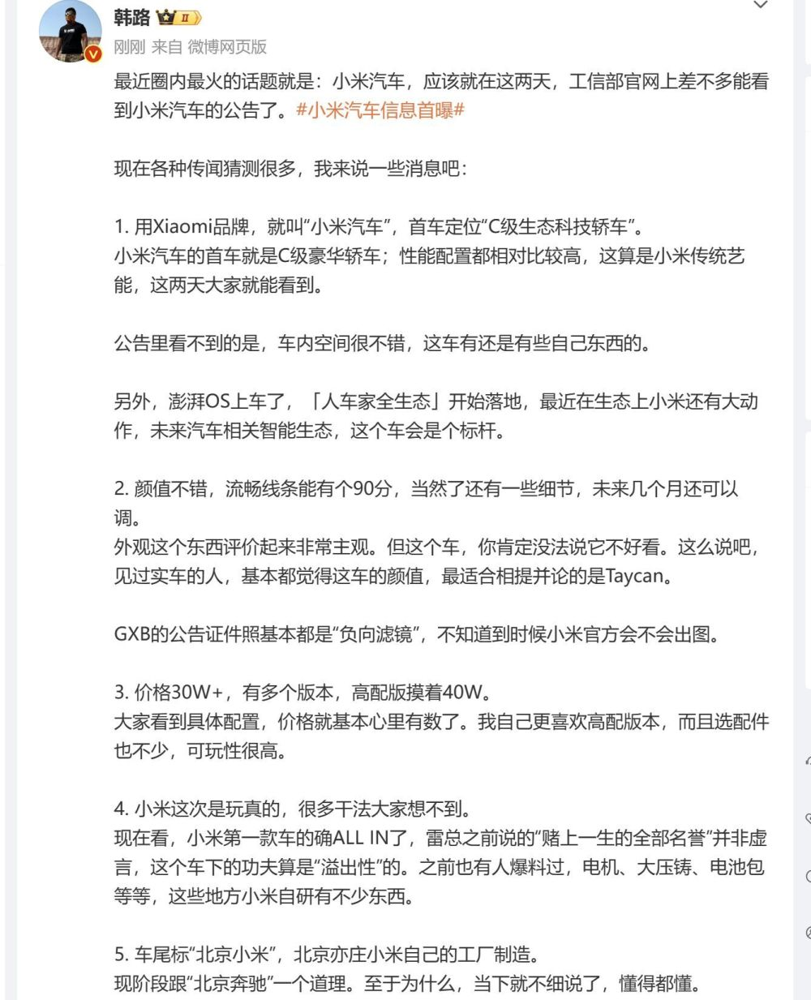

# 汽车博主曝光小米汽车：30万左右，车尾标北京小米

鞭牛士报道，11月14日消息，资深汽车博主韩路微博近日发文曝光了关于小米汽车的相关信息，称最近几天工信部将发布小米汽车的相关公告。

韩路表示，小米汽车价格定位为C级豪华轿车，名字就叫小米汽车，最低价格30万左右，高配50万左右，搭载澎湃OS，颜值不错，线条可打90分，车尾将标北京小米字样，和北京奔驰一个意思，由北京亦庄小米工厂制造。

在此前的小米发布会上，小米方面表示汽车将在明年上半年发布。

目前，上述爆料信息已经删除。

