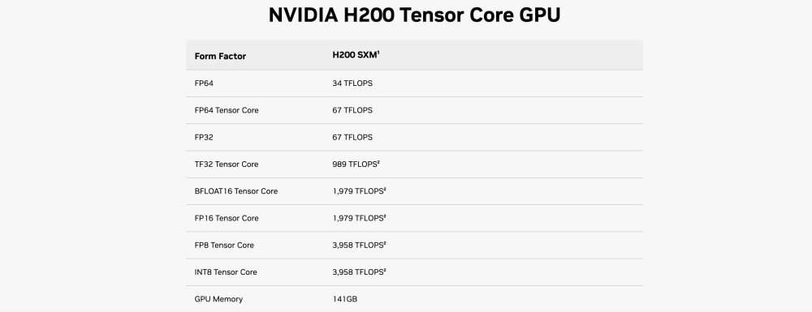
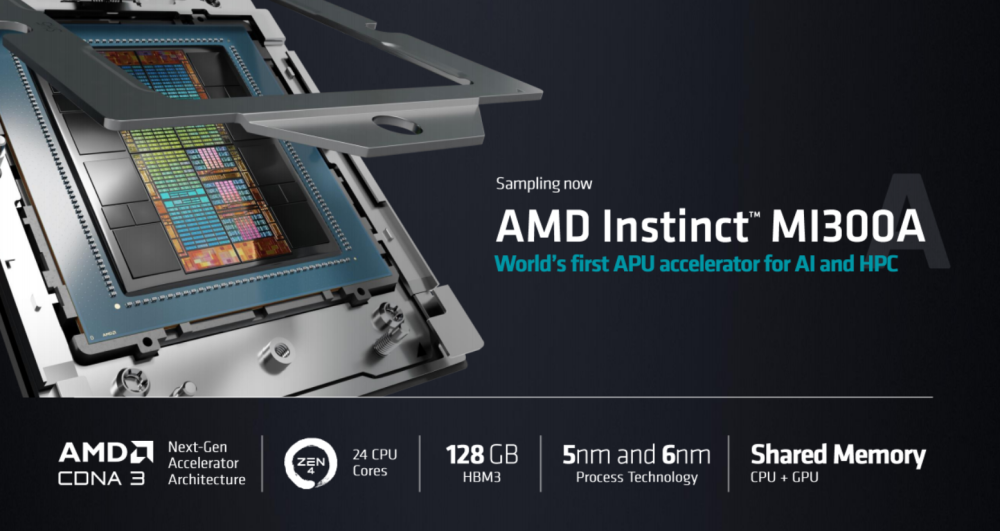

# 英伟达最新AI芯片H200只能算半代升级，发布更多是无奈之举

文｜ 郝博阳 无忌

最强GPU芯片再次升级了，但更像是半代升级。

在11月13日的2023年全球超算大会（SC23）上，英伟达发布了新一代AI芯片HGX
H200，用于AI大模型的训练，相比于其前一代产品H100，H200的性能提升了约60%到90%。

H200是英伟达H100的升级版。与过往GPU升级主要都在架构提升上不同，H200与H100都基于Hopper架构。

在同架构之下，H200的浮点运算速率基本上和H100相同。而其主要升级点转向了内存容量和带宽。具体包括141GB的HBM3e内存，比上一代提升80%，显存带宽从H100的3.35TB/s增加到了4.8TB/s，提升40%。

_H200核心GPU运算数据与H100完全一致_

然而，在大模型推理表现上，其提升却极其明显。H200在700亿参数的Llama2大模型上的推理速度比H100快了一倍，而且在推理能耗上H200相比H100直接降低了一半。

对于显存密集型HPC（高性能计算）应用，H200更高的显存带宽能够确保高效地访问数据，与CPU相比，获得结果的时间最多可提升110倍。

因为框架未有改变，H200与H100有着完全的兼容性。这意味着已经使用先前模型进行训练的AI公司将无须更改其服务器系统或软件即可使用新版本。

为什么英伟达突然不卷频率，卷起内存了呢？

H200这个半代升级，是不得不发的无奈之举

芯片内存，靠着AI才走向了前台。

几十年来，出于技术和经济原因，各种处理器在计算上配置过度，但在内存带宽上配置不足。因为内存容量取决于设备和工作负载。比如处理Web基础设施工作、或一些相对简单的分析和数据库工作，一个拥有十几个DDR内存通道的CPU就足够处理了。

但对于HPC模拟和建模、人工智能训练和推理来说，这点内存通道就不够用了。为了实际提高矢量和矩阵引擎的利用率，内存容量和内存带宽突然成了高性能GPU的命门。

早在今年年初，全球大厂扫货GPU备战百模大战时，H100的产能却出现了瓶颈。最主要的卡点都围绕在内存上。

H100所采用的HBM内存拥有DDR内存难以比拟的带宽，但其产量因为其堆叠生产工艺的复杂一直较低，除此之外为了在芯片中使用HBM，英伟达还必须采用台积电独创的CoWoS封装系统。HBM和CoWoS封装两个漏斗，直接滤掉了H100的产能。

因为GPU AI运算性能与内存的强关联性，HBM内存也成了各个大厂的兵家必争之地。

英特尔在今年年初推出了全球首款配备HBM内存的处理器--Intel Xeon Max系列处理器，其基于代号Sapphire Rapids-
HBM芯片构建。所有的Xeon Max都内置了64 GB的HBM2e高带宽内存，分为4个16 GB的集群，总内存带宽为1 TB/秒。

英特尔称，Xeon Max系列CPU配备的高带宽内存足以满足最常见的HPC工作负载，与旧的英特尔至强 8380系列处理器或AMD EPYC
7773X相比，可在某些工作负载中提供接近五倍的性能。即使Xeon
Max在主频和架构上都落后于H100，但就靠着内存水位相当，依然在媒体和业界备受重视，成了在AMD之外H100最有力的竞争者。

那如果竞争对手的主频和架构跟上来，内存还更胜一筹会怎样？

在AMD下月6日举办的发布活动中，该公司将会发布Instinct MI300A和Instinct MI300X。

Instinct MI300A为AMD首个集成24个Zen 4 CPU核心、CNDA 3架构GPU核心以及128GB
HBM3的APU，其被认为在性能上有望与英伟达的Grace Hopper相媲美。

_如鲠在喉AMD_

Instinct
MI300X集成了12个5纳米的小芯片，提供了192GB的HBM3、5.2TB/秒的带宽，晶体管数量高达1530亿。MI300X提供的HBM密度是英伟达H100的2.4倍，HBM带宽是H100的1.6倍，意味着在MI300X上可以训练比H100更大的模型，单张加速卡可运行一个400亿参数的模型。

这将是一个颠覆AI芯片乃至GPU市场的敌手，而英伟达更换了架构的下一代GPU芯片B100要最早明年Q2才能发布。6个月的时间，一个更强的AMD显卡完全可能把英伟达在这半年间积累的AI霸权碾的荡然无存。架构升级没有，主频因此提升不上来，为了保证不被超越，英伟达怎么办？只能把内存升级到和MI300X同水准，靠半代升级截胡AMD。

_B100，冲破天际_

所以，英伟达这波升级，更多的是个无奈之举。

新内存强在哪里

作为首款搭载HBM3e内存的GPU，我们总算能从它的数据中一窥内存对AI运算的巨大影响了。

HBM3e满足了用于AI的存储器必备的速度规格，也在发热控制和客户使用便利性等所有方面都达到了全球最高水平。

在它的加持之下，H200的内存带宽从3.35TB/秒提升至4.8TB/秒，提升43%；与H100相比，H200容量几乎翻倍，能以每秒4.8TB的速度提供141GB内存。在HBM3e加持下，H200让Llama-70B推理性能几乎翻倍，运行GPT3-175B也能提高60%。

英伟达大规模与高性能计算副总裁伊恩·巴克（Ian
Buck）在演示视频中表示，“HBM内存的整合有助于加速计算密集任务的性能，包括生成式人工智能模型和高性能计算应用，同时优化GPU的利用率和效率。借助H200，业界领先的端到端人工智能超算平台的速度会变得更快，一些世界上最重要的挑战，都可以被解决。”

在技术文档中，英伟达是如此解释AI计算和内存的关联的：内存带宽对于HPC应用程序至关重要，因为它可以实现更快的数据传输，减少复杂的处理瓶颈。对于模拟、科学研究和人工智能等内存密集型HPC应用，H200更高的内存带宽可确保高效地访问和操作数据，与CPU相比，获得结果的时间最多可加快110倍。

 _内存的力量！_

HBM被如此倚为长城，内存厂商也在这次AI大基建中获得了仅次于GPU厂商的收益。

HBM和DDR5的价格和需求在今年都大幅增长。而HBM的价格是现有DRAM产品的5-6倍；DDR5的价格也比DDR4高出15%到20%。

据BusinessKorea援引业内人士消息透露，SK海力士预计，2024年HBM和DDR5的销售额有望翻番。市场调研机构TrendForce指出，高端AI服务器需采用的AI芯片，将推升2023-2024年高带宽存储器（HBM）的需求。市场规模上，该机构预计2023年全球HBM需求量将增近六成，达到2.9亿GB，2024年将再增长30%，2025年HBM整体市场有望达到20亿美元以上。

潜在的垄断消失，但定价不一定手软

英伟达表示，H200计划于2024年第二季度正式出货。届时，包括亚马逊，谷歌，微软等大型计算机厂商和云服务提供商将成为H200的首批用户，客源依然稳健。

考虑到目前高性能GPU服务器仍然紧缺，云服务商现在是更多是出啥买啥。

但在竞争对手，如AMD和英特尔在今年年内真的发布可以与其匹敌的GPU服务器后，其垄断是否还能存在呢？

过往的分析认为垄断还将继续一段时间。H100的垄断地位带来的服务器间兼容性问题、英伟达苦心经营多年的服务器套组CUDA太过好用，工程师不愿放弃都是可能的原因。但有着更便宜，性能不差的竞品，这种垄断还能维持多久？因此英伟达这次的新定价策略就很值得玩味了。

一般的分析机构认为内存升级了，价格还得涨。

比如Wolfe Research的克里斯·卡索（Chris
Caso）在客户报告中称，鉴于H200提供的性能提升，该款芯片的售价可能会更贵。英伟达没有披露该产品的售价，但CNBC报告称，上一代H100估计每颗售价在2.5万美元到4万美元之间，因为采用了HBM3e内存，H200的售价可能会更贵。

但英伟达发言人克里斯汀·内山（Kristin Uchiyama）却表达的更暧昧，称定价将由英伟达的合作伙伴设定。

上个季度，英伟达仅在该领域的营收就达到创纪录的103.2亿美元(总营收为135.1亿美元)，比去年同期增长了171%。毫无疑问，英伟达希望新的GPU和超级芯片将有助于延续这一趋势。因为这就是它的赚钱之本。

目前H200的定价还没有公开，它更多会是英伟达对于后续垄断前景的自信指数。

新显卡能否打破GPU荒？期待H100增量更现实

H100上市至今一直处于供不应求的状态。包括甲骨文创始人拉里·埃里森和“硅谷钢铁侠”埃隆·马斯克都曾为能够买到这款GPU在社交媒体上狂吹。

那在H200正式发售之后，客户能否获得新芯片，或者它是否会像H100一样受到供应的限制--英伟达对此没有太多的答案。

第一批H200芯片将于2024年第二季度发布，英伟达表示，它正在与“全球系统制造商和云服务提供商”合作。除此之外，英伟达发言人克里斯汀·内山（Kristin
Uchiyama）拒绝就生产数量发表评论。

英伟达宣布这一消息之际，人工智能公司仍在拼命寻找H100芯片。英伟达的芯片被视为有效处理训练和操作生成式图像工具和大型语言模型所需的大量数据的最佳选择。谁拥有H100就会成为硅谷的焦点，初创公司一直在通过合作获得对H100的访问权。

内山表示，H200的发布不会影响H100的产量。他表示：“你将看到我们全年的总体供应量将会增长，我们将继续购买长期供应。”

对于GPU购买者而言，明年的情况可能会比今年好许多。今年8月，英国《金融时报》报道称，英伟达计划在2024年将H100的产量增加两倍，目标是明年生产多达200万颗，高于2023年的约50万颗。但随着生成式人工智能在今年迎来大发展，市场对先进GPU的需求可能只会更大。

_赢是一定赢，就看是大赢，中赢还是小赢_

