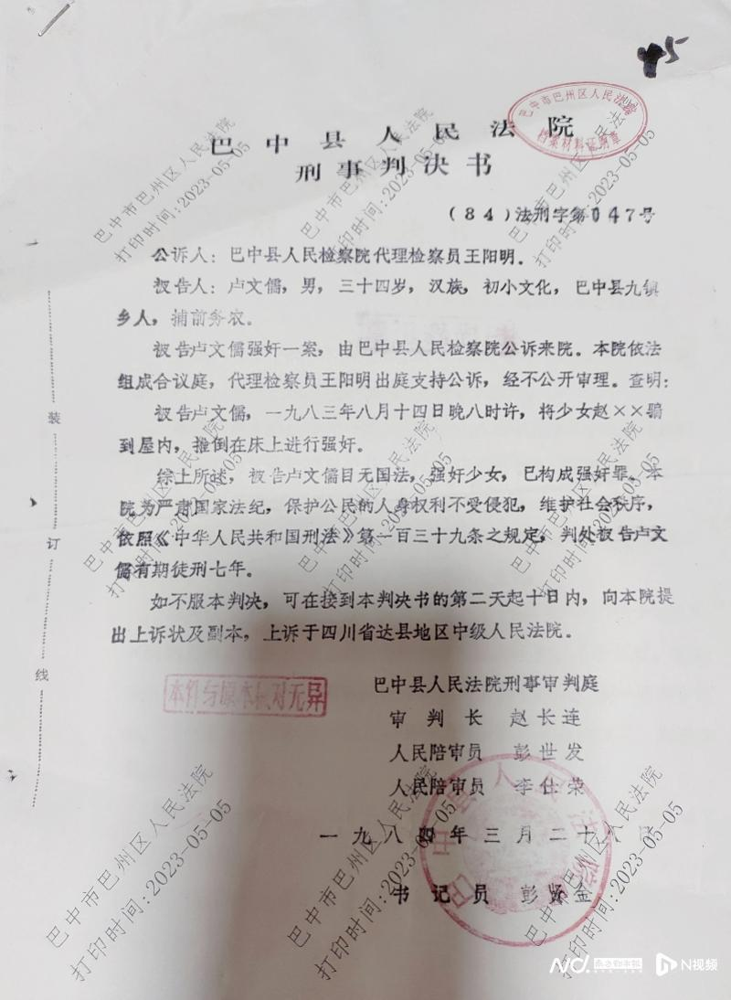

# 被错判改变的人生：四川男子卷入一桩“强奸案”之后的40年

“一句话，判了我7年刑。”约40年前的一纸错判，萦绕卢文儒往后余生。

1983年，一桩“强奸案”打破了他原本在四川巴中平静的务农生活，次年3月他被判有期徒刑7年，1989年法院再审宣判他无罪。此时的他已服刑5年，并因表现良好获得减刑，距离刑满释放只剩35天。寻常的5年，对其他七旬老人来说也许只是人生中短短一段时光，但对74岁的卢文儒而言，却是延绵至今的痛楚。被贴上“劳改犯”的标签后，妻子改嫁他人，儿子不认父亲，一个家庭就此分崩离析。

在狱中的5年，卢文儒没有一天不曾为自己申冤；出狱后的30多年里，又在辗转多地打工谋生的同时，一次次申请国家赔偿，却一次次落空；如今年迈体衰，膝下无子孙承欢，仍想为自己讨一个公道。今年11月，巴州区法院方面对南都、N视频记者表示，“决定书上这么说，就是最后的结果了”。已满头白发的卢文儒则仍在“求个公道”的路上。

_卢文儒。_

**一纸错判**

11月7日，南都记者在巴中市巴州区一处公租房见到卢文儒，他将一个黑色小方包紧紧抱在怀中，包里装着一份份判决书、申诉书、决定书。只有初小文化的卢文儒，原本不一定理解这些文字，如今，他却对这些文书上的内容倒背如流。

“被告卢某儒目无国法，强奸少女，已构成强奸罪……判处被告卢某儒有期徒刑七年。”不需要看，卢文儒准确背出了这句改变他人生的判决。

在这份宣判时间为1984年3月28日的《巴中县人民法院刑事判决书》显示：“经过不公开审理，查明：被告卢某儒，一九八三年八月十四日晚八时许，将少女赵某某骗到屋内，推倒在床上进行强奸。”

_1984年，卢文儒因犯“强奸罪”被判刑。_

卢文儒称，当时自己是被“屈打成招”的。事情发生在1983年8月14日，卢文儒正在原巴中县九镇乡水库大坝抬石头，因被控告强奸，他被九镇乡治安室传唤到乡政府。“当时的乡公安人员用棕绳把我吊起，双脚不沾地，用大指头粗的柏树条子猛打。”卢文儒称，自己被打到肋骨骨折，昏迷过去，乡公安人员强行拉他的手在认罪材料上按了手印。

曾帮助卢文儒申请赔偿的律师曾于2018年到事发地调查。他告诉南都记者，当时九镇乡的炊事员赵某德等人向他证实：“在审问过程中，卢某儒说‘我没有做过这件事，我是不认的’，后来就被吊在梁上打……卢某儒才认自己强奸，然后被别人强行在材料上按手印。”

1984年，卢文儒被送往监狱服刑。“从进了监狱第二天我就开始写信，向当时的巴州达县地区中级法院申冤。”

卢文儒在申冤信中写道：“案发的时间地点并没有呼救声，没有当地的干群作证，没有医院的证明手续，当时的民警根本就不明察秋毫。”这样类似的信件，他在狱中写了87封。

大约过了1年，卢文儒终于等来案件复查的消息。他向南都记者回忆，当时复查小组找他了解情况，“我把申冤信拿给他，他说信写得很清楚，就没有再口头问我，去找当地的干群了解情况了”。后来，该案的审判长告诉他，在复查的过程中，当年告他强奸的女孩表示自己是受人指使，对卢文儒进行诬告。

**妻离子散**

1989年11月22日，原巴中县人民法院再审判决，认为原判“事实证据不力”，对卢文儒宣告无罪。

沉冤得雪，但人生已彻底被改变。卢文儒告诉南都记者，自己被释放的时间是1989年12月，由于他在服刑期间表现良好获得减刑，被释放时离满刑只剩35天。

_服刑5年后，卢文儒被宣告无罪。_

卢文儒原本的人生蓝图里，是一家五口的幸福生活。案发时，他和妻子育有3个孩子，大儿子13岁，女儿12岁，最小的儿子才7岁多。

“原本关系是可以的”，卢文儒说，自己服刑的头两年，大儿子来看了他两三次，当时他在劳改做工，每个月有2.5元零花钱，钱都攒着，给了来看望的大儿子。

但随着时间流逝，父子关系恶化。卢文儒的姐姐告诉南都记者：“‘爸爸是劳改犯’这件事，还是给孩子造成了负担，被人指指点点，他后来就不认爸爸了。”

妻子一个人带着三个孩子，多次来监狱找他离婚。卢文儒说：“1986年，她跟别人有了事实婚姻。出狱后我们就离婚了，大儿子跟着我，另外两个跟着她，其实大儿子当时20岁了，已经不认我，我实际上是孤身一人。”

无罪释放后，卢文儒四处漂泊。在广东湛江、顺德等地打了四五年工，后来又在浙江、河南、湖北待过，烧过瓷砖，也在工地上搭过架子。2008年，59岁的卢文儒回到家乡巴中，“当时在修公路，我去打混凝土”。

一个人的打工生活持续到2013年，64岁的卢文儒没了干苦力的体力，当起清扫马路的清洁工。2021年，清洁工的工作也没有了，“年纪大了，人家不要”。如今，他只能依靠多年的积蓄生活，在巴中租住公租房，房租一年2500元。

卢文儒的姐姐是这些年来还能和他互相关照的唯一亲人。80多岁的她和丈夫住在巴中另一处公租房，一室一厅的狭窄小屋，厅既是客厅，也是餐厅，在卢文儒无力租房时，这厅里的沙发也曾是他夜晚的床铺。

卢文儒的姐姐告诉南都记者，不久前，74岁的卢文儒刚刚因为脊椎不好动了手术，住院期间，除了她之外，其他本该在弟弟身边的亲人，都已经离散无踪影。

**追偿无果**

无罪释放后，卢文儒开始申请国家赔偿，多年来，律师都已经换了六七个，却一直未果。

2018年4月28日，卢文儒在律师帮助下向巴州区人民法院提出国家赔偿135万元的申请，其中包括赔偿被判刑7年的损失费70万元，精神抚慰金50万元，安家费15万元。

_卢文儒提出的国家赔偿申请未被受理。_

这次申请没有被受理。巴州区人民法院认为，“国家赔偿法于1995年1月1日正式颁布实施，赔偿请求人卢某儒于1984年3月28日因犯强奸罪被原巴中县人民法院以（84）法刑字第047号刑事判决书判决有期徒刑7年，后于1989年改判无罪（同年予以释放）。该行为发生于国家赔偿法颁布实施前，法律不溯及既往，其申请国家赔偿事项不适用国家赔偿法”，最后决定“对赔偿请求人卢某儒的国家赔偿申请不予受理”。

卢文儒不服，向巴中市中级人民法院提出申诉，被驳回。其后，卢文儒再次向四川省高级人民法院申诉，得到的结果仍是“申诉理由不成立”，并“驳回卢某儒的申诉”。

四川省高级人民法院认为，“本案中卢文儒于1984年被错判刑罚，1989年经再审改判无罪，对卢文儒被侵犯人身自由的时间发生在1994年12月31日以前，故卢文儒的申诉事项不适用国家赔偿法。四川省巴中市中级人民法院赔偿委员会（2018）川19委赔13号决定认为本案应当按照国家赔偿法生效之前的有关规定处理，驳回卢文儒的国家赔偿申请并无不当。”

今年11月10日，巴州区人民法院工作人员对南都记者表示，此案以法院出具的法律文书为准，“决定书上这么说，就是最后的结果了” 。

2020年，卢文儒向四川省高级人民法院提出国家司法救助申请，获得司法救助金8万元。但他认为，司法救助和国家赔偿是两码事。

他表示，最高人民法院的相关批复显示，“属于1994年12月31日以前的应予赔偿部份，适用当时的规定予以赔偿；当时没有规定的，参照《国家赔偿法》的规定予以赔偿”。因此，卢文儒认为，即使案件发生在《国家赔偿法》颁布实施之前，他依然有权利要求得到应有的赔偿。

**煎熬之路**

卢文儒申诉中所提到的相关批复，是《最高人民法院关于〈国家赔偿法〉溯及力和人民法院赔偿委员会受案范围问题的批复》第一条：“根据《国家赔偿法》第三十五条规定，《国家赔偿法》1995年1月1日起施行，《国家赔偿法》不溯及既往……属于1994年12月31日以前应予赔偿的部分，适用当时的规定予以赔偿；当时没有规定的，参照《国家赔偿法》的规定予以赔偿。”

北京市炜衡（广州）律师事务所律师郑政昊向南都记者分析，在1994年12月31日之前，《国家赔偿法》尚未实施，但并不代表当时我国没有相关的赔偿制度。1954年、1982年《宪法》都明确规定，由于国家机关和国家工作人员侵犯公民权利而受到损失的人，有依照法律规定取得赔偿的权利。

1987年1月1日实施的《民法通则》第一百二十一条规定：“国家机关或者国家机关工作人员在执行职务中，侵犯公民、法人的合法权益造成损害的，应当承担民事责任。”最高人民法院1988年4月2日印发《关于贯彻民法通则若干问题的意见》第一百五十二条规定：“国家机关工作人员在执行职务中，给公民、法人的合法权益造成损害的，国家机关应当承担民事责任。”

郑政昊指出，即便当时《国家赔偿法》尚未实施，但依据《宪法》《民法通则》以及相关司法解释等规定，当事人可以尝试通过民事诉讼途径请求有关机关承担相应的民事赔偿责任。

中国裁判文书网公开案例显示，卢文儒的情况并非个例，相当一部分当事人因权利受侵害的时间发生在《国家赔偿法》实施之前而被驳回申请。对此，上述判例中，法院并没有对当事人的权利应当如何救济而作出充分的释明和指引。

对于卢文儒已获得的8万元司法救助金，郑政昊告诉南都记者，根据《关于建立完善国家司法救助制度的意见》的相关规定，国家司法救助是对于受到侵害但无法获得有效赔偿的当事人，由国家给予适当经济资助的制度，与国家赔偿是不同的。国家赔偿的方式除了支付赔偿金之外，还包括为受害人消除影响，恢复名誉，赔礼道歉，支付相应的精神损害抚慰金等一系列方式。

“卢文儒因被错判强奸罪而入狱多年，对其个人名誉的影响和精神的损害不是一纸无罪判决和8万元司法救助金就能消除的。在法律存在空白或适用困难之时，司法机关更应主动承担协调责任，为当事人有效解决改判无罪后的善后问题。”

时至今日，卢文儒依然在前路并不明朗的申诉之路上摸索。11月7日，在卢文儒姐姐家的客厅里，他从怀里的黑色方包中掏出一份落款时间为2023年11月7日的《国家赔偿再次申诉书》，向南都记者展示。

为了这次见面，他特意将自己收拾了一番，穿上红色的唐装，满头白发修剪得干净，看起来精神镬烁，只有那双数不清第几次将申诉材料一页页翻动的手，颤巍巍地透露出这个七旬老人，为自己“求个公道”的煎熬之路。

出品：南都即时

统筹：南都记者 向雪妮 陈燕

采写/摄影：南都记者 郑璇真 发自四川巴中

