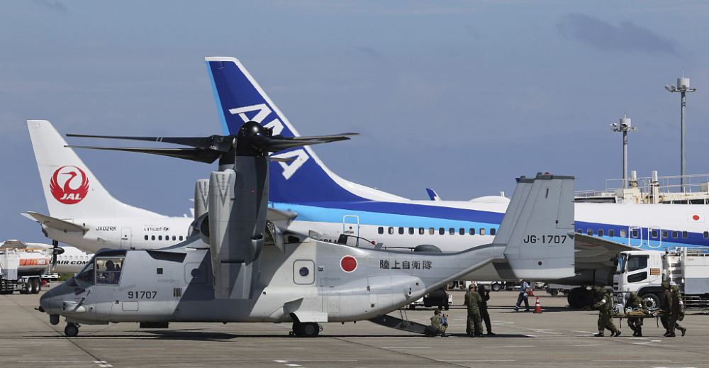

# 针对中国？日本自卫队两周内连搞四场演习，专家：加剧地区局势不稳定

【环球时报驻日本特派记者 岳林炜 环球时报记者
郭媛丹】日本近期在本土和周边地区接连举行多场军演和训练，日美等西方媒体报道中均提到有应对中国之意。其中，日本与美国、澳大利亚和加拿大在日本海岸线附近举行年度联合军演，更是首次邀请菲律宾海军以观察员身份参与和观摩。迄今为止，日本11月参与的演习已有4场。军事专家表示，军事演习如此频繁加剧了该地区局势的不稳定，明显不符合地区国家的利益。

据日本共同社13日报道，在该国最西端的冲绳县与那国岛，12日举行了与那国町政府主办的防灾训练。路透社称，大约200名日本官员和自卫队成员参加。与那国町长丝数健一接受采访时表示：“训练致力于与自卫队联合防灾，有助于提升应对突发事态的能力以及对他国的威慑力。”美国媒体则直接点名称，训练既有应对因地震引发海啸的目的，也适用于应对“北京一旦试图武力攻台而如何疏散撤离该岛居民的紧急状态”。不过，共同社报道称，训练进行当天，有居民在沙滩上举着写有“不要做战争准备”等字样的纸张。

_日本自卫队的“鱼鹰”运输机。资料图_

如果说上述训练还以“救灾”为借口，那么后面几场演习则是纯粹的军事目的。日本海上自卫队、美国海军、澳大利亚海空军以及加拿大海空军的联合军演于11月10日至20日在日本周边举行。此次联演号称日本海上自卫队史上最大规模的联合军演，有约30艘舰艇和超过40架飞机参加。此外，菲律宾海军高级官员也以观察员身份参加军演。日本海上自卫队舰队司令官斋藤聪对媒体表示，这次演习“并不是针对特定的国家和地区”。但日本富士电视台评论认为，本次演习针对的是不断加强海洋活动的中国以及朝鲜。日本广播协会认为，这显示出针对中国不断走向海洋的动向，四国将加强合作。

除多边演习，日美之间也展开了一次大规模演习，11月10日至20日，日本陆海空自卫队约3万人与美军约1万人在日本全国多地举行大规模军演，演习地点包含与那国岛、奄美大岛等地区，且会利用平时不会使用的民用机场进行战斗机起降等训练。共同社报道称，13日，日本航空自卫队的战斗机为了应对无法使用冲绳县那霸机场的状况，首度在鹿儿岛县的奄美机场、德之岛机场进行连续起降训练。

此外，美菲日韩“海上战士合作”联合演习9日举行启动仪式，日本陆上自卫队首次正式参加。此次演习将持续至20日，来自四国共2700多名官兵参演。“海上战士合作”演习于2017年首次举行，今年是第七次联合演习，日、韩2022年作为观察员参加了演习。

军事专家宋忠平13日接受《环球时报》记者采访时表示，日本参与的这些军演，无论是单边、双边还是多边，从演习地点和课目设置中都透露出相同的动向：针对中国。“表面上看起来是日本或菲律宾来主导演习，但实质上都是美国打造‘印太战略’，让更多盟友帮助美国来遏制和对抗中国。美国希望亚洲的同盟圈越大越好，甚至能扩大成为‘印太地区’的‘北约’。”

半个月不到日本就至少参加了4场军演和训练，对此，宋忠平认为，一个地区演习越多，说明该地区的局势形势越不稳定，该地区发生挑衅乃至擦枪走火事件的概率就会越高。“但是日菲等国家也需要明白，它们在给中国制造麻烦的同时也是给自身制造麻烦。一旦亚太地区也陷入战火危机，几乎所有亚太地区国家的经济都会受到影响，这不符合地区国家的利益。”

另据共同社报道，日本自民党副总裁麻生太郎13日在访问澳大利亚时发表演讲，叫嚣有必要展现日美澳团结一致，不容许中国凭力量改变现状。他还提议扩大合作，比如日本也加入“奥库斯”。对此，中国社会科学院日本研究所副所长吕耀东13日告诉《环球时报》记者，虽然麻生现在只是日本自民党副总裁，不是日本副首相，他说的话并不代表日本政府。但是，他仍是日本执政党的一员，反映了执政党内的一种思想倾向，作为自民党总裁的岸田文雄依然会听取他的建议。“麻生太郎在澳的鼓噪言论，给中日关系增加了不和谐因素。”黑龙江省社会科学院东北亚研究所研究员、东北亚战略研究院首席专家笪志刚对《环球时报》记者表示，日本通过地缘双边、多边安保关系，一是要打造更多所谓志同道合的同盟关系，二是利用双边、多边各种机制，提高本国遏制能力，达成掌握更多对华筹码、服务本国安保战略的目的。

