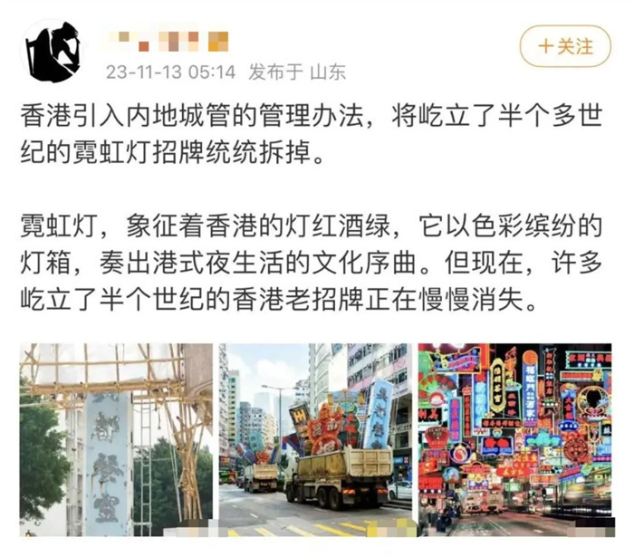
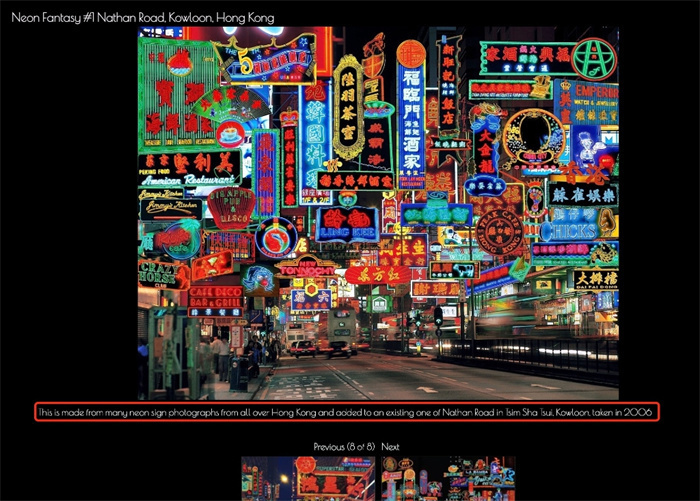
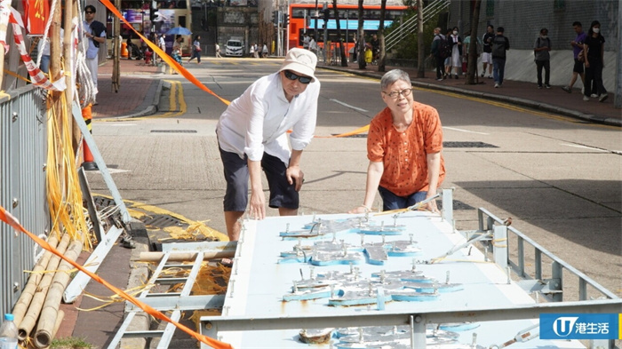

# 香港要拆光霓虹招牌？假的！

11月13日，有内地网友发文称，香港引入内地城管的管理办法，将霓虹招牌统统拆掉，并配上多个霓虹招牌被装车运走的图片，引发网络关注。记者查证后发现，三张配图中有两张都是经后期处理的图片，并非真实照片。根据香港特区政府屋宇署资料显示，小型招牌(含霓虹招牌)只要符合相关安全要求，是可以保留使用的。相关人士透露，有关部门并无集中清理现存招牌的计划，更不存在“引入内地城管的管理办法”一说。

13日，有内地网友发文称，香港引入内地城管的管理办法，将霓虹招牌统统拆掉，引发网络关注。

该网友发布的一张图片显示，两辆正在行驶的货车装着十多个霓虹招牌。据记者查证，这张图片不是真实照片，而是香港摄影师兼平面设计师Tommy
Fung通过PS创作的作品，Tommy Fung在社交平台上也发布了这张图片。

香港摄影师兼平面设计师Tommy Fung通过PS创作了这张图片，并发布在社交平台上。

另一张配图中满是五光十色的霓虹招牌，招牌下车流穿梭。这张图片是英国摄影师Keith MacGregor的作品。据Keith
MacGregor个人网站介绍，这幅作品是将香港各地的多张霓虹招牌照片拼接后制作而成，并加入了九龙尖沙咀弥敦道的照片，并非单个的真实场景。

据Keith MacGregor个人网站介绍，这幅作品是将香港各地的多张霓虹招牌照片拼接后制作而成，并加入了九龙尖沙咀弥敦道的照片，并非单个的真实场景。

其余一张配图中的“美都餐室”招牌确实近日被拆除了。美都餐室经营者黄醒芬早前已收到香港特区政府屋宇署发出的拆卸要求。施工当天，黄醒芬与其丈夫一同见证拆卸，并与招牌进行最后合照。公开资料显示，美都餐室开业于1950年，至今已有73年历史，因其旧式装修风格成为香港油麻地的“打卡”点，有不少电视剧、电影在此取景，如电影《九龙冰室》《追龙》等。

_施工当天，美都餐室经营者黄醒芬与其丈夫一同见证拆卸，并与招牌进行最后合照。(图片来源：U Lifestyle)_

据记者了解，香港特区政府屋宇署目前采用自2013年执行的“招牌检核计划”，小型招牌(含霓虹招牌)只要符合安全要求便可以保留使用。相关人士透露，“招牌检核计划”一直行之有效，因此有关部门并无集中清理现存招牌的计划，更不存在“引入内地城管的管理办法”一说。

为消除可能带来的公众安全风险，香港特区政府屋宇署自2014年起对未参加“招牌检核计划”的违例招牌发出法定清拆命令，以敦促有关招牌拥有人尽早参加检核计划，也会针对不合资格而参加检核计划的违例招牌或危险/弃置招牌发出法定清拆命令或拆除危险构筑物通知。

稿件来源：紫荆

