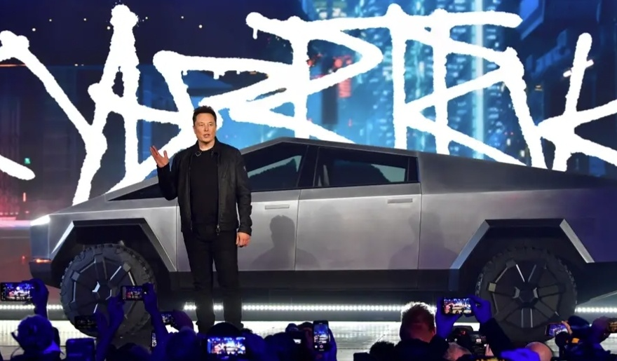

# 马斯克挑起电动汽车价格大战 最后赢家却不一定是特斯拉

**划重点**

  * _1_ 在过去1年里，特斯拉电动汽车平均价格下降了约25%，降价策略确实对销量起到了一定的提振效果。
  * _2_ 特斯拉希望通过降价增加销量，延缓竞争对手的发展速度，甚至将他们完全挤出市场。
  * _3_ 但降价策略的效果似乎并不太好，特斯拉汽车交付量、市场份额、营收都在下降，利润也受到挤压。
  * _4_ 分析师认为，尽管马斯克挑起了电动汽车价格大战，但最后的赢家不一定是特斯拉。

腾讯科技讯 在日益激烈的竞争压力下，特斯拉过去一年将其现有车型的平均价格大幅削减了约25%。Model
3的价格从48000美元降到了44380美元，而豪华型Model S的价格则从13万美元的高位跌至了96380美元。事实证明，降价确实推动了销量上涨。

然而，实事求是地说，这是一种不寻常的商业策略。考克斯汽车公司通讯主管马克·希尔默（Mark
Schirmer）表示：“在汽车行业的历史上，我还没有见过哪个哪个品牌会在不破产的情况下每年降价20%。”特斯拉希望较低的价格能提振销量，减缓竞争对手的发展速度，甚至可能将某些竞争对手完全赶出市场。

但事实并非如此。降价并没有转化为更高的销量。在第三季度，特斯拉交付给客户的汽车数量实际上下降了。营收正在下降，该公司曾经丰厚的利润率也受到挤压，第三季度降至17.9%，而去年同期为25.1%。竞争对手也没有被赶出市场。特斯拉曾经在电动汽车领域占据绝对主导地位，但其美国市场份额已从年初的62%降至如今的50%。

更糟糕的是，公众对电动汽车的需求并没有像汽车制造商预期的那样快速增长。这意味着，特斯拉已经为了一块正在缓慢增长的“蛋糕”而开始了一场旷日持久的争夺战。

沃顿商学院市场营销学教授约翰·张（John
Zhang）说：“如果你想打价格战，你必须确保有足够的销量增长并保持盈利能力。这必然是一场持续的战斗，而且这场战斗你必须一直打下去。你需要提前做好计划，只有这样你才能赢。”

当然，也有些专家认为，价格大战是不可取的，这是一场没有赢家的比赛，只会对整个行业的盈利能力造成破坏。在一个基础技术和生产成本都在迅速变化的行业中，没有人能确定哪里是底线。但不管能不能赢，马斯克都选择了一个糟糕的时机来挑起战斗。

当传统汽车制造商在通向电动未来的钢丝上行走时，他们可以依靠销售传统燃油汽车来为自己提供基本的业务保障，而特斯拉没有这样的安全网。对马斯克来说，要么全力以赴发展电动汽车，要么破产。

**特斯拉再次陷入“现金荒”**

马斯克为其电动汽车提供大幅折扣的决定，纯粹是一种绝望行为的表现。本月早些时候，特斯拉公布了第三季度财报，这一点变得显而易见。财报显示，该公司业绩全面下滑：特斯拉在营收、汽车交付量和自由现金流方面均未达到华尔街的预期。自由现金流从前一年的34亿美元降至8.48亿美元。最重要的是，该公司报告称其毛利率（衡量公司扣除成本后的盈利能力）继续萎缩，这让刚刚习惯于特斯拉赚钱的投资者们感到震惊。

在过去的两年里，尽管特斯拉推出了价格更为适中的车型，如Model 3轿车和Model
Y紧凑型SUV，但其利润率已达到汽车行业中的巅峰。这支持了一种观点，即特斯拉不是福特或通用汽车这样的传统汽车公司，因此其股价也理应高得多。自然，马斯克希望特斯拉能够保持这种状态，因此他承诺将尽一切努力削减成本。在第三季度收益的电话会议上，他说这就像《权力的游戏》，只不过目标是省钱。

不幸的是，削减成本不是说说就能实现的，即使是马斯克也不行。在第三季度，特斯拉的资本支出实际上激增至一年来的最高水平，达到24亿美元，远高于一年前的18亿美元。如果价格下降，成本上升，即使是马斯克最狂热的华尔街信徒也会告诉你，利润不是祈祷来的。

马斯克没有说明这次的现金荒何时会结束，也没有说明将如何提高利润率。他无法透露该公司的电动皮卡Cybertruck何时能向公众开放，甚至承认特斯拉试图制造这款新车是在“自掘坟墓”。他也无法详细说明特斯拉目前的老旧车型何时会进行有意义的更新。

但有一件事马斯克很清楚：价格需要继续下降。在一次被华尔街普遍认为是特斯拉一段时间以来最糟糕的电话会议中，马斯克像念咒语一样一遍又一遍地重复这一点，他的执着更多来自于信念而非事实。

马斯克说：
“所以我怎么强调成本的重要性多不为过。对大多数人来说，这不是可有可无的事情，而是一件必要的事情。我们必须让我们的汽车更便宜，这样人们才能买得起。”

马斯克给投资者提供的唯一真正的希望是，自动驾驶汽车技术最终将帮助抵消特斯拉不断下跌的价格的影响。但这一权衡到底如何发挥作用还不清楚。马斯克发起降价战数月来，没有任何成果，也没有改变计划。市场对马斯克利润缩水的反应是，特斯拉的股价下跌了15%。

**整个电动汽车市场都在“流血”**

特斯拉惨淡的业绩揭示了马斯克采取绝望降价策略的短期原因。但根本原因更为惊人：尽管需求不断增长，政府也进行了大量投资，但从燃油汽车向电动汽车的过渡并不像汽车制造商预期的那么顺利。

专家肯定会告诉你，电动汽车是未来，燃油汽车最终将从美国的车道和停车场消失。但是，通往电气化的过程并不是一条直线。消费者对电动汽车的兴趣没有汽车制造商最初预期的那么强劲，这主要有两个原因。

一是新技术的普及参差不齐，即使是最令人惊叹的创新，也需要一段时间才能让人们接受。另一个原因是全球经济增长放缓。世界各地的顾客变得对价格更加敏感，这对电动汽车来说是个坏消息：虽然电动汽车的平均售价正在下降，从去年的65000美元降到7月的53633美元，但它仍然高于新车的平均售价，后者徘徊在48451美元左右。

从福特、通用汽车到宝马和梅赛德斯，传统汽车制造商都在做自己最擅长的事情，以应对电动汽车价格下降带来的挑战，即生产消费者仍然想要的燃油车。

福特首席财务官约翰·劳勒（John
Lawler）在公司最新的财报电话会议上表示：“福特能够平衡汽油、混合动力和电动汽车的生产，以配合电动汽车的普及速度，这是其他公司做不到的。这显然对客户有好处，他们可以得到他们想要的产品。对我们也有好处，因为严谨的资本配置和不惜一切代价追逐规模，可以最大限度地提高盈利能力和现金流。”

但是，虽然传统汽车制造商可以依靠他们的老款车型继续发展，而特斯拉却没有这个选项，所以只能选择降价。

考克斯汽车公司分析师希尔默说：“马斯克正在发动一场价格战，我确实认为他别无选择，因为他没有什么真正的新东西可以与其他公司竞争。这并不是因为电动汽车存在需求问题。但我从事这一行已经很长时间了，我从来没有见过有人在没有需求问题的情况下降价。”

马斯克的目标是利用价格优势削弱市场上的其他公司，这已经不是什么秘密了，这让其他汽车公司都不太高兴。考虑到电动汽车未来的不确定性，几乎所有其他汽车制造商都不愿大幅降价，因为这样做将使继续投资电动汽车技术变得更加困难。今年4月，福特首席执行官吉姆·法利（Jim
Farley）表示，特斯拉降价可能会引发一场不可持续的价格大战。但该公司今年仍被迫至少两次下调其野马Mach-E SUV的价格。

许多汽车行业高管拒绝参与马斯克的战斗，因为他们从经验中知道，赢得价格战的最佳方式就是一开始就不参与其中。宝马首席执行官奥利弗·齐普斯（Oliver
Zipse）最近在与投资者的电话会议上表示：“我们无意通过降低价格来获得市场份额，这不是我们的策略。”

还有其他更有想象力、更精明的方法来吸引顾客，而不是大甩卖。在2008年经济衰退期间，现代汽车公司没有大幅降价，而是试图找出阻碍消费者购买新车的原因。结果发现，原来人们担心被裁员。有鉴于此，现代汽车向客户提供了一项保证：任何买了车然后失业的人都可以把车卖回给公司。

这种富有创造性的解决方案帮助现代汽车安然度过了困难时期。这是市场调查和广告相结合的营销战略典范。然而，特斯拉几乎没有进行前者，也断然拒绝进行后者。马斯克始终坚持认为，他超高的公众形象使得特斯拉做广告是一种浪费。

定价咨询公司Sodhi pricing的董事总经理纳夫迪普·索迪（Navdeep
Sodhi）说：“从理性上讲，马斯克不必选择这么快就降价。他这样做只会延缓竞争而已。如果马斯克够聪明，他就不应该选择降价。相反，他应该证明拥有特斯拉汽车的成本是合理的。”

广告的目的以及投资者推动特斯拉开始投钱做广告的原因之一是，要让消费者明白，特斯拉的汽车为何值更高的价格。索迪认为，特斯拉有一个令人信服的理由，可以让顾客知道电动汽车随着时间的推移可以节省更多资金。如果你能说服顾客支付更高的价格，为什么还要降价呢？

电动汽车等产品的市场建设是一场马拉松，而不是短跑。传统汽车制造商预计，在可预见的未来，电动汽车业务将出现亏损。特斯拉直到2021年才实现盈利。如果因为降价而再次亏损，预计投资者会跑向另一个方向。

**一场失败的战斗**

如果特斯拉降价的短期目的是保持市场份额并销售更多的汽车，那么这并没有起到作用。同时，此举可能对特斯拉造成长期损害。

沃顿商学院市场营销学教授约翰·张说，当公司随意玩弄价格时，这不仅会破坏品牌形象，还可能使消费者对公司的长期健康和财务稳定性产生怀疑。一旦客户习惯了以4万美元购买标准电动汽车，他们就不会再回到6万美元的价格。在价格战中，你今天可能会吸引更多人购买你的产品，但未来你可能会牺牲数百万美元的销售额。这样得不偿失！

在一个以信任和忠诚度为基础的行业中，这是一个巨大的风险。总的来说，虽然短期内降价可能带来销量的增长，但从长远来看，这可能是一场失败的战斗，对特斯拉的品牌价值、市场地位以及消费者的信心都可能造成不可逆转的损害。

但马斯克似乎并没有考虑未来，他需要从降价中赚到钱，而且现在就需要。制造汽车是一项昂贵的业务，如果降价不能带来更多的需求，特斯拉的命运可能会很快发生变化。考克斯汽车公司通讯主管马克·希尔默说：“如果你有一家工厂生产东西却卖不出去，那么你在汽车行业就会损失巨额资金。”

此时此刻，你需要一个经验丰富的汽车管理团队来掌舵你的公司。然而，特斯拉却正在上任一位新的首席财务官。在特斯拉服务了13年的扎克·科克霍恩（Zach
Kirkhorn）曾主持过公司历史上最赚钱的季度，却在8月份辞去了首席财务官的职务。根据公司文件，他的遣散费包括高额的解雇金和严格的保密要求，这让人感觉他像是被解雇了。

最终，降价将不足以推动销售增长。如果特斯拉想要保持业务健康发展，就需要吸引马斯克粉丝和早期采用者之外的新客户。特斯拉需要进行研究，并针对正确的客户群体推出广告，让他们相信特斯拉的四种车型中总有一种适合他们。降价可能会提振部分销售，但从长远来看，如果没有现金流，你就无法打造一家全球汽车巨头。马斯克本人也承认，特斯拉在2008年和2018年都通过烧钱死里逃生。

在经济低迷时期发动价格战是特斯拉从未面临过的挑战。多年来，特斯拉一直凭借先发优势、规模小而灵活以及投资者愿意救助它而存活下来。但如今的特斯拉越来越像一家普通的汽车公司，也面临着普通汽车公司的问题。

马斯克尚未实现的自动驾驶出租车和无与伦比的人工智能承诺，可能会让市场眼花缭乱一段时间，但它们并没有推动特斯拉赢得所发起价格战所需的销量。该公司面临着越来越多的竞争对手，昂贵的制造过程，以及已经习惯了暴利的股东。如果降价是特斯拉在这种新现实中生存下来的唯一办法，那么每次有新车上路时，它都将继续失血。而到了某个时刻，恐怕它再也无力扭转局面。（文/金鹿）

