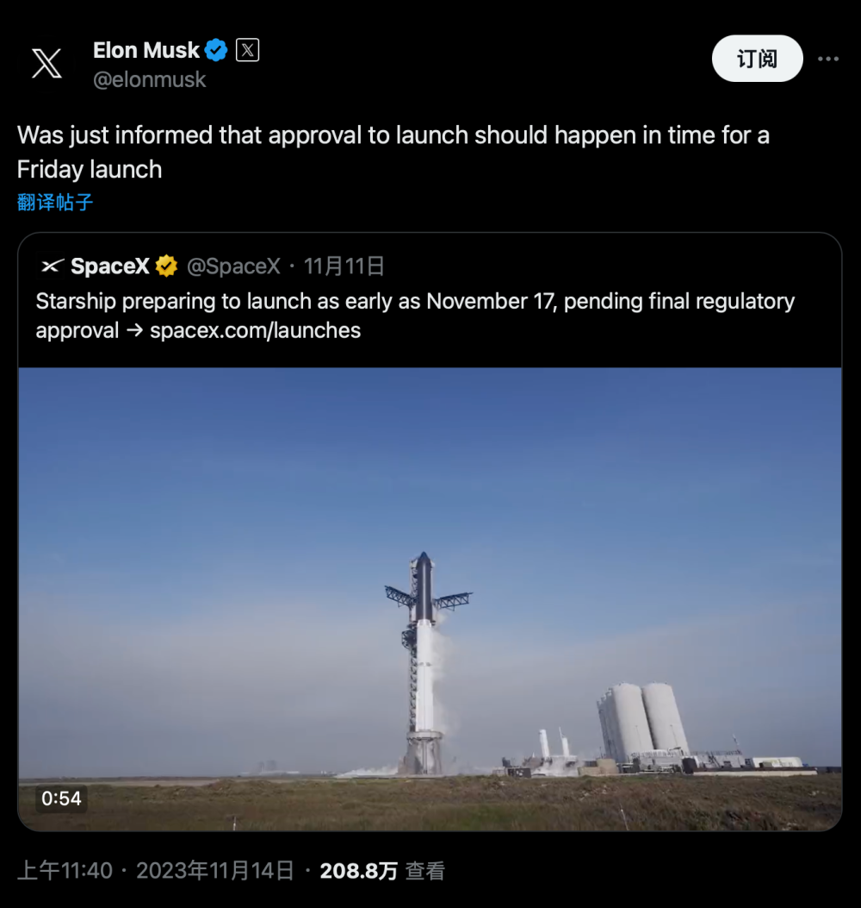
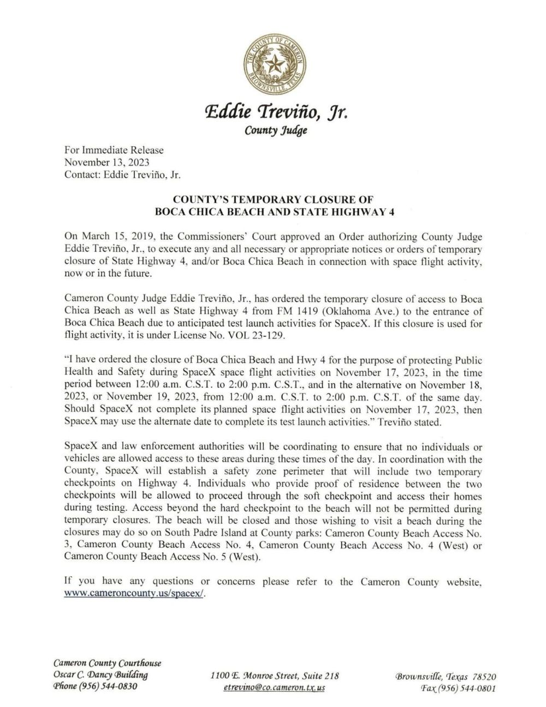
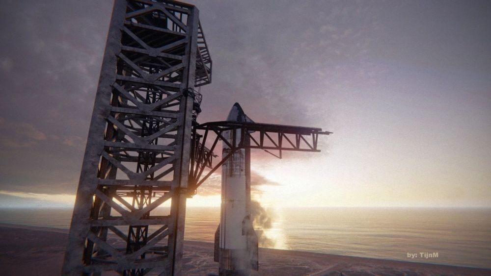
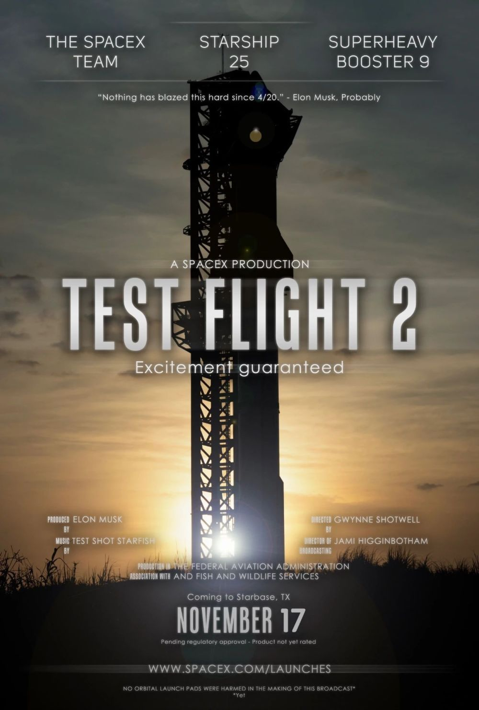

# 马斯克最新披露：17日前获准星舰发射

重磅消息来袭，老马刚刚透露内部消息：发射许可证将在周五前公布。美东时间11月13日22:40，即北京时间14日11:40，（图1）马斯克在X个人账号发消息称：「刚刚获悉，发射许可应该会在本周五发射前及时获得。」并且转发了11月11日SpaceX官方账号预告星舰第二飞消息：最早11月17日（周五）发射。几乎同一时间，星舰基地所在地德州卡梅伦县发布4号公路封道通告（图2）：美中时间11月17日、18日、19日每天中午12点至下午两点。
FAA/ATC也发布了这三天的发射规划公告（图3）。看来发射日越来越靠谱，越来越成真。观看星舰发射网络直播可寻两个渠道：官网发射页https://www.spacex.com/launches/或者X
@SpaceX账户https://twitter.com/SpaceX。

