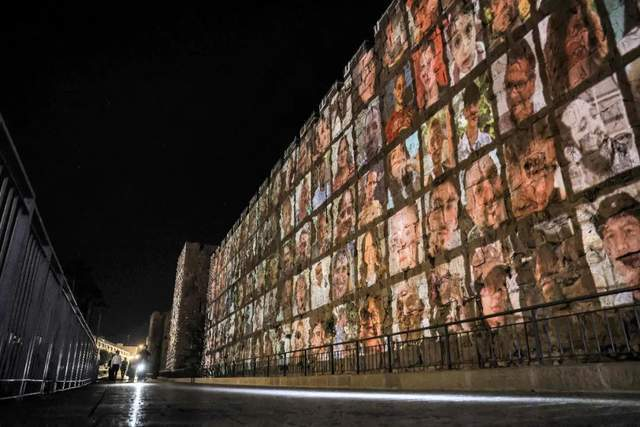

# “停战换人质”，以色列和哈马斯为何一再谈崩？

以色列和哈马斯之间有关人质的间接谈判第三次破裂了。

当地时间11月13日，随着以色列军队袭击加沙地带最大的医院希法医院，哈马斯暂停了人质谈判。两位参与谈判工作的埃及高级官员对媒体透露了该消息。国际社会有些难以置信：四天前的11月9日，参与谈判的美国官员刚刚对外表示，各方已经接近达成一份以12名人质获释为条件的临时协议。甚至在13日晚，哈马斯下属武装派别卡桑旅发言人阿布·乌拜达还表示，该组织准备释放被扣押在加沙地带的多达70名妇女和儿童，以换取为期5天的休战停火。

但埃及官员随后又对外宣称说，哈马斯表示，以色列持续的地面军事行动显示出“他们对达成任何协议都不感兴趣”。

自从哈马斯等武装团体10月7日从以色列控制领土绑架约240名人质后，由美国、卡塔尔、埃及等国居中参与的人质谈判断断续续地进行。先是10月20日前后，由于哈以双方在“先交出人质名单”还是“先解除封锁”上意见不一，谈判中断。

随后，哈马斯释放了两名美国人质，各方重新开始接触，并接近达成一个释放50名人质的协议。然而，10月27日以色列军方对加沙开启地面行动，让此前所有努力付诸东流。自此之后，“人质交易”的内容不再是交换囚犯、解除封锁，而是全面停火。

到11月15日，距离240名人质被绑架已过去39天。虽然多国领导人直接参与斡旋、全球谈判专家云集中东，但至今只有4名人质获释，另有1名人质被以色列的军事行动解救。与此同时，哈马斯方面表示，已有多名人质在以军的空袭和持续地面行动中遇难。

人质谈判的难点是什么？通过谈判解救人质是否还有希望？近日，《中国新闻周刊》采访了参与此前和本次人质谈判的专家及政府代表。他们指出，人质谈判已陷入两难困境。“我甚至不确定现在有关人质的接触算得上谈判（negotiation）。”以色列国防军退役中校阿莫斯·吉奥拉说。

_11月6日，耶路撒冷老城的城墙上投影着10月7日袭击中被巴勒斯坦武装分子绑架的人质照片。图/视觉中国_

**“过去谈判的经验，这次都没用”**

本次人质谈判最大的难点，在于人质的数量过于庞大，身份过于复杂。从10月7日至今，外界掌握的人质数据不断变化。以色列国防军宣布的最新信息是，他们认为共有239名人质。

这其中包括30名到40名以色列国防军官兵、警察及公职人员。平民来自多达25个国家，包括美国、德国、法国、俄罗斯、阿根廷、泰国等。人质是否都被哈马斯掌控也未可知，其他“圣战”武装宣称扣押了约30名人质。

人质谈判专家葛森·巴斯金对《中国新闻周刊》说，这导致过去的成功经验无法适用。过去十多年里，巴斯金是以色列和哈马斯间进行人质谈判的“中间人”之一，参与协调释放了以色列士兵吉拉德。10月7日以来，他和以色列、哈马斯双方就人质谈判保持沟通。

“以吉拉德事件为例。在吉拉德被关押的5年零4个月时间里，以色列不知道他被关在哪里。5年后，双方才开始谈判换囚方案，因为哈马斯发现吉拉德可能死于营养不良，情况紧急。”巴斯金回忆道，“而现在，我们没有5年时间，人质却多达240名。”

人质数量多，“交易”的筹码就难以确定。巴斯金指出，用所有在押的巴勒斯坦囚犯来交换人质是一种选项。问题是，在2011年有关吉拉德的谈判中，以色列用1027名巴勒斯坦囚犯换回了这名士兵。而现在，以色列监狱中关押的全部巴勒斯坦囚犯总计约7000人，他们能否换回240名人质？另一方面，以色列政府又担忧，释放7000名囚犯将扩大哈马斯在巴勒斯坦民众中的影响力。

另一种“交易”是用释放人质换取停火。对此，在最近一个阶段的谈判中，哈马斯只讨论释放少量人质，如“以50名人质交换5天停火”或“以70名人质交换一周停火”。很难说这是否是一种“分化对手”的策略：有参与谈判的美国官员表示，美国、以色列、西方国家的代表都希望先释放本国公民。

这或许可以解释为什么以色列军方没有在11月9日人质谈判达成“初步协议”后暂缓进攻，最终导致协议破裂：这份协议的内容是，哈马斯释放12名人质换取3天停火，但获释人质“以美国公民为主”。

一些专家指出，以色列政府一心想解救包括军方人员在内的所有人质，但考虑到“以色列和哈马斯之间没有直接接触渠道”，以色列不得不接受漫长的沟通渠道，也就不能不被来自第三方的要求所左右。法新社援引美国高级官员的话说，将释放人质数量与停火时间挂钩，就是“来自拜登政府的建议”。

以色列国防军退役中校阿莫斯·吉奥拉曾是以色列军方和巴勒斯坦民族权力机构在加沙地带的谈判代表，参与处理过多次针对哈马斯袭击的幕后谈判工作。他对《中国新闻周刊》表示，以色列军方可能不认为美方提出的这种“交易”是可行的，因为这不会促使哈马斯释放所有人质、特别是以色列军方人质。

“以色列军队努力的方向依然是通过地面行动对哈马斯施加压力，迫使哈马斯主动提出释放人质的方案。”吉拉奥说。巴斯金则认为，以色列军队正在收集情报，“他们应该已经掌握了相当多关于人质被关押在何处的情报。我猜测他们正在策划利用特种部队营救人质，但这将有很大的风险。”美国官员们则担忧，如果真的把哈马斯军事指挥官逼到“无路可走”，所有人质的生命都将面临危险。

“军事行动可以推迟，因为人质死亡带来的社会冲击将是不可承受的。”巴斯金说，“但现在的两难境地是：要想确保人质安全，以色列就必须停火。可是停火并不意味着哈马斯会释放所有人质。”

**“谈判是一场政治博弈”**

前以色列情报官员戴维·梅丹曾作为以色列政府的人质问题协调员主持交换吉拉德的谈判。他对美国媒体回忆道，在2011年谈判的最后阶段，尽管由于以色列法律，他不能直接和哈马斯军事领导人贾巴里面对面会谈，但他们其实坐在开罗埃及情报总部大楼的两个相邻房间内，由埃及官员来回穿梭对话。

而这一次，谈判双方的物理距离要遥远得多。目前，负责人质谈判的以色列情报机构官员只和美国、卡塔尔、埃及官员谈判。然后，卡塔尔官员向多哈的哈马斯领导层传递信息，埃及官员和加沙的哈马斯军事部门接触。其间，哈马斯领导层和军事部门也要单独进行协商。

各方达成初步共识后，以色列官员起草协议草案，卡塔尔、埃及官员提出建议，美国官员修改，最终版本经多哈的哈马斯领导层确认后，再发送给加沙的一线军事领导人。“每一轮沟通至少需要两到三天。”到了人质释放的细则谈判，以色列国防军和红十字国际委员会也要参与进来。

不断拉长的对话链条损耗了各方的相互信任。更糟糕的是，随着战场时局的变化，各方代表接受的具体指示也不断变化，甚至前后矛盾。以色列国防部长加兰特曾在会见人质家属时表示“不考虑换囚方案”，但总理内塔尼亚胡很快又在公开讲话中表示愿意考虑换囚。

“这是以色列的决策传统：先说‘不’，然后又说‘可’。”吉拉奥回忆道，本世纪初巴以进行加沙地带安全事务谈判时，以色列国防军代表面临的最大难题就是缺乏来自最高层的明确指示。而在10月27日以军开始本次大规模地面军事行动前，总理办公室和以色列军方也就何时开始行动产生分歧。

有分析认为，目前内塔尼亚胡正面临双重压力。一方面，梅丹透露，近期和他交流过的人质家属已经更加倾向于“停战换人”，“换囚”方案一开始就是由人质家属们提出的。但另一方面，以色列国防军高层正在向总理做出保证：特种部队有信心采取更大规模的人质解救行动。

以方的立场还直接受到美国政府的影响。美国总统拜登近日对美国媒体称，自己“每天都在与相关人员交谈”。“对于执行层面的谈判代表而言，这未必是一件好事。”吉拉奥说。

哈马斯一方的情况也很混乱。11月8日接受《中国新闻周刊》采访时，巴斯金给哈马斯领导层发出的消息已经连续一周“已读不回”。在此之前，他已经发现问题：“我不确定偏安在卡塔尔五星级酒店里的哈马斯领导人有没有能力影响加沙。因为这些哈马斯领导人对我提出的条件，与以色列政府从卡塔尔、埃及那里得到的消息是不同的。”

梅丹认为，现在各方不应再将时间浪费在无效的沟通上，而应集中精力寻找在加沙的哈马斯军事部门领导人，“卡塔尔的哈马斯领导人不那么重要”。在此前有关加沙地带的人质谈判中，只有埃及政府情报部门能直接联系到这些目前能对是否释放大部分人质做出决定的人，关键人选可能只有三个：加沙地带哈马斯军事部门主要领导人叶海亚·辛瓦尔，以及10月7日袭击事件的主要军事负责人穆罕默德·代夫和马尔万·伊萨。

不过，人质谈判暂时陷入僵局，并不意味着各方“无事可做”。在10月27日以色列军方开始大规模地面行动前，谈判的一个焦点问题是能否用“解除封锁”换取详细的人质清单。专家们认为，如果能获得人质清单，对于谈判、武力解决及人道探视都有帮助。

目前，各方仍在为恢复对话创造条件。吉拉奥指出，加沙地带的谈判从来都是巴以内部不同力量及相关各国博弈的战场，“要理解谈判背后的现实政治环境。关键是，直接参与谈判的各方能否摆脱外部的‘噪音’干扰。”

记者：曹然 陈佳琳

编辑：徐方清

