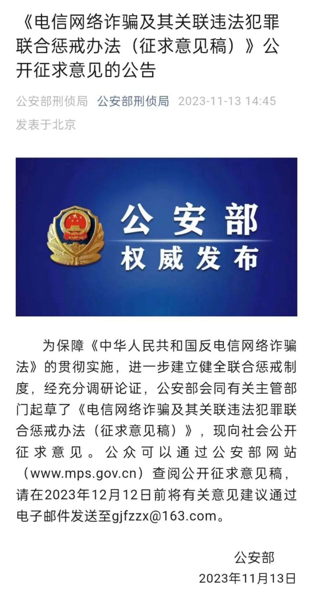
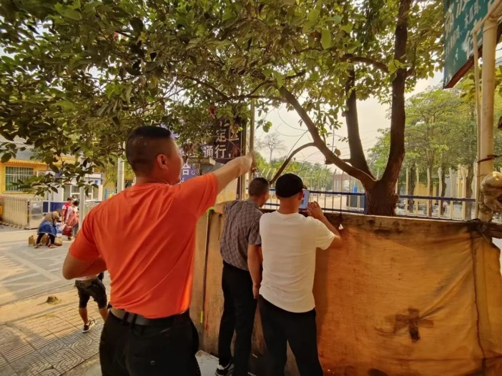
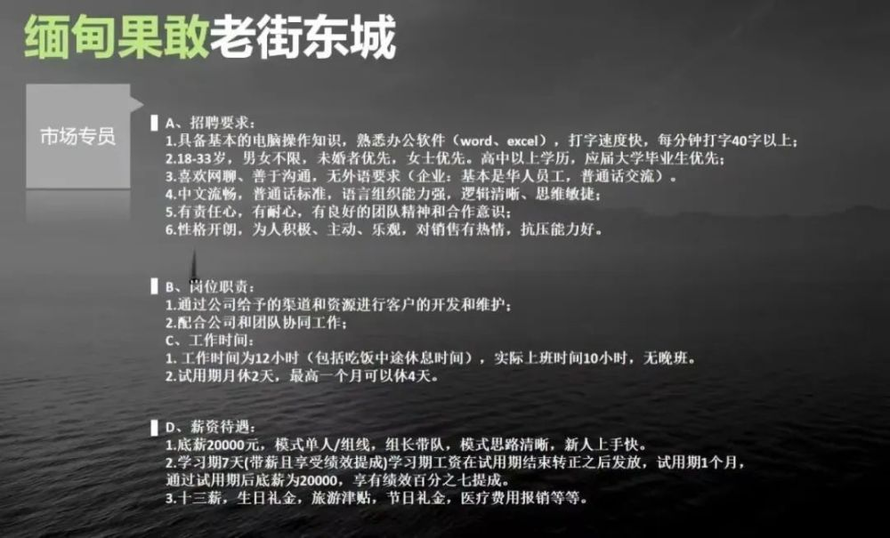

# “蛇头”、打手与洗钱：128份判决书里的“缅北”电诈链条

境外电诈人员归国后，将面临怎样的惩罚？新京报记者在裁判文书网以“缅北”为关键词进行检索，发现128份相关判决书。在这些判决书里，涉缅北电信网络诈骗的犯罪行为被一一列举，跨境电信网络诈骗难以取证等问题，也在判决书中一一呈现。

_2023年11月13日，公安部发布《电信网络诈骗及其关联违法犯罪联合惩戒办法（征求意见稿）》公开征求意见的公告。网络截图_

**文丨新京报记者 汪畅**

**编辑丨陈晓舒**

**校对丨刘越**

打击境外电信网络诈骗的力度在持续加强。

11月13日，中华人民共和国公安部官方网站发布消息称，为深入贯彻落实《中华人民共和国反电信网络诈骗法》，公安部会同有关主管部门起草《电信网络诈骗及其关联违法犯罪联合惩戒办法（征求意见稿）》[以下简称《惩戒办法（征求意见稿）》]，面向社会广泛征求意见。

《惩戒办法（征求意见稿）》共19条，主要包括惩戒原则、惩戒对象、惩戒措施、分级惩戒、惩戒程序、申诉核查6个方面内容。文中指出，应坚持分级惩戒、过惩相当，对于因实施电信网络诈骗及其关联犯罪被追究刑事责任的人，惩戒期限为3年；经设区的市级以上公安机关认定的惩戒对象，惩戒期限为2年。

北京市社会科学院法治所副所长王洁指出，跨境电信网络诈骗纷繁复杂，往往存在难以取证的问题，在后续定罪量刑上可能存在一定局限性，《惩戒办法（征求意见稿）》的推出，意味着国家对惩治电信网络诈骗高度重视，惩戒办法是落实《反电信网络诈骗法》的要求，也是持续推进对电信网络诈骗行为的系统性治理的关键举措之一。

据央视新闻10月16日报道，截至目前，在云南多地公安机关不懈努力下，已有4666名缅北涉我电信网络诈骗犯罪嫌疑人移交我方，其中包括网上在逃人员205名。今年8月以来，全国电信网络诈骗案件发案数、造成财产损失数同比分别下降24%、20.5%。

境外电诈人员归国后，将面临怎样的惩罚？新京报记者在裁判文书网以“缅北”为关键词，发现128份相关判决。在这些判决书里，涉缅北电信网络诈骗的犯罪行为被一一列举，跨境电信网络诈骗难以取证等问题，也在判决书中一一呈现。

涉缅北诈骗人员画像

在这128份判决书里，被告人年龄最小的19岁，年龄最大的是46岁。其中，涉及湖南省的判决书最多，共有27份。

不过在王洁看来，这并不能代表湖南省是相关案件高发地区，在现实操作中，可能存在有的省市未将判决书上网，有的省市还未将此类案件处理完毕等情况。

新京报记者据判决书整理发现，这些赴缅北的犯罪人员，有的是受到同乡、熟人的邀约，有的则是看到网络信息之后，主动联系，也有人是被高薪招聘等虚假信息蒙骗。这其中，不乏有人明知前往缅北是从事违法行为，而仍自愿前往的。

一份来自广州市白云区人民法院的判决书显示，被告人魏阳为求高额回报，自愿参与诈骗，先跋涉至云南省瑞丽市，然后辗转偷渡至缅甸，安全回国停留一阵子之后，又再次前往缅甸，继续参与境外非法诈骗组织，最终被遣返。

这些涉案人员文化程度普遍不高。新京报记者据判决书统计，221名被告人中，共有169人是初中和小学文化程度。学历最高的被告人，是一名00后大学生，被抓获时就读于南宁理工学院，涉案情形是为电信网络诈骗人员提供技术支持，涉案金额共计23万余元，被判以诈骗罪共犯论处。

判决书显示，2021年12月，大学生王泽希在一款名为蝙蝠的聊天APP上认识了网名为“亿陆顺”的男子，经介绍，王泽希在蝙蝠群与上家联系，出资购买一种诈骗分子普遍用来虚拟拨号的GOIP设备，以及电话卡等工具，并组织被告人黄思铭、同案犯廖某等人参与操作设备。2022年1月1日至18日期间，在明知他人实施电信网络诈骗犯罪活动的情况下，仍多次架设GOIP设备，提供给上家向不特定多数人拨打诈骗电话，共获利5万余元，并由王泽希分配获利。

证人曾供述，在操作设备时，王泽希的手机浏览器显示有这台设备拨出号码的情况，他当着大家的面说，这些是缅北的诈骗犯在打电话。在蝙蝠APP的群聊中，王泽希的上家还会告诉哪张卡有问题，有时会说今天用什么类型的骗术，骗到什么人。王泽希虽然知道这台设备是用来进行网络诈骗，但为了赚钱，还是参与了，一共拿到手的工钱有1566元。

法院认为，被告人王泽希、黄思铭为谋取非法利益，明知他人实施电信网络诈骗犯罪，仍提供网络技术支持，涉案金额巨大，二人的行为应当以诈骗罪共犯论处。依照刑法的有关规定，王泽希、黄思铭的犯罪工具依法应予以没收，二人的违法所得依法应予以追缴。

_2023年4月7日傍晚五点，云南清水河口岸，有家属隔着铁栏杆和被骗缅北的年轻人打招呼。新京报记者 汪畅 摄_

判决书里的电诈犯罪链条

涉缅北的被告人，往往涉及多项罪名，其中包括偷越国边境罪；组织他人偷越国边境罪；掩饰、隐瞒犯罪所得、犯罪所得收益罪；帮助信息网络犯罪活动罪；诈骗罪；妨害信用卡管理罪；组织、领导、参加黑社会性质组织罪；非法利用信息网络罪等等。

据128份判决书统计，罪名最多的是涉及偷越国(边)境罪，共25起。其次是帮助信息网络犯罪活动罪、掩饰隐瞒犯罪所得罪和诈骗罪。可以串联起一条关于缅北电信网络诈骗的犯罪链条。

从判决书可以看到，在诈骗集团内部，有诈骗犯、“蛇头”、打手、国内下游负责洗钱的帮手。“蛇头”是这条产业链的起点。为了给诈骗集团运送人力，有的“蛇头”会提前垫付车票机票等费用。

一份判决书显示，2020年9月，两名雷姓被告人以高薪工作为由，引诱五人前往缅甸孟能天空科技公司从事电信网络诈骗工作，为此先行垫付1万元资金，用于他们的路费和住宿。另一份判决书里的老周，为了获取接送一人200元的好处费，他在2020年3月至11月期间，共运送偷渡人员200余人。

在诈骗集团内部，每个人便各司其职，以团伙形式作案。他们往往分为管理人员和实际操作各项业务的人员，上下班和食宿时间，均有统一规定。上班期间，还得将手机等个人物品上交。

一份辽宁省沈阳市和平区人民法院出具的刑事判决书显示，2020年7月至2021年2月期间，张鹤在缅甸勐拉成立以其为首的电信诈骗团伙，被告人董玉生、孟祥玉、李晓明、金勇祥、王久祺以非法占有为目的，偷渡至缅甸勐拉加入其中。他们明确分工，实行集团化管理运作，分成聊天行骗组、发卡客服组、换现组、P图组、解冻支付宝技术组、财务统计组等，针对我国境内居民实施电信诈骗，现已查明被害人23人，涉及诈骗金额44万余元。最终，他们被以诈骗罪追究刑事责任，分别被判处五年至四年三个月的有期徒刑及罚金。

新京报记者梳理发现，在与诈骗链条有关的案例中，被告人的最高判刑为九年，其涉案诈骗金额达到四十余万元。判决书显示，自愿前往缅甸参与境外非法诈骗组织的魏阳，假扮客服，诱导被害人下载“安逸花”“港湾金融”“京东白条”等虚假的借款APP，然后以被害人银行卡信息填错、没有填写订单码、提现太快等理由，对被害人进行欺骗，并诱导他们转账资金到其团伙提供的银行账户。最终，魏阳因诈骗罪，被判处有期徒刑九年，并处罚金人民币十万元。

诈骗犯是否会被判处死刑？王洁表示，根据刑法规定，诈骗罪的最高刑期为无期徒刑。

在所有涉缅北案件中，只有云南省德宏州中级人民法院官方微信发布的一则案件，被告人因组织、领导、参加黑社会性质组织被判处死刑。2016年6月至2018年4月期间，这伙人依托境外赌场，利用互联网社交平台发布借款赌博、办理贷款、高薪招工等虚假信息，并提供交通旅费，将被害人诱骗至云南省瑞丽市，再组织被害人偷越国境到境外赌场，强迫诱使被害人借筹码进行赌博，故意制造赌债，后以偿还赌债或高额交通旅费为由，将被害人关押在境外地点，对其进行殴打、虐待和侮辱，并且通过电话、微信、视频通话等方式迫使被害人的亲友缴纳赎金。

在这期间，黎晓龙等被告人造成1人死亡、1人重伤，多人轻伤、轻微伤的严重后果。吴新明等被告人造成1人死亡、2人轻微伤的严重后果。最终，黎晓龙和吴新明均被判处死刑，剥夺政治权利终身，并处没收个人全部财产，其他被告人则分别被判处有期徒刑并处以罚金。

随着国内警方打击力度持续加强，一些诈骗手段就此失效，但身在境外的犯罪分子也在钻研新套路。

一份出自湖南省石门县人民法院的判决书显示，2019年5月以来，一个犯罪团伙专门针对中国境内居民实施电信网络诈骗。2020年7月，这伙人专门去学习“校园贷”的话术，并在随后以此为实施诈骗的重点。

此前，他们的信贷诈骗模式已经非常成熟。有专人负责在QQ等平台发布相关广告，然后由专人负责冒充银行客服跟被害人对接。核实完基本信息之后，再引导被害人添加“银行专员”的QQ号，让他们缴纳10%的授权金。再由“放款专员”以解冻资金、提升星级缴费等借口继续诈骗。之所以发生转变，是因为这一诈骗模式逐渐被更多人熟知，难以为继。

_“金三角”地标。受访者供图_

归国电诈人员将面临何种惩罚？

“长期驻扎缅北的诈骗集团，往往存在多种不同的违法犯罪行为。”当下，已有4666名缅北涉我电信网络诈骗犯罪嫌疑人移交我国。王洁说，但这些人中，每个人的情况肯定都不相同，比如诈骗集团的头目，除了诈骗之外，是否还存在故意伤人、组织偷渡等犯罪行为？而如果有人只是在诈骗集团当厨师呢？但是又是否存在偷渡的情况？“一切还等证据亮出。”

境外电诈人员归国后，将面临怎样的惩罚？王洁指出，“证据是这些人定罪和量刑的重要依据。”但由于跨境电信网络诈骗纷繁复杂，往往存在难以取证的问题。

北京市华城律师事务所合伙人律师甘仕荣说，由于我国和缅甸目前还没有刑事协助的条约，面对取证这一问题，国家已经出台《最高人民法院、最高人民检察院、公安部关于办理电信网络诈骗等刑事案件适用法律若干问题的意见》（下文简称《意见》），其中第六条第三项的规定提到，“依照国际条约、刑事司法协助、互助协议或平等互助原则，请求证据材料所在地司法机关收集，或通过国际警务合作机制、国际刑警组织启动合作取证程序收集的境外证据材料，经查证属实，可以作为定案的依据。公安机关应对其来源、提取人、提取时间或者提供人、提供时间以及保管移交的过程等作出说明。”

有法院在判决时运用到了这一文件。2019年4月3日，被告人潘佳靖、刘欢慷、程实在他人的组织下到达缅甸北部地区进入卧虎山庄诈骗窝点，经过三四天的学习后，三人均以“代办员”身份进行电信网络诈骗，直到2019年5月10日，他们三人从卧虎山庄离开。由于他们的作案地点在境外，犯罪集团的账目未能收集，无法逐一查证各被告人参与诈骗的资金数额。

但据《意见》的规定，“实施电信网络诈骗犯罪，被告人实际骗得财物的，以诈骗罪（既遂）定罪处罚。诈骗数额难以查证，但具有下列情形之一的，应当认定为刑法第二百六十六条规定的‘其他严重情节’，以诈骗罪（未遂）定罪处罚：1.拨打诈骗电话五百人次以上的”，为此，法院决定按照各被告人拨打诈骗电话人次数进行定罪处罚。

根据三名被告人的供述，在卧虎山庄期间，“代办员”要搭配一至二名“拉手”，每天一起实施犯罪行为。证据显示，在卧虎山庄期间，“拉手”每天至少要拨打200余个诈骗电话，还不包括反复拨打、接听同一电话号码，以及反复向同一被害人拨打、接听电话的次数。从有利于各被告人的原则，法院认为，可以认定这三名被告人搭配的“拉手”日拨打诈骗电话数量为200人次。

《意见》规定，“因被告人故意隐匿、毁灭证据等原因，致拨打电话次数的证据难以收集的，可以根据经查证属实的日拨打人次数，结合被告人实施犯罪的时间、被告人的供述等相关证据，综合予以认定；‘拨打诈骗电话’包括拨出诈骗电话和接听被害人回某电话；反复拨打、接听同一电话号码，以及反复向同一被害人发送诈骗信息的，拨打、接听电话次数、发送信息条数累计计算”。

为此，合议庭最终认定被告人潘佳靖、刘欢慷、程实各参与诈骗犯罪时间为37日，其各自对接的拉手分别拨打了诈骗电话7400次，他们分别获取违法所得14000元、5000元、2000元。

根据最高人民法院、最高人民检察院《关于办理诈骗刑事案件具体应用法律若干问题的解释》的规定，诈骗既有既遂，又有未遂，分别达到不同量刑幅度，依照处罚较重的规定处罚。本案各被告人在缅甸诈骗窝点当代办员期间，其对应的拉手向不特定对象拨打诈骗电话均超过5000次，应当认定为刑法第二百六十六条规定的“其他特别严重情节”，以诈骗罪（未遂）定罪处罚，对于未遂犯，可以比照既遂犯从轻或者减轻处罚。

因此即便很难查证三人是否诈骗成功，这三个人也分别被以诈骗罪（未遂）定罪，并判处有期徒刑和罚金。

王洁说，在境外的诈骗分子在犯罪过程中，很可能存在不同种类的犯罪，根据嫌疑人口供、相关电子数据等证据，不少境外诈骗分子可能都存在数罪并罚的情况。对于有些人而言，即便诈骗罪的犯罪事实难以认定，偷越国（边）境罪也很难逃脱。

_“蛇头”通过短视频平台发来的一张招聘信息，底薪两万元，要求喜欢网聊，打字速度快。受访者供图_

“胁从犯”的认定

许多归国的电诈嫌疑人往往会辩称，自己是被迫参与电诈，是“胁从犯”。

从判决书可见，有的犯罪组织确实会受到当地地方武装保护。在（2020）川1322刑初48号判决书中，四川省营山县人民法院审理查明，2018年，阿斌和阿诚等人在缅甸果敢地区的卧虎山庄、木姐山庄等地建立了诈骗窝点，形成一个较为固定的犯罪团队。多名被告人先后通过他人介绍等方式进入该团队，在不同的组别，以虚假发放贷款的方式从事电信网络诈骗活动。

该犯罪组织受到当地地方武装保护，内部实行“公司化”运营管理，且管理严格，每个成员均使用外号，上下班及食宿时间统一规定，居民身份证、手机等个人物品在上班期间均要交由管理人员统一保管。

2018年至2019年期间，犯罪集团以对不特定人拨打电话、虚构发放贷款的方式实施电信网络诈骗犯罪，共有178名电信网络诈骗被害人报案，涉案数额累计人民币438万余元。

在法院审理过程中，便有被告人辩解称，卧虎山庄受当地地方武装保护，自己是“胁从犯”，应被减轻处罚。王洁解释，“胁从犯”意味着对方存在被胁迫参与犯罪的情况，需要按照他的犯罪情节减轻处罚或者是免除处罚。

但经过审理，四川省营山县人民法院未认定他们属于“胁从犯”。法院认为，本案诈骗犯罪集团受当地地方武装保护，其目的是保护犯罪集团从事犯罪活动不受外界干扰，保护的是犯罪集团利益；上交身份证、手机等个人物品是犯罪集团内部管理需要，而非是强迫各被告人参加犯罪。下班时间，犯罪集团还会将各被告人的私人手机交还各被告人使用。各被告人进出诈骗集团来去自由，想干多久就干多久，完全取决于自愿，且下班后可以自由活动，均无人身限制。

而且法院认为，这些人因利益诱惑，受朋友邀约偷渡出境，在事前有可能不明知是帮助他人实施电信网络诈骗犯罪，但各被告人作为成年人，具有完全行为能力，其认知能力健全，即使是受人指使，多次采用虚构事实、隐瞒真相的方法，并利用话术剧本、修改后台数据等欺骗手段骗取被害人的财物，在主观上也应当明知是在帮助他人犯罪。

不过甘仕荣认为，当存在武力胁迫的情况时，法院判决仍会视情况而定，“如果是强迫去做这件事，是有可能被免除处罚，甚至不认定为犯罪行为的，但是有的人可能是刚开始被胁迫，后来发现有利可图，便主动为之，一切要依据实施细节来区分。”

**定罪的争议**

“当下面对境外犯罪，有时还存在一些司法上的无奈。”王洁指出，由于很多犯罪行为都在境外实施，如果没有证据证明这些人此前有共谋，就难用诈骗罪的共同犯罪来对他们定性，而只能用帮助信息网络犯罪活动罪或者掩饰、隐瞒犯罪所得罪来定性。

“帮助信息网络犯罪活动罪，是很多涉缅北犯罪中的主要一项。”甘仕荣指出，如果明知他人利用信息网络实施犯罪，还为其犯罪提供互联网接入、服务器托管、网络存储、通讯传输等技术支持，或者提供广告推广、支付结算等帮助，则构成帮助信息网络犯罪活动罪，情节严重的，处三年以下有期徒刑或者拘役，并处或者单处罚金。

江西人梁霞在被定为这项罪名时，曾以上游犯罪尚未查证属实为由为自己辩护。2022年3月，她的同学卓某联系她时，说自己的银行卡被冻结了，让她拿自己的银行卡帮转货款、取现，后来这张卡被认定为用于收取电信诈骗赃款，总额达43万元。她辩解说，自己被好友恳求，这才答应帮忙，并不知道对方是电信网络诈骗人员。

江西省永丰县人民法院认为，梁霞明知道卓某只是一个在企业务工的普通员工，并非企业高管人员，月收入只有1万余元，而且卓某要其接收款项的理由是公司货款，接收之后又取现或转账给不同人员，公安部门反诈中心也打了电话给她，她却没有理会，因此可以推定她明知其收取转移的款项为犯罪所得。最终，江西省永丰县人民法院以掩饰、隐瞒犯罪所得罪判处梁霞有期徒刑两年，并处罚金人民币20000元。

裁判文书网的案例中，出现的另一个争议点，也与定罪有关。

湘潭市岳塘区人民检察院指控并经审理查明，2021年11月，被告人肖炽、何昕明知何昕的哥哥何阳长期在缅北从事电信诈骗犯罪行为，仍伙同邹某为何阳提供资金支付结算帮助。经邹某组织，被告人丁啸鹏在明知他人利用信息网络实施犯罪的情况下，在湘潭市岳塘区株易路口附近的茶楼内先后联系“小眼镜”、刘某提供银行卡协助转账。

诈骗得来的5万元，被丁啸鹏通过微信转账、取现等方式转予邹某，邹某随即将上述款项转予何昕，何昕随即将上述钱款转入何阳指定账户。此外，丁啸鹏还介绍了“小眼镜”、刘某先后向肖炽等人提供银行卡协助转账。事后，肖炽、何昕从中获利共计1100元，丁啸鹏从中获利600元。

公诉机关认为，被告人肖炽、何昕明知他人实施电信网络诈骗犯罪，仍为其提供帮助；被告人丁啸鹏明知是犯罪所得而予以转移，应当以诈骗罪追究被告人肖炽、何昕的刑事责任，以掩饰、隐瞒犯罪所得罪追究被告人丁啸鹏的刑事责任。

丁啸鹏辩称，其自首前不知道邹某是电信诈骗，即使他实施了犯罪行为，其罪名也应该是帮助信息网络犯罪活动罪。然而法院认为，他明知是犯罪所得而予以转移，其行为构成掩饰、隐瞒犯罪所得罪，公诉机关指控的罪名成立。最终，肖炽、何昕犯诈骗罪，丁啸鹏犯掩饰、隐瞒犯罪所得罪，均被判处有期徒刑及罚金。

同样是提供资金转账支持，为什么定罪不同？甘仕荣表示，主要是看当事人是否明知诈骗环节，诈骗罪的定罪侧重在骗，“比如不管你这个钱是骗来的，还是抢劫来的，他只负责帮忙转移，并没有参与欺骗，对此也不知情，那一般就不会定为诈骗罪。”

近日，公安部会同有关主管部门起草了《惩戒办法（征求意见稿）》。意见稿共有19条，主要包括惩戒原则、惩戒对象、惩戒措施、分级惩戒、惩戒程序、申诉核查6个方面内容，遵循依法认定、过惩相当、动态管理原则，明确个人和单位纳入惩戒对象的范围，规定金融、电信网络、信用惩戒的具体措施，根据惩戒对象违法行为分级适用惩戒，规范审核认定、惩戒期限和告知等程序，明确申诉、受理、核查、反馈和解除的程序和时限。

甘仕荣认为，这项意见稿或许能解决之前司法实务中存在的一些无法有效打击的难点和痛点，从而更好地对电信网络诈骗犯罪进行定罪和量刑。

