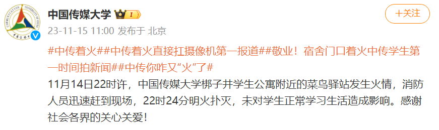
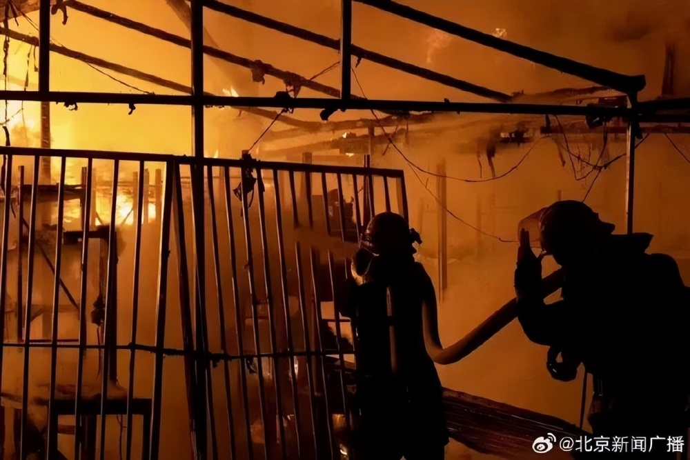
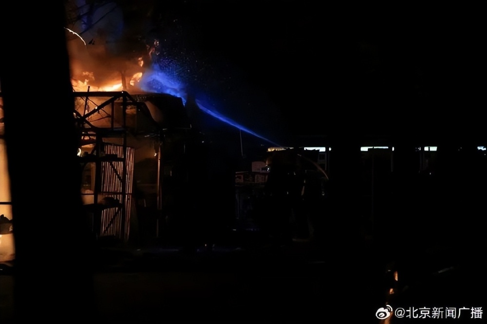
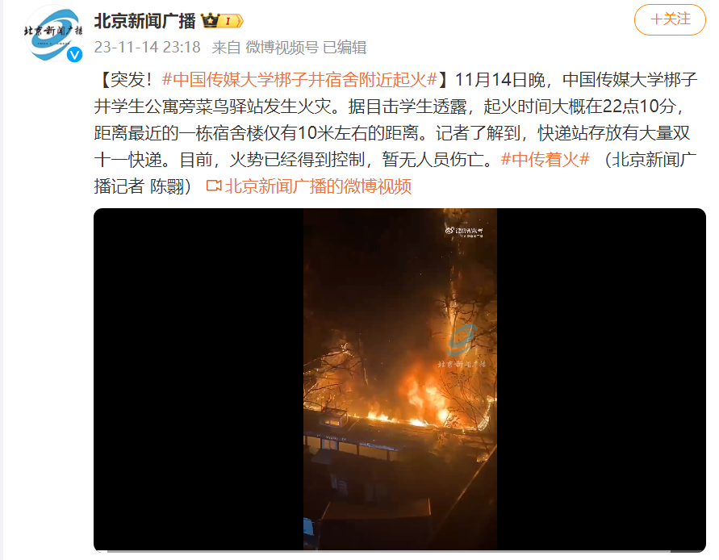

# 中国传媒大学刚刚回应菜鸟驿站发生火情：未对学生造成影响

据@中国传媒大学
15日消息：11月14日22时许，中国传媒大学梆子井学生公寓附近的菜鸟驿站发生火情，消防人员迅速赶到现场，22时24分明火扑灭，未对学生正常学习生活造成影响。感谢社会各界的关心关爱！

 _@中国传媒大学 微博截图_

**此前报道**

**中国传媒大学梆子井宿舍附近起火**

据@北京新闻广播：11月14日晚，中国传媒大学梆子井学生公寓旁菜鸟驿站发生火灾。据目击学生透露，起火时间大概在22点10分，距离最近的一栋宿舍楼仅有10米左右的距离。记者了解到，快递站存放有大量双十一快递。目前，火势已经得到控制，暂无人员伤亡。

_图源：@北京新闻广播_

_来源：环球网综合@中国传媒大学、@北京新闻广播_

