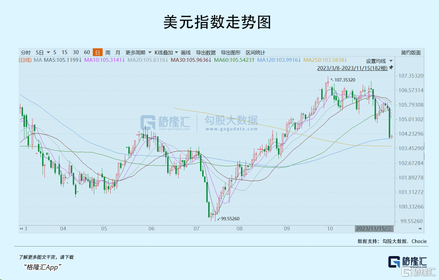
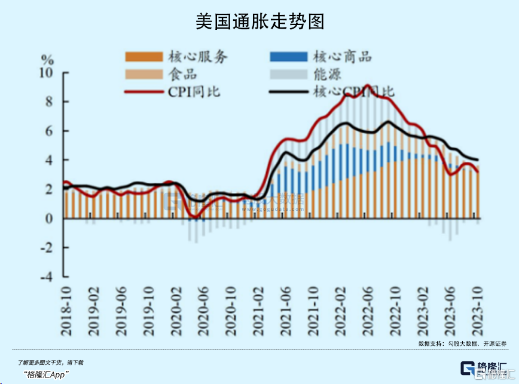
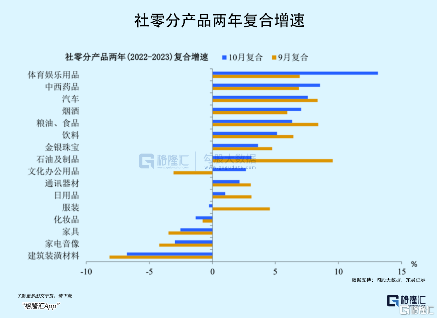
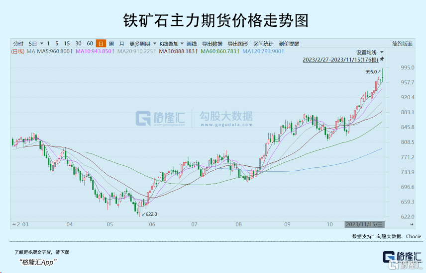

# 全球股票市场沸腾，中国资产也要起飞了

**全球股票市场沸腾。**

隔夜，美股跳空大涨2.37%，较10月底反弹11.5%。标普500指数大涨1.9%，较10月底反弹9.2%。欧洲股市同样飙涨，德国DAX大涨1.7%，法国CAC40大涨1.4%。

今日，亚太股市同样火爆。日经225大涨2.5%，离刷新历史新高仅一步之遥。韩国综合指数也大涨2%。港股市场，恒生指数和恒生科技指数均飙涨4%。

A股市场涨幅略显落寞，上证指数上涨0.55%，但已突破过去两周横盘震荡区间。深成指和创业板指均涨超0.5%。北向资金一度流入超50亿元，收盘时流入36亿元。

债市方面，10年期美债收益率大跌18.5BP至4.453%，创下9月22日以来新低，较10月23日触及16年高点的5.02%累计下跌超50BP。此外，2年期美债收益率同样大跌将近20BP，现价报4.838%。汇市方面，美元指数突袭暴跌1.5%至104左右，而10月初还高达107.3。

股市债市汇市异动明显，其导火索是昨日晚间9点半披露的 **美国10月份通胀数据** 。该数据非常重要，可能会在一段时间之内强化大类资产的走势。

01

据美国劳工部披露，10月CPI同比上升3.2%，低于市场预期的3.3%。今年5月至9月，CPI分别为4.1%、3%、3.2%、3.7%、3.7%。通胀此前已经连续反弹了4个月，而这一次再次掉头保持下行趋势，对市场的影响不小。

拆分看，能源项同比下滑4.5%，跌幅较9月扩大4%。其中，汽油价格环比大幅下滑5%，环比增速较9月下降7.1%。

能源通胀的改善，源于国际油价大幅下跌——布伦特原油从9月底的96美元一路降至11月初的83美元。其核心因素源于美国多项核心数据表明美国经济开始降温，以致于市场比较悲观，预期石油需求不振，尽管期间还有巴以冲突以及沙特俄罗斯减产等供给端的扰动。

食品方面，10月同比上升3.3%，较9月下降0.4%。这已经是连续14个月下降，但环比增速从0.1%回升至0.3%。

10月核心CPI同比上升4%，低于市场预期和前值的4.1%，创下2021年10月以来新低。环比上升0.2%，预期升0.3%，前值升0.3%。

具体来看，10月核心商品项通胀为-0.1%，已经连续第5个月出现环比负增长。未来预计环比可能持续保持小幅下滑态势，新车、二手车、家具以及家用产品将持续弱势。其重要因素之一就是超额储蓄即将耗尽，加之薪资增长放缓，消费面临一定下行压力。

此外，核心服务环比上升0.3%，较9月下滑0.3%。其中，住房项同比上升6.7%，环比上升0.3%，后者较9月下滑0.3%。可见，房租通胀下行速度有一定加速。

核心服务通胀环比增速放缓推动核心通胀增速下降，也让市场对于通胀粘性的担忧有所减缓。

总而言之，
**10月不及预期的通胀数据将大大强化了市场对于美联储结束加息的预期。这亦是全球股票市场大幅上行、美债美元大幅回落的主要因素。并且这一逻辑变化并不是短期的，将在中期维度影响全球风险资产的表现。**

但也值得注意的是，由于11月和12月基数效应，通胀仍有一定可能出现反弹。据测算，若11月和12月通胀环比增速与10月持平，那么整体CPI同比将分别为3.3%、3.7%，核心CPI同比增速将反弹至4.1%、4.2%。当然，这需要走一步看一步，倘若接下来2个月美国经济下滑态势明显，通胀自然也有可能保持10月份持续回落的趋势。

02

今日，国家统计局发布了10月经济数据，整体表现中规中矩。

供给端，10月工业增加值同比增长4.6%，环比9月上升0.1%，略超市场预期的4.3%。一方面是由于去年9月工业增加值基数偏高，10月回落，导致今年10月相比过去同期而言，基数偏低。另一方面前期披露的制造业PMI中生产指数下滑较大，导致市场预期本身也不高。

需求端，先看社零消费。10月同比增长7.6%，超出市场预期的7%和前值的5.5%。不过，两年复合平均增速仅为3.5%，已经连续2个月边际下滑。此前1-9月份两年复合平均增速分别为5.3%、5.3%、3.3%、2.6%、2.5%、3.1%、2.6%、5%、4%。

具体类别看，体育娱乐用品、烟酒等两年复合平均增速有所回暖。尤其是体育娱乐用品同比大幅飙升，亦是社零略超预期的重要因素。一方面，假期旅游较好修复，相关需求有一波释放。另一方面，双11促销窗口前置，销量摊销一部分在10月。然而，建筑装潢材料、家电音像、家具等地产链表现非常弱势。

整体来看，社零消费虽然略超预期，但表现依然比较疲软。还是老问题，居民资产负债表因疫情大幅受损，至今仍然没有完全摆脱。加之股市、楼市表现较差，一定程度上限制了消费支出意愿。

再看固定投资，前10月同比增速仅为2.9%，较前9月继续下滑0.2%。这已经是连续第8个月保持下滑态势。

分类别看，10月制造业投资同比增长6.2%，低于前值的7.9%。其实，今年以来，民间投资相比整体投资同比增速在持续改善，但制造业民间投资的改善状况相对较差，也证明了制造业复苏的基础并不牢固。

10月广义基建同比增速为5.6%，低于前值的6.8%。其中，交通仓储以及水利、环境和公共设施两大板块投资增速均有降温。基建放缓的因素包括新增专项债发行进度不及去年、没有去年政策开发性金融工具支持等。当然，最本质原因是财政收入不见好转，地方政府还正在化债之中。

**不过，基建在明年会发力，因为万亿国债已经在路上。**

再看房地产市场，前10月投资增速继续回落至9.3%，10当月同比降幅继续小幅扩大至11.3%。另外，新开工面积同比下滑21%，而8-9月分别为-23%、-15%。竣工面积同比增长13%，而8-9月分别为10%、23.9%。

整体看，10月房地产市场的压力还是比较大，拖累固定投资以及整体经济表现较为明显。虽然前期已经出台了认房不认贷、降低首付比例、解除限购限售等一些列政策，但实际效果并不佳。

地产政策方面，还有望继续加码。昨日，有媒体传言，央行考虑通过抵押补充贷款（PSL）等政策工具，分阶段通过政策性银行提供中长期低成本资金，以支持“三大工程”建设，包括保障性住房、城中村改造和平急两用基础设施，支持总额度将至少为1万亿元。

PSL工具是央行在2014年创立，在2015年和2022年使用过。2015年通过该工具，以棚改为抓手，快速推动地产去库存，振兴了当时萎靡的房地产市场。2022年因为疫情肆虐，PSL为基建补充弹药，托底整个经济增长。

**当前，若以“三大工程”为抓手，再启PSL，那么可视为财政政策托举固定资产投资。加之前期刚刚公布的万亿特别国债举措，都将成为托底明年经济增长的有利武器。**

这亦是最近商品市场黑色系持续暴涨的重要导火索。其中，铁矿石主力期货合约已经逼近1000美元大关。

**当然，股票市场也已经扭转了此前对经济基本面悲观的预期。**

03

去年11月10日，美国公布低于预期的通胀数据。同一天，中央政治局会议召开，调整疫情防控政策。内外两大因素加持，驱动中国股票市场整整反弹了2个多月。

这一次，剖有相似之处。外部因素，美国10月通胀数据不及预期，加之前期非农数据以及美联储议息会议定调，均指向美联储结束加息。内部因素呢，推出万亿特别国债，以及可能的万亿PSL，让市场对经济基本面持续改善与沪深有较强的预期。

去年市场底出现在10月31日，今年市场底也已经出现，为10月23日。去年有一波扎扎实实的跨年行情。今年呢， **内外驱动因子都在，想必也不会缺席。**

**当然了，越早相信这个故事，投资性价比也就越高。**
往后面走，不确定因素也就越多，比如美国经济是否会陷入较为严重的衰退、长时间保持如此高利率是否会引发非线性风险。珍惜年底前两个月的美好时光吧，不要错过。（全文完）

