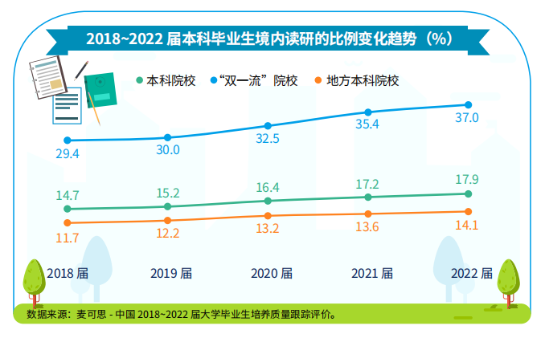
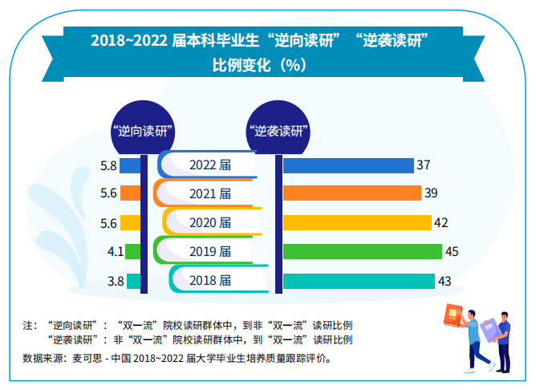

# 名校本科毕业却考研进入“非名校”？麦可思研究院：逆向考研“往下读”比例上升

2024年考研已进入倒计时。红星新闻记者从麦可思研究院获取的相关数据统计结果发现，近年来“逆向考研”作为一种新的考研趋势，越来越受到考生关注。

数据显示，近五年“双非”院校应届读研群体中，到“双一流”院校读研的比例从2018届的43%下降至2022届的37%。与此同时，地方本科院校毕业生为追求名校而读研的占比也呈下降趋势，因就业难暂时读研的比例有所上升。

相关调查结论指出，在考研人数逐年攀升的情况下，尽管考研群体中选取本校或更好大学“向上考”仍是主流，但“逆向考研”的人数也不断上升。

麦可思研究院发布的《2023年中国本科生就业报告》（下称《就业报告》）数据显示，近五年应届本科毕业生境内读研比例持续提升，从2018届的14.7%逐年增至2022届的17.9%，上升了3.2个百分点。并且，不同类型院校的应届本科生读研比例差异较大。

《就业报告》数据表明，“双一流”院校应届本科生国内读研比例增长更快，从2018届的29.4%增至2022届的37.0%，增幅达到26%。《就业报告》分析认为，造成这一现象的原因一方面在于“双一流”院校推荐免试研究生的占比较大，且近年来呈上升趋势；另一方面，“双一流”院校毕业生在考研中整体竞争力较强，考研成功率相对较高。

相比之下，近五年地方本科院校毕业生国内读研比例增速则相对较缓，从2018届的11.7%增至2022届的14.1%。《就业报告》分析认为，这或与地方本科院校毕业生首次考研失利情况更为普遍有关。

 _图据麦可思研究院_

此外，在近年来的考研热潮中，“逆向考研”作为一种新的趋势逐渐受到关注。所谓“逆向考研”，是指“双一流”院校的本科毕业生，考入非“双一流”院校读研。《就业报告》数据表明，近五年“双一流”院校应届本科毕业后，在继续读研的群体中，到“双非”院校读研的比例逐年升高，从2018届的3.8%上升至2022届的5.8%。

为何会出现这种现象？《就业报告》分析认为，这反映出在考研难度逐年攀升的情况下，部分“双一流”院校本科毕业生被迫做出向下兼容的升学选择。不过《就业报告》也同时指出，整体而言，读研群体中选取本校或更好大学“向上考”仍是主流。但不可否认的是，普通院校考入名校的“逆袭读研”路径难度有所增加。麦可思研究院调查发现，在近五年“双非”院校应届读研群体中，到“双一流”院校读研的比例从2018届的43%下降至2022届的37%。

_图据麦可思研究院_

本科毕业生选择读研的背后，大多是为了增强就业竞争力。对地方本科院校毕业生而言，“逆袭读研”能带来更可观的经济回报。如在2014届地方本科院校读研人群中，进入“双一流”深造群体毕业五年后月收入可达到12442元。但更优渥的经济回报并不体现在非“双一流”院校深造群体中。数据显示，“双非”院校深造群体毕业五年后的平均月收入为9507元，不及工作经验更丰富的，学历未提升人群所拿到的9961元的平均收入。

《就业报告》分析认为，这在某种程度上能够说明，学历并非职场成功唯一的“敲门砖”，长期工作经验积累的素质和能力提升，对毕业生职业生涯发展亦有很大价值。

红星新闻记者 杨雨奇 实习生 张珺洁

编辑 何先锋 责任编辑 魏孔明

