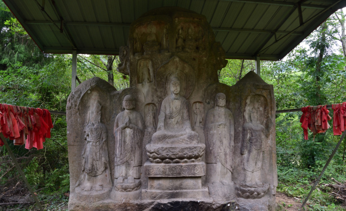
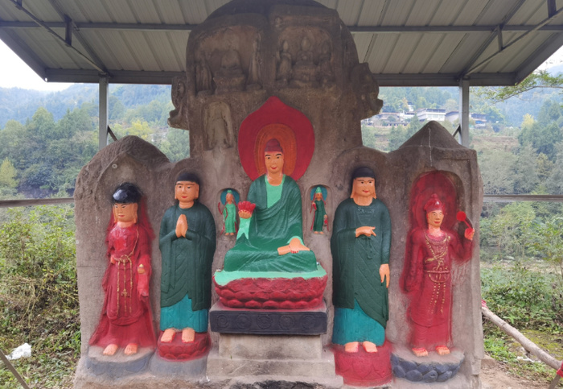

# 四川千年摩崖造像被毁容？官方：村民为穿衣还愿涂色，公安正开展调查

11月13日，四川省巴中市南江县石飞河部分摩崖造像被涂色引发网友广泛关注。

11月15日凌晨，南江县文物保护研究中心发布通报称，经初步调查，2023年11月6日，四川省阆中市居民李某华委托巴中市南江县赤溪镇金银村村民王某国(李某华之母)请高塔镇射洪寨村民岳某邦对石飞河部分摩崖造像涂色“穿衣还愿”。事件发生后，当地立即对现场增加了保护措施，防止不当行为造成二次损害。同时，公安机关正在依法开展调查。

11月14日，四川省文物局、文物考古研究院和巴中市文物局专家进行现场查勘，并研究制定保护修复方案。南江县文物保护研究中心已联系文物资质机构对摩崖造像价值及因涂抹造成的损失进行评估。下一步，该中心将对调查处置和修复情况及时向社会公布。

据上游新闻此前报道，近日，南江县新发现的一处开凿于北魏晚期、距今1400多年的摩崖造像，被当地村民信众以“还愿”为由用颜料涂抹“毁容”。记者从当地文保部门获悉，该处造像是2021年才发现，还未纳入文保单位，虽然设有监控和大棚保护，但因地处偏远，发现情况时已来不及制止。

_近日，四川南江县一处北魏晚期营造的摩崖造像被涂抹，图为涂抹前。上游新闻 图_

_近日，四川南江县一处北魏晚期营造的摩崖造像被涂抹，图为涂抹后。上游新闻 图_

巴中市文物局工作人员表示，涂抹造像的颜料主要是丙烯类，目前已经邀请相关专家论证。

据报道，珍贵石窟佛像被“浓妆艳抹”，近年来，全国各地类似事情时有发生。

来源：微信公号“南江文旅”、上游新闻

