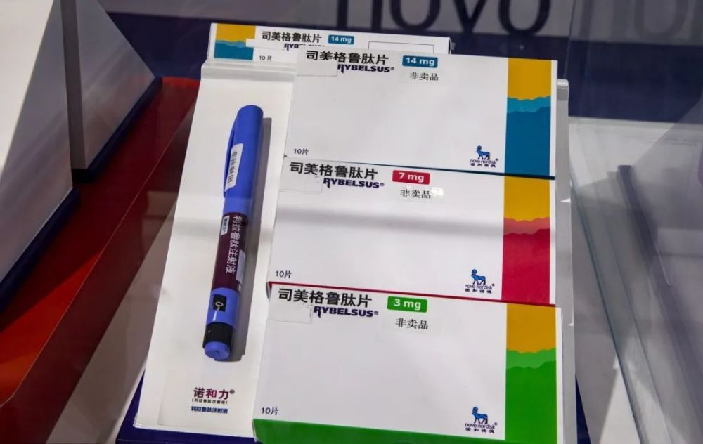

# 揭秘减肥神药的“黑市交易”：医院正规处方，倒卖一支赚400元

_图片来源：视觉中国_

特约作者 | 陈方

编辑 | 陈弗也

出品 | 棱镜·腾讯小满工作室

今年初还在倒卖人血白蛋白的张先生，3月份就把库房里的冰柜全部清了出来，改进新货。

他给作者出示了库房的视频，满满一冷藏柜里放着的都是1.5ml包装的司美格鲁肽。在药贩子的圈子里，这种神奇的“减肥针”是当下最好卖的货。

司美格鲁肽本是一种治疗糖尿病的药，和胰岛素类似，是打在肚子上的自动注射针，2021年4月在中国获批上市，当年底便纳入了医保。

国外科学家研发出司美格鲁肽后，很快发现这种药物有神奇的减肥功效，而且通过临床试验验证了减肥效果。2021年6月，司美格鲁肽获得美国正式批准，用于减肥。但在中国，司美格鲁肽的减肥适应症还没获批。

同一种药物、同一种用法，一条隐秘的利益链便由此出现了。

**医保基金吃亏，其他人都受益**

像张先生这样的药贩子在微信群里有很多。当下什么药流行、什么药紧俏，他们就能拿到什么药，比如，年初的新冠药、五月份的甲流药、如今的减肥药……

其实，司美格鲁肽2022年开始就很紧俏。在2021年底，司美格鲁肽以降糖药物的身份被纳入了医保目录，1.5ml规格的小支装价格从1120元降到478.8元，还能享受医保报销。

从那时起，司美格鲁肽就处于供不应求的状态。

小李曾在杭州的三甲医院开到过司美格鲁肽，但他并没有糖尿病。医生给了他一张通知书，表明已告知患者用药风险，患者仍希望自费购买药品，用于减肥。他陆陆续续在医院买了三四个月的药，到了今年6月份，医院告诉他，已经开不出司美格鲁肽了。

小李趁着出差的机会，到北京的医院咨询，发现北京市区内大一点的三甲医院也都买不到这种“减肥神药”。有医生告诉他一个地址，让他到五环外的一家民营医院去买。

公立医院是司美格鲁肽销售的主要渠道。不少用于减肥的司美格鲁肽实际上是以降糖药的名义从医院或者药店开出的，这也就是不少药贩子所说的“正规渠道货源”。

在微信群里，司美格鲁肽依然能正常买到，只是价格略贵于现在的挂网价，而且明确承诺是“医院”里开出来的，生产日期和保存品质有保证。像小李这样的人，则认为少许差价可以接受。

一支1.5ml的司美格鲁肽挂网价不到500元，糖尿病患者去医院就诊购药自付只需要150元左右。药从医院开出后到药贩子手里，再转卖出去就能卖到500元以上。开药的患者、药贩子从中能赚到近400元的差价，想减肥的用户则可以买到药。

这中间，只有医保基金吃了亏，其他人似乎都获得了收益。

降糖和减肥，同一种药可以有两种不同的用途，一种用途的供应受管控，另一种用途基本属于放任状态，这很自然会产生“黑市”的现象。再严格的监管政策都无法避免漏洞出现：真正的糖尿病患者完全可以买到司美格鲁肽后转卖，自己仍然使用其他降糖药物。

不过，即便是减肥适应症获批了，短期内倒卖现象可能也无法断绝。

司美格鲁肽是丹麦诺和诺德公司的原研药，全球范围内都很紧俏，尤其是在已经获批了减肥适应症的美国，更是被列上了紧缺药名单。今年这种“减肥神药”就有可能问鼎全球药品年销售额最高的“药王”宝座。

甚至有投资机构认为，减肥变得不再困难之后，各国的医保开支、人均预期寿命，乃至更深远的社会结构都会发生深层次改变。这可能并不是天方夜谭。

**“一周打一次”的神药，彻底引爆行业**

《健康时报》今年8月专门报道了全球权威糖尿病期刊上的一篇论文，研究了中国1580万成年人的肥胖状况，得出的结论是：受试者中超重比例占34.8%，肥胖人群占比14.1%。

减肥不仅是抖音、小红书上帅哥美女的生活日常，也是每个人都面临的健康问题。减肥的方式有很多种，药物减肥一直是人们所期待的“懒人减肥法”，但全球医疗界几乎攻克了所有已知的常见疾病，却对肥胖症一直束手无策。

自从2011年西布曲明被认定为有害成分禁止使用之后，国内唯一明确用于减肥的药品就只剩下奥利司他了。但是，据很多用户说，吃完奥利司他后，反胃、呕吐、腹泻现象很严重，以至于当年投资布局这唯一减肥药的很多企业都没赚到钱。

司美格鲁肽是GLP-1受体激动剂的一种，这类药物通过刺激肠促胰岛素发挥功能，分解糖分，实现降糖和减重的效果。GLP-1在药物原理上和奥利司他、普通胰岛素等都不一样，10年前最初发明出来时，因为分子结构的关系，药物作用时间太短，一天要打好几次，不如胰岛素方便，更没人想到它能减肥。

直到一周打一次的司美格鲁肽出现，行业才彻底被引爆。

有意思的是，自从今年司美格鲁肽火了之后，国内竟也冒出了不少号称能生产类似GLP-1药物的医药企业想要抢夺市场。近期市场上热门的“减肥药概念股”冒出来不少，不乏短期内股价上涨三四倍的案例。

司美格鲁肽是多肽类药物，诺和诺德公司找到这个化合物花了8年的时间，但其实仿制合成的难度并不太大，在原来结构上稍作修改的“仿创”也不是没可能的。这正是国内企业纷纷跳出来称自己也能生产类似减肥药的原因。

诺和诺德可能并不太担心中国的药企，它最担心的是美国礼来。

11月8日，美国礼来公司的类似产品、GLP-1/GIP双靶点药物替尔泊肽在美国获批用于减肥。替尔泊肽据称减肥效果比司美格鲁肽更好，而且礼来早早布局了产能，预计今年底就能放量供应美国市场。

诺和诺德11月13日刚刚宣布，计划投资60亿欧元在丹麦加紧建设新的生产基地，产能将在2025年底前释放。

两大高手已经无需比拼疗效的内力了，现在比的是“硬桥硬马”的产能真功夫。一旦市场供应大幅增加，“黑市交易”将不复存在。到时候国内声称能生产减肥药的企业，是奋力一搏还是一哄而散，恐怕不难猜。

