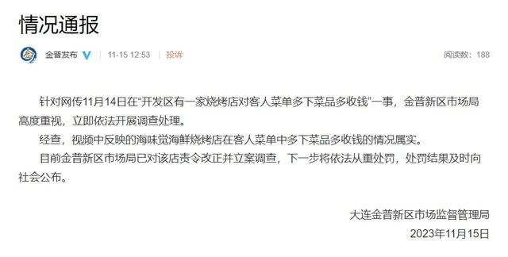

# 网传大连一烧烤店对客人菜单多下菜品多收钱，官方通报：情况属实

情况通报

针对网传11月14日在“开发区有一家烧烤店对客人菜单多下菜品多收钱”一事，金普新区市场局高度重视，立即依法开展调查处理。

经查，视频中反映的海味觉海鲜烧烤店在客人菜单中多下菜品多收钱的情况属实。

目前金普新区市场局已对该店责令改正并立案调查，下一步将依法从重处罚，处罚结果及时向社会公布。

大连金普新区市场监督管理局

2023年11月15日

