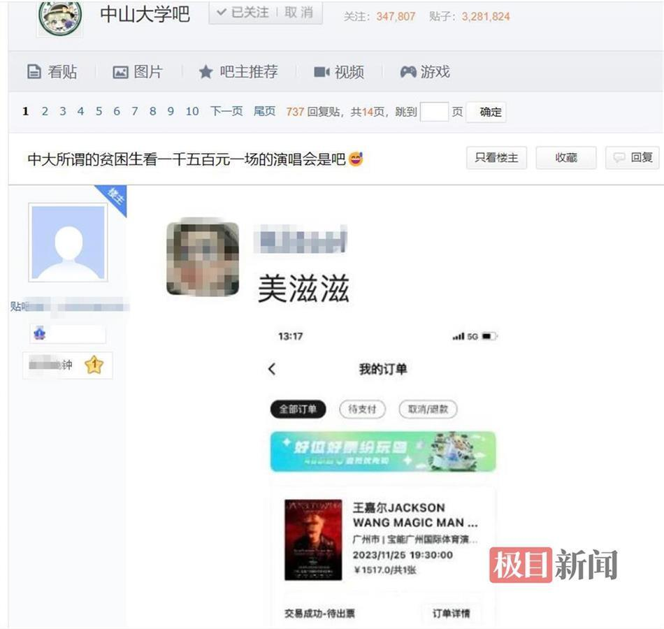
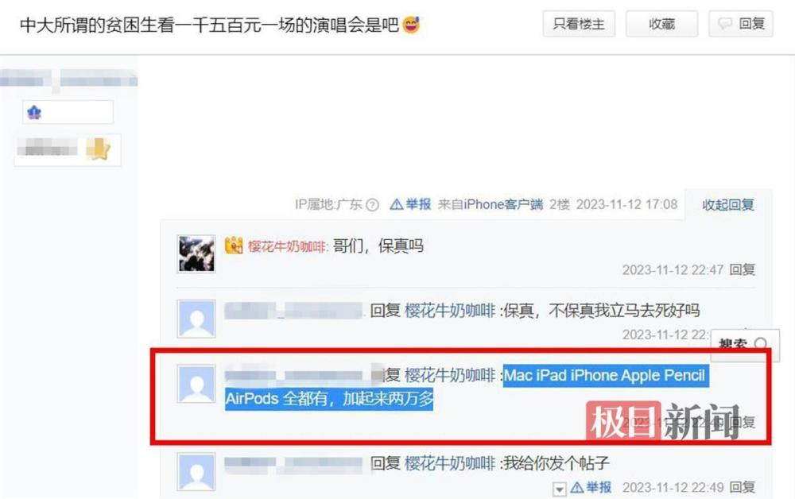
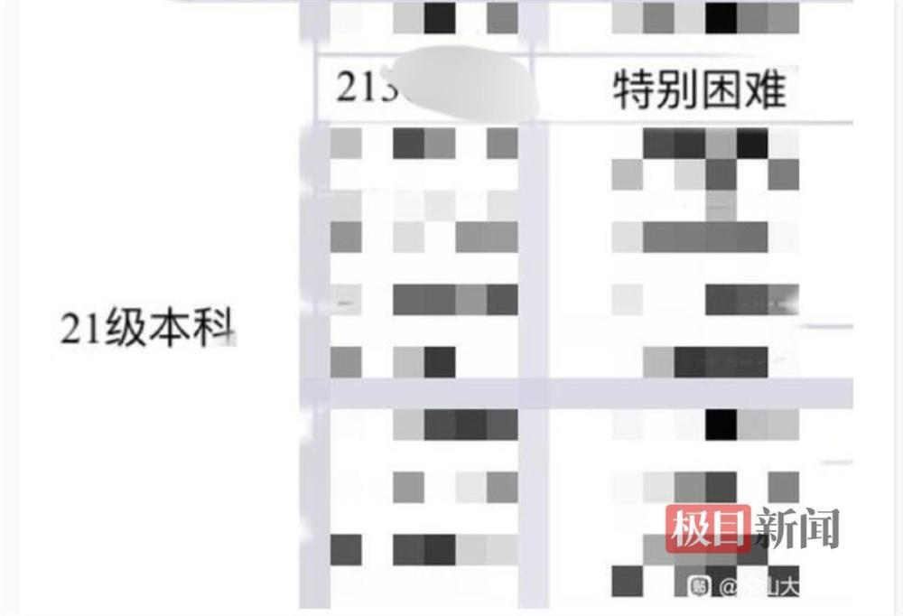
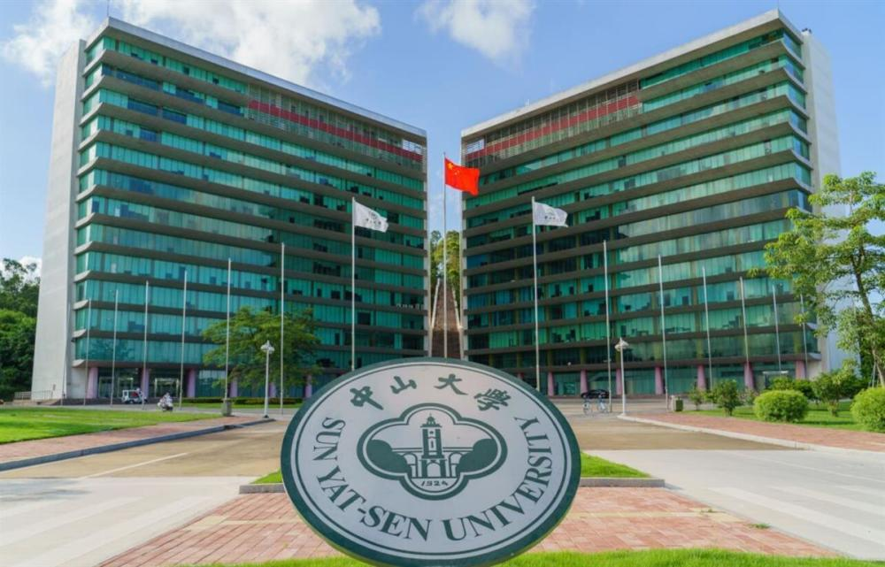

# 网传获助学金学生买苹果四件套、花1500元看演唱会 中山大学：正核实

极目新闻首席记者 丁鹏

近日，有网友在中山大学贴吧发帖称，该校中法核工程与技术学院（以下简称中法核）一名获助学金的特困学生用的是苹果系列四件套（一般指苹果品牌的手机、电脑、平板和手表四款产品），而且还买了价值1517元的王嘉尔演唱会门票。11月15日，极目新闻（报料邮箱：jimu1701@163.com）记者从中山大学多部门了解到，该校已关注到相关信息，并正对此事进行全面调查核实。

_中山大学贴吧网友发文称特困生买1500元演唱会门票（网页截图）_

帖文显示，一名中山大学2021级本科生因“特别困难”获得了一笔助学金，但有网友称这名同学的经济条件并不差，平时用的是苹果电脑、平板、手机等四件套产品，价值2万元，而且还购买了王嘉尔将于11月25日在广州举行的演唱会门票，票价达到1517元。帖文中，爆料网友还公开了这名获得助学金学生的学号信息。

_网友称涉事学生使用多款苹果品牌产品（网页截图）_

11月15日，极目新闻记者致电中山大学珠海校区中法核学院奖助学金事项工作人员电话，但未能接通。

中山大学校长办公室一名工作人员告诉极目新闻记者，奖助学金的评定工作由学校党委学生工作部负责。

中山大学党委学生工作部一名负责奖助学金工作的工作人员向极目新闻记者介绍，他们将调查核实此事。

_该网友公开的该学生号和年级信息（图片来源：中山大学贴吧）_

中山大学珠海校区中法核学院一名负责人告诉极目新闻记者，他们已经关注到贴吧的相关情况，正在对评定流程、学生情况等进行全面调查核实。

_中山大学珠海校区一角（图片来源：学校官网）_

（来源：极目新闻）

