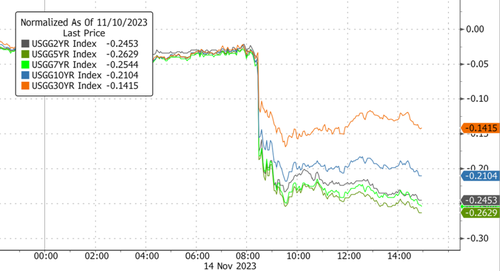
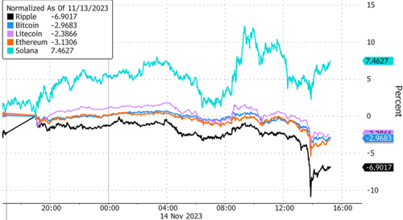
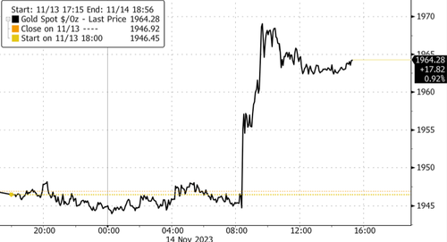

# 美股收盘：通胀放缓引爆多头情绪 纳指大涨2.4% 市场押注联储完成加息

美国10月CPI环比零增长，预期为增长0.1%，前值增0.4%；同比增3.2%，弱于预期3.3%和前值3.7%。核心CPI环比增0.2%，弱于预期和前值0.3%；同比增4%，弱于预期和前值4.1%，并创下2021年9月以来的两年新低。

**美国通胀超预期降温，坐实了市场对美联储已经完成加息的预期**
，12月和明年1月加息概率分别从14%和25%降至零，对明年上半年开始降息的押注急速升温，明年首次降息的时间点预期从7月份提前至5月，且5月降息概率从34%提升至63%。

**美联储官员“一如既往”试图打压过于乐观的降息交易。**
今年票委、芝加哥联储主席古尔斯比称抗通胀仍需努力，住房通胀将是进展关键。明年票委、里士满联储主席巴尔金也称，不确信通胀处于平稳朝着2%回落的正轨之上，“担心有必要采取更多紧缩行动。”

美国共和党籍众议院议长约翰逊称，他提出的阶梯式权宜支出法案正赢得越来越多两党支持，将为参议院通过该法案留出足够时间，美国联邦政府有望在周六凌晨之前避免停摆。

欧元区三季度GDP初值季环比萎缩0.1%，若四季度持续不佳可能陷入技术性衰退。英国三季度薪资增速仍接近创纪录高位，职位空缺数减少，显示劳动力市场开始走软，不过可能无助于缓解英国央行对通胀压力的担忧，这令英国富时100股指的周二涨幅弱于欧洲其他国家。

道指收涨近500点，标普、纳指和中概指数涨约2%，小盘股涨超5%，微软英伟达创新高

11月14日周二，由于美国10月CPI通胀低于预期和前值，期货交易员开始预计到明年7月美联储降息50个基点，美股集体跳空高开超1%，罗素小盘股开盘涨3%，道指期货盘前涨300点：

**开盘10分钟，科技股居多的纳指以及纳斯达克金龙中国指数便齐涨2%**
。纳指日内最高涨超350点或涨2.6%，升破1.4万点整数位，创约六个月来最佳表现，并脱离技术位盘整区间。

标普500指数最高涨近百点或涨2.2%，一度升破4500点。11大板块齐涨，对利率敏感的房地产板块涨超5%为一年最佳，可选消费、原材料、公用事业板块涨超3%，电信和科技股涨2%。

道指最高涨近600点或涨1.7%，罗素小盘股涨5.4%并收于日高，创一年来最佳表现，“恐慌指数”VIX跌近6%并一度失守14，创9月20日以来的两个月最低，纳指100也涨超2%。

追踪标普信息技术板块的ETF
XLK涨2%至历史收盘最高，追踪通讯服务板块的ETF创去年4月来最高，软件股ETF创去年1月来最高，主流光伏股两位数跳涨，光伏股ETF TAN涨超10%。

**最终，**
道指连涨三日，与标普大盘均至9月14日以来的两个月最高，纳指创8月1日来的三个半月最高，标普和纳指齐创4月份来最佳表现，罗素小盘股三连涨至9月20日来的八周最高：

标普500指数收涨84.15点，涨幅1.91%，报4495.70点。道指收涨489.83点，涨幅1.43%，报34827.70点。纳指收涨326.64点，涨幅2.37%，报14094.38点。纳指100涨2.1%，罗素2000小盘股指数涨5.4%。

**明星科技股齐涨。**
元宇宙Meta涨超2%，连涨八日刷新22个月最高，亚马逊涨超2%至19个月最高，苹果涨超1%、奈飞涨近1%，均至十周最高，微软涨约1%至历史收盘最高，谷歌A涨超1%至三周最高，特斯拉涨超6%至四周新高。

**芯片股也齐涨。**
费城半导体指数涨3.6%，升破3600点至8月8日以来的三个多月新高。英特尔涨3%至17个月最高，AMD涨2.7%至五个月最高，英伟达涨超2%，连涨十日至历史收盘最高，追平上市以来最长连涨纪录，本次连涨十日累涨近22%。

**AI概念股反弹三日** 。C3.ai涨超7%至十周新高，Palantir
Technologies涨超1%刷新三个半月高位，SoundHound.ai涨7%至两个月最高，BigBear.ai涨5.6%至三个半月最高。

消息面上，高盛在下周英伟达三季报之前重申买入评级，预计业绩和四季度指引强劲。特斯拉中国上调Model
3和Y后轮驱动版售价。C3.ai扩大与亚马逊AWS云业务的战略合作，将为企业提供生成式人工智能解决方案。

**热门中概追随美股大盘强势上涨。** ETF
KWEB和CQQQ均涨超2%，纳斯达克金龙中国指数（HXC）涨2.2%，升破6400点，从逾一周新低连续反弹三日，并创一个月最高。

纳斯达克100成份股中，京东涨3.7%，百度涨超2%，拼多多涨1.6%。其他个股中，阿里巴巴和腾讯ADR涨约2%，B站涨3%。蔚来汽车涨近5%，小鹏汽车涨9.7%，理想汽车涨近1%。

同时，BOSS直聘涨超5%，三季度营收超预期同比增超36%，将进行上市后首次派息。迅雷跌4.5%，三季度调整后净利润同比降约39%。唯品会涨3.5%，对四季度净营收指引低于市场预估。法拉第未来跌超5%，第三季度首次产生收入且经营性亏损收窄，月底将举办“中东战略发布会”。

**尽管穆迪下调摩根大通、富国银行等最大银行子公司的信用评级前景至负面，银行股指仍因经济避免衰退的希望而大涨。**
行业基准费城证交所KBW银行指数（BKX）涨5.6%后收涨4.7%，创9月18日以来八周最高，盘中创6月6日以来五个月最大涨幅，10月底曾创2020年9月以来的三年最低。KBW纳斯达克地区银行指数（KRX）涨8.6%后收涨7.5%，创9月5日以来的十周最高，5月11日曾创2020年11月来最低。

**其他变动较大的个股包括：**

媒体称，亚马逊将允许美国Snapchat用户直接从这款“阅后即焚”社交媒体应用程序中购买亚马逊上的广告产品，Snapchat母公司Snap涨超7%至四个半月最高。

嘉能可将以69.3亿美元现金，收购加拿大泰克资源旗下炼钢煤业务的77%股权，为两年后拆分自家煤炭业务奠定基础，矿业股泰克资源盘初涨超7%，力拓涨3%，淡水河谷和南方铜业涨约5%。

美国家装零售巨头家得宝涨超5%至七周新高，盘中创近一年最大涨幅，虽然全年业绩指引收窄且三季度营收同比下滑3%，当季财报仍超预期，管理层称最糟糕的通胀时期已经过去。

电动汽车制造商Fisker一度跌超24%至上市后历史最低，三季度亏损超预期且汽车交付量不佳，首席会计官意外离职后披露内部财务控制存在重大缺陷，将延迟提交10Q季报监管文件。

**欧股齐涨，且除英国之外的国家股指均涨超1%** 。泛欧Stoxx
600指数收涨1.34%至一个月最高，基础资源板块涨3.7%、零售股涨超3%，利率敏感的房地产股涨7%至八个月高位，高盛预计，随着家庭消费能力的增强和经济放缓威胁缓解，欧洲斯托克600指数明年将上涨7%。

美债收益率全线两位数跳水，两年至10年期收益率均跌超20个基点，基债收益率七周最低

CPI超预期降温，坐实了市场对美联储已结束本轮加息周期的预期，美债收益率集体两位数大跌，10年期基债收益率退守4.45%下方，3至7年期中期债券收益率均跌超20个基点。

摩根大通美国国债客户多头占比升至2010年以来最高，美银的基金经理调查也称，投资者对债券的看涨程度为金融危机以来最高。

对货币政策更敏感的两年期美债收益率跌23个基点至4.81%，创一周多盘中最低。10年期基债收益率日内跌20个基点、从日高最深回落超22个基点至4.43%，至9月22日以来的七周多最低，以及3月硅谷银行倒闭引发全球金融担忧以来的最大单日跌幅。30年期长债收益率日内最深下行15个基点并一度失守4.60%，也创七周最低。

_两年至10年期美债收益率集体跌超20个基点_

**欧债收益率大幅追跌美债收益率走势。**
欧元区基准的10年期德债收益率跌超12个基点，为9月14日以来首次跌穿2.6%关口，与跌16个基点的负债较深外围国家基准10年期意债收益率齐创两个月最低。10至50年期英债收益率集体跌超17个基点，基债收益率创五个多月最低。

油价盘中涨近2%后从一周高位冲高回落，美油一度尝试上逼80美元，布油上逼84美元

美联储若结束加息有助于提振经济增长和用油需求，国际能源署上调今明两年的石油需求增长预测，与昨日的OPEC乐观月报形成呼应，
**均提振油价盘中涨近2%，尾盘时冲高回落。** WTI
12月期货收平，报78.26美元/桶，布伦特1月期货收跌0.05美元，跌幅0.06%，报82.47美元/桶。

美油WTI最高涨1.51美元或涨1.9%，一度升破79美元并尝试上逼80美元关口，刷新11月7日以来的一周盘中新高，尾盘小幅转跌后下逼78美元。布油最高涨1.46美元或涨1.8%，尝试上逼84美元，也刷新一周盘中高位，尾盘抹去稍早全部涨幅。

尽管预计几乎所有主要经济体的增长都会放缓，国际能源署IEA仍将今年全球石油需求增长预测从230 万桶/日上调至 240
万桶/日，将明年的需求增量预期从88万桶/日提高至93万桶/日，但预计明年上半年将出现小规模供应过剩。美国能源部计划购买120万桶石油补充战略石油储备，也有助于进一步提振短期内需求。

欧洲基准的TTF荷兰天然气期货尾盘小幅上涨0.1%，ICE英国期货则转跌0.8%，脱离美国CPI数据发布后的日高位。美国天然气期货转跌超3%。昨日欧美天然气齐涨，是由于投资者担心美国得州LNG液化天然气工厂将重新停工、限制冬季取暖旺季的供应。

美元指数跌1.6%失守104，欧元英镑涨1.8%，日元涨1%上逼150，离岸人民币涨超400点

衡量兑六种主要货币的一篮子美元指数DXY跌1.6%，接连失守105和104两道关口，创9月1日以来的十周多最低，昨日曾尝试上逼106。彭博美元指数跌超1%，创1月6日以来最大跌幅。

**非美货币大幅跳涨。**
欧元兑美元涨1.8%，接连升破1.07和1.08两道关口，突破200日均线并创8月31日以来最高。英镑涨1.8%，接连升破1.23至1.25三道关口，至两个月最高。

日元兑美元涨近1%，升破151并上逼150，至一周新高，昨日曾下逼152创一年最低。离岸人民币上逼7.25元，较上日收盘最高涨近430点或涨0.6%，创9月1日以来的两个半月盘中最高。商品货币澳元和新西兰纽元兑美元齐涨2%。

**主流加密货币齐跌。**
市值最大的龙头比特币跌4%至3.53万美元，上周五曾自去年5月以来首次升破3.7万美元大关。第二大的以太坊跌超5%并失守1980美元，远离七个月高位。

_主流加密货币齐跌且幅度较大_

现货黄金涨超1%至1970美元，白银涨近4%钯金涨5%，伦铜一个半月最高，锌涨近2%

美元和美债收益率大幅走低显著提振金价。COMEX
12月黄金期货16美元或涨0.8%，报1966.50美元/盎司，12月期银涨3.5%至23.13美元，重返23美元整数位上方。

现货黄金日内最高涨超24美元或涨1.3%，一度触及1970美元整数位，收复11月8日以来大部分跌幅。现货白银最高涨近4%并重返23美元上方，钯金最高涨5%并重上1000美元关口。

道明证券大宗商品策略师Daniel
Ghali认为，美国CPI通胀明显弱于预期，对贵金属相当有利，同时预计四季度数据将显著恶化，继续削弱美元并支撑黄金，未来半年金价或涨至2100美元。

_现货黄金最高涨超1%至1970美元整数位_

**伦敦工业基本金属两日连涨。**
昨日涨1.6%的经济风向标“铜博士”再涨0.8%，升破8200美元至一个半月最高。伦铝继续脱离两周低位，伦锌涨1.9%至2600美元，至一周新高，也接近10月初以来高位。伦铅1.5%并升破2200美元，至七周多最高。伦镍小幅上涨，但离2021年5月以来的两年半低位不远，昨日涨1.3%的伦锡再涨超1%，升破2.5万美元至三周最高。

同时，沪锌夜盘收涨超1%，沪镍涨0.8%，氧化铝涨超1.5%。内盘焦炭、焦煤和铁矿石的夜盘期货均收涨超3%，棕榈油、热卷、沥青涨超2%。

