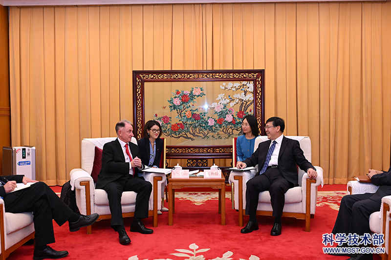
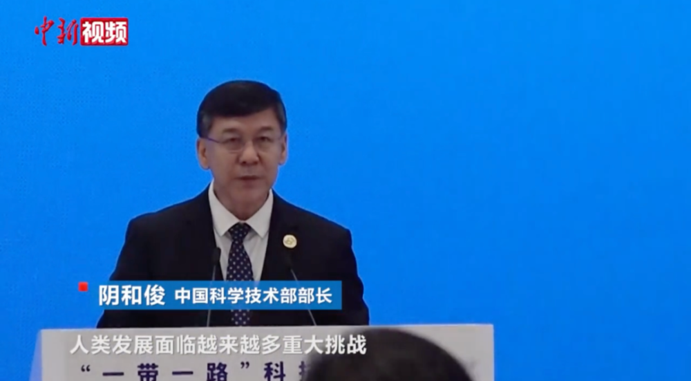

# 重组后的重要部门新任一把手最新发声，背后有重要信息

**撰文 | 余晖**

11月15日，科技部官方微信发布了科学技术部党组书记、部长阴和俊的署名文章，文章聚焦的是科技创新法治建设。

阴和俊是科技部重组后的新任一把手。

作为学者型官员，阴和俊曾在高校、科研机构任职多年。今年10月24日，他接替王志刚担任科技部部长。

11月6日，阴和俊赴重庆参加了首届“一带一路”科技创新部长会议；11月15日，他又发表了署名文章。

**这两个重要动作，背后有两个关键信息，分别是“科技国际合作”和“科技创新法治建设”。**

**科技部重组后的新任一把手**

阴和俊，男，汉族，1963年1月出生，今年60岁。

他曾在科技部、北京市、天津市、中国科学院任职，担任过中国科学院党组副书记、副院长（正部长级）。今年10月7日，阴和俊接替66岁的王志刚担任科学技术部党组书记。10月24日，他履新科技部部长。

阴和俊是科技部重组后的新任一把手。

今年3月，中共中央、国务院印发了《党和国家机构改革方案》，方案明确， **重新组建科学技术部，仍作为国务院组成部门。**

方案提到，加强科学技术部推动健全新型举国体制、优化科技创新全链条管理、促进科技成果转化、促进科技和经济社会发展相结合等职能，强化战略规划、体制改革、资源统筹、综合协调、
**政策法规** 、督促检查等宏观管理职责。

另外，方案还提到，组建中央科技委员会，作为党中央决策议事协调机构。 **中央科技委员会办事机构职责由重组后的科学技术部整体承担。**

**国际合作**

履新科技部党组书记后，阴和俊多次强调了国际合作。

党的二十大报告提到， **扩大国际科技交流合作** ，加强国际化科研环境建设，形成具有全球竞争力的开放创新生态。

10月10日，科技部党组书记阴和俊会见来访的英国皇家工程院院长、思克莱德大学校长吉姆·麦克唐纳德爵士一行， **这也是他到任后的首个公开活动。**

在那次会谈中，阴和俊提到了“中英科技创新合作”。

他说，中方对继续深化双方合作持开放积极态度， **愿进一步开展务实科技交流与合作，** 携手为解决全球挑战作出贡献。

11月6日，首届“一带一路”科技交流大会在重庆开幕，阴和俊参加了会议。在会上，阴和俊宣读了《国际科技合作倡议》。

他说，“当前世界百年未有之大变局加速演进，人类发展面临越来越多重大挑战， **人类社会比以往任何时候都更需要国际合作和开放共享**
。通过科技创新合作探索解决全球性问题，共同应对时代挑战，共同促进和平发展。”

11月6日，他还出席了首届“一带一路”科技创新部长会议。他提出与各方深化5方面具体合作：

一是持续深化政府间合作关系；

二是大幅提升科技交往规模；

三是全面拓宽合作领域；

四是加快构建高水平合作平台；

五是共同完善全球科技治理。

**人工智能、大数据、生物安全**

除了合作之外，“科技创新法治建设”也是阴和俊关注的焦点问题之一。

11月15日，科技部官方微信发布了科学技术部党组书记、部长阴和俊的署名文章。文章的标题是《加强科技创新法治建设 为科技自立自强提供法治保障》。

这也是他履新科技部一把手后，首次发表署名文章。

在上述文章中，阴和俊阐述了加强科技创新法治建设的重要性。

他提到，科技革命和产业变革带来的新变化，带来人与自然以及人与人之间关系的再认识、再构建，增加了法律体系建设的不确定性，使科技创新法律体系建设面临更大的挑战。

“比如，随着人工智能的发展，人类社会本身秩序受到的影响得到越来越多的关注， **人工智能的法律规制成为重要问题** ； **自动驾驶等新技术**
的发展和应用，带来了承担责任主体划分的现实问题； **合成生物学的应用** 带来科技伦理问题。”

他还写道，面对激烈的国际竞争，应进一步完善科技创新管理体制机制， **加快围绕人工智能、大数据、生物安全等领域的立法。**

在文章中，阴和俊提到了目前我国科技创新法治建设存在的一些问题，包括“科技创新法律体系中专门法仍然比较欠缺”“在适应科技创新新发展新变化上，我国在很多领域的法治建设仍然不够及时”等。

阴和俊提到，全面推进科技创新法治建设，保障科技自立自强。

他写道，“结合落实党和国家机构改革重要部署，
**加强党中央对科技工作的集中统一领导，组建中央科技委员会，能动履职保障科技创新在法治轨道上发展，用良好的法治环境，推动实现高水平科技自立自强** 。”

他还提到了接下来的几项重要工作，包括：

**加强人工智能等新兴领域和涉及科学数据、科研机构等重要科技创新要素和创新主体的立法** ，推动科技创新主体之间协同互动， **构建新型举国体制**
，保障科技投入和重大科技战略任务实施。

针对 **人工智能、基因技术等体现国家发展战略导向的前沿技术创新领域**
进行专门立法，促进和规范前沿技术领域研发和应用，发挥法治促进科学技术发展和抑制科技发展负面效应的作用， **加强科技伦理治理，防止科学技术的滥用和失控**
，构建新技术研发应用的制度优势。

**围绕科技法律的实施，建立部门、地方协同机制**
，明确法律贯彻落实的总体要求、主要任务和保障措施，推动完善地方性法规，构建上下贯通、统一衔接的科技法律制度体系等。

**资料｜ 新华社 人民网 民主与法制周刊 科技部官网等**

**【版权声明】本文著作权归政知新媒体独家所有，未经授权，不得转载。**

