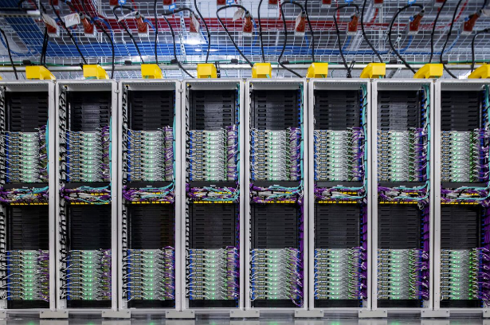
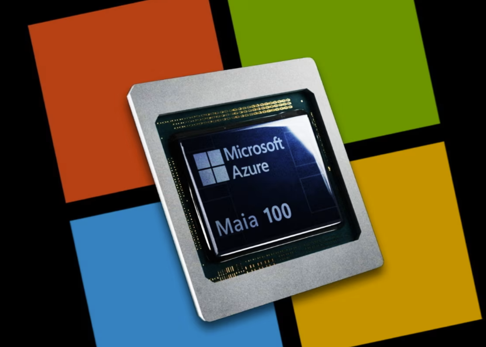
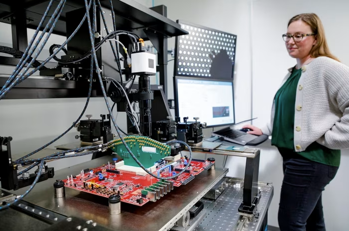

# 外媒评微软自研芯片：同时与这么多巨头竞争 微软能吃得消吗？

**划重点**

  * _1_ 彭博社认为，微软之所以发布两款自研芯片，旨在两个关键增长领域寻求减少对外部供应商的依赖。
  * _2_ 路透社表示，微软的自研芯片将可以帮助客户降低人工智能服务成本过高的问题。
  * _3_ 金融时报称，在开发商努力寻找英伟达AI芯片替代供应商之际，微软抓住了机会。
  * _4_ CNBC认为，微软推出的两款芯片，可能同时让其在两个领域与英伟达、英特尔展开竞争。

腾讯科技讯
美国当地时间周三，微软发布了首款自研人工智能（AI）芯片和云计算处理器。其中，AI芯片可用于训练大语言模型，并帮助其摆脱对英伟达昂贵芯片的依赖。同时，基于Arm架构的云计算处理器，则可用于支持云工作负载。这两款自研芯片旨在为Azure数据中心提供动力，并将帮助该公司及其企业客户准备迎接AI时代到来。在两款芯片发布后，外国主流媒体对微软此举发表了评论。

**彭博社：微软寻求在两个关键增长领域减少对外部供应商依赖**

微软发布了首款自主研发的人工智能芯片和云计算处理器，试图在竞争日益激烈的人工智能计算市场上更好地控制自己的技术，并增加自己的产品。该公司还宣布了一款新软件，可以让客户设计自己的人工智能助手。

微软多年的投资表明，芯片对于在人工智能和云计算领域获得优势是多么重要。在公司内部制造它们可以让公司从硬件中获得性能和价格上的好处。同时，此举还可能使微软避免过度依赖某一家外部供应商，目前整个行业对英伟达人工智能芯片的争夺凸显了这一弱点。

在微软进军处理器领域之前，其云计算的竞争对手也采取了类似的举措。亚马逊公司于2015年收购了一家芯片制造商，并销售基于多种云和人工智能芯片的服务。谷歌于2018年开始让客户使用其人工智能加速器处理器。

微软Azure硬件系统和基础设施主管拉尼·博卡（Rani
Borkar）在接受采访时表示，对于微软这样规模的公司来说，“优化和整合”硬件的每一个元素，以提供最佳性能，避免供应链瓶颈，是非常重要的。他称：“最终，我们会给客户提供基础设施的选择权。”

科技行业似乎正在开始向自研芯片的方向转变。这种转变对英特来说尤其是个坏消息，该公司自己的人工智能芯片研发工作已经落后。与此同时，通过Cobalt，微软加入了亚马逊和AMD的行列，抢夺目前由英特尔主导的服务器芯片市场份额。

微软之前也进行过自研芯片的尝试，包括与AMD合作设计Xbox处理器，为HoloLens眼镜和Xbox的Kinect运动控制器开发专用芯片。但在这个艰难而昂贵的行业中，Maia和Cobalt是微软规模最大、用途最广、也最雄心勃勃的举措。

**路透社：微软推自研芯片旨在节省AI服务成本**

微软周三发布了两款自研计算芯片，加入了其他大型科技公司的行列，这些公司面临着提供人工智能服务成本过高的问题，这些成本可能是搜索引擎等传统服务的10倍。

微软高管表示，他们计划通过一套通用的基础人工智能模型来解决这些成本问题，方法是将人工智能技术融入到其几乎所有产品中，而Maia芯片对这项工作进行了优化。

微软云和人工智能部门执行副总裁斯科特·格思里（Scott
Guthrie）表示：“我们认为，这为我们提供了一种方式，可以为客户提供速度更快、成本更低、质量更高更好的解决方案。”

微软还表示，明年将为其Azure客户提供运行在英伟达和AMD最新旗舰芯片上的云服务。微软表示，他们正在AMD的芯片上测试OpenAI最先进的GPT 4。

分析公司Creative Strategies的首席执行官本·巴加林（Ben
Bajarin）表示：“这并不是说微软要取代英伟达的芯片。Maia芯片将允许微软在云端销售人工智能服务，直到个人电脑和手机足够强大，可以处理它们。”

微软周三发布的第二款芯片旨在节省内部成本，并应对微软的主要云计算竞争对手亚马逊AWS。格思里表示：“我们正在设计Cobalt解决方案，以确保我们在性能和性价比（与亚马逊的芯片相比）方面都非常有竞争力。”

**GeekWire：微软在OpenAI帮助下推AI芯片猛追亚马逊**

微软公开证实了其长期传闻的计划，即推出自己的数据中心处理器，其中包括针对人工智能进行优化的处理器，并根据其主要人工智能合作伙伴、ChatGPT制造商OpenAI的反馈进行了改进。

微软表示，这些芯片代表了其Azure基础设施的“最后一块拼图”，使其能够直接参与设计云平台的每一层，这些云平台在其业务中所占的比例越来越大。

微软自研芯片Azure Maia AI Accelerator针对人工智能任务进行了优化，包括生成式人工智能。Azure Cobalt
CPU则是基于Arm架构的处理器，用于通用云工作负载。

早在八年前，亚马逊就通过收购Annapurna
Labs，开始生产自研数据中心芯片。此后，AWS扩展到专门的人工智能芯片Tranium和interentia，用于构建和运行大模型。微软也在追赶谷歌，后者已经开发了多代张量处理单元芯片。

OpenAI表示，他们与微软合作，对Maia芯片进行了改进和测试。OpenAI首席执行官萨姆·奥特曼（Sam
Altman）在声明中表示：“Azure的端到端人工智能架构现在通过Maia芯片得到了优化，为训练更有能力的模型铺平了道路，并使这些模型对我们的客户来说更便宜。”

**金融时报：开发商寻求英伟达芯片替代品 微软借机推AI芯片**

微软推出了首个用于云端人工智能服务的自研芯片。与此同时，开发商正呼吁寻找替代供应商，以取代主导人工智能处理器市场的英伟达。

微软在周三举行的Ignite开发者大会上宣布进入人工智能处理器市场。此前，英特尔和AMD再次努力与英伟达展开竞争，后者在训练大型人工智能模型所需的高性能图形处理单元（GPU）领域几乎处于垄断地位。

过去一年，对英伟达A100和H100芯片的需求远远超过了供应，就连微软也不得不向甲骨文等竞争对手云服务提供商寻求额外的GPU容量，以支持自己的人工智能服务。

自2016年以来，微软越来越多地在内部开发其数据中心硬件。自研芯片是该公司迄今为止最雄心勃勃的一步，它将硬件和软件“堆栈”更紧密地结合在一起，有望提高性能和效率。

据估计，自研芯片往往需要花费数亿美元，这使得它成为一个只有科技行业最富有的公司才能承担的项目。

咨询公司Creative Strategies的科技行业分析师本·巴加林（Ben
Bajarin）表示，微软能够将自己的芯片与软件及数据中心基础设施的其他部分协同开发，这是微软与其他云服务提供商“真正的区别”。

他将其与苹果长期以来为iPhone和Mac开发定制处理器的努力，以及谷歌为YouTube开发的专用视频芯片进行了比较，后者有助于为客户提供更流畅的体验。

巴加林称：“不是每个公司都能做到这一点，当然也不是每个公司都会这么做。但对于那些控制了足够芯片堆栈并拥有资源的公司来说，这种自研芯片趋势将继续下去。”

**CNBC：微软同时与英伟达、英特尔竞争？**

微软刚刚发布了两款自研芯片，其中Maia 100人工智能芯片可能与英伟达备受追捧的人工智能图形处理单元（GPU）竞争。而Cobalt 100
Arm芯片则针对一般计算任务，可能会与英特尔处理器竞争。

现金充裕的科技公司已经开始为客户提供更多的云基础设施选择，他们可以使用云基础设施来运行应用程序。阿里巴巴、亚马逊和谷歌多年来始终在这么做。据估计，截至10月底，微软拥有约1440亿美元现金，在2022年占据了21.5%的云市场份额，仅次于亚马逊。

当GPU短缺时，云服务提供商提供的特殊人工智能芯片可能有助于满足需求。但与英伟达或AMD不同，微软及其云计算同行并不打算让企业购买包含其芯片的服务器。

如果以亚马逊的经验为鉴，微软对Cobalt处理器的采用速度可能会快于Maia人工智能芯片。微软正在Cobalt上测试Teams应用和Azure
SQL数据库服务。微软表示，到目前为止，它们的性能比Azure现有的Arm芯片（由初创公司Ampere开发）高出40%。

**The verge：微软在打造多元化供应链**

微软发布的首款自研人工智能芯片可用于训练大语言模型，并有可能帮助其摆脱对英伟达昂贵芯片的依赖。

对于微软来说，供应链的多样化至关重要，尤其是考虑到英伟达目前是人工智能服务器芯片的主要供应商，而各家公司一直在竞相购买这些芯片。据估计，为了推进ChatGPT的商业化，OpenAI需要超过3万个英伟达的老款A100
GPU，而微软的自研芯片可以帮助其客户降低人工智能的成本。

微软宣称是为支持Azure云工作负载才开发了这些芯片，而且不打算将其出售给英伟达、AMD、英特尔和高通等其他公司。

微软Azure硬件系统和基础设施主管拉尼·博卡（Rani
Borkar）解释称：“我认为这更像是一种互补，而不是与他们竞争。今天，我们在云计算中同时使用英特尔和AMD的芯片。同样，在人工智能领域，我们也可以同时使用AMD和英伟达的芯片。”

**Ars Technica：微软新AI芯片将为其智能服务提供动力**

微软专门设计Maia来运行像GPT 3.5 Turbo和GPT-4这样的大语言模型，这些模型支撑着微软Azure
OpenAI服务和微软Copilot（前身为Bing Chat）。微软不打算出售这两款产品，而是希望它们只供内部使用。

微软希望成为“Copilot公司”，为此它需要大量的计算能力来实现这个目标。但由于芯片短缺导致备受追捧的英伟达AI
GPU价格上涨，包括亚马逊、OpenAI、IBM和AMD在内的几家公司已经在设计或考虑设计自己的人工智能加速器芯片。微软也觉得有必要定制芯片，把自己的服务推向前台。

没有任何科技公司是一座孤岛，微软也不例外。该公司计划继续依赖第三方芯片，这既是出于供应需要，也是为了维护其错综复杂的商业伙伴关系网络。微软承诺，该公司将于明年将英伟达H200加入其产品线，以支持更大的模型推理，而不会增加延迟。（文/金鹿）

