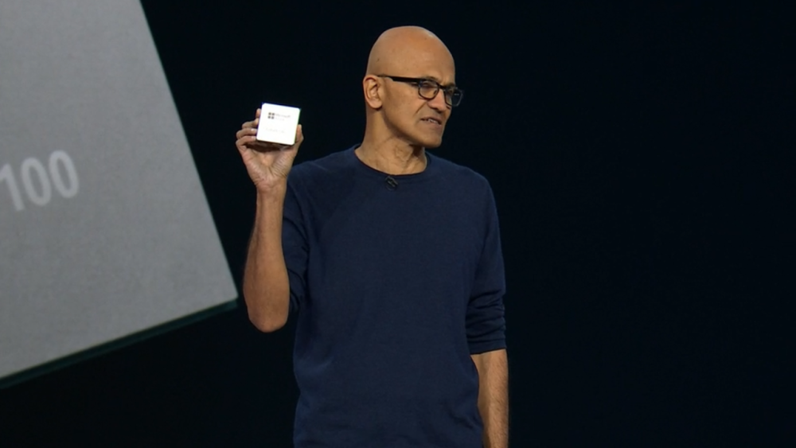
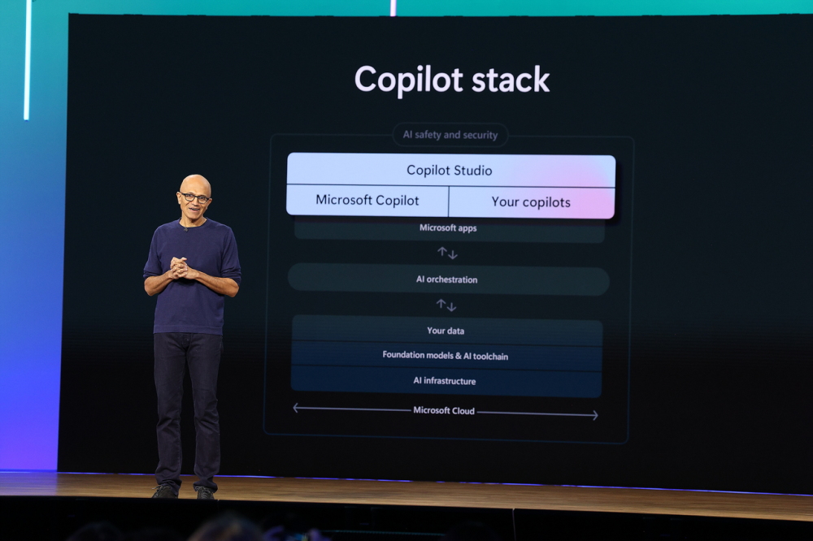
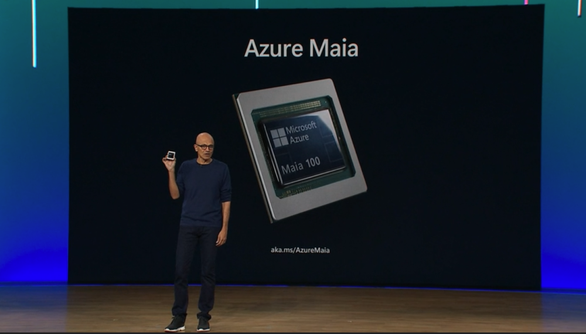
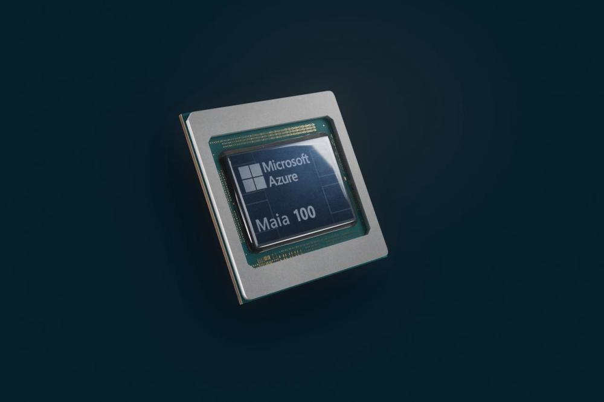
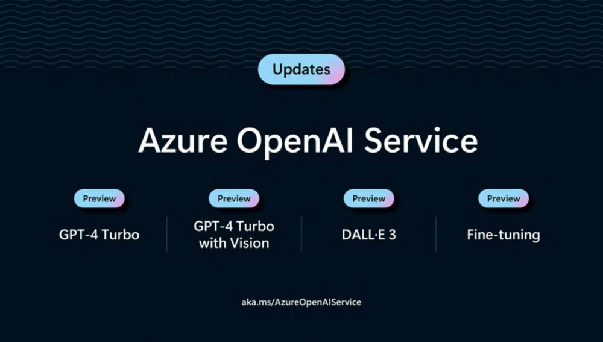
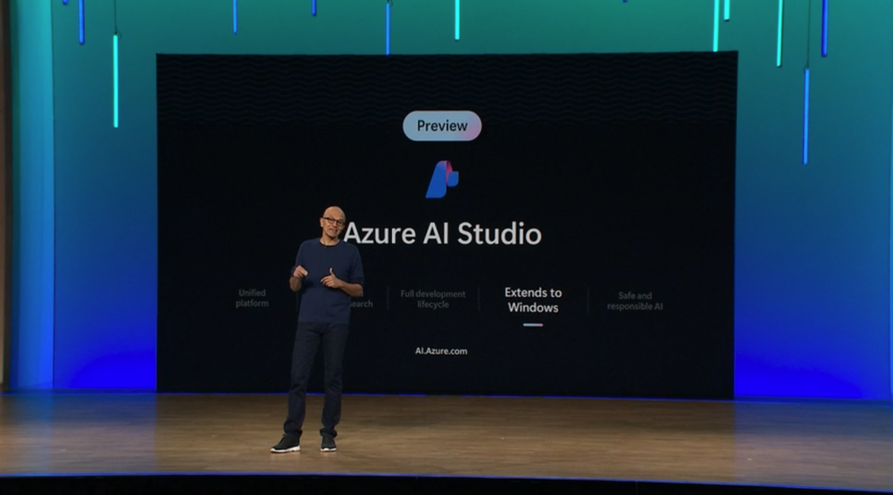
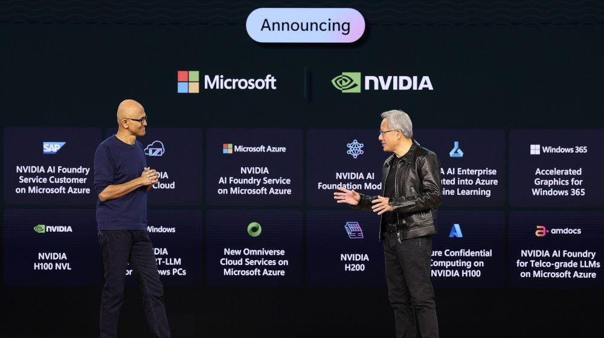
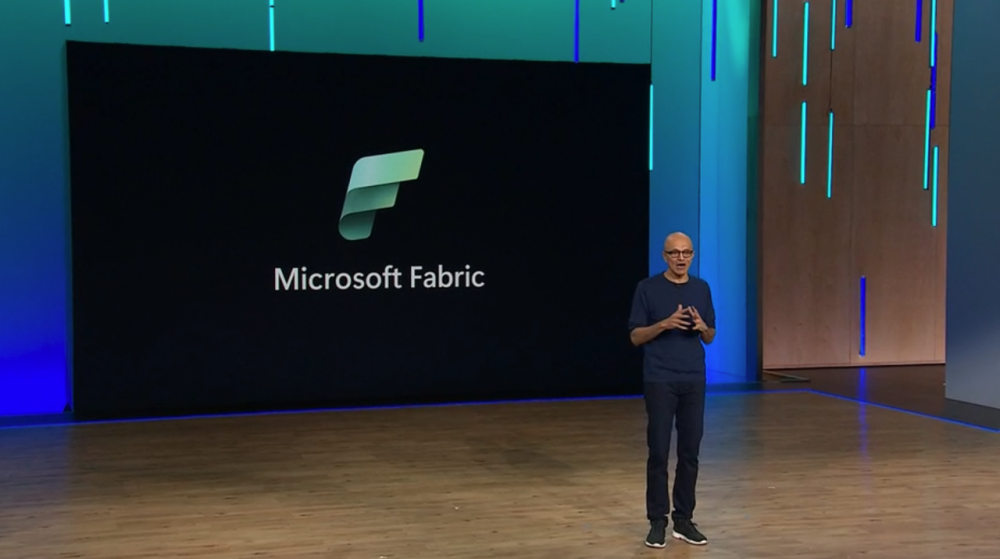

# 微软，用最开放的云，玩最野的AI

你几乎很难想象，那个困于混合现实和量子计算，在 B 端和 C
端都乏善可陈的巨头微软，能在短短一年时间之内脱胎换骨，成为整个硅谷，不，乃至全球最潮的科技公司。

点燃这家老牌公司的，无他，只有两个字母——AI。

当地时间 11 月 15 日，在其大本营美国西雅图，微软公司 CEO 萨提亚·纳德拉在 Ignite 大会上， **一口气公布了 100
多项以AI为中心，在云计算基础设施、 模型即服务 MaaS 、数据平台、Copilot 人工智能助手等方方面面的新产品和新功能** 。

 _萨提亚展示 Azure Cobalt CPU 芯片｜Microsoft_

其中，既有 Azure Cobalt、Azure Maia 这样专门为 AI 打造的 ARM 架构 CPU 和 AI 加速芯片，也有重新为 AI
设计的端到端机架，微软甚至重新改进了线缆中的光纤技术，只为了比特传输更加快速。

就在你以为微软要用自研处理器，免交「英伟达税」时，纳德拉不仅请来了英伟达创始人黄仁勋进行「商业互吹」，而且 **将 AMD 、英伟达最新的处理器纳入
Azure 云服务，让后者在AI时代成为最 Open 的「世界计算机」** 。

_OpenAI 开发者大会上 Sam Altman 和萨提亚开了个小玩笑｜OpenAI_

两周前 OpenAI 的开发者大会上，Sam Altman
把纳德拉请上台后第一句话就是：「你说说咱俩家关系是怎么滴了？」直接把自己最大的「金主爸爸」整笑了。今天的微软自己的场子上，PPT 背板上写着的「微软爱
OpenAI」算是纳德拉对 Altman，以及业界对于两家关系「表面和气背地竞争」质疑的回敬。

「 **我们承诺，所有OpenAI的创新，都将成为 AzureAI的一部分，提供给大家** 。」纳德拉的演讲，再次证明微软和 OpenAI
亲密无间的关系。而价格更低能力更强的 GPT-4 Turbo 也如愿来到微软的 AI 服务之中。

同时，Copilot Studio，类似于 OpenAI 的 GPTs，让用户可以一句话生成自己的 GPT。而且，不论是 Copilot 还是
GPTs，都可以作为插件在人工智能助手页面使用。

「Copilot 将是新的交互界面，帮助人们接触现实世界和组织内的知识；更重要的是，它还是你的智能体，帮助你在这些知识的基础上做行动。」

一年之前，微软还是一家商业软件公司； **一年之后，微软成为了一家「Copilot」公司，一家全球最开放，野心也最大的AI公司** 。

自研芯片曝光，最「AI」的云基建

不同于今年 3 月微软初次展现 Copilot demo
时的炫酷，在今天的大会上，纳德拉强调落地。他说：「我们正在进入人工智能的一个令人兴奋的新阶段，不仅仅是将其视为新奇的技术，而且还涉及到产品制造、部署、安全性、真正的生产效益以及所有与现实世界有关的细节。

迈入 Copilot 时代的微软，打造了端到端 Copilot 堆栈，包括：基础设施、基础模型、数据工具链，以及 Copilot 本身。
**基于这一新的堆栈，纳德拉依次介绍了再次「刷新」的微软** 。

_纳德拉在 Ignite 主旨演讲中，依次介绍微软的 Copilot 堆栈｜Microsoft_

首先是最底层的堆栈——驱动 AI 模型的云计算基础设施。作为 OpenAI 的独家云供应商，这一身份无疑让微软云 Azure
迅速进化为，大模型工作负载下更适配的云。这一结果背后， **是一个最开放的平台公司，做出的全栈升级。从能源、数据中心、网络、CPU 和 AI
加速器等方面，微软与广泛的合作伙伴再造基础设施** ：

用可再生能源为数据中心提供动力；

用新材料——中空芯光纤技术为数据中心的网络进一步提速；

Azure Boost 系统正式上线，它可以将存储和网络进程从主机服务器转迁移到专用硬件和软件上，从而提高存储和网络速度；

以及最重要的，芯片相关的创新与合作。

纳德拉兴奋地总结称，「看到我们作为一家超级计算机公司，了解工作负载，据此获得机会优化整个堆栈，从能源消耗到硅片，以最大化性能和效率，真的很感谢这个闭环（feedback
cycle）」。

_萨提亚发布 AI 加速芯片 Azure Maia｜Microsoft_

紧接着，他宣布了数据中心期待已久的重磅发布： **第一款定制的自家 CPU 系列 Azure Cobalt 和AI加速芯片 Azure Maia** 。

Microsoft Azure Cobalt 是一款基于 Arm 架构的云原生芯片，针对通用工作负载的性能、功率和成本效益进行了优化。纳德拉称，这款 CPU
芯片已经在支持 Microsoft Teams Azure 通信服务以及 Azure SQL 的部分中使用；明年也将向客户提供这款产品。

Microsoft Azure Maia 是一款 AI 加速芯片，用于 OpenAI 模型、Bing、GitHub Copilot 和 ChatGPT 等
AI 工作负载运行云端训练和推理。这款芯片采用了 5 纳米工艺制造，拥有 1050 亿个晶体管。

_Azure Maia 100 美颜照｜Microsoft_

纳德拉称，「硅多样性（sillicon diversity）是我们能够支持世界上最强大的基础模型和所有 AI 工作负载的关键因素」，在本次 Ignite
技术大会上，微软不仅发布了两款自研芯片，也纳入了更多行业合作伙伴的最新 AI 优化芯片，包括 AMD Instinct MI300X，以及英伟达 H100
和 H200。

在上述超级计算机之上， **微软还提供参数量从数十亿到数万亿不等的基础模型，来满足不同开发者构建AI应用程序时的成本、延迟和性能需求** 。

 _GPT-4 Turbo 毫无疑问将来到 Azure
平台｜Microsoft_

当然，OpenAI 的更新，会作为 Azure AI 的一部分持续交付。最新的 GPT-4，包括 GPT-4 Turbo 与视觉功能将引入 Azure
OpenAI 服务。GPT-4 Turbo 将于 2023 年 11 月底在 Azure OpenAI 服务中公开预览，定价将与 OpenAI
保持一致。GPT-4 Turbo with Vision 即将推出预览版，DALLE·3 现已在 Azure Open AI 服务中公开预览。

另外，Azure OpenAI 服务，将引入 GPT-4 的微调功能，允许客户使用自己的数据创建 GPT-4 的自定义版本。

除了闭源模型， **微软还扩大了开源模型的 MaaS 服务，让专业开发者将能够轻松将Stable Diffusion、Meta Llama 2
、Mistral 即将推出的高级模型以及 G42 Jais 等最新的AI模型，通过API集成到他们的应用中** ；还可以用自己的数据定制这些模型，而无需担心
GPU 基础架构的设置和管理。

_萨提亚发布 Azure AI Studio｜Microsoft_

在基础模型之上，微软从工具层面进一步降低开发者的使用门槛——通过推出 Azure AI
Studio，微软向客户提供完整的生命周期工具链，使其能够构建、定制、训练、评估和部署最新一代模型。值得注意的是，它还包括内置的安全工具，通过 Azure
AI Studio，客户可以检测和过滤应用程序中以及服务中生成的有害内容。

_萨提亚和黄仁勋在台上讨论生成式 AI 将带来的巨大变革｜Microsoft_

「AI 和加速计算是一个全栈挑战，也是一个数据中心规模的挑战。」从底层硬件到上层软件，微软不仅提升自己的能力，也引入了强大的伙伴。在 Ignite 大会上，
**纳德拉和黄仁勋宣布两家公司的合作不止于硬件，在软件上也将强强联合——英伟达的 AI 代工厂（Nvidia AI Foundry）服务正式引入
Azure** 。

英伟达的基础模型、框架、工具以及其 DGX Cloud AI 超级计算和服务汇集在一起，向 Azure 用户创建生成式 AI
模型提供端到端的解决方案。企业客户可以在 Azure 上利用英伟达 AI Enterprise 软件部署其模型，为生成式 AI
应用——如智能搜索、总结和内容生成等，提供助力。

数据驱动，微软 AI 的 B 端核心

从上述硬件和软件的基础设施再往上一层，是数据。可以说，没有数据就没有人工智能。在这次大会上， **纳德拉重点介绍了在今年 5 月 Build
开发者大会上首次推出了数据平台——MicrosoftFabric** 。自发布以来，Fabric 已经进行了 100
多项功能更新，并与合作伙伴一起扩展了生态系统，目前已经有包括 Milliman、蔡司、伦敦证券交易所和安永在内、超过 2 万家客户使用。

 _Microsoft Fabric 是 AI 商业端解决方案的核心功能｜Microsoft_

微软团队希望创造一种集成、简化的体验，将客户数据和微软的 AI 工具连接起来，Microsoft Fabric正是该解决方案的一部分。

**Microsoft Fabric 的核心是「统一」，用一个产品、一种体验、一种架构、一种业务模型汇集了所需的所有数据和分析工具**
，包括数据工程、数据集成、数据仓库、数据科学、实时分析、应用可观察性和商业智能。

通过 Fabric 的「数据湖」，企业团队可以从任何地方连接到数据，并在不同引擎之间使用相同的数据副本。这些智能数据可以安全地流向人们每天使用的
Microsoft 365 应用程序，以改善决策并产生影响。 **Copilot in Microsoft Fabric 还可以与 Microsoft
Office 和 Teams 集成，培养数据文化，从而在整个企业内加大利用数据价值** 。

Microsoft Fabric 现已开放使用，它通过将每个人汇集到一个由 AI 驱动的平台上，在企业级数据基础上统一所有数据资产，重塑团队处理数据的方式。

微软 Copilot，也能「一键生成 GPT」了

在应用这一层级，Copilot 全面迎来了自己的时代。

在 Ignite 2023 大会上，微软宣布 Bing Chat 和 Bing Chat for Enterprise
现在将更名为「Copilot」，并发布了「Copilot Studio」，可定制 Copilot，或构建独立的协同助手，包括自定义的 GPT、生成式 AI
插件等，可以自定义主题。

在使用方面， **Copilot Studio
可以在同一网页中构建、部署、分析和管理所有内容，通过使用拖放的低代码方法，包括逻辑和数据连接，直接构建和发布插件到适用于 Microsoft 365 的
Copilot** 。

_Bing Chat 正式更名为 Copilot｜Microsoft_

微软称，无法轻松找到所需信息是工作者在日常工作中面临的前五大问题之一。这些插件基于用户的数据和流程，通过聊天形式对话，能够回答基于用户的业务数据和流程的问题。

对于企业用户来说，用户能够为特定的企业场景定制 Copilot，从客户关系管理（CRM）到企业资源规划（ERP）到人力资源（HR），Copilot
能够回答类似「我的休假余额是多少？」或「我有没有要提交的费用？」等问题。

除了能够定制适用于 Microsoft 365 的 Copilot 外，微软还支持创建和发布独立的自定义协同助手，还支持无缝集成 OpenAI
的服务，很快， **创作者将能够在 Copilot Studio 中构建自己的定制 GPT** 。

_Copilot Studio 能让用户一键生成 AI 助手，并且看起来比 GPTs 正式很多｜Microsoft_

这种独立的协同助手可以无缝发布到内部和外部网站、移动应用程序等多个渠道，例如，可以在公共网站上为外部客户提供协同助手，找到适合他们需求的产品。

在后台，Copilot Studio
还有内置的分析仪表板，管理员能够集中监视使用情况并进行分析，在管理中心内控制访问权限，使用公司特定政策保护数据，管理环境等。

_微软在 Dynamics 365 Guides 引入 Copilot，将生成式 AI 与混合现实结合｜Microsoft_

另外， **微软还在 Dynamics 365 Guides 引入 Copilot，可以简单理解为一种ARCopilot** ，这意味着，能用 AI
的不再只是办公室的白领了，还有蓝领。它可以让工业环境中的工人使用语音和手势，提出有关复杂机械的问题，以及进行维护。

微软的 HoloLens
混合现实头戴设备允许他们指向设备和零件，然后提出关于从组件规格到机械服务日志的各种主题的问题。然后，微软的系统可以通过全息图、文本显示和语音响应提供答案。

「一切为了 AI，为了 AI 的一切。」用这句话形容今天的微软 Ignite 大会，并不算夸张。在 GPT-4
和大语言模型彻底搅动了世界之后，看到机会的微软，成为转身动作最快的巨头。

**如果说之前微软还是在产品层面进行「AI集成」，现在它已经在硬件设施、云计算和商业服务的全生态层级，围绕 AI 进行了革新** 。只要 AI
浪潮继续推进，微软就会是那个最领先、最具有前瞻性和决策力的巨头。

