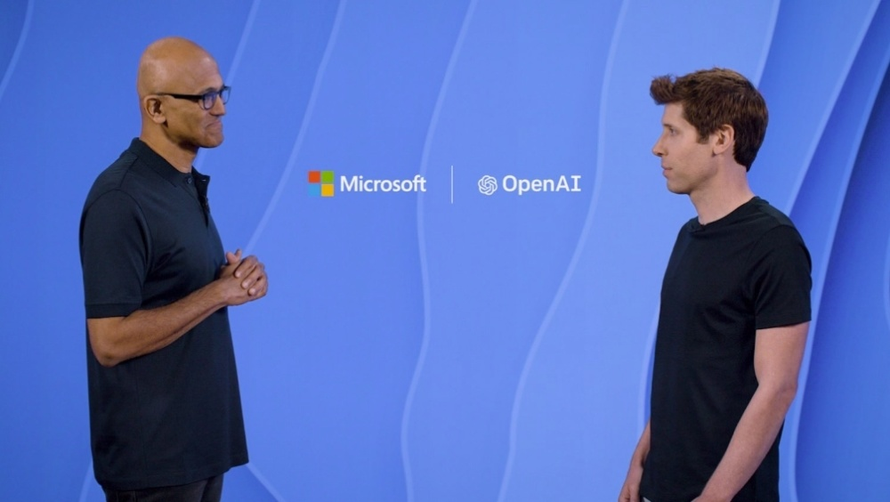
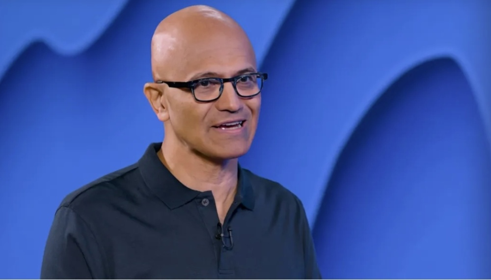

# 纳德拉专访：OpenAI靠微软构建最好的系统 微软靠OpenAI建最好的模型

**划重点**

  * _1_ 纳德拉谈及微软与OpenAI的关系，认为二者相互依赖，各取所需。
  * _2_ 纳德拉表示，开发软件的方式正发生根本性变化。
  * _3_ 纳德拉认为，一场平台转型正在进行，其意义将与大型机向台式机转变一样重大。

腾讯科技讯 上周于旧金山举行的OpenAI首届开发者日活动上，微软首席执行官萨蒂亚·纳德拉（Satya
Nadella）出人意料地亲自到场，并与OpenAI首席执行官萨姆·奥特曼（Sam Altman）一起，热情地称赞开发者们帮助创造的奇迹！

两天后，在GitHub Universe开发者大会上，纳德拉再次亮相。GitHub首席执行官托马斯·多姆克（Thomas
Dohmke）在那里展示了该公司人工智能编程工具Copilot的新版本，该工具可以从自然语言生成计算机代码。纳德拉热情洋溢地喊道：“我又能编程了！”

美国当地时间周三，纳德拉在微软自己的开发者大会Microsoft Ignite上发表演讲，并发布了更多基于人工智能的开发工具，包括Azure AI
Studio，它将让开发者在不仅来自微软的模型目录之间进行选择，还允许开发者选择Meta、OpenAI和Hugging
Face等模型目录，以及为Microsoft 365定制Copilot的新工具。

纳德拉似乎对开发者非常看重，他四处宣传他们可以使用新一代人工智能工具的所有方式，比如GitHub
Copilot（微软于2018年收购了GitHub）或OpenAI的新开发者工具套件。据报道，微软已向OpenAI投资了约130亿美元。

最近接受《麻省理工科技评论》采访时，纳德拉反复强调微软长期以来对开发者的关注。但他也传达了一个信息：我们开发软件的方式正在发生根本性的变化。

纳德拉认为，一场平台转型正在进行，其意义将与大型机向台式电脑，或台式电脑向移动设备转变一样重大。这次，充当桥梁的是自然语言人工智能工具，他认为其中有些工具将降低软件开发的进入门槛，提高现有开发者的工作效率，并最终引领一个新的创造力时代。

下面是专访全文：

**关于与OpenAI的关系**

OpenAI面临的一个批评是，它的业务只有通过微软才能实现，微软已经为这家初创公司提供了100多亿美元资金，并获得了支持其计算密集型语言模型所需的资源。然而，微软也高度依赖OpenAI的技术来支持GitHub
Copilot、Bing和Office 365等服务。

在纳德拉看来，两家公司实际上相互依赖。他始终觉得，微软是一家平台和合作伙伴优先的公司，这对很多人来说并不新鲜。纳德拉认为，OpenAI依靠微软构建最好的系统，而微软依靠OpenAI建造最好的模型，然后一起进入市场。

**关于平台转变**

纳德拉表示，这次平台转变与之前的转变有很大不同，他认为公司不仅需要为开发者提供工具，还需要向他们传达一个明确的信息，告诉他们公司在想什么，以及开发者如何参与。

无论何时发生平台转变，关键是要确保该平台无处不在，可供开发者开发各种新内容。所以对微软来说，最重要的任务是让开发者工具、开发者平台广泛可用。

无论是OpenAI构建ChatGPT并在其基础上进行创新，还是微软构建Copilot并在其上进行创新，这将为开发者提供分发他们应用程序的机会。因此，在任何平台创建过程中，最重要的事情就是让平台无处不在，然后帮助开发者接触到他们的用户。

**关于提高生产率**

在过去的15年或更长时间里，美国的生产率增长始终处于停滞不前的状态。最近一次巨大的平台转变（移动开发的兴起），对实现广泛繁荣几乎没有什么帮助。但纳德拉表示，这一次将有所不同，主要是因为向人工智能的转变将推动一场创造性革命，让任何人都能更轻松地创造新作品，包括编写代码。

另一方面，今天的编程依然是一项高技能、高收入的工作，有人担心人工智能会将其自动化。对此，纳德拉认为，熟练的程序员仍然会有需求，但他们的工作性质将会发生变化，甚至会有更多的工作机会。纳德拉曾预计，将来会有10亿开发者在其平台上进行开发，其中许多人之前几乎没有编程经验。

任何时候，当你遇到像这样颠覆性的事情时，你必须考虑失业及其影响。这意味着，这一切都与技能提升和再培训有关。有趣的是，这更类似于文字处理器和电子表格开始出现时发生的事情。显然，如果你是一名打字员，情况就会发生翻天覆地的变化。但与此同时，它使数十亿人能够在文字处理器中打字，创建和共享文档。

纳德拉不认为职业开发者的价值会比现在更低，只是开发者会被划分为很多层次。每次你提示Bing
Chat或ChatGPT时，你实际上就是在编程。对话本身就是在引导一个模式。

纳德拉还预测，会有很多很多新的工作出现，包括很多新型的知识型工作或者是一线工作。在这些工作中，繁琐的任务都将被消除。纳德拉承认，移动时代非常棒，它使服务消费无处不在，但其并没有转化为无处不在的服务创造。

上一次，得益于个人电脑的出现，信息技术的发展使美国及其他地区的生产率得到极大提高。事实上，即使是对信息技术和生产率持批评态度的人，比如西北大学的罗伯特·戈登（Robert
Gordon）也要承认，当个人电脑首次出现在工作场所时，它确实带来了广泛的生产率改变。

有鉴于此，纳德拉认为像Copilot这样的工具，将被底特律的（初级）软件工程师用来编写代码。他还认为汽车工业的生产率将发生真正的变化。零售业、一线工作和知识型工作也是如此。

进入开发者行业的门槛将非常低，因为它是自然语言，领域专家可以构建应用程序或工作流。在纳德拉看来，这是最令人兴奋的事情。他非常希望，我们将开始看到更广泛的生产率提高。

**关于保护开发者**

美国法院正在审理大量知识产权案件和集体诉讼，它们都涉及合理使用的问题。至少有一起诉讼专门针对GitHub
Copilot，声称微软和OpenAI的生成工具是在开源代码上进行培训的，相当于软件盗版。人们担心使用这些工具的人可能会成为知识产权索赔的对象。微软正试图通过广泛的赔偿政策来解决这些问题，OpenAI也在开发者日活动上宣布了自己的赔偿政策——Copyright
Shield。

从根本上说，这些大型模型会抓取并获取内容，然后在这些内容上进行训练。但如果有人不希望自己的内容被抓取，我们在抓取工具中有很好的粒度控制，任何人都可以阻止自己的内容被抓取。事实上，这种情况可以得到控制，你可以让它只为搜索而抓取，而不是为了训练大语言模型。因此，任何真正想要确保自己的内容不被用于AI再培训的人，现在就可以做到。

当然，纳德拉认为法院和立法程序在某种程度上必须规定什么是合理使用，什么是不合理使用。微软已经采取了很多控制措施，以确保起抓取的数据只用于训练获得法律许可的模型。（文/金鹿）

