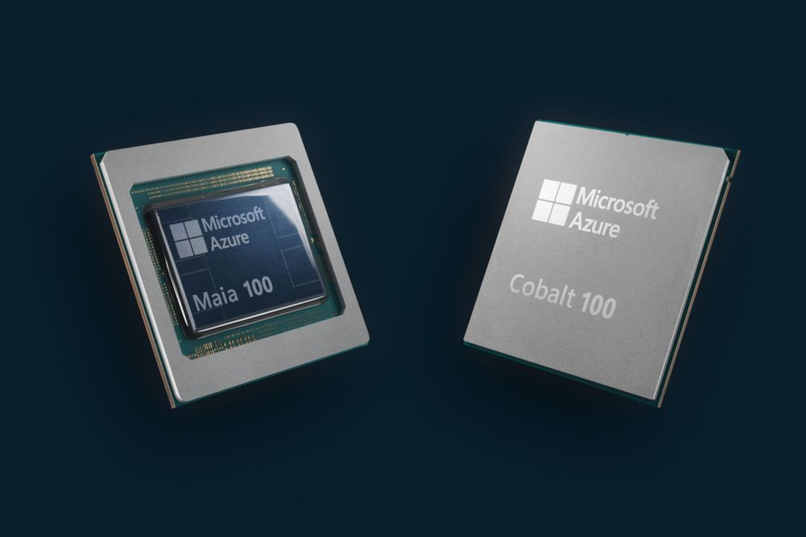

# 重磅！微软官宣推出两款自研芯片，而且都与人工智能有关

腾讯科技讯 11月16日消息，微软正式推出了其自研的两款人工智能芯片。在美国当地时间周三的Lgnite会议上，该公司表示，这款名为Maia
100的芯片是Azure Maia AI加速器系列中的首款芯片。除了Maia 100之外，这家科技巨头还推出了首款用于通用云计算的定制基于Arm ( ARM
) Azure Cobalt中央处理器。

凭借这两款芯片，微软现在可以与竞争对手谷歌和亚马逊平起平坐，后者也开发了自研定制芯片来运行相应的云平台。微软公司表示，自研芯片将用于基于云的训练和人工智能模型的推理。培训是公司建立人工智能模型的过程，推理是公司将模型推出以供实际使用的过程。

“软件是我们的核心优势，但坦率地说，我们是一家系统公司，”微软Azure硬件系统和基础设施公司副总裁Rani Borkar在一份声明中表示。

在微软，我们正在共同设计和优化硬件和软件，以便一加一大于二。我们可以了解整个堆栈，而芯片只是其中的成分之一。

微软表示，通过其自研定制芯片支持的服务，可以带来“强大的性能和效率收益”。

如果你拥有微软旗下的软件，那么它会在微软设计的芯片上运行得更好。这是因为微软可以定制其软件和硬件以提供更好的性能。

这与英伟达除了人工智能芯片外还提供自己的人工智能软件的原因相同，或者苹果为iPhone或Mac开发自研芯片的原因也是如此。如果一家公司能够同时控制硬件和软件，它就能为用户提供更好的体验。

微软表示，它与ChatGPT开发商OpenAI合作测试其Maia 100芯片，并将利用这些经验来构建未来的芯片。

OpenAI首席执行官Sam
Altman在一份声明中表示：“当微软首次分享其Maia芯片的设计时，我们感到非常兴奋，我们共同努力用我们的模型对其进行改进和测试。”
“Azure的端到端AI架构现已通过Maia优化至芯片，为训练功能更强大的模型以及让我们的客户获得更便宜的‘模型’铺平了道路。”

微软表示，除了构建芯片之外，它还构建了装有芯片的服务器主板以及它们所在的服务器架构。

至于Azure Cobalt芯片，微软表示，它的性能比当前一代基于Arm的Azure芯片提高了40%。

微软云和人工智能部门执行副总裁Scott
Guthrie表示：“就我们的运营规模而言，优化和集成基础架构堆栈的每一层以最大限度地提高性能、实现供应链多元化并为客户提供基础架构选择非常重要。”，他在一份声明中表示。

同时，微软推出自己的芯片并不意味着放弃与英伟达或AMD的合作。微软仍在提供运行英伟达H100芯片的云计算能力，并新增了对H200芯片的访问。微软表示，明年还将开始提供对AMD的MI300芯片的使用权。

