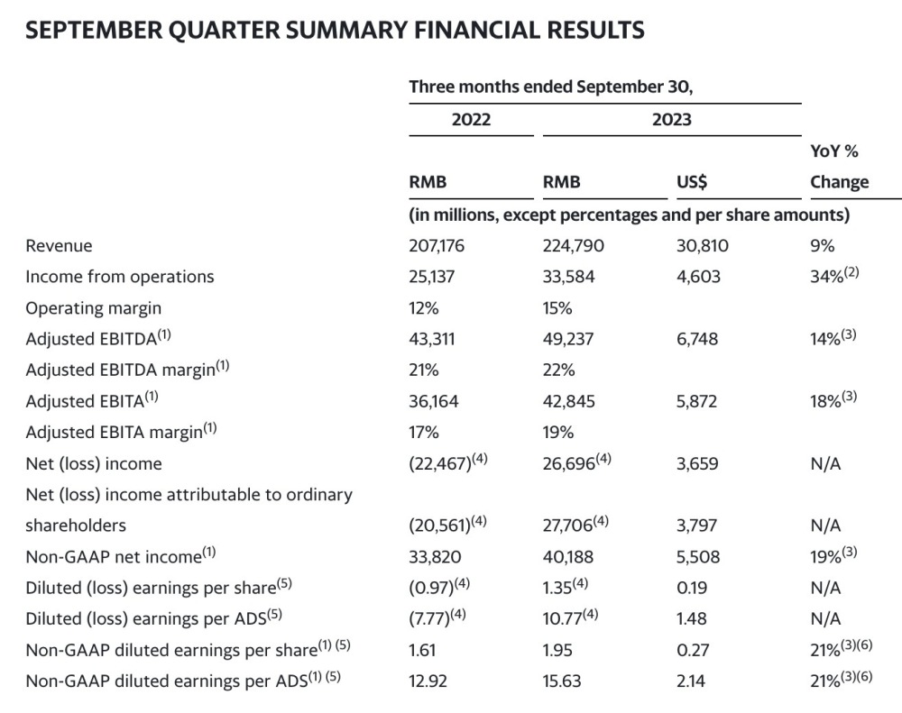

# 阿里第二财季营收增9%，盒马鲜生IPO已暂停，不再推进阿里云分拆

腾讯科技讯
11月16日，阿里巴巴发布第二财季业绩（注：阿里巴巴财年与自然年不同步，从每年的4月1日开始，至第二年的3月31日结束），财报显示，阿里巴巴第二财季营收2247.9亿元人民币，预估2,241亿元人民币；调整后EBITDA
492.4亿元人民币，同比增长14%。

阿里巴巴美股盘前继续扩大跌幅，现跌近8%。

阿里巴巴披露，盒马鲜生的首次公开募股计划已暂停，正在评估市场情况。

阿里巴巴集团财报披露，鉴于多方面不确定性因素，不再推进云智能集团的完全分拆。同时，阿里巴巴将坚决加大对阿里云的持续战略投入，确保阿里云专注于“AI+云计算”发展战略，打造AI时代技术领先的云计算服务。

**截至2023年9月30日止的季度：**

收入为人民币2247.90亿元（308.10亿美元），同比增长9%。

经营利润为人民币335.84亿元（46.03亿美元），同比增长34%。经调整EBITA（一项非公认会计准则财务指标）同比增长18%至人民币428.45亿元（58.72亿美元）。

归属于普通股股东的净利润为人民币277.06亿元（37.97亿美元），净利润为人民币266.96亿元（36.59亿美元）。非公认会计准则净利润为人民币401.88亿元（55.08亿美元），同比增长19%。

摊薄每股美国存托股收益为人民币10.77元（1.48美元）及摊薄每股收益为人民币1.35元（0.19美元或1.47港元）。非公认会计准则摊薄每股美国存托股收益为人民币15.63元（2.14美元），同比增长21%及非公认会计准则摊薄每股收益为人民币1.95元（0.27美元或2.13港元），同比增长21%。

经营活动产生的现金流量净额为人民币492.31亿元（67.48亿美元），相较2022年同期的人民币471.12亿元增长4%。自由现金流（一项非公认会计准则财务流动性指标）为人民币452.20亿元（61.98亿美元），相较2022年同期的人民币357.09亿元增长27%。

截至9月30日，阿里巴巴员工总数为22.5万人，截至6月30日为22.87万人。

在截至9月30日止季度中，根据阿里的股份回购计划，以约17亿美元回购约1860万股美国存托股（相等于1.484亿股普通股）。截至9月30日，阿里巴巴流通的普通股为约203亿股（相等于25亿股美国存托股），较上季度减少1.389亿股普通股（相等于约1740万股美国存托股），在目前董事会授权的股份回购计划下仍有146亿美元回购额度，有效期至2025年3月。

**分业务业绩**

淘天集团

淘宝、天猫集团营收976.54亿元（约合133.85亿美元），同比增长4%。

国际数字商业集团

国际数字商业集团（AIDC）收入245.11亿元（33.60亿美元），同比增长53%。

本地生活集团

来自本地生活集团（LSG）的营收为155.64亿元（约合21.33亿美元），同比增长16%。

菜鸟集团

来自菜鸟集团（CSNLL）的营收为228.23亿元（约合31.28亿美元），同比增长25%。

云智能集团

来自云智能集团（CIG）的营收为276.48亿元（约合37.89亿美元），同比增长2%。

大文娱集团

来自大文娱集团（DMEG）的营收为57.79亿元（约合7.92亿美元），同比增长11%。

**业务集团分拆和融资进展**

云智能集团

阿里巴巴认为，云智能集团的完全分拆可能无法按照原先的设想提升股东价值，因此决定不再推进云智能集团的完全分拆，而是会面对不确定的环境，专注建立云智能集团可持续增长的模型。

阿里国际数字商业集团

阿里国际数字商业集团正在为外部融资做准备。

菜鸟集团

菜鸟集团已申请在香港进行首次公开募股，并已向香港联交所递交了A1 文件。

盒马

盒马的首次公开募股计划暂缓，阿里巴巴正在评估确保成功推进项目实施和提升股东价值所必须的市场状况和其他因素。

