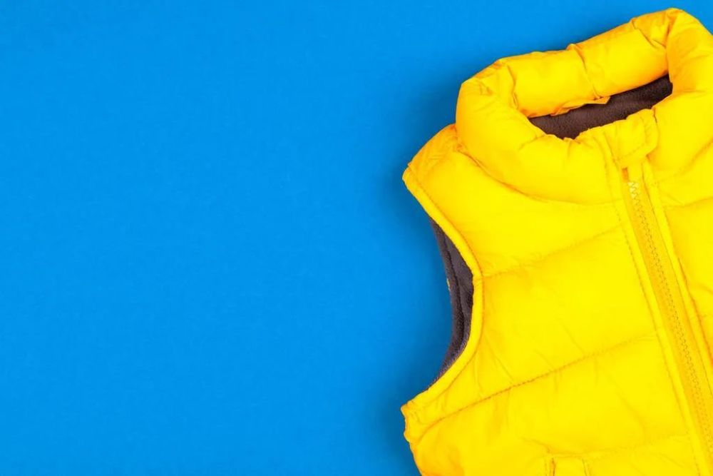
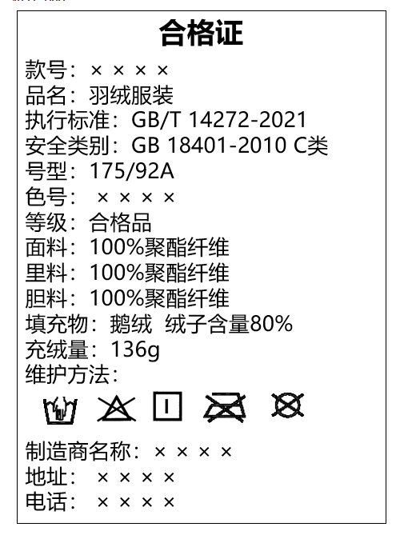
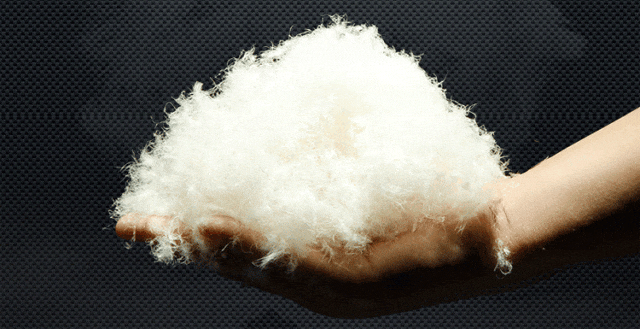
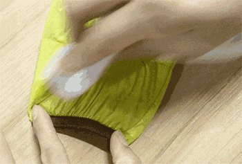

# 买羽绒服看1个指标就够，商家想钻空子都难

近日，多地气温骤降，冷空气“组团”出没。刚刚过去的“双11”线上销售数据显示，某网购平台第一波开售，羽绒服售卖达500万件；另一平台发布数据，运动羽绒服销量同比上涨108%。除了款式，保暖性是人们选购羽绒服时最看重的指标之一，怎么选才不出错？

受访专家

中国纺织工程学会科学传播专家、苏州市纤维检验院高级工程师 丁力进

中国纺织工程学会科学技术普及部主任 白洁

羽绒服的“绒”有很多种

2022年4月，新版羽绒服装标准（GB/T14272-2021《羽绒服装》）开始实施，与2011版国标相比，新国标在羽绒品质要求、羽绒种类标注等进行了完善和提升。

其中，将“含绒量”改为“绒子含量”，更能直观反映羽绒品质的高低。

含绒量：指的是羽绒羽毛中绒子和绒丝所占的质量比；

绒子含量：指羽绒羽毛中绒子所占的质量比。

绒子包含朵绒、未成熟绒、损伤绒、类似绒。其中，朵绒是羽绒中最主要的成分。朵绒越大，羽绒绒枝越长，而绒枝具有一定支撑力，让羽绒呈球性独特结构，使得羽绒间相互支撑，羽绒因此具有一定蓬松度，同时可容纳大量的静止空气，避免空气流动带走热量，起到良好的保温效果。

未成熟绒是尚未长全的绒，呈伞状；损伤绒是从羽绒上脱落下来的；类似绒呈丝状，且凌乱；绒丝则是从绒子或毛片根部脱落下来的单根绒丝。

由此可见，在一定羽绒重量下，绒子含量越高，蓬松度越好，保温效果越好。

但若羽绒中存在大量绒丝，由于绒丝没有独特球性立体结构，蓬松度较差，难以固定静止空气，保温效果较差，且绒丝容易通过纤维间、绗缝间空隙钻出，影响服装美观。

新版标准中采用“绒子含量”有利于识别羽绒产品质量优劣，避免不法商贩钻空子，在填充物中加入大量价格低廉的绒丝来提高羽绒的含绒量数值，以次充好。

重点关注吊牌的3个信息

选购羽绒服时，建议大家重点关注羽绒服的吊牌、水洗标，这里面几乎涵盖了羽绒服的含绒量、面料成分、充绒量、羽绒种类等信息。

记住以下判断维度，选出性价比更高的羽绒服：

**羽绒种类**

羽绒多采集于鹅与鸭，一般而言，鹅绒具有较高的保暖重量比，体积可压缩至更小，通常较昂贵。新版“标准”指出只需区分鸭、鹅，不再区分颜色（灰或白）。羽绒品质不在于颜色，而在于绒毛内部结构空间和羽绒纤维的细度等。高品质鸭绒比低品质鹅绒具有更好的绝缘保暖性，挑选羽绒服时不能只看羽绒种类，还要看羽绒服的品质、品牌。

**蓬松度**

蓬松度是每一盎司（约为30克）羽绒所占体积的数值。如一盎司的羽绒服所占的空间为700立方英寸，则称该羽绒服的蓬松度为700。

**面料**

羽绒中的绒丝、羽丝可以从纤维间的缝隙中逸出，因此羽绒服面料须细密且耐磨损。秋羽绒（指充绒量低于普通羽绒服，适于深秋或初冬穿着的羽绒服）一般采用锦纶面料，因为它既耐用又轻巧。羽绒服面料如果进行防水或防泼水处理，效果更好，能对抗雨、雪天气。

**买回家的羽绒服，可通过以下方式鉴别填充物质量：**

按：将羽绒服铺平，轻轻按压然后让其自然恢复。

如果回弹很快，说明羽绒服的蓬松度好，羽绒保温效果好；若回弹很慢，说明填充物质量欠佳；若根本无回弹性，填充料很可能是鸡毛或是其他长毛片的粉碎毛，而非羽绒。

摸：感受其手感柔软程度，有无过大过粗的长毛片、羽毛梗等。手感柔软但有短小粗硬的羽毛梗则为粉碎毛，这种羽绒制品穿着不舒适、保温效果差。

拍：猛拍羽绒服，看有无粉尘溢出。如有粉尘溢出，则为粉碎毛等伪劣填充料所做制品，容易溢出粉尘，引起疾病。

揉：用双手揉搓羽绒服装，看是否有毛绒钻出。如有毛绒钻出，说明面料不防绒，穿着后容易飞出羽毛，一段时间后保暖性更容易下降。

闻：天然羽绒会有轻微鸭绒味道，用鼻子接近羽绒服装作深呼吸数次，再与一般布料对比一下，有无异味或臭味。无气味最佳，如有明显气味则不宜穿着。

一份羽绒服日常养护攻略

和羽绒服本身的品质相比，后期的清洗与保养也关乎其保暖性。建议大家做好几点延长羽绒服“寿命”：

**不可干洗**

由于羽绒服的主要成分是蛋白质纤维，干洗剂会破坏羽绒，使绒朵变脆易碎，降低羽绒的蓬松度，影响羽绒的保暖性能，应使用专用的羽绒制品清洗剂或中性洗涤液。

**洗净后不可拧干**

以免将绒朵破坏，影响保暖性能，应将水分挤出，再平铺或挂起晾干，晾干后可轻轻拍打，使羽绒服恢复蓬松柔软。

**一冬最多洗两次**

羽绒服洗的次数过多，会导致羽绒折断、结块，保暖性下降。

不太脏的羽绒服，可用牙刷蘸酒精在污渍处轻轻揩拭，再用毛巾蘸清水擦拭，待酒精挥发干净即可。

**不能暴晒**

强烈的阳光也易使羽绒服的面料变薄，所以不能暴晒。

**换季保存前先晾晒**

换季贮存前，最好先晾晒2~3小时，拍打除去灰尘，保持干爽，用透气的收纳袋套好，存放于干燥通风处。▲

本期编辑：张宇

