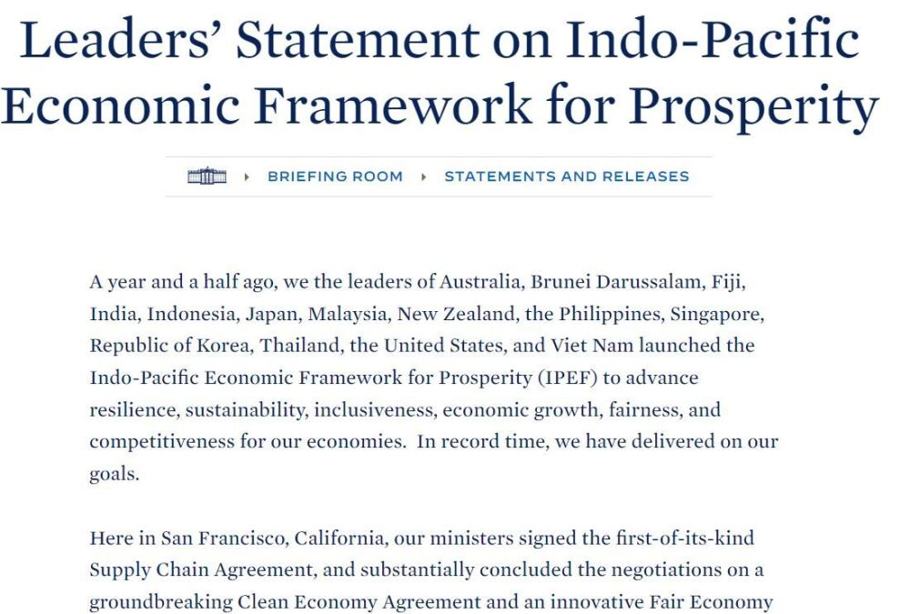

# 印太经济框架跛脚？14国没能在APEC达成贸易协议

记者 | 安晶

自特朗普执政开始，签订新的自贸协议就成为美国领导人力图回避的操作。

自贸协议乃至大部分贸易协议被众多选民视为损害美国利益、减少美国就业。特朗普上台后立刻带美国退出跨太平洋伙伴关系协定（TPP），还批评已生效20多年的北美自由贸易协定造成美国工作岗位流失。北美自由贸易协定最终改为门槛更高的美墨加协定。

考虑到选民的态度，拜登上台后也对签署新贸易协议保持谨慎。在本周的APEC会议期间，美国没有与任何国家签署贸易协议。

去年5月，拜登为替代TPP、制衡中国推出了“印太经济框架”（IPEF）。框架共有14个参与国，设定了四大支柱：贸易、供应链、针对清洁能源的绿色经济，以及涉及税收和反腐败的公平经济。

本周的APEC会议期间，印太经济框架14国举行了两天部长级会议。11月16日，14国领导人就部长级会议成果发表声明，宣布就三大支柱达成协议，最关键的贸易则没有任何协议。

美国官员透露，民主党议员对明年选举选票的担忧是贸易问题未达成协议的主要原因。

三大支柱达成协议

白宫16日发布的14国领导人声明宣布，各国部长就供应链、绿色经济和公平经济三大支柱签署协议。

_图片来源：美国白宫_

在供应链上，14国推出“关键矿产对话”机制，加强各国在关键矿产供应链上的合作。早在今年5月，14国部长已经敲定供应链合作协议内容，APEC会议期间只是正式签署协议。

当时媒体报道指出，全球仅有不到1%的镍来自美国，但印度尼西亚占全球镍矿供应量的一半以上；澳大利亚和东南亚国家也供应钴、锂等关键矿产，为14国在有需要时分享关键矿产创造了条件。

14国还就供应链设立了“危机响应网络”，在有可能出现供应问题时对各国提前预警。当供应问题出现时，14国间设有紧急沟通渠道，以便及时为各国提供支持。

印太经济框架的14个参与国为美国、澳大利亚、文莱、斐济、印度、印尼、日本、韩国、马来西亚、新西兰、菲律宾、新加坡、泰国、越南。这14国贡献了全球GDP的40%，占全球商品和服务贸易的28%。

在绿色经济支柱上，据美国商务部官网公布的信息，14国承诺要加强各国在清洁能源技术上的研发、商业化；通过相关基建、技术、标准设置上的协作加强各国互联；加大投资以推动清洁能源基建、技术等发展。

美国商务部长雷蒙多宣布将设立3000万美元的“催化资本基金”，鼓励14国私人投资者参与绿色能源产品开发。美国和日本将分别贡献1000万美元，澳大利亚贡献800万美元。

14国每年还将召开“绿色经济投资论坛”，鼓励绿色能源领域投资。第一次论坛将于明年下半年在新加坡召开。

在公平经济支柱上，14国在协议中承诺加强经济的透明度、法治和公平性，加大反腐败力度，以改善印太地区的贸易投资环境。

为落实达成的协议，14国设立了部长级别委员会，从明年开始每年举行会谈，各国领导人则每隔两年举行峰会。

14国的声明还特别指出，13国就贸易问题取得了进展，将继续谈判以达成互惠互利的贸易支柱成果。

贸易协议难达成

印太经济框架刚推出之时，其贸易方面内容就引发争议。与自贸协议不同，印太经济框架不涉及市场准入和关税减免，大幅削弱了对各国的吸引力。

当时美联社援引分析人士评论质疑，如果不能享受低关税、更好进入美国市场，各国将对印太经济框架能带来哪些实际好处打上问号。这也使得印太经济框架的吸引力低于美国退出的TPP。

即便不涉及市场准入和关税减免，印太经济框架中的贸易支柱谈判也遇到了困难。印太经济框架中的其他三个支柱由美国商务部负责谈判，贸易支柱则由美国贸易代表戴琪谈判。

本月早些时候，戴琪接受美国媒体采访时表示，将在APEC会议期间公布与印太经济框架四大支柱有关的“让人兴奋的”成果。

但上周，美国官员透露与贸易支柱有关的协议将无法达成。知情官员接受Axios新闻网采访时指出，准备明年参加议会改选的民主党议员对美国政府与其他国家达成贸易协议表示了担忧。

自从特朗普把贸易协议与抢走美国人饭碗相关联后，贸易协议就成为众多选民心中的雷点。参议院多数党领袖、民主党人舒默警告拜登政府，在选举前不到一年达成贸易协议存在政治风险。

俄亥俄州参议员、民主党人布朗（Sherrod
Brown）直接发声明，明确反对印太经济框架中的贸易部分，称其“不可接受”。布朗将参加明年的改选，民调显示他与四名共和党候选人的差距仅在5个百分点内。

知情官员称，正是由于民主党议员的施压，白宫要求美国谈判官员放缓就印太经济框架贸易支柱的谈判。

法新社把贸易支柱谈判受阻称为美国的“挫折”，可能进一步削弱美国作为贸易伙伴的可靠性。文章指出，美国政府过去数十年都通过自贸协议与全球各国建立合作关系，目前受国内政治影响，美国已经走向“孤立主义者”模式。

彭博社也表达了类似观点。美国智库亚洲协会政策研究所副所长、美国前贸易副代表卡特勒（Wendy
Cutler）接受该媒体采访时称，美国没有与13国就贸易支柱达成协议让“我们的贸易伙伴震惊”。

卡特勒表示，贸易谈判存在起伏波动，而现在明显是低谷期，是遭遇的“重大挫折”。

