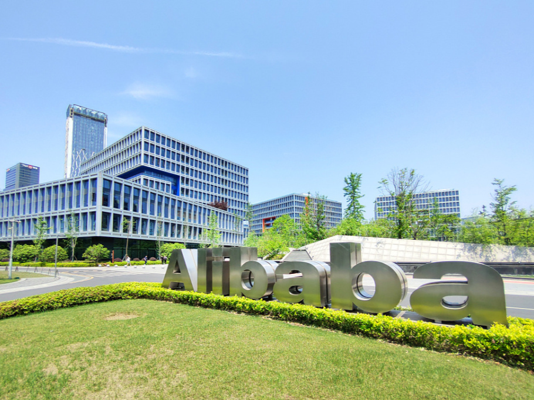

# 双十一刚结束，阿里又变天：叫停分拆，重提平台战力

_来源：视觉中国_

作者 ｜ 程潇熠

编辑 ｜ 康晓

出品 ｜ 深网.腾讯小满工作室

阿里大开大合的组织变革持续了半年多，新任CEO吴泳铭接棒逍遥子张勇后，第一件事便是替这场变革踩下“刹车”。

11月16日，阿里巴巴集团最新财报披露，阿里不再推进云智能集团的完全分拆，盒马鲜生的IPO计划也已暂停。在原先的计划里，云智能集团及盒马鲜生将在明年7月前完成独立上市。

阿里在财报中将两项计划的终止与搁置原因归结为外部环境变化。云智能集团不再推进拆分是因“美国近期扩大对先进计算芯片出口的限制，给云智能集团的前景带来不确定性。”盒马则需再“评估市场情况”。

而从吴泳铭在财报电话会议中的发言来看，上述计划的变动与阿里新领导班子针对未来十年制定的新战略有关——即仍支持阿里各业务线独立面向发展，但也强调分而不散。

**“我们正在探索建立相应的激励体系，在业务集团的独立性和协同性之间着力取得平衡，实现发展的最大合力。”** 吴泳铭说。

这与阿里最初对业务分拆的期盼有所不同。今年3月，时任阿里董事会主席兼CEO的张勇在开启阿里24年来最大组织变革的内部信中曾说道，“公司大了以后，与其通过各种方式来鼓励大家协同，不如真正用市场方式来双向选择。”

张勇认为，让各个业务独立、上市能解决员工“为谁而战”的问题，“大家不是为了完成绩效聚在一起，而是共同做一项事业”，事业是否成功不靠绩效考评，而靠市场检验。之后阿里能跑出若干个上市公司，经过几年后还能“生儿育女”，分出更多的上市公司，“这样我们业务才算走向繁荣。”

阿里未来战略的变化，或许是此前张勇选择闪电退休的重要原因：原本计划“自立为王”的云智能集团不再拆分，张勇也将面临从阿里一把手降为子业务集团负责人的尴尬处境。

如今，阿里权力机构完成新旧交替，阿里将在新舵手掌控下驶向新航道。

**“1+6+N”重订三年战略**

对于未来十年，吴泳铭为阿里集团明确提出三个方向：
技术驱动的互联网平台业务，AI驱动的科技业务，以及全球化的商业网络。又基于三个方向提出了三大关键变革举措，《深网》根据原文内容总结归纳：

**1.分而不散，建立激励体系，在业务集团的独立性和协同性之间着力取得平衡，实现发展的最大合力。**

**2.根据市场规模、商业模式及产品竞争力定义核心业务与非核心业务。** 核心业务保持长期投入，非核心业务尽快变现。

**3.以三年为周期评估业务价值，持续孵化战略级创新业务。** 第一优先级投入符合用户需求和AI驱动变革业务，对面向未来的革新性产品长期投入保持战略耐心。

阿里对于战略级创新业务有明确的遴选标准：具备足够巨大的市场空间；具备独特的市场定位；符合用户需求趋势和集团“AI驱动”战略。

被选上的业务将以独立子公司的方式运营，即从6大集团下属的子业务变为“1+6+N”中的“N”业务，独立后集团将以3-5年为周期进行持续投入。首批被划为战略级创新业务的有：采购批发平台“1688”，二手闲置交易平台“闲鱼”，企业协同工具“钉钉”，智能搜索产品“夸克”。

**6大业务集团在未来三年也重新制定了核心策略：**

**淘天集团：** 提供海量产品和服务，做“万能的淘宝”；在APP执行消费分级和价格力策略；用户购买频次替代GMV成为平台经营最关键目标。

“淘宝是一个超级app，覆盖主流的三种销售模式：直播内容驱动模式、品牌营销模式、日销低价模式。”吴泳铭称，淘宝要有能力容纳从品牌商品到白牌商品的多个商品分层，而价格力则是贯穿各层次商品的核心战略。

**云智能集团：** 保持独立公司运作；AI驱动，提供AI基础设施，开放AI生态；公共云优先，减少项目制的销售订单。

**国际数字商业集团：**
以全球物流网络为基础，建设全球数字化供应链网络；建设AI数字零售核心技术能力，推动商家从“local”（本地）走向“global”（全球）；拓展新兴海外市场。

**菜鸟集团：** 海外加快智能物流网络建设，国内走差异化道路，输出科技能力，帮助品牌商和制造商提升物流数字化和智能化水平。

**本地生活集团：** 继续以本地生活两个业务阵地为核心，即高德发展出行和到目的地，饿了么发展即时到家业务。

**大文娱集团：** 三年内基本实现影视制作端的标准化、流程化、数智化；优酷坚持头部内容战略，提高自制比重；阿里大文娱集团将整体实现尽快稳定盈利。

**将命脉握在集团手中**

阿里云是阿里系产品的技术底座。这一定位或许在上周末阿里云异常引发阿里全系产品故障后，在大众心里又有了进一步加深。

11月12日，“阿里全系产品崩了”等话题迅速引发众议、登上微博热搜。阿里系如淘宝、钉钉、饿了么等多款产品发生服务器故障，影响国内、中东、中南亚等多个地区。据阿里云公告，当天阿里云监控发现云产品控制台访问及API调用出现异常，阿里云工程师紧急介入排查。事故发生三个多小时后产品均恢复正常。

**吴泳铭钦定阿里未来十年将是AI驱动，云智能集团是承载这一使命的载体。如果按原定计划引入外部投资者，不断稀释阿里集团在云智能集团的股份，不亚于授人以柄，将自己的命脉主动交到他人手中。**

自OpenAI推出的ChatGPT为AI时代照亮了一条大模型之路，各大科技公司几乎同时间段将大模型提升为优先级最高的AI项目。

据Insider ，亚马逊CEO Andy Jassy 直接组建并领导大模型核心技术团队。Andy
Jassy在2022年度股东信中直言，大型语言模型和生成式AI意义重大，能让“亚马逊未来几十年可以在每个业务领域都进行创新的核心”。

据外媒爆料，亚马逊已打算将第二个大模型——内部代号Olympus（奥林匹斯），接入自家在线零售商店、Echo等设备，相关功能预计在12月上线。

有大量算力、数据和生态应用的云计算公司是大模型竞争中的优势方。阿里云是中国云计算领域的开拓者之一，早从马云时代开始就是阿里巴巴集团的核心战略业务。

2013年，阿里云开始进入快车道，2015财年至2019财年年营收约100%增长，在中国云计算市场可谓一骑绝尘。然而从2020年开始，因为华为云等厂商获得了大量政企青睐，阿里云份额受到严重挤压，营收增速断崖式下跌，2023年一季度阿里云增速一度降至-2%，2023年三季度增速达2%，但仍是阿里集团业务中增速最缓的一个。

“成功的科技公司必须具备穿越科技周期的能力。”在吴泳铭看来，大模型及AI无疑是这一阶段科技公司穿越周期的必备能力。

从今年8月开始，阿里在大模型领域动作频繁。先是上架了开源模型通义千问70亿参数通用模型和对话模型，9月又开源了通义千问140亿参数模型Qwen-14B及其对话模型Qwen-14B-Chat。11月10日，吴泳铭官宣，阿里巴巴即将开源720亿参数大模型，这将是国内参数规模最大的开源大模型。

“互联网以及科技行业的竞争是无限游戏，任何产品可能都不存在长期的护城河。”吴泳铭认为，虽如此，但阿里作为年收入1250亿美元、自由现金流达270亿美元的集团，有上千万客户和全球第三的云计算平台，几方合力，便是阿里的优势。“飞速发展的科技正在深刻重构所有产品、所有行业和所有生活场景，可以说，今天所有对未来的预估都是低估。”

