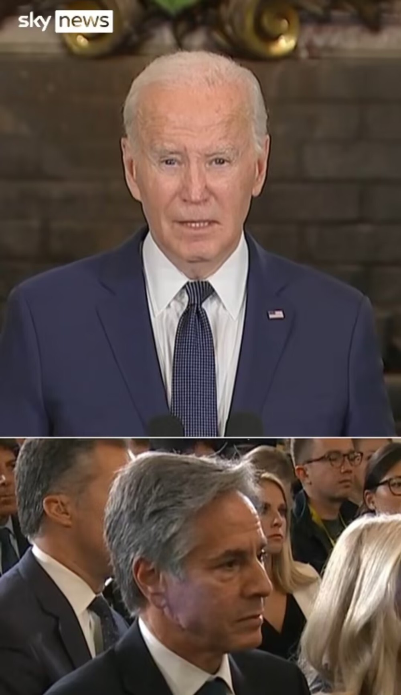

# 外媒：拜登记者会上谈巴以人质问题，被台下布林肯提醒后连忙停下

【环球网报道】据英国《每日电讯报》、天空新闻网报道，当地时间11月15日，美国总统拜登在记者会上发言时提及巴以冲突人质问题，有媒体注意到台下的美国国务卿布林肯突然摇头示意，拜登随后意识到自己说了太多，说道：“我说了太多细节了。我知道，国务卿先生，我不说了。”

当地时间15日，拜登在加州召开记者会，谈到巴以人质问题时经布林肯提醒连忙打住 图源：英国天空新闻网视频截图

