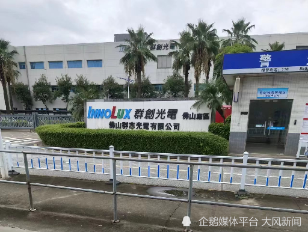
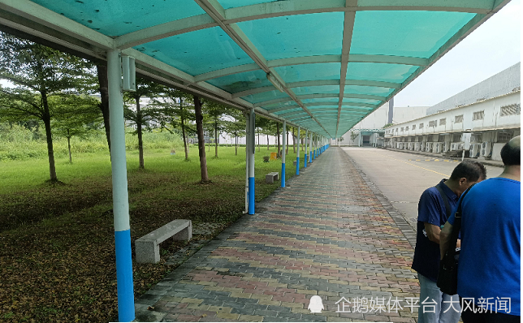
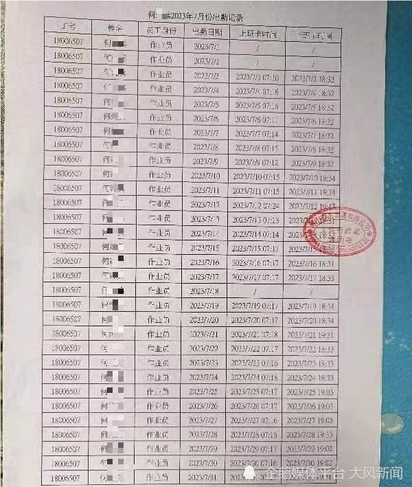

# 广东一男子连上23天班刚出车间4分钟猝死，当地人社局：不予认定工伤

何先生反馈，他的弟弟何某午休去吃饭路上，突然倒地猝死。当时出了车间才4分钟，结果无法认定工伤，导致索赔陷入难题。

突发猝死：已连上22天班，去吃午饭路上倒地吐血

何先生的弟弟何某在广东省佛山群志光电有限公司上班，8月10日中午，何某从车间出来4分钟，正在去吃饭的路上，突然吐血猝死。

 _事发工厂 受访者供图_

“120救护车当时也去了现场，人没抢救过来，医院死亡证明上写的是猝死。我弟弟连上23天班了，这就是过劳死”。何先生认为，弟弟连上23天班，是不是工伤公司都应该赔付，以工伤为由推脱是在推卸责任。“我们找公司，公司说有保险，但人社部门认定不是工伤，我们行政复议了，结果也没有改变。公司到现在还没赔偿，我们现在也不知道该怎么办了。”

 _何某倒地地点 受访者供图_

在何先生提供的弟弟2023年出勤记录中，7月显示，7月3日至17日连上15天班，休息1天，7月19日至8月9日连上22天班，8月10日打了上班卡，未打下班卡。上班卡时间在上午7时12分至19分不等，下班卡时间从下午6时32分至7时31分不等。在居民死亡医学证明（推断）书上，小何年龄为35岁，死亡日期为2023年8月10日，死亡原因为猝死。

_家属提供的何某考勤记录 受访者供图_

用人单位回应：每日工作时间不长，应该不存在过劳情况

11月14日，华商报大风新闻记者联系到佛山群志光电有限公司，负责处理何某一事的工作人员说，出事的第二天，公司就向人社部门递交了工伤认定的相关资料，认定结果是非工伤，依据为不是工作时间，也不是在工作岗位。他们公司给员工都买了社保，意外险也能赔付一些。

“能赔付金额和家属要求的差距较大，家属要100多万元。家属复议了，最终结果还没告知到我们，会根据结果执行。”工作人员说，对于家属提出的连上23天的情况，其实每天的工作时间没有那么长，应该不存在过劳的情况，连上20多天的情节还需要再核实，“人猝死后未解剖，所以医院也没有说具体的死因，只是说猝死。”

南海区人社局：休息时间非工作岗位，不予认定或视同工伤

采访中记者了解到，佛山市南海区人社局于8月11日受理佛山群志光电有限公司的工伤认定申请后，根据提交的材料调查核实情况如下：何某是该公司员工，2023年8月10日，何某上日班，上班时间由早上7时30分至下午16时30分，中午11时至12时为午餐时间，当日何某在公司工作至11时后打卡出工作车间，记录的时间为11时2分(有视频佐证)，后其与同事一起步行出车间去吃午餐，11时6分左右，其步行至阳光走廊中间段时突发晕倒在地，经120到场抢救后证实死亡，死亡原因为:猝死。何某的死亡发生在休息时间内，其事发地点也不属于工作岗位，综述，其死亡不属于视同工伤死亡。何某的死亡，不符合《广东省工伤保险条例》第九条、第十条认定工伤或者视同工伤的规定，属于不得认定或者视同工伤的情形。决定不予认定或是视同工伤。

不予认定工伤后，家属不服，提起行政复议。

广东省佛山市南海区人力资源和社会保障局9月27日出具行政复议答复书显示，该局于2023年8月11日受理佛山群志光电有限公司的工伤认定申请后开展调查，并于2023年8月14日作出《工伤认定举证通知书》并有效送达予公司方，2023年8月16日公司方出具《不予举证说明》，其后，答复人综合所有材料以及自身调查所得，于2023年8月23日作出《不予认定工伤决定书》(编号:[2023]295416号)，并依法向各方当事人送达。答复人所作的上述认定工伤决定，程序合法。

南海区政府：决定书中表述不够严谨，但不影响结果

佛山市南海区人民政府11月8日出具行复议决定书南海府行复[2023]563号显示，该案的争议焦点是:被申请人佛山市南海区人力资源和社会保障局作出的上述《不予认定工伤决定书》是否合法?《广东省工伤保险条例》第九条第(六项规定:“职工有下列情形之一的，应当认定为工伤:……(六)在上下班途中，受到非本人主要责任的交通事故或者城市轨道交通、客运轮渡、火车事故伤害的;……”第十条第一款第(一)
项规定:“职工有下列情形之一的，视同工伤:(一)在工作时间和工作岗位，突发疾病死亡或者在四十八小时之内经抢救无效死亡的;……”

本案中，可以证实何某是佛山群志光电有限公司的员工，其是在下班途中突发疾病经抢救无效死亡，其突发疾病时并非处于工作时间内和工作岗位上，死亡原因亦非因交通事故或者城市轨道交通、客运轮渡、火车事故所致，故其不符合上述规定应当认定为工伤或视同工伤的情形，亦不符合《广东省工伤保险条例》第九条、第十条规定的其他应当认定为工伤或视同工伤的情形。被申请人据此对何某的死亡不予认定或者视同工伤，合法有据。

对于家属述称何某午餐时间内去吃午饭的过程应当视为工作时间、工作岗位的合理延伸。南海区人民政府认为，虽然用人单位应当给予劳动者合理的休息时间来保障劳动者吃饭的生理需求，但该休息时间并不能视为工作时间；而工作岗位是指劳动者从事职业活动、履行岗位职责的场所，并不包括上下班途中。本案中，何某是在下班后外出吃午饭的路途中突发疾病死亡，其突发疾病的时间处于休息时间，且其已离开工作岗位，不能视为工作时间和工作岗位的合理延伸，申请人的上述复议理由缺乏事实根据和法律依据，不能成立。

但佛山市南海区人力资源和社会保障局在《不予认定工伤决定书》中，将“何某的突发疾病经抢救无效死亡，不符合《广东省工伤保险条例》第九条、第十条认定工伤或者视同工伤的情形……”记载为“何某受到的伤害，不符合《广东省工伤保险条例》第九条、第十条认定工伤或者视同工伤的情形……”表述不够严谨，存在瑕疵，但不影响处理结果的合法性。于是维持佛山市南海区人力资源和社会保障局作出的《不予认定工伤决定书》。如不服，可向人民法院提起诉讼。

**华商报大风新闻记者 佘欣 编辑 李智**

**（如有爆料，请拨打华商报新闻热线029-88880000）**

