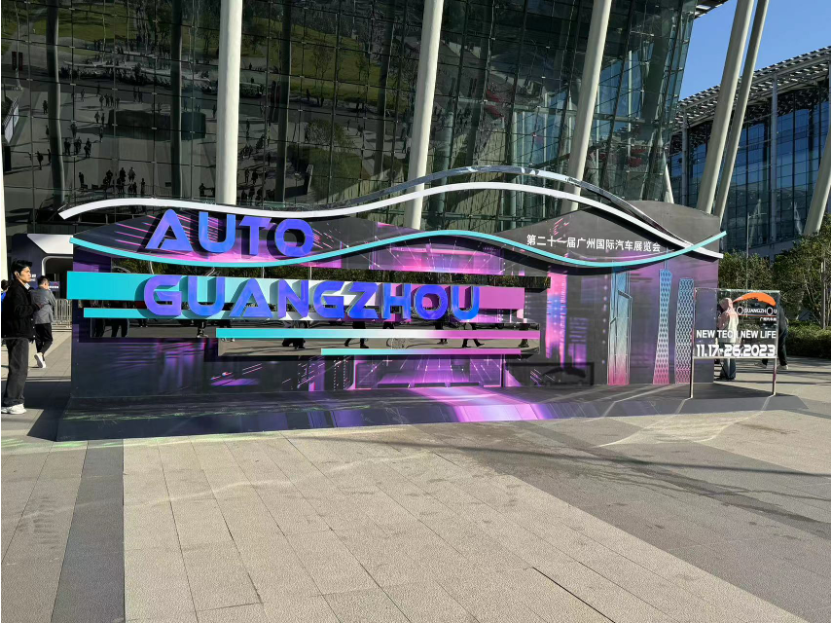
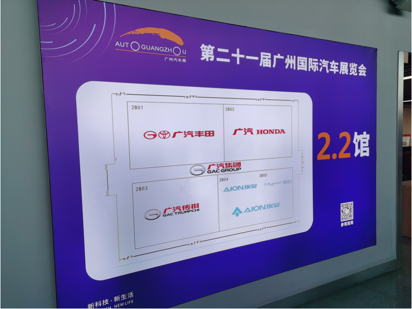
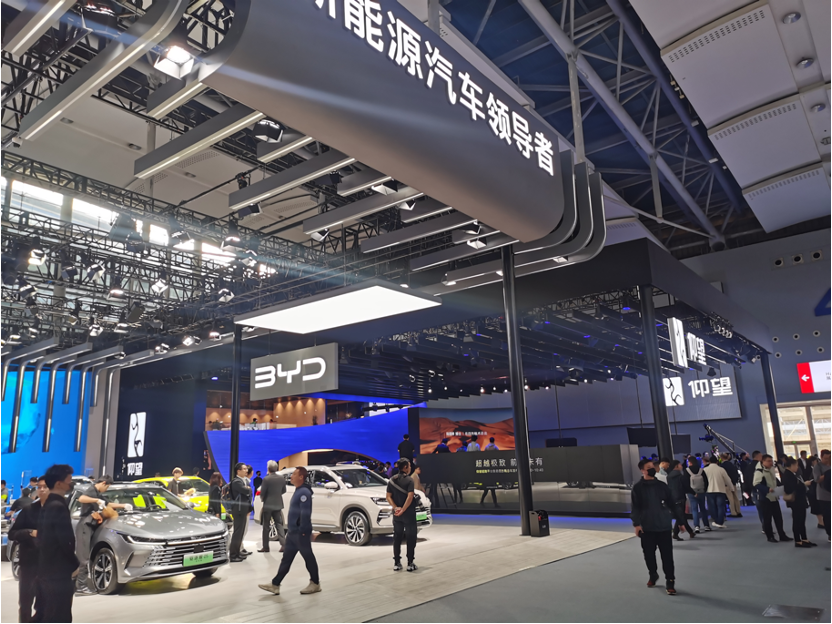

# 广州车展第一天：特斯拉的对手唱主角，数十个汽车品牌集体消失

腾讯新闻《远光灯》 作者 郭亦非

作为国内四大A级车展之一，11月17日，广州国际汽车展览会在琶洲会展中心开幕。

广州车展素有“来年车市风向标”之称，在新旧势力交替、电动化与智能化浪潮下，为了来年大卖，各大车企再次亮起了肌肉，纷纷拿出了全新重磅车型，彰显自身电气化转型成果。本届参展车辆共有1132台，其中包括了全球首发车59台、概念车20台、新能源车469台。

有意思的是，搅动车市的“鲶鱼”特斯拉，继缺席年初的上海车展后，再次缺席此次的广州车展。他们今年在级别更低的武汉和深圳车展上有过两次亮相。

特斯拉没来，一众对标它的对手们仍将在广州车展轰轰烈烈“开打”。

大本营扎根广州的广汽集团自然首当其冲，狠狠刷了一波存在感。他们豪气包下一整个场馆，坐拥5个展台，分发给旗下广汽传祺、广汽本田、广汽丰田、埃安、昊铂五个品牌。

隔壁的自主品牌龙头比亚迪也不甘示弱，拿下4个展台，除了比亚迪品牌外，还有仰望、方程豹、腾势三大品牌集体亮相。

“遥遥领先”光环加持下的华为，也准备在家门口秀一把肌肉。不过，与往届不同的是，本届广州车展华为将以鸿蒙智行名义参展，这也是华为智选车宣布战略升级之后的首次对外亮相。

11月9日晚，华为智选车首款轿车智界S7开启预售，新车定位纯电动中大型轿跑，预售25.8万起。余承东在发布会上多次点名特斯拉，他表示市场太卷，智界S7将重新定义智能轿车，在各方面的规格参数上超越特斯拉的Model
S，用户可以以Model 3的价格买到比奔驰EQE更好的车。

在某新势力高层看来，华为通过智选车模式已经补齐了产品定义、研发、制造方面的短板，结合市场渠道能力和智能驾驶能力，华为或许会在未来两年内不断冲击特斯拉市场地位。

几家欢喜几家愁，市场愈发内卷下，也有不少车展常客缺席了本次车展。

据不完全统计，斯柯达、标致、雪铁龙、东风雷诺、华晨中国、众泰、长安铃木等传统燃油品牌集体消失，此前，这些品牌关厂裁员、败退中国市场的声音不断。部分新势力的日子也不好过，曾经名噪一时的恒驰、威马，如今也不见了踪影。

新能源浪潮正加速重塑产业格局，以及车企江湖地位排序，自主品牌正借助先发优势，不断侵蚀合资、豪华车企的市场份额，已占据半壁江山。

乘联会数据统计，2023年10月的国内乘用车零售份额中，自主品牌、德系、日系和美系品牌，分别占比55.6%、18.1%、17.7%和6.1%。新能源车渗透率指标中，自主品牌、豪车和合资品牌，分别为60.4%、19.6%和6.5%。

这一变化在车展的车型产品上也得以窥见。本次展出的469台新能源车型中，自主品牌车型达到350台，在规模上遥遥领先。这其中，甚至包括拥有63年历史的老牌车企一汽红旗，其首款纯电轿车EH7将在车展亮相。

与此同时，拿热闹非凡的MPV市场举例，广州车展上，两家新势力MPV产品将正式亮相，包括理想争议不断的首款纯电产品MEGA、小鹏扶摇架构下的旗舰车型X9。

豪华车沃尔沃也不甘寂寞，与极氪009高度相似，售价却高出30万元的EM90也将上场，他们的共同对手，将是别克GL8、丰田赛那、广汽传祺M8等老牌产品。

当然，燃油车市场也是难以舍弃的蛋糕，各家推出的重磅燃油车依然不少，各种新车、改款、换代纷纷一拥而上。

作为中型轿车销量担当，丰田旗下的全新第九代的凯美瑞此前已在海外上市，此次将借助广州车展首次国内亮相，除了外观内饰全面革新外，动力上全系搭载2.5L油电混动系统，并提供两驱/四驱版车型，国产版是否取消纯燃油车型值得关注。

豪华品牌宝马也将携全新一代国产版5系亮相，拥有520i搭载2.0T四缸发动机，最大功率208马力（153kW），官方称其0-100km/h的加速时间为7.5秒，综合油耗5.8L/100km。

可以预见，燃油车与新能源车新旧势力的拼杀仍将持续，绝不止步于广州车展。

