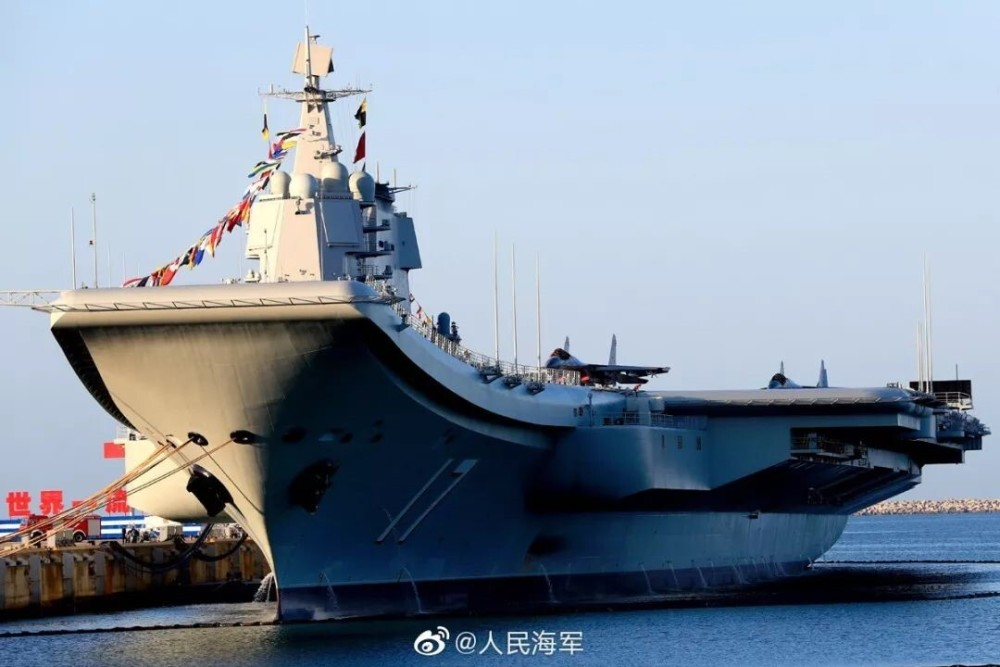
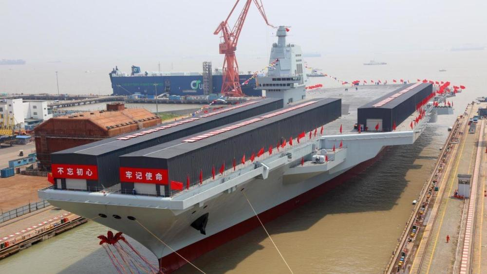

# 观察｜山东舰远航后绕台，一年三次远海演训体现连续出动能力

_歼-15战斗机在山东舰上准备起飞。 中国军网 图_

山东舰首次在完成远海长航后未返回驻地，进入台湾海峡继续执行绕台航训。

11月16日下午，国防部新闻局副局长、国防部新闻发言人张晓刚大校就山东舰远航后绕台一事进行了回应。张晓刚表示，近期，中国人民解放军海军组织山东舰编队赴相关海域进行训练，旨在锤炼提高航母编队体系作战能力，提升官兵技战术水平，进一步增强维护国家主权、安全、发展利益的能力。需要指出的是，这是根据年度训练计划作出的例行性安排，符合国际法和国际实践，中国军队将常态组织类似演训活动。

 _停靠港口的山东舰。@人民海军 图_

**山东舰一年三次前出岛链**

根据《参考消息》11月9日援引台媒的报道称，完成台湾东南海域训练的解放军航母山东舰，传出8日晚间进入台湾海峡的消息。

报道称，日本防卫省统合幕僚监部6日表示，解放军航空母舰山东舰在10月28日到11月5日的9天演训期间，舰载战斗机起降约420次、直升机起降约150次，合计起降570架次，正驶向南海。舰载机起降的同时，山东舰在太平洋海域朝东南方向移动，并在11月2日抵达宫古岛东南方向1380公里处，随后调转方向，在6日朝南海方向航行。舰队包括导弹驱逐舰、护卫舰等。

根据《环球时报》援引日本防卫省公布的信息，山东舰在此期间汇集了更大规模的护航舰艇，包括两艘055型万吨驱逐舰、3艘052D型驱逐舰、3艘054A型护卫舰及1艘901型综合补给舰。

“如果日本防卫省公布的信息属实，那么此次山东舰航母编队应该是一个要素齐全的编队，既有主力防空舰055型和052D型，还有主要负责反潜的054A型护卫舰以及后勤补给的大型补给舰。”海军专家王云飞向澎湃新闻（www.thepaper.cn）分析表示，“当然上述舰艇都是多用途战舰，还具备较强的反舰能力。”

此次航母山东舰舰载机创纪录的起降次数也引发广泛关注。

舰载战斗机9天出动420架次，平均每天47架次，对比以往远海训练的一些观测数据，这是迄今为止最高的纪录。“每天47架次意味着平均每架舰载机日出动2架次，这说明山东舰出动能力达到了滑跃起飞航母非常高的水平，同时也说明山东舰战斗力的提升。”王云飞表示。

“考虑到舰载机飞行员的休息、舰载机维护和航母甲板运作，即使美国‘尼米兹’级核动力航母，持续作战情况下，每架舰载机日出动架次也只有2.5架次。”王云飞补充说。

值得一提的是，此次远海训练是山东舰本年度的第三次前出岛链进行训练。今年4月，山东舰穿越巴士海峡，经过台岛东南海域展开首次西太平洋训练。央视军事在山东舰完成远海训练后发文称，此次训练，山东舰航母编队首次成体系、成规模远赴西太平洋海域，参加了环台岛战备警巡和“联合利剑”演习，同步开展战斗值班、课题演练、飞行训练，并在岛链外与火箭军、陆基航空兵以及其他水面作战编组开展联合演练。面对外军舰机轮番侦察试探的复杂局面，编队始终积极应对、稳妥处置，有效提升了实战能力。

今年9月，山东舰再次前出岛链进行远海训练。在当月的国防部记者例会上，有媒体对山东舰远海训练的提问提及，有分析称，这是距台湾最近的一次演习。国防部新闻发言人吴谦大校对此表示：这是年度计划内的一次训练，旨在提高部队的备战打仗能力。

时隔一个多月，山东舰今年第三次前出岛链进行远海训练，一年三次远海训练，不仅创下了山东舰的纪录，也创下了中国航母的前出岛链远海训练的次数纪录。

“不到一年三次前出岛链进行远海演训，说明山东舰具备较强的连续出动能力，也体现了中国航母战力的提升。” 王云飞分析认为。

_福建舰下水。 央视新闻视频截图_

**福建舰即将进行海试？**

山东舰远航后绕台的消息也引起了大众对福建舰何时海试的关注。

去年6月17日，我国第三艘航空母舰下水命名仪式在中国船舶集团有限公司江南造船厂举行。经中央军委批准，我国第三艘航空母舰命名为“中国人民解放军海军福建舰”，舷号为“18”。

根据官方公布的消息，福建舰是我国完全自主设计建造的首艘弹射型航空母舰，采用平直通长飞行甲板，配置电磁弹射和阻拦装置，满载排水量8万余吨。该舰下水后，将按计划开展系泊试验和航行试验。福建舰顺利下水标志着我国海军装备现代化建设取得了又一重大的历史性突破，对于进一步提升我国海军维护国家海洋权益的能力具有重要意义。

今年1月，海军福建舰副舰长钱树民接受央视采访时表示，今年工作中心是试验试航。

今年3月，“央视军事”公众号发布的8秒短视频引发热议，画面从一侧展示了福建舰的船体，甲板上的电磁弹射施工单元依旧罩着施工厂房，与从前相比没有变化，但在水线附近红色油漆上有一处排水口正在排水，周围发黑。军事专家接受《环球时报》采访时认为，这可能是柴油发电机的排烟口，而这进一步表示福建舰目前进行的系泊试验非常顺利，已经进行了辅助动力的测试

今年4月，在人民海军成立74周年纪念日到来前夕，央视发文称，福建舰动力测试、系泊试验顺利展开。

资料显示，系泊试验是在机电设备和其系统安装结束的基础上进行的，目的是检查船体、机械设备、电器设备及动力装置的制造、安装的完整性和可靠性。

军事专家张军社此前接受央视采访时表示，福建舰要进行系泊试验和航行试验，看航母能否达到设计要求，出现问题也能及时改进。这些试验完成后，福建舰就准备正式移交海军入列服役了。

海军专家李杰此前接受澎湃新闻采访时介绍说，按照国际惯例，从航母下水再到海试、服役通常是需要两到三年的时间，从下水到海试一般是一年左右时间。

“与采用滑跃起飞方式的航母辽宁舰、山东舰不同，福建舰配备了电磁弹射器，吨位更大，可搭载更多舰载机，综合作战能力更强，对于中国海军和造船工业来说都是具有里程碑意义，福建舰需要肩负更多的技术验证工作。”王云飞指出。

