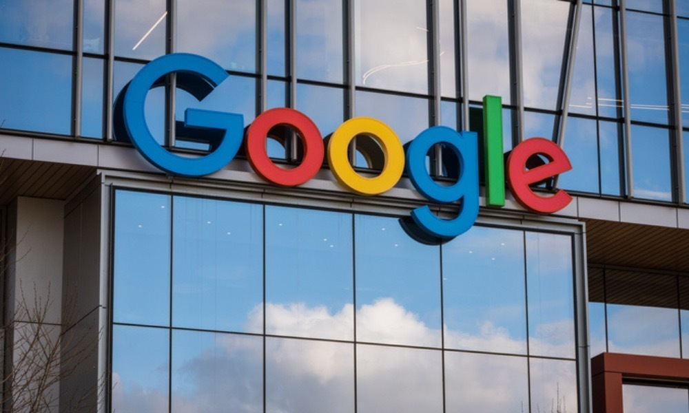

# 谷歌推迟发布ChatGPT的竞品Gemini 质量引联合创始人布林不满

**划重点：**

  * _1_ 谷歌云计划在明年年初准许企业客户使用Gemini，同时，相关研究人员正努力确保其能够超越GPT-4。
  * _2_ 谷歌联合创始人布林在Gemini团队中扮演了更重要的角色，他虽然不是正式的决策者，但最近几周他对Gemini提出了批评和反馈，并帮助不同的团队协调工作。
  * _3_ 鉴于缺乏开发大型语言模型的专业人才，谷歌和OpenAI一直在激烈争夺人工智能人才。据报道，OpenAI已经为谷歌的某些研究人员提供了价值1000万美元或更高的年薪。

腾讯科技讯 11月17日消息，知情人士周四透露，谷歌将推迟发布Gemini
AI大模型，意味着谷歌在火热发展的生成式人工智能市场赶上OpenAI的难度超出了该公司原来的预期。

谷歌的代表在今年年初曾告诉一些云客户和商业合作伙伴，他们将在11月获准使用该公司全新的对话式人工智能服务Gemini。但知情人士透露，谷歌最近告诉云客户和商业合作伙伴，这一计划可能被推迟至明年第一季度。这一延迟对谷歌而言犹如雪上加霜，原因是该公司的云业务增长已经放缓，而主要竞争对手之一微软的云业务却在加速增长。微软的成功部分来自于向客户销售OpenAI的技术。

谷歌推迟向消费者和企业客户推出Gemini，将在多个方面给该公司造成伤害。自从一年前OpenAI推出ChatGPT以来，这家初创公司已登上了科技行业的巅峰，把聊天机器人变成了消费者认可的人工智能的全球同义词。OpenAI取得这样的成绩，得益于谷歌发明的技术和曾经在谷歌工作的员工的帮助。

ChatGPT也是近年来增长最快的消费者和企业软件支柱业务之一。企业使用这项技术来完成一些任务，如自动化软件编程、总结长篇报告、开展营销活动以及开发利用其预测能力的专业应用程序。OpenAI首席执行官山姆·奥特曼（Sam
Altman）周二表示，在开发日（DevDay）之后使用量的激增超出了OpenAI的承受能力，为确保每个人都有良好的体验，将暂停新ChatGPT
Plus注册。

与此同时，谷歌开发的ChatGPT的竞争对手Bard一直未能成功。这对谷歌来说是一个问题，因为ChatGPT的上亿用户产生了有价值的数据，这些数据有助于OpenAI跟踪和提高其产品的质量。

谷歌发言人凯瑟琳·沃森（Kathryn Watson）表示：“我们不对谣言或猜测发表评论。”谷歌首席执行官桑德尔·皮查伊（Sundar
Pichai）周四在一场公开活动中表示，谷歌“专注于尽快推出Gemini
1.0，确保它具有竞争力，是最先进的。”皮查伊在5月首次证实了媒体关于Gemini的报道。

知情人士称，谷歌推迟发布面向云客户的大型Gemini模型，意味着该公司希望在让外部软件开发者获得这项技术之前，用这项新技术支撑其消费者产品。在谷歌10月24日举行的财报电话会中，皮查伊并未过多的探讨Gemini的发布问题，仅表示：“我们只是在为我认为将在2024年推出的下一代系列模型奠定基础。”

寄予厚望

谷歌对Gemini寄予厚望，希望它不仅仅能够推动企业软件销售。谷歌还希望Gemini能够为YouTube的创作者提供新的工具，例如为视频生成定制背景，以及提高Bard和谷歌助手的功能。谷歌助手是谷歌为电话和其他设备提供的类似Siri的语音助手。

根据任务复杂性的不同，谷歌开发了多个版本的Gemini来处理不同的任务。外部开发人员已经测试了小版本的Gemini模型。但据一位参与这项工作的人士说，该公司仍未敲定最主要、最大版本的Gemini。

Gemini团队面临的关键挑战是确保主模型与OpenAI最先进的大型语言模型GPT-4一样出色，甚至更好。该消息称，目前还不清楚谷歌是否达到了这个标准。比较不同公司的人工智能模型的性能并不简单，尤其是如果其中一家公司还没有公开推出大模型的话。与OpenAI可以从GPT模型的客户那里获得许多质量反馈不同，谷歌目前还无法获得关于Gemini的质量反馈。

谷歌对在Bard中使用Gemini采取了谨慎的态度。自Bard于3月推出以来，一直由能力较差的大型语言模型提供支持。一名谷歌员工透露，Bard当时在一场受到外界关注的演示中犯了一个事实错误，这个错误仍然困扰着一些参与其中的员工。

AI广告工具

Gemini的另一个关键应用是广告，这是谷歌的主要赚钱工具。知情人士透露，谷歌高管讨论过使用新模型为广告商提供可以自动生成广告推广活动的工具，包括定制文本和视觉效果。这最初将包括静态显示广告的图像，但最终也可能包括音频和视频广告。包括亚马逊和Meta在内的其他公司也推出了人工智能广告工具。

与Palm 2等早期的谷歌大型语言模型相比，Gemini对与用户互动的记忆也更长，Palm
2目前为谷歌搜索中的Bard和生成式人工智能结果提供支持。知情人士透露，更长的记忆可以让广告客户比较一段时间内广告活动的表现。举例来说，广告客户可以利用这个模型创造出上个月表现最佳的广告文案的新变体。

谷歌花了整整一年的时间开发Gemini。但这一努力要求内部两个相互竞争的人工智能团队Google
Brain和DeepMind休战。最终，这两个团队进行了合并。

据悉，Gemini的开发人员得到了谷歌联合创始人谢尔盖·布林（Sergey
Brin）的帮助。布林回到公司从事这方面的工作，现在每周花四到五天时间在公司位于加州山景城的总部与Gemini模型的开发人员在一起。该消息还称，布林不是正式的决策者，但最近几周他对Gemini提出了批评和反馈，并帮助不同的团队协调工作。布林与另一位联合创始人拉里·佩奇（Larry
Page）共同持有谷歌母公司Alphabet的控股权。

鉴于缺乏开发大型语言模型的专业人才，谷歌和OpenAI一直在激烈争夺人工智能人才。据报道，OpenAI已经为谷歌的某些研究人员提供了价值1000万美元或更高的年薪。人工智能研究人员衡量加盟哪家公司的因素之一是算力。就员工可以用来开发新人工智能模型的专用服务器的数量而言，谷歌比OpenAI拥有优势。OpenAI首席执行官山姆·奥特曼（Sam
Altman）今年年初曾向员工表示，谷歌的这种优势将维持到明年。不过在微软的帮助下，OpenAI将尽快在算力上赶上谷歌。（无忌）

