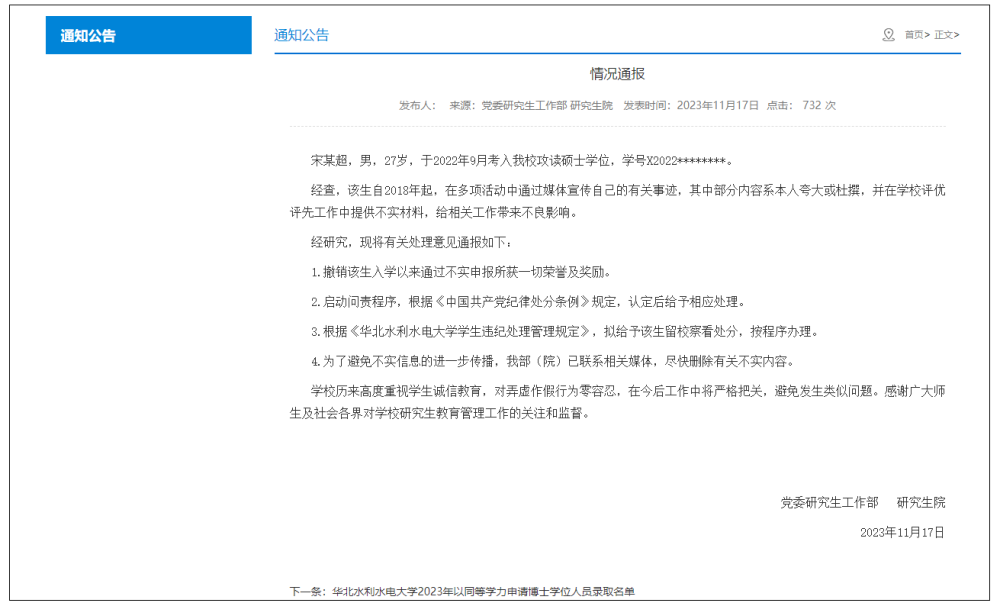
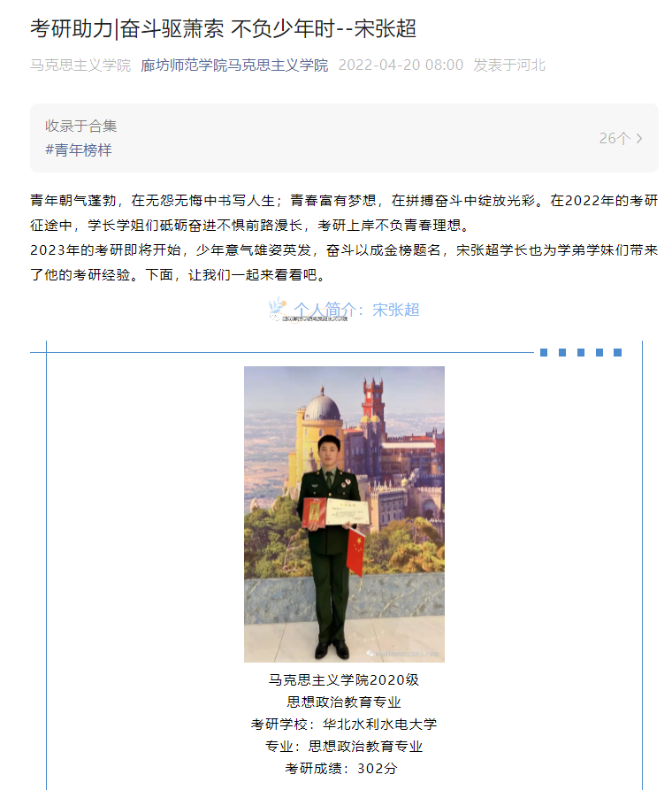
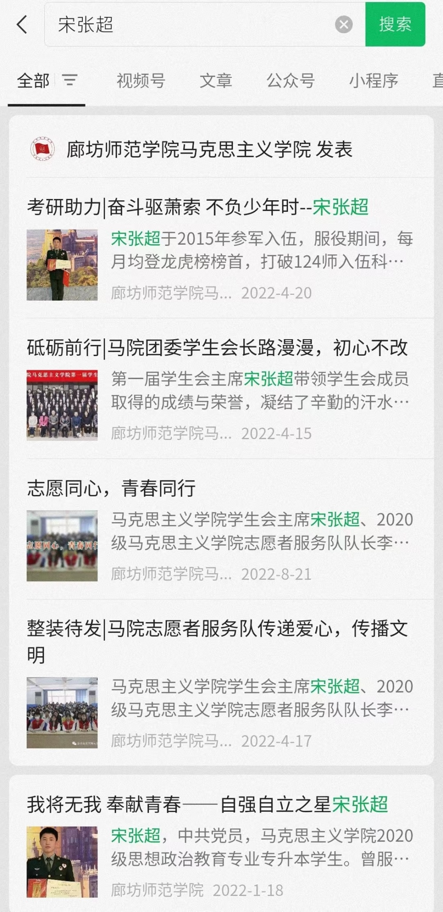
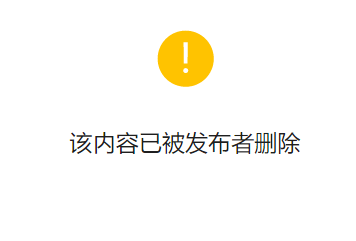

# 27岁研究生夸大杜撰宣传自己事迹，华北水利水电大学：该生留校察看

华北水利水电大学党委研究生工作部网站11月17日发布情况通报：

宋某超，男，27岁，于2022年9月考入我校攻读硕士学位，学号X2022********。

经查，该生自2018年起，在多项活动中通过媒体宣传自己的有关事迹，其中部分内容系本人夸大或杜撰，并在学校评优评先工作中提供不实材料，给相关工作带来不良影响。

经研究，现将有关处理意见通报如下：

1.撤销该生入学以来通过不实申报所获一切荣誉及奖励。

2.启动问责程序，根据《中国共产党纪律处分条例》规定，认定后给予相应处理。

3.根据《华北水利水电大学学生违纪处理管理规定》，拟给予该生留校察看处分，按程序办理。

4.为了避免不实信息的进一步传播，我部（院）已联系相关媒体，尽快删除有关不实内容。

学校历来高度重视学生诚信教育，对弄虚作假行为零容忍，在今后工作中将严格把关，避免发生类似问题。感谢广大师生及社会各界对学校研究生教育管理工作的关注和监督。

微信公众号“廊坊师范学院”、“
廊坊师范学院马克思主义学院”曾发布多篇有关该校马克思主义学院2020级思想政治教育专业专升本学生宋张超的文章。据相关文章介绍，宋张超曾“服役于广州军区某侦察大队，退役复学后担任保定市征兵形象大使、马克思主义学院学生会主席”，曾参与“广州台风救援、河南抗洪”等活动。“在2022年硕士研究生招生考试中，宋张超取得了专业内初试第三、复试第二的优异成绩，现已成功考入华北水利水电大学马克思主义学院思想政治教育专业。”

_微信公众号“廊坊师范学院马克思主义学院”发布的有关宋张超的文章_

微信公众号“华北水利水电大学”也曾发布一篇题为《曾参与台风灾情救援，相关事迹被央视报道！他是宋张超！》的文章，目前，这篇文章链接已失效，但仍见于该公众号其他文章的推荐阅读序列中。

