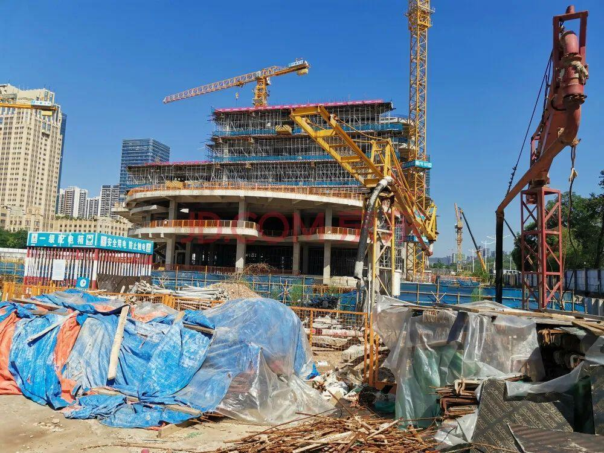

# “中国第一高楼”苦等新主人

被规划为“中国第一高楼”的世茂深港国际中心项目，还是没能等到新主人。

11月16日，深圳市龙岗区龙城街道“12宗地土地使用权及地上物”在京东拍卖上流拍。这是世茂股份旗下公司深圳市世茂新里程实业有限公司名下资产，也是世茂深港国际中心的大部分资产。世茂深港国际中心曾规划建设超668米的“中国第一高楼”。2022年世茂债务危机爆发后，世茂深港国际中心停工至今。

这并非世茂深港国际中心项目首次拍卖。上一次，是2023年7月5日，12宗土地以130.44亿元的起拍价，6.52亿元的保证金开始拍卖。两次拍卖时的打折力度不可谓不高。与163.05亿元的评估价相比，第一次130.44亿元的起拍价，相当于打了八折。第二次起拍价格为104.35亿元，已较首次拍卖降了26亿元。

然而，第一次拍卖虽然有3万人围观，727人关注提醒，但截至拍卖结束，最终无一人报名。第二次，截至11月16日上午10点拍卖结束，虽然吸引近万人围观，且降价力度更大，但明显热度不如从前。最终，也无人出手。至此，“中国第一高楼”的命运，没能如愿等到逆转。

01、为啥又没找到买家？

世茂深港国际中心是一个价值超百亿的大型综合项目。

在当下的时间节点，很多房企自顾不暇中，几乎没有人能够买得起如此大额的地产项目。即便有人有资金实力，他们也都在观望中。“除非那个资产的价格，低到不能再低，才会考虑出手。”一名从事不良资产收购的资深人士告诉「市界」。

实际上，由于受制于城市规划等要求，2017年这块地在竞拍环节时，对竞拍人的要求很高。比如要求竞买人2016年经第三方审计的总资产不低于2000亿元；要求竞买人在内地和香港各有不少于（含）1家上市公司，以及在中国境内开发建设并已竣工不少于1栋250米以上超高层建筑等。

尽管今年的这两次拍卖，没有像当初土地竞拍那样的规则，但在前述不良资产收购资产人士看来，这么大的项目，地标性的建筑，任何公司来做，都需要一定的实力，不然干不下去。投资一座高层建筑，还需要进行全面的风险评估。“比如项目的长周期开发所需资金、项目背后的债权关系，以及入市后的去化招商等。”

深圳市世茂新里程实业，这个12宗地块的主人，背后涉及多项债务。天眼查APP显示，目前世茂新里程作为被执行人的案件有11宗，被执行总金额约91亿元，申请执行人中出现多家房产代理机构的身影。其中，中信信托申请执行的标的数额最大，约60.69亿元。根据评估文件，12宗地有10宗设立了抵押权利，抵押权人正是中信信托。这些风险点，都会影响项目的走向，使得企业不敢轻易接盘。

接盘这个项目，还要考虑深圳写字楼的现状。12宗土地按照之前规划，包含集中商业及T3办公楼用地及地上物、4宗写字楼用地（2栋250米、1栋338米、1栋500米）、4宗公配用地（包含营销中心），以及幼儿园、国际学校、绿地操场用地。

由此可见，涉及办公楼、写字楼的体量不可谓不大。从目前深圳写字楼的现状来看，“已经出现了供求失衡的状况，很多甲级写字楼空置率达到了30%，前海等地区甚至达到了40%。”协众策略管理集团联合创始人黄立冲告诉「市界」。

黄立冲继续解释道，写字楼的规划不像住宅长期存在，再加上现在的办公模式发生改变，对写字楼的需求量没有之前那么大，“作为开发商，不是说敢不敢接的问题，而是就算接了以后，这个楼的建设非常昂贵，即便最开始赚钱了，很可能半路因为各种高维护成本，以及出租率不确定等被拖累。”那么，第二次流拍之后，这12宗地块何去何从？

 _▲（来源/京东法拍网）_

一般来说，第一次拍卖过后，相隔半个月到一个月，再进行第二次拍卖。如果第二次流拍以后，大概会在半个月到一个月之后进行“变卖”。“变卖跟拍卖的区别在于，拍卖是先交一部分保证金，然后再缴纳剩余尾款。变卖则是需要报名付全款。”法拍平台相关人员告诉「市界」，报完名付完全款后，它就自动进入24小时倒计时环节了。变卖周期有20天时间。

对于“该标的会不会第三次流拍”的问题，法拍房相关人士向「市界」坦言，这样的大标不确定。这也就意味着，世茂深港国际中心项目的命运走向，仍然不乐观。

12宗土地走上法拍这一步，并不是世茂自愿的，至少在走上法拍这条路前，世茂仍在为“第一高楼”寻找买方。比如2022年2月16日，时任世茂集团执行董事的吕翼，曾代表世茂与投资人召开视频会议，商议兑付问题。也是在此次会上，世茂方面透露，“信托计划涉及的项目深圳龙岗深港国际中心，拟引入国资战投，正与深业、深投控、中建投和AMC等洽谈。”

然而，由于种种原因，深港国际中心始终未能找到接盘方，直到法院的强制执行程序下达。与中信信托的纠纷，是12宗土地走上拍卖的主要原因。2022年，中信信托以世茂深港国际中心项目为底层资产，发行信托产品募集资金87亿元，用于支持世茂深港国际中心二期公寓和一期商办开发建设。2022年2月，中信信托宣布，上述信托计划中的57亿元资金遇到兑付困难，世茂深港国际中心随之停工。

同一年，北京市第三中级人民法院，对世茂深港国际中心项目的12宗土地查封。直到2022年7月，12宗土地首次走上法拍平台。

02、第一高楼的前世今生

深港国际中心所在地块是世茂在2017年以240亿元的价格拿下的。按照设想，它计划投资500亿元，在地块上将建一栋668米的最高塔，成为深圳乃至中国第一高楼。

对于“第一高楼”的工程进度，世茂有一个时间表：这栋高楼在首期开工项目内，三年内完成进度的50%，整个项目也于五年内完工。在拿下地块三个多月后，世茂便开始动工了。世茂对于要打造的“第一高楼”寄予厚望。世茂集团董事局副主席许世坛多次说，“这个项目做好之后，预计可供货值超过700亿元，一年收租就可以达到30亿元以上”。

彼时，深港国际中心也的确成为世茂手中的“王牌”项目。它不仅是深圳最大的投资项目，更是一个集办公、商业、旅游、文化、科普展示、公寓于一体的大型城市高端国际化综合体。深港国际中心的价值不可谓不高。通过公开资料显示，世茂在深港国际中心上，净投入已经达到151.43亿元，总货值629.04亿元。

2019年，世茂深港国际中心的公寓产品一经对外推售，便赢得了市场追捧。有媒体如此形容当时的盛况：超级富豪疯狂扫货，“有深圳湾业主一口气买了六套”“有海外的粉丝委托国内朋友代订”……彼时，深港国际中心所在片区楼盘上的宣传语，都有“距世茂深港国际中心xx米远”这样的标语。几乎所有人都坚信，正如罗湖的地王大厦、福田的平安金融中心和南山的春笋大厦，深港国际中心是这个片区价值跃升的点火器。

然而，四年后的今天，在世茂的流动性危机中，“第一高楼”的施工进展不及预期。以法拍的12宗地为例，「市界」从评估报告中看到，12宗地块中动工的有6宗地块，有4宗还处于土方施工阶段，尚未进行整体建筑施工。而从整个深港国际中心来看，公开资料显示，这个综合体项目，已售货值84.25亿元，剩余货值达544.79亿元。

_▲（来源/京东法拍网）_

深港国际中心也已是官司缠身。北京市高级人民法院今年5月的一份裁定书显示，深港国际中心项目已被列为重点风险项目，前后已有接近261户小业主向相关部门投诉，已有22家供应商及施工单位起诉查封及轮候查封深港国际中心项目资产。时至今日，「市界」从法拍平台上传的图片看到，深港国际中心还未建成的项目，其工地上空无一人，杂草丛生，现场一片凌乱。

如今，对于深港国际中心项目，世茂已是无暇顾及。因为，世茂仍然在自救当中。自2021年12月起，世茂就对多个项目明码标价进行出售，包括香港维港汇项目股权、上海外滩茂悦大酒店、广州亚运城项目股权、上海世茂佘山洲际酒店、北京分钟寺地块等等，都被摆上了货架。今年4月，许荣茂也将自己名下在伦敦金融城的大楼出售。

据华尔街见闻不完全统计，过去19个月里，世茂系旗下资产以及许氏父子名下资产，超170亿元资产被出售，用以偿债。在深港国际中心项目二次法拍的一个星期前，世茂股份更连发多份公告卖资产。比如世茂股份将持有的三家公司，100%股权转让给关联方世茂集团全资子公司——上海樾泓奕、上海梵粤。三家标的公司转让对价合计约6.29亿元，上海樾泓奕、上海梵粤均以承接世茂股份对标的公司的对应债务形式进行收购。

另一方面，公开资料显示，世茂股份也在卖楼为世茂集团子公司“还债”，交易对价高达15.89亿元，其中包括厦门、南京、徐州等地的房产。对于上述交易，世茂股份表示，资产转让是公司基于下属子公司实际债务情况以及未来发展所做出的审慎判断，为进一步降低公司流动性偿债压力，尽力度过债务危机，所需采取的必要举措。

从股权结构看，世茂股份的控股股东，为峰盈国际有限公司，持股比例43.73%，间接股东为港股上市公司世茂集团，公司实际控制人为许荣茂。实控人许荣茂也传出正在卖资产。

2023年11月15日，据香港《信报》报道，市场消息透露，香港中环中心目前有4个全层单位较积极放售，其中3层更于过去一个月内减价求售，当中由世茂集团董事局主席许荣茂持有、位于低层的两个全层单位，一并减价6.7%至每平方英尺2.8万港元，合共减价约1亿港元，两层最新叫价共逾14亿港元。

用时间换空间，世茂也只能如此了。

**（作者 | 陶 婷，编辑 | 孙春芳）**

