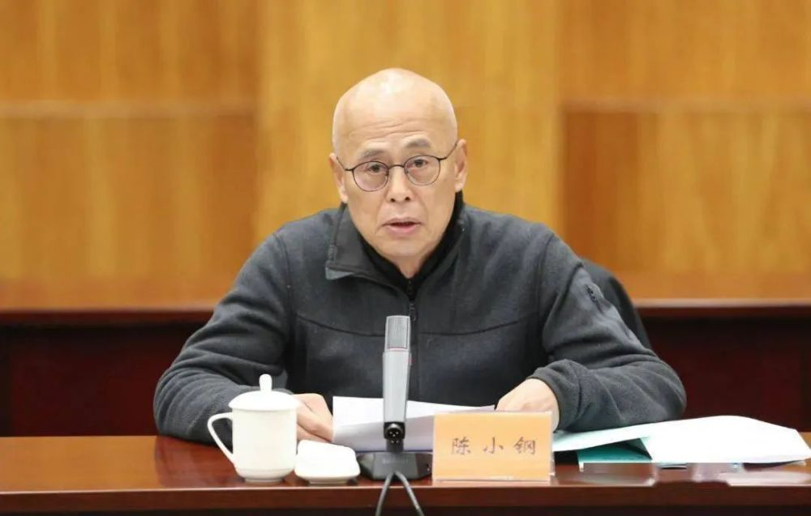
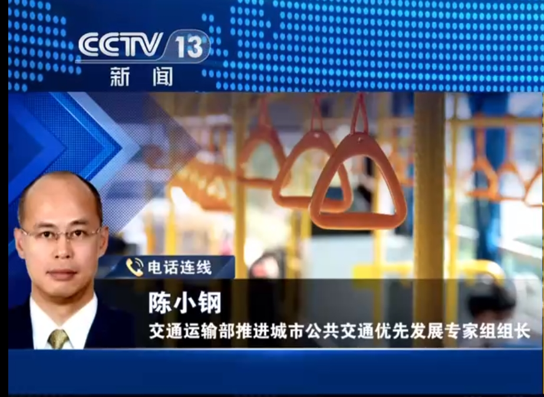
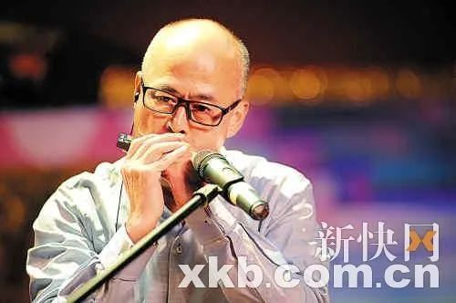

# “摇滚书记”陈小钢被查

据广州市纪委监委网站11月18日消息，市交通运输局原党组书记陈小钢涉嫌严重违纪违法，目前正接受审查调查。

_陈小钢 资料图_

陈小钢出生于1959年1月，四川中江人，早年在广东省委办、广州市委办工作，1999年3月出任广州市天河区区长，2003年1月改任黄埔区区长，2006年9月担任黄埔区委书记。

2014年5月，陈小钢调任市交通委党组书记、主任，后专任市交通运输局党组书记，2019年5月退休。

长安街知事（微信ID：Capitalnews）注意到，退下来后，陈小钢多次以中国公路学会城市交通分会副理事长、交通运输部验收组组长等身份出席活动。

今年10月，他还以交通运输部推进城市公共交通优先发展专家组组长的身份接受了媒体采访。

据当地媒体报道，陈小钢还有“摇滚书记”、“才艺书记”的称呼。2011年在黄埔区“春晚”上，他一袭黑衣自弹自唱《传奇》，受到关注。其实，自2008年起，他在该舞台上演过小品，唱过歌曲，演过情景音乐剧。

_陈小钢。图源：新快网_

