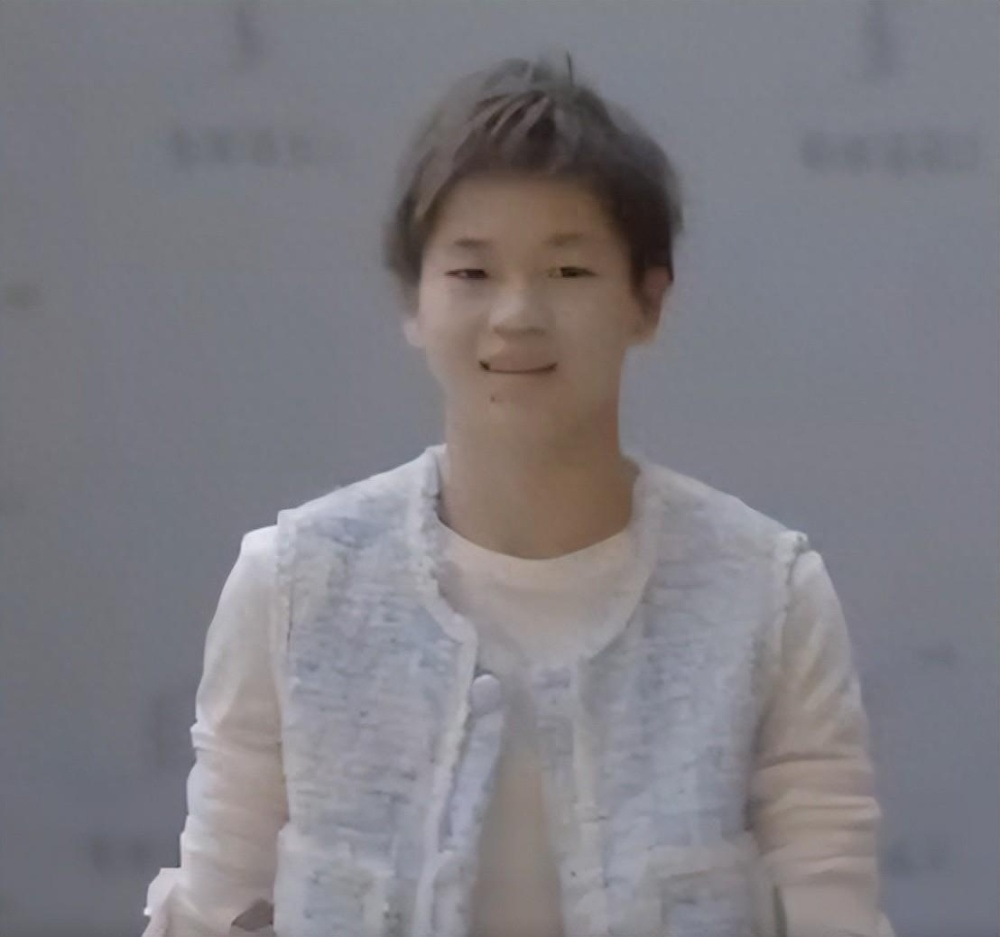
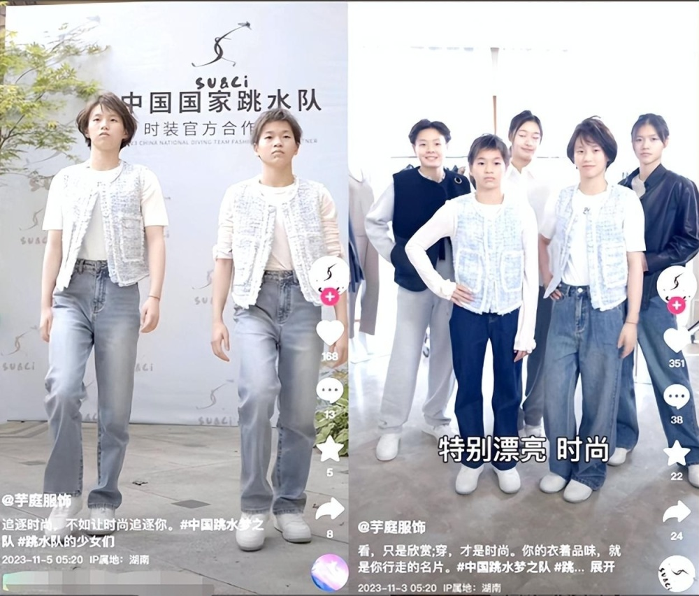
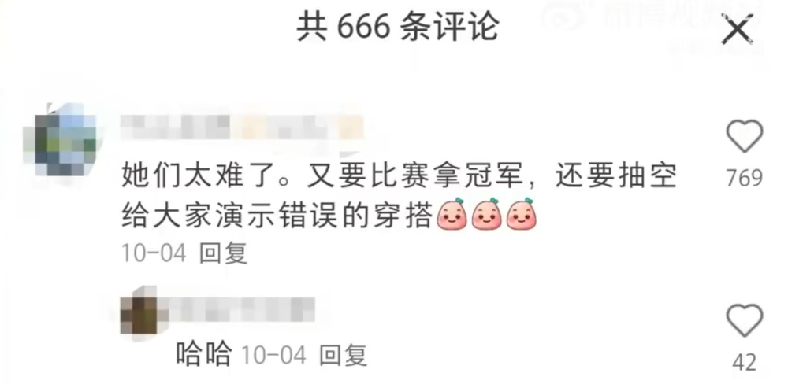
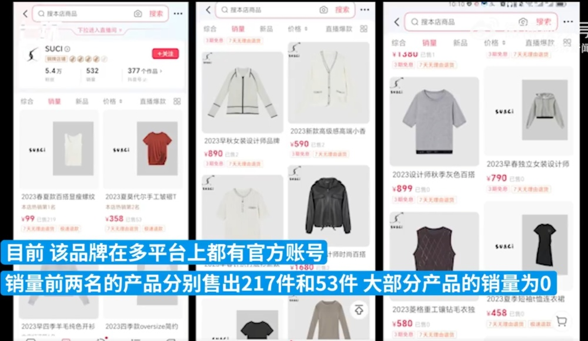
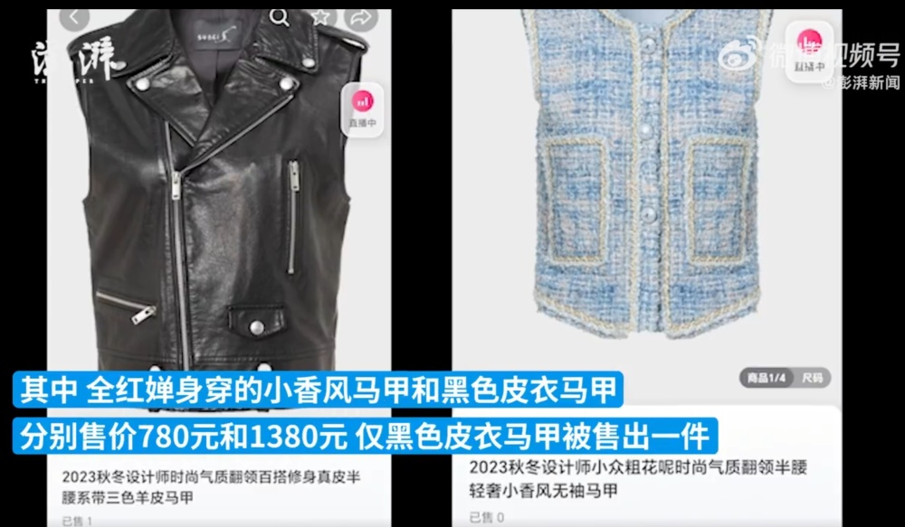

# 全红婵代言的女装品牌被吐槽丑，客服回应：每个人眼光不一样，后续还会有更多“全妹同款”

11月17日，“国货女装请全红婵代言被群嘲”的话题突然冲上了热搜。但不少网友表示这些衣服太丑、太土，并不适合队员。

对此，芋庭服饰店铺客服称，“每个人眼光不一样”，并表示后续品牌还会有更多的“全妹同款”。针对网友更换造型师建议，客服称“做不了主”。

官方账号发布的视频中，品牌创始人颖琪介绍称该品牌于2023年3月3日正式亮相。“我们的第一步就是选择和跳水队合作”。

她称国家队代言审批很严格，自己是运营了几十年的老公司，开的新的分公司，最后才签下这份合同。

目前，该品牌在多平台上都有官方账号，销量前两名的产品分别售出217件和53件，大部分产品的销量为0。

其中，全红婵身穿的小香风马甲和黑色皮衣马甲，分别售价780元和1380元，仅黑色皮衣马甲被售出一件。

天眼查App显示，芋庭服饰成立于2022年10月，注册资本200万元，注册地在上海市，法定代表人为孙志超，持股比例30%，另外两名股东为胡凯钢和陈永吉，分别持股50%和20%。

**【来源：九派新闻综合澎湃新闻、天眼查等】**

