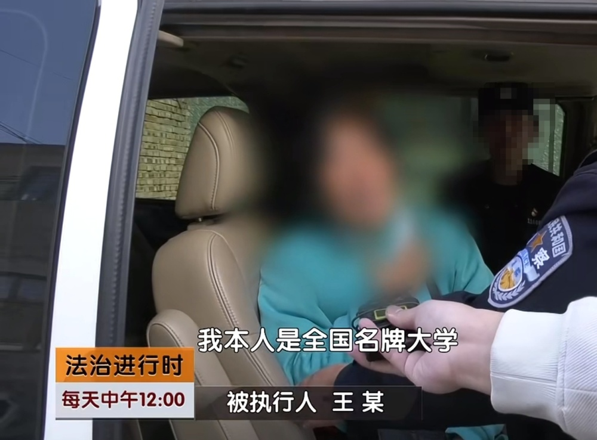
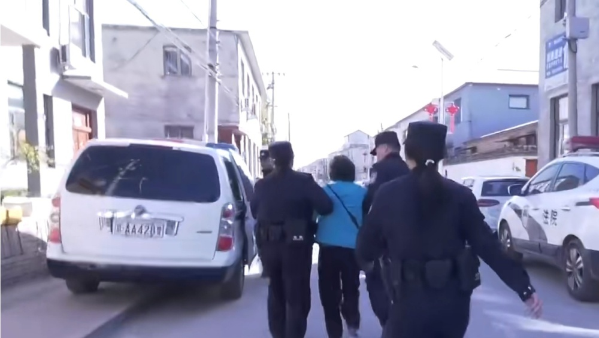

# 北京男子8万卖宅基地给高校教师，11年后反悔欲买回遭拒，法院翻墙破门强制执行

“我是名牌大学，排名前十的，退休副教授。”王桦(化名)对镜头介绍着自己的身份。

“知识方面应该没问题，咱们应尊重法律守法。”镜头背后的记者答道。

日前，上述对话发生在一档法治报道节目中，内容为《大学教师非法购买农村宅基地，法官破门强制执行》。

事情要从2007年年说起，李越（化名）在北京市房山区田各庄村有一处祖宅，其当年以8万元将祖宅卖给了大学老师王桦。2018年，李越打算把祖宅买回来，对方不同意，李便向法院提起诉讼。

九派新闻获取到该案相关裁判文书。2019年，法院审理并判决，双方签订的《房屋买卖协议书》无效。

法院认为，王桦并非该案涉及房屋所在村的集体经济组织成员，不应享有该村宅基地的使用权。其作为城市居民，不得购买农村宅基地上房屋。

5年间，其不认可判决，多次提起上诉，各级法院先后做出17份判决，但其全都不认可，不履行判决。最终，法官破门强制执行，对房屋进行腾退。

时隔16年，位于北京市房山区的祖宅又回到李越手中。九派新闻联系到李越，但被拒绝接受采访。

_被执行时，被执行人辩解。电视台报道截图/法治进行时_

**【1】8万元售卖北京农村宅基地，11年后欲买回**

据《法治进行时》，李越接受采访时称，卖房是因当年父亲患癌，经济困难。“她来田各庄村买房，一说，一拍即合。”

王桦回忆道，当时李越问她，“街面上的平房要不要？”她说去看下。结果，一看就看中了。

“这四间房按6万，边上的小房是两万块钱。一共8万元。”李越站在院子中间，指着周围的平房介绍。

**判决书显示，2007年8月8日，李越与王桦签订了《房屋买卖协议书》，北京市房山区人民政府城关街道办事处某村村民委员会加盖了印章，该村委会收取了王桦3000元。**

该协议书约定，王桦购买李越的上述宅院内房屋4间，支付价款6万元，当日支付房价款和其他款项共计8万元，后即开始在上述宅院内居住。

**协议签订11年后。李越称，母亲对老房有情结，住楼房别扭，“就把房子弄回来得了。”他谈到，当时条件稍微好点，便跟王桦协商，但她一直不同意。**

另一边，王桦接到电话，听他说想把房子买回去。“我在这安居乐业这么多年了，住的挺好，为什么要别人打扰我呢？”她说。

**双方协商不成，李越便向法院提起诉讼。其诉求为确认双方签订的《房屋买卖协议书》无效。**

王桦不同意对方的诉讼请求。其辩称，“我购买房屋并居住已经12年，对方的起诉已经超过诉讼时效。李同样是居民，法律并不禁止居民将房屋出售给居民，而且房屋买卖经过当地村民委员会认可，并交纳了3000元房屋管理费。”

其还称，“国务院的相关文件规定，农民的住宅不得向城市居民出售，我的住宅不是农民出售给我的，我是根据物权法规定购买的房屋。”

**【2】法院判决合同无效，赔偿等问题可另行解决**

2019年，法院审理后判决，李越和王桦签订的农村房屋买卖合同无效。

法院认为，违反法律、行政法规的强制性规定的合同应属无效。

**判决提到，农村房屋的买卖必然涉及对该房屋所在宅基地使用权的处分，而宅基地使用权是集体经济组织成员享有的权利，与特定身份关系相联系。李越、王桦之间的房屋买卖协议必然涉及宅基地的买卖，王桦并非本案涉及房屋所在村的集体经济组织成员，不应享有该村宅基地的使用权。**

王桦作为城市居民不得购买农村宅基地上房屋，没有购买资质，其答辩意见没有法律依据，法院不予采信。

依据《中华人民共和国合同法》第五十二条之规定，法院判决确认李越与王桦于2007年8月8日签订的《房屋买卖协议书》无效。

北京市房山区法院执行局崔法官接受采访时表示，第一份判决书判的是房屋买卖合同无效。第二份判决书判的是返还并腾退宅基地及房屋。

对此判决，王桦不服且申请再审。

九派新闻在裁判文书网上查询到的另一份民事裁定书显示，王桦称自己购买房屋后，对房屋进行了装修，增建了房屋，而该判决书无视损失赔偿。

**法院认为，结合王桦的居住情况，酌情对房屋的腾退时间予以确定，其间其自行做好证据保存。王桦的损失赔偿等问题可另行解决。**

2020年10月16日，法院驳回了她的再审申请。

《法治进行时》报道，王桦不认可判决，多次提起上诉，各级法院先后做出了17份判决，但她全都不认可，更不履行判决，导致这起案件久拖不决。

最终，法警翻墙进院，从里面打开了院墙大门，将王桦带出院子，对房屋进行强制腾退。

节目中，北京市房山区法院执行局李副局长表示，
**“今天这个案子已依法强制执行完毕，已经将房屋腾退交给申请执行人。我们执行局也会不断地加大执行力度，来充分地保障申请执行人的合法权益。”**

图源@法治进行时。

**【3】农村宅基合同纠纷多因出卖方不诚信**

九派新闻检索发现，1987年实施的《中华人民共和国土地管理法》明确，非本村村民也可以申请宅基地。

但是，1998年修订的《中华人民共和国土地管理法》删除了关于城镇非农业户口居民使用集体土地建住宅的条款，规定“宅基地和自留地、自留山，属于农民集体所有”。

1999年5月，国务院办公厅发布的《关于加强土地转让管理严禁炒卖土地的通知》第二条规定，农民的住宅不得向城市居民出售，也不得批准城市居民占用农民集体土地建住宅。这是国家首次以红头文件的形式明确禁止城镇居民购买宅基地上房屋。

国家法官学院教授胡云红在一篇对“农村土地产权纠纷案例”的研究论文中分析了2006年至2021年间，中国宅基地上房屋买卖合同的7万余份裁判文书。

其研究提到，宅基地上房屋买卖合同纠纷案件呈现几大特点：订立合同时间与诉讼时间跨距大。从合同订立到起诉的时间跨度少则10年以上，多则25年以上；大多涉及征收拆迁利益。系争房屋所在地一般都处于城镇开发阶段，涉及或将涉及房屋拆迁和征收补偿问题；

矛盾纠纷多为出卖方不诚信行为引发。调研发现，90%以上主张宅基地上房屋买卖合同无效的诉讼原告为出卖方；并且，案件增速与城镇开发速度成正比。

对于合同无效后果的处理，各地裁判也不尽相同。研究提到，有的法院虽然认定合同无效，但并未对返还等作出认定，采取回避态度，导致执行阶段出现困难。有的法院则对返还和拆迁补偿等费用的分配作出判决。

**对于返还问题，实践中，有的地区考虑出卖人因土地增值所获利益以及房屋价值变动,由买受人返还房屋，出卖人向买受人赔偿房屋重置成新价价（地上物价值）,作为对价返还，具体数额可委托评估机构评估。**

宅基地上房屋买卖合同被确认无效的，一般情况下应当认定买卖双方均有过错。至于过错之大小及如何赔偿损失，特别是涉及拆迁利益的分配上，实践中存在较大差异。

**根据2019年最高人民法院发布的《全国法院民商事审判工作会议纪要》，“在确定合同不成立、无效或者被撤销后财产返还或者折价补偿范围时，要根据诚实信用原则的要求，在当事人之间合理分配，不能使不诚信的当事人因合同不成立、无效或者被撤销而获益”。**

**九派新闻记者 徐鸣**

**编辑 曾金秋**

【来源：九派新闻】

版权归原作者所有，向原创致敬

