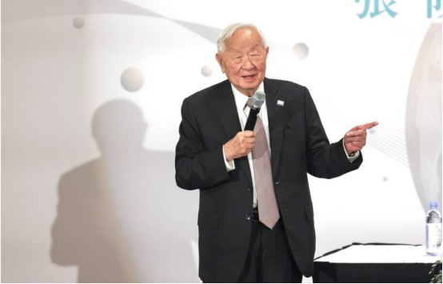

# 台积电创办人在美国回应“美国半导体独立”：“至少短期内不可能”

【环球网报道 记者
徐嘉莅】据台湾“中央社”18日报道，台积电创办人张忠谋参加国际记者会时有媒体提问，美国共和党2024年总统竞选人维韦克·拉马斯瓦米日前称“保卫台海”的稳定期限等到美国半导体独立就会结束。报道说，张忠谋回应说，只看表面就知道不是这样子，“美国要重新建立像台积电Capacity（规模）简直是不可能的事情，至少在短期内不可能”。

_当地时间17日，台积电创办人张忠谋参加国际记者会回答媒体提问 图自台湾“中央社”_

报道称，谈及美国芯片法案，张忠谋说，吸引台积电赴美设厂投资金额为520亿美元，当中390亿美元为美国政府补贴，但这是多年补贴的合计总额。而台积电每年平均投资300亿美元，甚至更多，“这是否能解读为美国吸引投资金额相对小”。张忠谋称，无论是美国芯片法案或其他法案，“我觉得都是蛮浪费的”。

台湾“中央社”日前报道称，美国2022年8月批准527亿美元《芯片与科学法案》，其中包括针对半导体制造业的390亿美元补贴计划。报道提到，但迄今尚未发出任何补贴。

值得一提的是，据台湾中时新闻网报道，台积电创办人张忠谋在2022年8月3日的午宴上曾告诉2022年时任美国众议院议长的佩洛西和其他美国议员，如果美国认为靠花大钱就可以进入世界上最复杂的芯片制造市场，那就太天真了。报道称，在当时的午宴上，主要讨论的话题是围绕美国半导体制造补贴计划。张忠谋称很高兴台积电可以从补贴中受益，但问题在于，美国真认为这样就可以独立拿下芯片制造业？

报道称，张忠谋当时还告诉佩洛西，从拜登政府大开支票到成立自给自足的芯片产业，还有好长一段距离。他提到，如果美国认为可以靠花钱进入世界上最复杂的芯片制造市场，那就太天真了。他称，半导体芯片制造极其复杂，需要大量的劳动力，并讲究组装质量。

