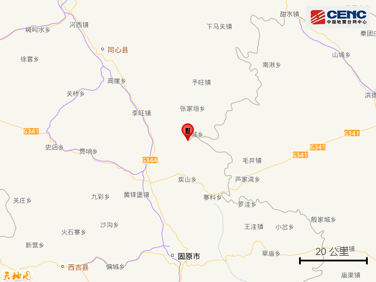
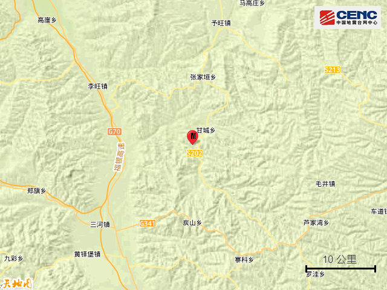
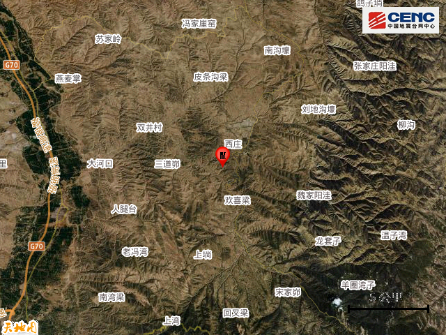
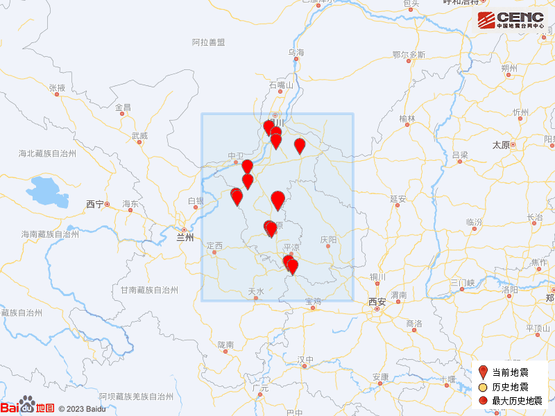

# 宁夏中卫市海原县发生3.3级地震，震源深度15公里

据中国地震台网正式测定，11月18日17时48分在宁夏中卫市海原县发生3.3级地震，震源深度15公里，震中位于北纬36.55度，东经106.31度。

震中5公里范围内平均海拔约1598米。

根据中国地震台网速报目录，震中周边200公里内近5年来发生3级以上地震共13次，最大地震是2021年11月18日在宁夏银川市灵武市发生的4.0级地震（距离本次震中161公里），历史地震分布如图。

