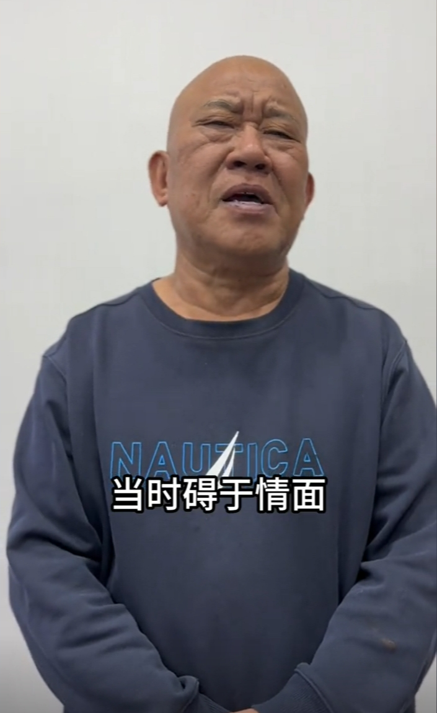

# 曾录视频给缅北白应苍庆生，杜旭东道歉：碍于朋友情面，未做查证

近日，一条“多位明星给缅北四大家族白所成之子白应苍录视频祝寿”的消息引发网络热议。网传视频疑似拍摄于一场生日宴会，舞台中央的大屏幕上播放着一段视频，这视频中有不少明星网红的身影。14日有艺人经纪人回应解释，很多人都会找明星艺人录这种视频，有专门在市场上卖这种视频的人。有媒体曾对这个行业进行调查，发现已经形成一条龙的产业链。

17日晚，演员杜旭东在其个人社交媒体上发布视频，就其以前给缅北电诈集团的白家成员录制庆生视频一事道歉，他在视频中表示，这事发生在很久之前，他在没有考证白家的背景情况下，受朋友之托，“碍于情面，便配合录制了这个视频”，现在已经深刻认识到了自己的错误，“今后我将以此为戒，约束自己的言行举止。”

编辑 蒋庆

