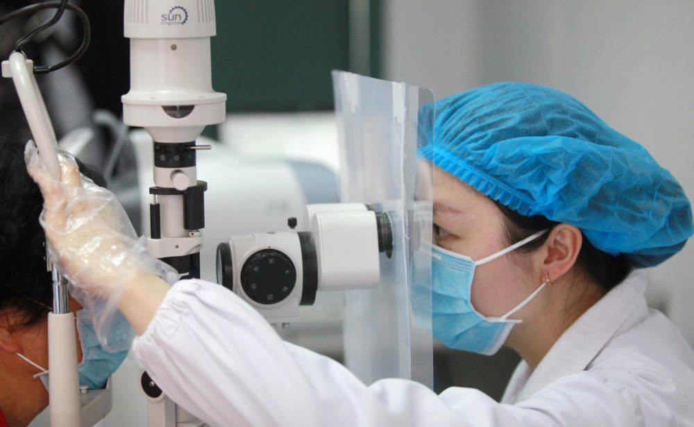
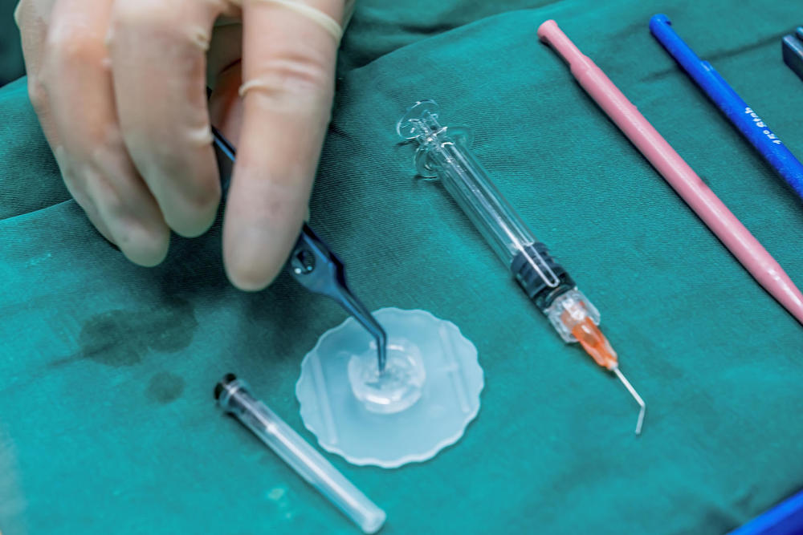

# 白内障找上年轻人？95后白内障患者：以为白内障是“老年病”，手术前几近失明

你是否也会认为，白内障是中老年人的“专属”疾病？那么现在，是时候改变这一“刻板印象”了。

根据《2021-2022年度全球眼健康调研报告》，60岁~89岁的老年人白内障发病率约为80%。但不可忽视的是，报告也同时指出，近年来白内障患病人群的年龄层次正逐步向年轻化发展。

根据近年流行病调查统计，一部分刚过40岁的中年人体检发现晶状体已出现早期浑浊。

 _▲资料图 图据IC photo_

近期，红星新闻记者对白内障患者群体展开采访并从中发现，不乏20岁出头的年轻人已经罹患了白内障。

在谈及对白内障的诊疗时，其中一名受访者指出，正因自己误以为白内障“老年病”，所以即便晶体查出“白点”，也仍未意识到自己可能患上白内障。而认知偏差一度让其几近失明……

**20多岁的年轻患者：“以为是老年病，耽误治疗几近失明”**

“就算发现眼睛里有小白点，也没人认为是白内障，大家都觉得那是老年人才会得的病。”现年25岁的宋女士（化姓），就是青年白内障患者群体中的一个。

她告诉红星新闻记者，过去自己一直是低度近视外加散光，看东西有些模糊不清，但从没想过会在20来岁就患上白内障：“即便是高考时已经检查出小白点，但检查人员也没有认为我眼睛里的白点是白内障。”

什么是白内障？四川大学华西医院眼科主任医师、博士研究生导师何为民在接受红星新闻采访时解释道：“
**眼睛好比一台照相机，瞳孔后方的晶状体类似于照相机的镜头，因为各种原因引起的晶状体浑浊，就是我们俗称的白内障。** ”何为民表示，
**有临床意义的白内障，往往会导致患者出现视物模糊、畏光等症状。**

_▲四川大学华西医院眼科主任医师、博士研究生导师何为民_

随着时间的推移，宋女士发现自己的视力越来越差，看东西也总是“雾蒙蒙”一片。“直到有一天，我突然发现自己什么都看不见了，去医院做了检查，才确诊了白内障。”

确诊后不到两周，宋女士就接受了白内障手术，植入了单焦人工晶体。尽管手术时长仅有十来分钟，但在她的记忆里，手术过程并不好受：“能够感受到手术时固定脸部的胶带撕拉感带来的疼痛，手术后也总觉得眼睛里有异物感。我问周围做白内障手术的老年人，他们却说没有这样的感觉。”

事后想来，宋女士认为自己应该在初次发现眼里有小白点时，就第一时间到医院检查并进行及时的手术治疗：“如果不是我刻板印象地认定白内障是老年病，也不至于发展到后面啥都看不见了才手术。”

_▲资料图 图据视觉中国_

宋女士告诉红星新闻记者，由于没能第一时间确定自己患上了白内障并进行手术治疗，因此在很长一段时间里，她都以矫正视力的办法维持，因此其间也长期在视力模糊中度过。

而由于后来手术植入的是单焦晶体，不具备调节功能，因此术后如果不戴眼镜，也仍看不见近距离的字。“像是从近视眼变成了‘老花眼’，即便戴着眼镜，像药盒上那样的小字我还是看不清。”

和宋女士类似，因认定年轻不会患白内障以致于耽误治疗的，还有现年29岁的林女士（化姓）。

在接受红星新闻记者采访时，她讲述起了自己确诊前的经历：“大概在确诊白内障一年多以前，我已经感觉到眼睛不对劲了，视力下降很快，看东西很模糊。”

林女士说，由于视力愈发不好，她在眼镜店验光时发现视力无法矫正上去。而即便是这样，她仍没有往患白内障的方向去想：“因为我之前就是高度近视，眼镜店验光师又说视力矫正不上去可能是因为散光，所以没人提醒我可能得了白内障。”

带着模糊的视力，林女士又坚持了一年。直到一年后的一次体检时，看到体检单上赫然写着“晶状体浑浊”，林女士才意识到自己的眼睛可能真的出了问题。前往医院检查后，她被确诊白内障。

**视力下降难以矫正：“至今也不知道自己为何会得白内障”**

“大概今年年初，我看东西就像眼前蒙着一层雾。半年后，我的视力下降到走在路上都看不清红绿灯。”26岁的尚女士（化姓）告诉红星新闻记者，因视力快速下降，今年5月，她走进当地一家眼科医院做详细检查，这才知道自己患上了白内障。

“一直觉得白内障是中老年疾病，完全没想到我20来岁也会得这个病。”尚女士觉得难以理解，而医生告诉她，她之所以患上白内障，大概率是药物所致。

据尚女士透露，由于此前她查出某种基础性疾病，所以过去3年里，她需要不间断服用含激素药物。而这些激素药物，也逐步成为她罹患白内障的“元凶”。

_▲26岁的尚女士确诊药物性白内障_

对于白内障的诱发机制，何为民在接受红星新闻记者采访时解释：“ **通常白内障可被分为8大类型，其中一个分型就是尚女士所罹患的‘药物性白内障’** 。”

何为民告诉记者，比如一名患者做了器官移植，术后长期服用糖皮质激素药物；或自身存在免疫性疾病如系统性红斑狼疮、风湿性关节炎等，这些疾病的治疗通常
**需要服用激素药物，长此以往就可能诱发白内障** 。

但并非每个人都能明确自己患上白内障的具体原因。

33岁的徐先生（化姓）同样出现过视力快速下滑、矫正无效的情况。“因为我本身有近视，在不知道患白内障的情况下，单纯以为自己的度数又增加了。”徐先生告诉记者，他在眼镜店验光时也发现了自己矫正视力效果不佳，无法配到符合当时眼睛度数的眼镜。

在验光师的建议下，徐先生来到医院做检查，最终被确诊为白内障。之后，他接受了手术治疗。他告诉红星新闻记者，由于自己晶状体浑浊的程度不高，因此术后恢复较好，目前视力已有所改善。

徐先生始终搞不明白，为何自己会在30多岁就患上白内障：“我基本没有发生过眼睛受伤或者服用激素药物的情况，所以医生基本排除了后天原因。”此外，徐先生表示自己并没有不健康的用眼习惯，“当然也有熬夜的时候，平时看手机、电脑较多，但医生否认了是这些原因导致的白内障。”

对此，何为民也回应红星新闻记者表示，导致白内障的后天性因素， **除了激素药物外，也有可能出现“外伤性白内障”“并发性白内障”等** 。

何为民解释道，所谓外伤性白内障，即指因各种外伤（如针刺伤，刀划伤等等）导致晶状体受损，从而引发白内障；而并发性白内障，则指眼睛局部发生病变，如高度近视的患者就容易发生白内障，还有部分高度近视群体发生视网膜脱离，在接受相关手术后，也可能诱发白内障。此外，
**先天性视网膜色素变性、葡萄膜炎、糖尿病引起的代谢性白内障，也可能让年轻人罹患白内障** 。

那么，熬夜、长时间看电脑等是否会诱发白内障？对此，何为民给出了否定的回答：“这些行为或许会导致近视，但不会引起晶状体浑浊，所以此类外部用眼习惯并不会直接导致白内障疾病的出现。”

排除后天性原因后，医生告诉徐先生，他患白内障很可能是由于先天性，只是成年后才发病。对此，何为民也同样解释道，
**在白内障疾病的类型上，的确有“先天性白内障”的分型，因遗传等问题所致** ，以致于一些婴幼儿出生时，就患有了白内障。

**手术后年轻人戴上了老花镜，眼科专家：可个体化选择人工晶体**

随着人口老龄化的加剧，白内障已成为我国最常见的致盲眼病之一。今年5月12日-14日，2023屈光性白内障手术国际论坛在长沙举行。

会上，根据中华医学会眼科学分会发布的数据，我国60岁以上人群白内障发病率约为80%；而老花眼一般在38岁左右出现，52岁以后老花眼的发病率接近100%。第七次全国人口普查数据显示，我国60岁及以上人口有2.6亿。据此估算，在我国有超过2亿的老年人正遭受老花眼和白内障的双重侵袭。

而对于青年白内障群体而言，在完成白内障手术后，他们也不得不在青年阶段就戴上老花镜。

尚女士告诉红星新闻记者，今年5月确诊白内障后，她在今年8月接受了手术治疗。“其实第一次手术时我心里挺害怕的。”据尚女士介绍，手术前3天她遵医嘱每天滴加替沙星眼药水。手术过程中，她还需要一直盯着一盏灯看，其间不断有麻药滴在眼周。

 _▲资料图：白内障手术_

据尚女士回忆，整台白内障手术大约需要15分钟：“医生要把我原来的晶体打碎，然后再植入新的人工晶体。”完成手术后，她的视力如今已恢复许多，基本没有不适感，“现在办公或者看电影、看手机都可以不戴眼镜，只有晚上开车时才戴眼镜。”

但林女士在手术后，尽管视力不再有“雾蒙蒙”的感觉，但看东西的能力却也无法像正常人一样。她告诉记者，手术时她选用了在眼睛里植入能看中等距离的晶体，因此如果是看不远处的物体就很清楚，可如果是看近距离的物体，视线往往会变得模糊，“比如我要剪指甲、看小字，做这些活动时我就得戴上一个老花镜。”

徐先生也有着跟林女士相似的感受。手术后，他的眼睛里植入了多焦晶体，但在做精细工作时，也同样得戴上一个老花镜。

“ **白内障的治疗通常都依靠手术完成，目前并没有任何药物、眼药水能治疗白内障。**
”何为民告诉记者，由于白内障患者的晶体出现了浑浊，所以手术就需要更换新的晶体。至于选择何种类型的人工晶体，则需要医生根据患者术前的检查结果和眼睛情况个体化选择。

**白内障是否真的逐步年轻化？专家：大多有特殊原因，不必过分担心**

红星新闻记者发现，在多个社交平台上，不少20岁-35岁左右的年轻人，都分享了自己治疗白内障的心得。而在华西医院眼科门诊室外，记者也观察到，前来治疗白内障的群体中，有一部分患者是年轻人。

红星新闻记者查阅发现，在2023屈光性白内障手术国际论坛上发布的《2021-2022年度全球眼健康调研报告》表明，白内障是目前世界首位致盲眼病，60~89岁的老年人白内障发病率约为80%。同时，上述报告也指出，近年来白内障患病人群的年龄层次逐渐呈现年轻化发展态势。根据近年流行病调查统计，一部分刚过40岁的中年人体检发现晶状体也出现了早期浑浊。

何为民也介绍道，行业中过去有“老年性白内障”的说法，但因为年龄越大罹患白内障的几率越高，因此目前医学上也将“老年性白内障”更名为“年龄相关性白内障”。

那么，这是否也从侧面说明，白内障疾病正呈现年轻化趋势？

“可以说80岁以上的人都有白内障，但 **目前并没有权威数据表明，越来越多的年轻人罹患白内障**
。”何为民表示，从她个人的接诊经验来看，从整体就诊情况而言，35岁以下前来治疗白内障的群体仍是少数。

据何为民介绍，目前医院接诊白内障的患者大多是60岁以上的老年人，而年轻人到医院接受白内障手术，大部分是上文中所介绍的原因。

此外，何为民还补充道，之所以会感觉年轻人比过去更容易罹患白内障，一方面是由于当前定期体检的覆盖面增加，加之年轻人对用眼健康的重视，因此不少年轻人在做眼睛常规检查时，就能及时发现白内障问题；另一方面，还有部分人群是因为在做其他项目检查时，偶然发现自己罹患了白内障。

“ **通常来看，年轻人到院治疗白内障，主要还是集中在高度近视群体、出现基础疾病需长期服用激素药物的人群、眼外伤及糖尿病患者。**
”何为民指出，年轻人罹患白内障的概率相比老年群体仍是少数，“年轻人需要注意自己的用眼健康，避免出现高度近视，但对罹患白内障则不必过分恐慌。”

红星新闻记者 杨雨奇 实习生 张珺洁

编辑 郭宇 责编 李彬彬

