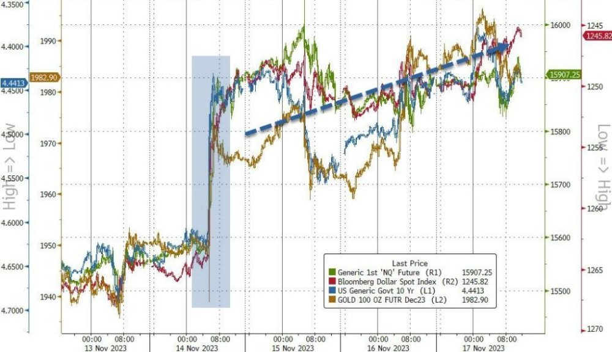
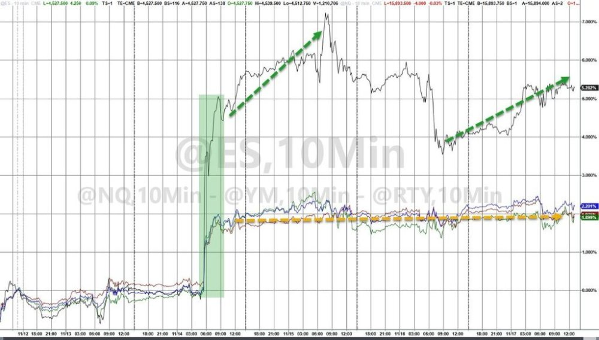
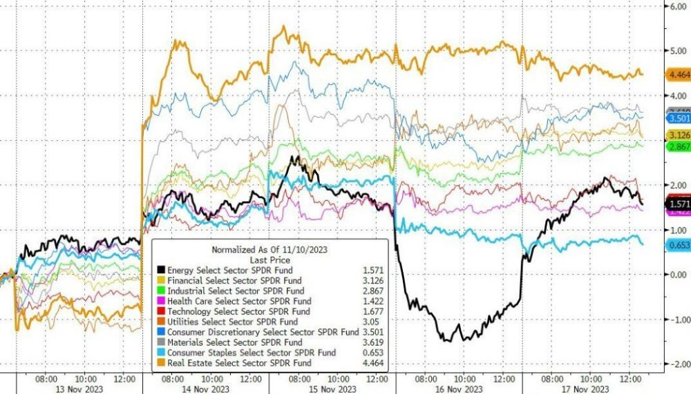
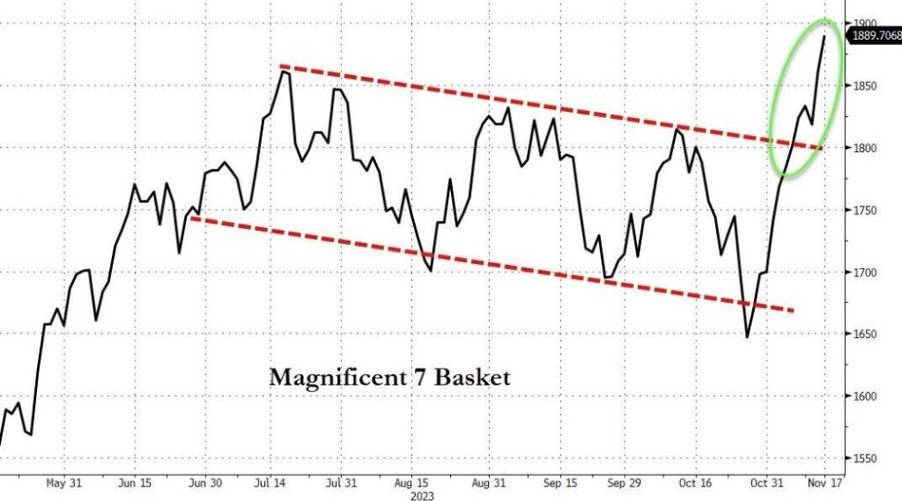
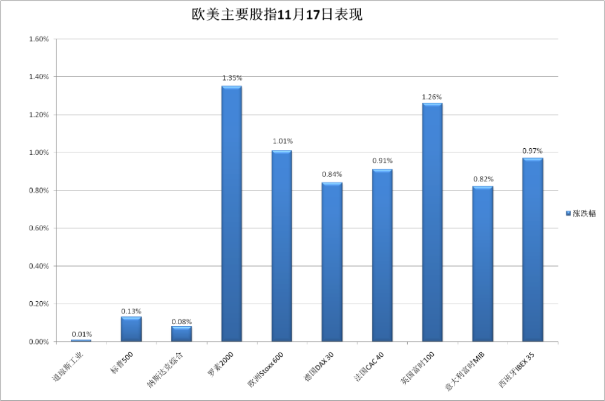
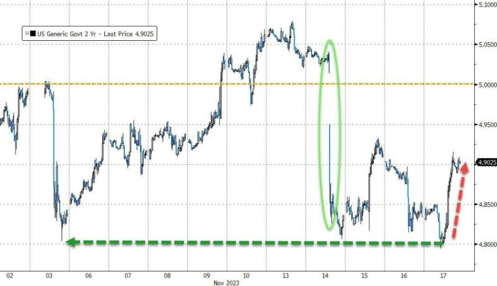
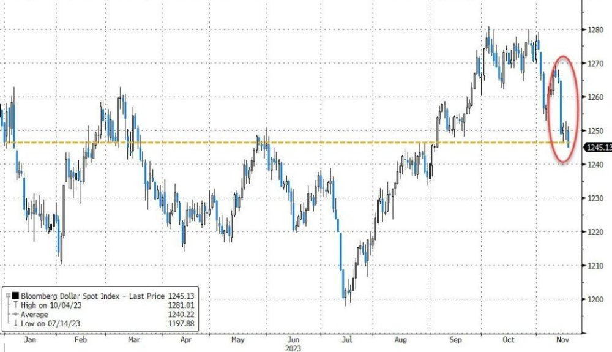
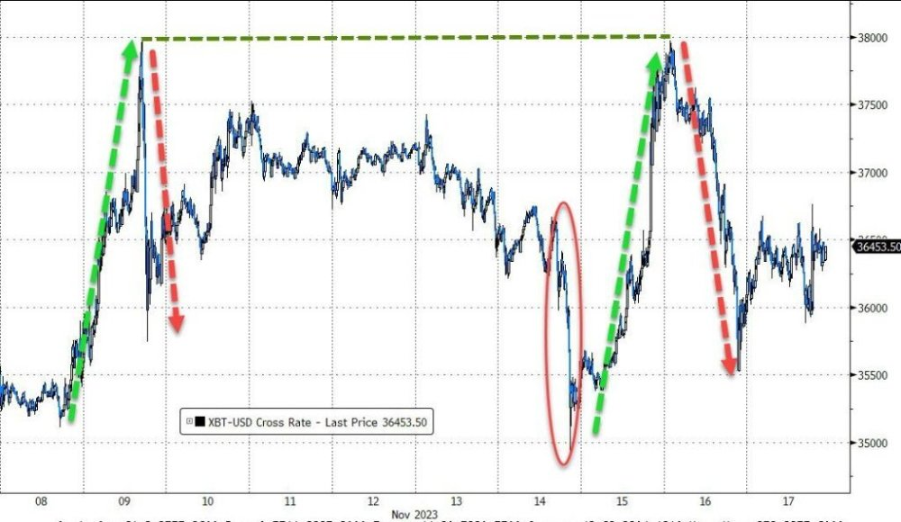
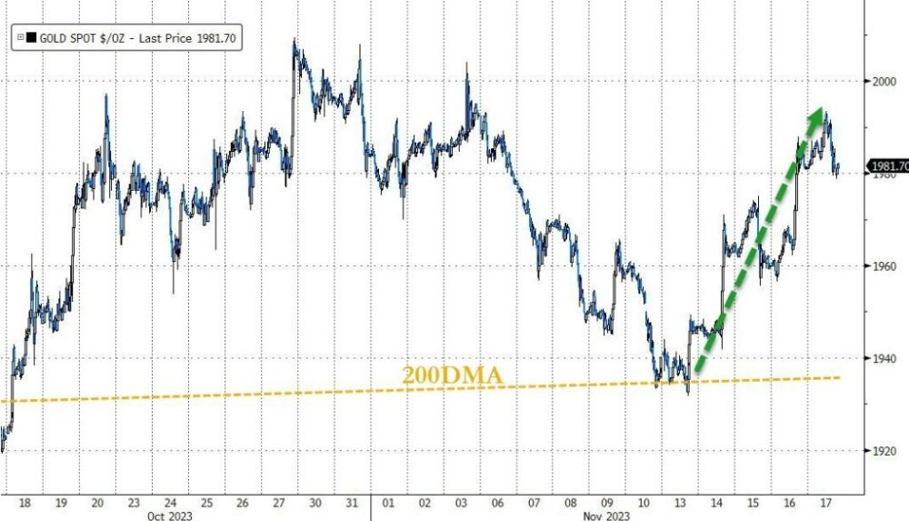

# 美股收盘：微软等科技股打压，美股指艰难反弹，原油大涨超4%

周五美国总统拜登料将签署权宜支出法案，正式避免本周末美国政府关门，市场对此反应平静。周五有合计2.4万亿美元的美股期权到期，可能夸大美股波动，但主要股指盘中波动较小，未受期权到期冲击，打压大盘的是部分科技股，周四最拖累大盘的能源股在原油大反弹之际挺身护盘。

周五应用材料大跌，拖累芯片股及纳指科技指数。据环球网，对于有消息称，因涉嫌逃避出口限制对华出口，应用材料正遭美国司法部刑事调查，中国外交部回应称，中方已多次就美国芯片出口管制表明立场；中方将密切关注有关动向，坚决维护自身权益。在重要人工智能（AI）领域合作方OpenAI宣布CEO
Sam Altman离职、董事会对他的领导能力不再有信心后，微软股价跌幅迅速扩大。

虽然本周后两日美股不复强劲涨势，但以超预期大幅放缓的CPI为首，一系列数据强化了市场对美联储已结束加息、可以避免衰退的乐观情绪，在对“美联储友好”型数据出炉的一周，美股大盘继续累涨。两家零售巨头沃尔玛和塔吉特因各自财报表现而影响全周股价，四季度盈利指引逊色的前者股价下跌，业绩强劲的后者股价飙涨。

欧美数据均传来通胀放缓的好消息。欧美国债价格全周齐反弹。周五公布的欧元区10月调和CPI终值同比增速较9月的4.3%大幅放缓至2.9%，确认了欧元区通胀放缓的势头。欧美国债收益率盘中齐降。基准十年期美债收益率曾下破4.40%，本周第三日创9月下旬以来新低，对利率敏感的两年期美债降至9月初以来低谷。

此后欧洲央行官员发表鹰派讲话。欧央行管委会委员Pierre
Wunsch称，不应忽视潜在的能源成本飙升风险，若发生油价冲击，可能需要进一步收紧货币。另一欧央行管委Robert
Holzmann称，降息为时过早，不会在明年二季度降息，重申央行必须准备好如有必要就加息。欧债价格冲高回落，德债收益率V型反转。美债的收益率盘中追随欧债转升，但全周收益率降势不改，主要源于周二CPI公布后收益率大跳水，投资者加码押注加息结束。

汇市方面，加息告终以及美联储明年重回宽松的预期打击了美元，期货市场定价显示，投资者预计，到明年12月，美联储的隔夜贷款利率会下降93个基点，美元指数周五进一步下挫，本周第三日创9月初以来新低，全周创四个月来最差、今年内第二差单周表现。日元在美元走软的支持下继续反弹，将近两周来首次盘中收复150.00关口，有评论称，日元走势反映了对全球增长收缩的担忧加剧；离岸人民币周五也走强，三个月首次盘中涨破7.21、较日低回涨超400点。

_本周美国股债齐涨、黄金反弹、美元大跌，呈现类似QE时期的交易_

大宗商品中，媒体称OPEC+可能将日产油量再削减高达100万桶，助推周四重挫的国际原油强劲反弹，一日涨超4%，创一个月前巴以冲突升级以来最大日涨幅，本周仍连跌四周。美国原油库存意外激增、产油创新高，以及反映中国楼市形势的相关数据都是本周油市关注点。一些分析师认为，周四油价大跌可能跌过了头，毕竟中东局势还可能干扰供油，而且美国承诺要制裁伊朗。

和原油周五走势相反，周四大涨的黄金盘中回落，未能进一步逼近2000美元关口，但纽约期金全周成功累计反弹，巴以冲突以来仅上周累跌，本周金价走高的动力来自美联储结束加息的预期。

三大股指连涨三周 纳指创五个月最长周涨 应用材料盘中大跌 财报周塔吉特涨近20%

三大美国股指早盘曾齐跌。小幅高开的道琼斯工业平均指数和标普500指数盘初迅速转跌，后几度短线转涨，早盘尾声刷新日低时，道指跌超60点，和标普均跌近0.2%。低开的纳斯达克综合指数早盘刷新日低时跌近0.4%。午盘三大指数均转涨，刷新日高时，标普和纳指涨近0.3%，道指涨超80点、涨超0.2%，尾盘涨幅收窄，纳指和道指短线转跌。

最终，三大指数勉强集体收涨，标普和纳指四连涨，周四终结四连阳的道指未继续回落。标普收涨0.13%，报4514.02点，连续两日刷新9月1日以来高位。纳指收涨0.08%，连续三日收涨不足0.1%，报14125.48点，连续四日刷新8月1日以来高位。道指收涨1.81点，涨幅0.01%，报34947.28点，和周三所创的8月14日以来高位相去不远。

价值股为主的小盘股指罗素2000收涨1.35%，抹平周四跑输大盘的多数跌幅，接近周三刷新的9月20日以来高位。科技股为重的纳斯达克100指数收涨0.03%，四连涨，两日刷新7月18日以来高位。衡量纳斯达克100指数中科技业成份股表现的纳斯达克科技市值加权指数（NDXTMC）收跌0.14%，暂别收盘历史高位，本周累涨2.29%，连涨三周。

本周主要美股指均将累计上涨。标普累涨2.24%，道指累涨1.94%，纳指累涨2.37%，和累涨1.99%的纳斯达克100都连涨三周，标普和道指均自7月28日以来首次连涨三周。纳指和纳斯达克100自6月16日以来首次三周连涨。罗素2000累涨5.42%，创今年第二大涨幅，在上周回落后强劲反弹。

_主要美股指中，上周表现最差的小盘股指领涨，道指因沃尔玛等成份股表现不佳而涨幅垫底_

标普500各大板块中，周五有五个收跌，谷歌所在的通信服务跌近0.5%，微软和应用材料所在的IT跌近0.3%，房产、医疗和必需消费品跌近0.2%.六个收涨的板块中，周四跌幅居首的能源得到原油反弹提振，涨超2%，表现最好，其他板块涨不足0.8%，亚马逊所在的非必需消费品涨逾0.7%。

本周各板块全线累涨，除了能源和沃尔玛和所在的必需消费品外，都至少涨超1%。其中，受利率前景影响的房产涨超4%领涨，材料、金融、非必需消费品都涨超3%，公用事业涨近3%，工业、通信服务涨超2%。

 _美股各板块ETF本周走势_

周四领跌道指成份股的思科和沃尔玛跌势明显缓和。思科收跌约0.6%，因发布财报后周四收跌近10%，本周累跌约9.2%。周四财报后跌超8%的沃尔玛早盘转涨后午盘转跌，收跌0.4%，本周累跌6.5%，而沃尔玛的老对手塔吉特收跌0.04%，但因公布三季度盈利远超预期后周三大涨近18%，本周累涨19.9%，创2019年8月以来最大周涨幅。

龙头科技股多数盘中下跌，部分转涨。特斯拉盘初曾跌3%，早盘转涨，收涨0.3%，未继续跌离周三连涨四日刷新的10月17日以来高位，在上周逆市跌超2%后，本周累涨近9.2%。

FAANMG六大科技股中，OpenAI宣布CEO离职后，微软午盘跌幅迅速扩大到2%以上，最终收跌近1.7%，在连日创盘中历史新高后，跌落收盘纪录高位；将“人类最强大模型”推迟到明年一季度发布的谷歌母公司Alphabet收跌近1.2%，跌落三日刷新的10月24日以来高位；两日刷新7月19日以来高位的奈飞收跌0.2%；而连跌两日的亚马逊收涨近1.7%，逼近周二所创的历史高位；Facebook母公司Meta午收涨近0.3%，连涨两日，逼近周二所创的去年1月以来高位；苹果几乎收平，企稳于周四刷新的8月3日以来高位。

这些科技股本周都累涨，奈飞涨超4%，Alphabet涨超2%，Meta涨近2%，苹果和亚马逊涨超1%，微软涨不足0.1%。

芯片股总体盘中转涨、连涨三日，费城半导体指数和半导体行业ETF
SOXX收涨约0.7%，本周分别累涨约4.4%和4.2%。到收盘时，周四大涨超6%的英特尔涨超1%，AMD涨近0.7%；而英伟达跌近0.4%，应用材料盘初曾跌超8%，收跌约4%。

包括苹果、微软、Alphabet、Meta、亚马逊、特斯拉和英伟达在内，七大科技股本周涨破下行趋势区间。

 _七大科技股本周涨破下行趋势区间_

周四总体回落的AI概念股反弹。到收盘时
，C3.ai（AI）涨超1%，Palantir（PLTR）涨超3%，SoundHound.ai（SOUN）涨超5%，BigBear.ai（BBAI）涨约0.3%，
Adobe（ADBE）微涨。

热门中概股总体反弹，阿里巴巴等部分龙头继续下挫，但跌幅较周四明显缓和。纳斯达克金龙中国指数（HXC）收涨0.1%，未继续跌离周三所创的10月11日以来收盘高位，本周累涨2.8%。中概ETF
KWEB和CQQQ收涨约0.4%。个股中，到收盘，开始预售旗舰SUV
MEGA车型的理想汽车涨近5%，网易涨超4%，小鹏汽车涨超3%，爱奇艺涨3%，拼多多涨超1%，而周四披露不再推进阿里云完全分拆后跌超9%的阿里巴巴跌近2%，百度、京东跌超1%，腾讯粉单、B站跌近0.4%，蔚来汽车跌逾0.1%。

公布财报的个股中，三季度盈利和营收均高于预期的服装零售商Gap（GPS）和折扣零售商Ross
Stores（ROST）盘中分别收涨30.6%和7.2%；而大幅下调三季度营收指引区间、远低于分析师预期的电动车充电网络运营商ChargePoint（CHPT）收跌35.5%；公布预计截至明年9月的一财年营收下滑、逊于分析师预期的增长1.5%后，家居用品公司Spectrum
Brands（SPB）收跌11.6%。

波动较大的个股中，媒体称英超豪门曼联的所有者格雷泽家族接近达成协议，以每股33美元的价格向英国富豪Jim
Ratcliffe出售曼联25%的股权，曼联美股（MANU）盘中曾涨逾10%，收涨7.9%；宣布将出售在南卡罗来纳州的三家医院、交易估值约24亿美元后，医疗保健公司Tenet
Healthcare（THC）盘中曾涨超10%，收涨9.6%。

欧股方面，市场对欧洲央行明年激进降息的前景更加乐观，货币市场定价充分体现，投资者预计到明年底，欧央行将累计降息100个基点。泛欧股指反弹，本周第四日收涨。欧洲斯托克600指数不但抹平周四跌幅，而且刷新9月20日以来收盘高位。主要欧洲国家股指齐涨，周四止步三连涨的英法意股反弹，德股和西股连涨五日。

斯托克600各板块中，得到铜价上涨支持的矿业股所在板块基础资源收涨近1.8%，表现最好，原油反弹力挺油气板块涨近1.7%，对利率敏感的房产也涨近1.7%。个股中，在吉利宣布出售约3.88亿美元沃尔沃股份、媒体称为大幅折价出售后，瑞典上市的沃尔沃欧股盘中曾跌近14%，收跌11.1%，股价创历史新低。

本周斯托克600指数涨近3%，抹平上周回落的跌幅，但还不及上上周涨3.4%所创的七个月最大周涨幅。本周各国股指齐涨，德股和西股连涨三周，上周回落的英法意股反弹。全周基础资源涨超6%，领跑其他板块，一扫上周跌超3%领跌的颓势，房产涨近6%，紧随其后，油气小幅累涨0.3%，扭转四周连跌之势，科技涨近4.8%，部分受益于，公布业绩优于预期后，德国芯片巨头英飞凌周三一日涨近10%。

十年期美债收益率本周第三日创9月下旬来新低 后转升 全周仍回落超20个基点

欧洲央行管委Wunsch警告或因油价上涨冲击而进一步加息后，欧洲国债价格冲高回落，收益率盘中回升、全部或部分抹平降幅。到债市尾盘，英国10年期基准国债收益率收报4.10%，日内降5个基点，欧股盘初曾下测4.03%，刷新近半年低位；基准10年期德国国债收益率收报2.58%，大致持平周四同时段水平，欧市盘初曾下破2.52%，刷新9月1日以来盘中低位。

本周，欧债收益率在上周止住两周连降后大幅回落，反映了，本周公布的美国CPI、PPI和英国CPI超预期放缓，均助长了央行结束加息且明年降息的预期。10年期英债收益率累计降约23个基点，继英央行宣布继续暂停加息的上上周后，再度一周降超20个基点；10年期德债收益率累计降约13个基点，最近11周内第八周下降，上上周降约19个基点。

美国10年期基准国债收益率在欧股盘前曾升破4.46%，后回落，欧股早盘下破4.38%，刷新9月20日以来盘中低位，继周二和周三连创9月22日以来新低后，本周第三日创9月下旬以来新低，日内降近6个基点，此后持续回升，美股盘前已经重上4.40%，美股早盘曾接近4.47%刷新日高，日内升约3个基点，到债市尾盘时约为4.44%，日内微升不足1个基点，在上周升约8个基点后，本周回落，累计下降约21个基点。

_各期限美债收益率周五盘中回升，全周仍总体下降_

对利率前景更敏感的2年期美债收益率在欧股早盘曾下破4.80%，刷新的9月1日以来低位，日内降逾4个基点，美股盘中重上4.90%后曾升破4.91%刷新日高，到债市尾盘时约为4.89%，日内升约5个基点，在上周升约22个基点后，本周累计回落约17个基点。

 _两年期美债收益率周五上攻5.0%未果_

美元指数创四个月最大周跌 日元近两周来首次收复150 离岸人民币创三个月新高

追踪美元兑欧元等六种主要货币一篮子汇价的ICE美元指数（DXY）在亚市盘中和欧股盘前曾几度转涨，欧股盘初涨破104.50刷新日高，日内涨近0.2%，欧股早盘转跌后保持跌势，美股午盘跌破103.90，继周二和周三之后，本周第三日盘中跌穿104.00、并刷新9月1日以来盘中低位，日内跌近0.5%。

到周五美股收盘时，美元指数处于103.90下方报103.815，日内跌约0.5%，本周跌约1.9%；追踪美元兑其他十种货币汇率的彭博美元现货指数跌超0.4%，处于8月31日以来同时段低位，本周累跌近1.7%，和美元指数都连跌两日、本周在上周反弹后回落，创7月14日以来最大周跌幅，
主要源于周二公布美国CPI超预期放缓后一日跌超1%，创一年最大日跌幅。

 _彭博美元指数本周创今年第二大周跌幅_

非美货币中，日元连续两日反弹，盘中收复150.00，美元兑日元周五基本保持跌势，欧股盘前已跌破150.00，为11月6日以来首次盘中跌破这一关口，欧股盘中曾触及149.20，刷新11月3日以来低位，日内跌1%；欧元兑美元盘中转涨，美股早盘曾接近1.0900，逼近周四刷新的8月31日以来高位，日内涨0.4%；英镑兑美元在美股盘前曾涨破1.2440刷新日高，和周二涨破1.2500刷新的9月14日以来高位仍有距离。

离岸人民币（CNH）兑美元在亚市早盘跌至7.2551刷新日低，欧股盘前转涨后保持涨势，欧股早盘曾涨破7.21至7.2098，刷新8月10日涨至7.2078以来高位，继周三之后本周二度创8月上旬以来新高，日内涨389点、较日低回涨453点。

周四盘中因美国证监会推迟审批比特币现货ETF申请而大跌后，比特币（BTC）有所反弹，在亚市早盘曾涨破3.68万美元刷新日高，美股盘前起加速回吐涨幅，美股午盘曾跌破3.60万美元，美股收盘时处于3.64万美元上方，最近七日涨超1%，未能接近上周四盘中逼近3.8万美元所创的去年5月以来高位，最近24小时跌超2%。

_比特币周三曾逼近3.8万美元，但此后持续回落，未能站上3.8万美元_

原油脱离四个月低位 创五周最大日涨幅 仍连跌四周

国际原油期货周五强劲反弹，欧股盘前彻底摆脱跌势后持续走高，美股午盘刷新日高时，美国WTI原油逼近76.0美元，日内涨超4.2%，布伦特原油涨至80.8美元上方，日内涨近4.4%。

最终，原油继周一之后本周第二日集体收涨，并均创10月13日因巴以冲突升级而大涨当天以来最大日涨幅，周四失守80美元的布油收复这一整数位心理关口。

周四收跌4.9%的WTI
12月原油期货收涨4.10%，报75.89美元/桶，在连续两日收跌后反弹；周四收跌4.6%的布伦特1月原油期货收涨4.12%，报80.61美元/桶，止住三日连跌，和美油均脱离周四刷新的7月6日以来即月合约收盘低位。

本周原油连跌四周，美油累计跌1.66%，布油跌超1%。自巴以冲突爆发六周来，原油只在前两周累涨，此后持续累跌。本周累跌主要源于周四至少收跌超4%，继上周二之后再创10月4日以来最大日跌幅。

_美国WTI原油周五创今年第五大日涨幅，盘中上攻200日均线未果_

美国汽油和天然气期货涨跌各异。连跌三日的NYMEX
12月汽油期货收涨近4%，报2.1845美元/加仑，脱离周四刷新的去年12月以来低位，本周累跌0.23%，连跌四周；NYMEX
12月天然气期货收跌3.33%，报2.960美元/百万英热单位，刷新10月24日以来低位，连跌两日、每日至少跌超3%，本周累跌超2.40%，连跌两周，部分受累于美国能源部公布的前两周美国EIA天然气库存增幅大超预期。

伦铅创逾一年新高 全周涨超5% 黄金逼近2000美元后转跌 全周反弹超2%

伦敦基本金属期货周五多数继续下跌。伦镍连跌三日，两日刷新两年来低位，两年多来首次收盘跌破1.7万美元。伦锡、伦铝、伦锌连跌两日，跌超1%的伦锡跌至一周低位，伦铝跌至10月末以来低位，周四跌3%领跌的伦锌继续跌离半年来高位。而伦铜反弹，刷新周三所创的9月末以来高位，伦铅连涨四日，约一年半来首次收盘逼近2300美元。

本周基本金属表现不一。伦铅涨超5%，连涨五周，上周止步两周连涨的伦铜涨约2.9%，伦锡涨1%，连涨两周，而伦镍跌超2%，连跌四周，伦铝跌近0.4%，连跌两周，连涨四周的伦锌跌近0.3%。

纽约黄金期货在欧市盘初曾涨至1996美元上方，日内涨近0.5%，美股盘前转跌后总体保持跌势。最终，COMEX
12月黄金期货收跌0.13%，报1984.7美元/盎司，跌落周四刷新的11月6日以来收盘高位。

在只有周三收跌、且周四一日涨近1.2%创10月18日以来最大涨幅的本周，期金累涨2.43%，在上周跌超3%后反弹，巴以冲突爆发以来，仅上周累跌，但本周金价走高和巴以冲突关系不大，主要源于CPI等数据助长美联储加息结束的预期。

 _现货黄金周五也盘中回落，但本周站上200日均线_

