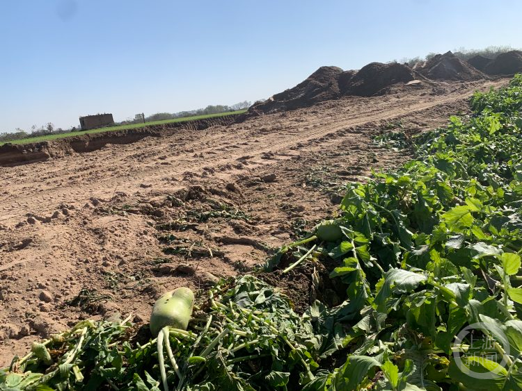
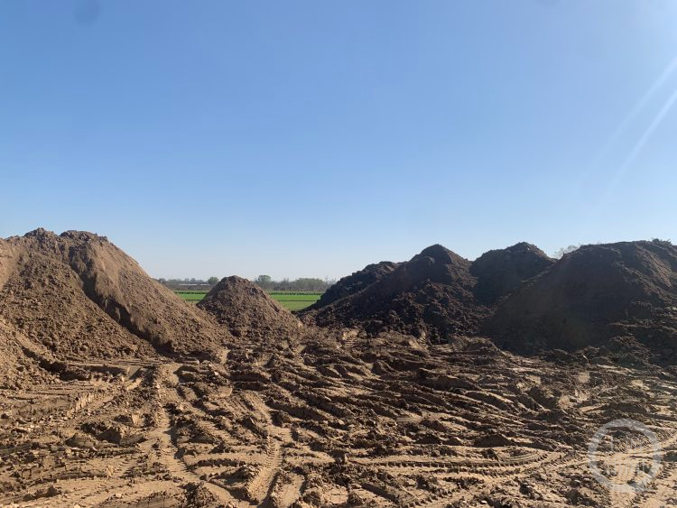
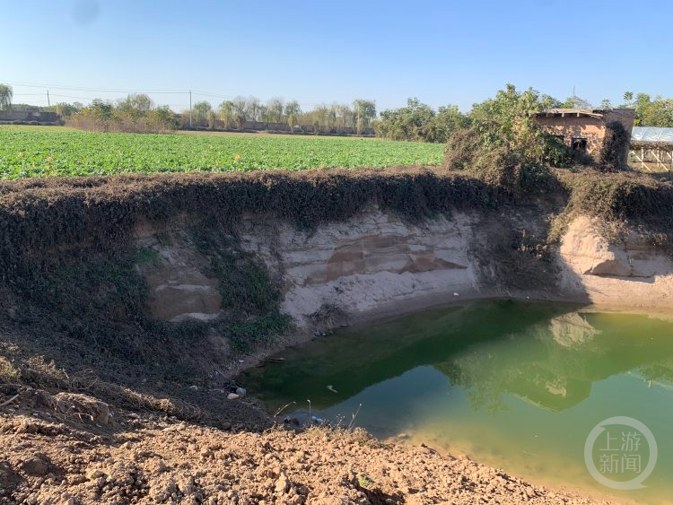
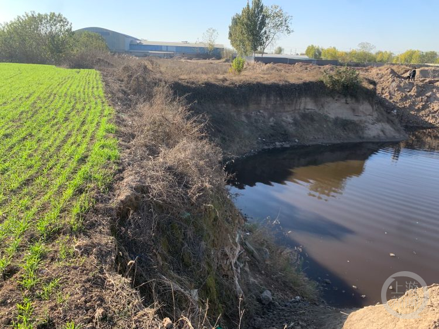

# 西安农村有人耕地里盗采砂石挖出足球场大坑，当地：城管公安都在调查

西安市鄠邑区元村村民说，在他们村，耕地被人为破坏已经不是第一次。

11月17日，在鄠邑区元村周围2公里范围内，上游新闻记者实地调查发现，在农田耕地中分布着大小不一的6处深坑，深坑一座比一座大，彼此并不相连，最大一处深坑面积相当于一座小型足球场。

​“这些人为什么要挖坑？”上游新闻（报料邮箱：cnshangyou@163.com）记者问。

​“挖砂石卖钱呗。”村民回答。

村民们担忧的是，耕地上挖坑容易，但产生的深坑却很难复耕。

 _采砂后留下的大坑特别醒目。 上游新闻记者 沈度 摄_

**耕地埋了建筑垃圾无法耕种**

​近期，一则视频在网上流传：一名老人拿着一根铁棒，在一处深坑中敲击着埋于土下的大量建筑垃圾。视频中，老人痛心疾首地说，这么好的地，倒这些多建筑垃圾，谁来管一管？

​视频中，老人称，事发地位于西安市鄠邑区元村，倾倒建筑垃圾的土地性质为农田耕地。有人将垃圾倾倒后用土掩埋。老人说，埋了建筑垃圾的耕地无法耕种。

​按照举报人指引，上游新闻记者来到西安市鄠邑区元村。在“元村十二户”（记者注：地名）有村民称，视频发出后，倾倒的建筑垃圾已经被当地政府连夜清理。

在现场，上游新闻记者看到，有大型车辆碾压过的痕迹，现场留下的一个小型坑洞，被土填埋的倾倒点上，仍留存着一些建筑垃圾的遗留物。

附近村民称，倾倒建筑垃圾的地点属于农田耕地。

上游新闻记者在现场看到，在倾倒点紧邻的土地，村民种植着萝卜、大白菜和小麦等农作物。此时正是萝卜收获的季节，在填埋点一旁耕地中，有村民正在劳作。

正在采摘萝卜的村民告诉上游新闻记者，填埋点的耕地属于元村另一组的村民，该村民一直在外打工，土地一直闲置未用，有时会租给外村人耕种。

“倒垃圾的都是晚上来的，我也不知道是什么人。”
摘萝卜的村民感慨地说，“这么好的地，倒了这些垃圾，你说可惜不可惜，这一倒不要紧，这地以后就没有办法种东西了。”

周围村民告诉上游新闻记者，更令他们厌恶地是，有人在深夜进村在耕地中偷挖砂石。

**盗挖者都是晚上来挖砂石**

按照村民指引，在上述建筑垃圾填埋点约100米外，上游新闻记者看到三座隆起的土丘，土丘约有5米高，由土和砂石混合形成。

_大型机械经过后一旁的萝卜被压烂。 上游新闻记者 沈度 摄_

在耕地中，这些土丘显得格外醒目。在现场，随处可见大型机械碾过的车辙，比邻的耕地中，已经成熟的萝卜被这些机械碾碎了。

土丘旁是一座深坑。上游新闻记者用手机测量工具进行简易测量，大坑深有5米左右，坑口长约15米，宽约10米，目测如同一座小型篮球场。坑内存有大量积水，水质浑浊，水面漂浮着各类垃圾。扔入一个石块，积水掀起水花，深不见底。

_采砂后留下的大坑里面全是积水。上游新闻记者 沈度 摄_

多名村民告诉上游新闻记者，耕地内的这座深坑是被人用大型机器挖开的，这些盗挖者的目的是为了掀开表层土壤，然后挖出地下的砂石，“运走这些

砂石就是钱。”

按照村民的描述，这些土丘就是盗挖者尚未运走，堆积在一起的砂石。

有至少3名上了年龄的女性村民告诉上游新闻记者，通常她们晚上10时左右睡觉，次日清晨6时起床，“晚上刚躺下，就听见外面轰隆隆的声音就来了，把人吓得不行。外面冷，咱也不敢出去，他们一忙就是一夜，到了早上，咱人还没起床，又能听见轰隆隆的声音，也没人管。”

“就跟贼一样，晚上来，白天走，你说吓人不吓人。”有村民说。

**最大深坑像一个小型足球场**

元村向北比邻涝峪河和渭河。上游新闻记者在元村周边进行沿途走访。距离村委会2公里范围以内，上游新闻记者在耕地中先后又找到了4处深坑，且每个深坑都有明显的大型机械采挖的痕迹。

4处深坑周围种植着萝卜、小麦、果树等农作物，在这些农作物中央，4处并不相连的深坑显得异常醒目。与此前发现的深坑相比，这4座深坑一座比一座大，上游新闻记者目测，最大一处深坑如同一座小型足球场。这4座深坑内都有积水，水体浑浊，一旁也堆着一座座土丘。

从高处俯视，一片绿色耕地中间，这4座深坑和旁边的土丘，像是在绿色大地上划开的几处泛黄的“疤痕”。附近居民告诉上游新闻记者，这些深坑就是采砂后留下的。

_采砂后留下的土丘。上游新闻记者 沈度 摄_

上游新闻记者在元村周边的耕地中，一共发现5处疑似采砂留下的大坑和一处疑似倾倒建筑垃圾的坑洞。

11月17日，上游新闻记者联系元村村干部核实此事。一名村干部承认，被偷挖砂石的地点属于村里农民的农田耕地。

这名村干部说，在他们村，农田耕地中有人偷盗采挖砂石以及被倾倒建筑垃圾等现象不在少数。“这些人跟你打游击，都是夜里来的，我们一点办法都没有的。”

_土坑旁边就是种植的庄稼。 上游新闻记者 沈度 摄_

这名村干部说，由于村干部没有执法权，发现了盗采偷挖砂石的现象，他们只能报警。“我们原来也拦过，人家还说我们是车匪路霸，倒打一耙。老百姓怨我们，但我们也没办法。”

这名村干部说，此前村干部不止一次联系过城管、公安前来处理此事，也有执法部门对嫌疑人进行扣车、抓人等处理。

**国土资源部门：专门工作组处理此事**

针对网络上反应关于“元村有人倾倒建筑垃圾”一事。11月17日，上游新闻记者对主管此事的各部门进行了采访。

西安市鄠邑区城管执法大队渭丰中队的工作人员告诉上游新闻记者，目前他们已经接到上级通知，要求督办此事。他们已派人到现场对视频中倾倒的建筑垃圾进行了清运，同时他们正配合鄠邑区城管执法局对现存问题进行调查并整改。

_被挖开的土坑。 上游新闻记者 沈度 摄_

当地国土资源部门工作人员告诉上游新闻记者，当地确实存在农田耕地被人盗采偷挖砂石的现象，目前已有专门的工作组正处理此事。

西安市鄠邑区渭丰街道办有关部门的工作人员告诉上游新闻记者，经他们调查了解，耕地中存在的部分沙坑属于历史遗留问题，此前曾有人在元村周围从事盗挖砂石的现象，国土部门和公安部门接到报案后也多次立案调查。公安部门已对相关涉案人员进行了立案调查，有的嫌疑人已经到案，但个别人员在逃，警方已上网追逃，相关案件在全力侦破中。

针对目前新发现的倾倒建筑垃圾和盗挖砂石问题，按照上级部门指示，城管、公安及街道办正在调查。“耕地问题是大事，不可能不管。”这名工作人员说。

上游新闻记者也注意到，11月17日，西安市鄠邑公安发布“悬赏通告”，对涉嫌非法采矿、非法占用耕地的5名涉案在逃人员进行悬赏缉捕，“每协助抓获一名犯罪嫌疑人的，公安机关奖励人民币5000元。”

该“悬赏通告”称，该案涉及14人，到案9人，5人在逃。上游新闻记者注意到，涉案人员中，多人来自鄠邑区渭丰街道。

采砂后留下的大坑不远处就是农作物。 上游新闻记者 沈度 摄

上游新闻记者从当地获悉，为了打击盗挖砂石等违法问题，当地曾专门成立了工作组，并设有举报电话。

11月17日，西安市鄠邑区打击盗采砂石偷倒建筑垃圾违法行为工作领导小组办公室的工作人员告诉上游新闻记者，现在有多个部门都在关注和处理元村及周边盗采砂石和偷倒建筑垃圾的问题。

“现在咋处理的？”上游新闻记者问。

“目前这个保密，因为涉及到案子……但你放心，我们一定会给老百姓一个交代。” 该工作人员说。

元村多名村民告诉上游新闻记者，他们更关心的是被破坏的耕地何时能够复耕，毕竟破坏容易但复耕并非易事。渭丰街道办有关部门的工作人员表示，有关问题已经由国土部门上报，一直在着手解决采砂遗留的复耕问题。

陕西恒达律师事务所高级合伙人、知名公益律师赵良善说，如果在耕地挖沙取土，非法占用耕地，改变土地用途，造成耕地土壤表层破坏，依据《最高人民法院关于审理破坏土地资源刑事案件具体应用法律若干问题的解释》第3条规定及《刑法》第342条规定，非法占用基本农田5亩以上或者非法占用基本农田以外的耕地10亩以上的，将涉嫌非法占用农用地罪，最高可判处5年有期徒刑。

赵良善说，如果构成非法采矿罪，依据《刑法》第343条规定，最高可判处7年有期徒刑，并处罚金。他说，长期以来耕地保护都是“红线”问题，一直都是司法机关重点打击对象之一。

​​​​​​​​上游新闻记者 沈度​

