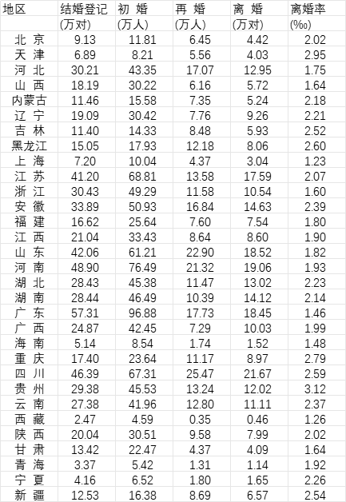

# 2022年我国初婚人数低于1100万，比2021年下降9.16%

近年来，我国结婚人数持续减少，初婚年龄在推迟。数据显示，去年全年依法办理结婚登记683.5万对，比上年下降10.6％。

结婚登记数据包括初婚人数和再婚人数，相比再婚人数，初婚人数与出生人口的关系更为密切。根据国家统计局编著出版的《中国统计年鉴2023》，2022年，我国初婚人数为1051.76万人，比2021年减少了106.04万人，比上年下降了9.16%，这也是多年来初婚人数首次低于1100万人。

从历年数据看，2013年是我国初婚人数的最高峰，达到2385.96万人，也就是说，9年来我国初婚人数下降了55.9%。

表：历年结婚登记、初婚、再婚、离婚、离婚率数据（数据来源：《中国统计年鉴2023》）

整体来看，去年我国初婚人数低于1100万，有适婚人数减少、初婚年龄推迟、婚恋观念变化等诸多因素影响。其中，从近四十年出生人口数据看，我国出生人口在经历1987年这一近40年来的最高峰之后，连续多年下行。也就是说，随着95后乃至00后进入到婚育阶段，处于适婚年龄的年轻人数量也在下降。

从2010年以来历年结婚人口年龄结构来看，我国结婚年龄尤其是初婚年龄大幅推迟。根据《中国人口普查年鉴-2020》，2020年我国的平均初婚年龄为28.67岁，比2010年的平均初婚年龄（24.89岁）增加了3.78岁。

人口专家、广东省政府参事室特约研究员董玉整对第一财经分析，从客观上来看，处于适婚年龄的年轻人在减少。从主观上来看，结婚年龄推迟，部分人群的结婚意愿也在减弱，不婚的人逐渐增多。

董玉整分析，如今不少年轻人不太想结婚，有多个因素，包括：现实生活中婚姻的稳定性，影响了年轻人对婚姻的向往；年轻人的婚姻观发生了变化，很多人不再把结婚生育当成人生的必修课；还有现实生活中结婚成本的上升等。

此外，2022年四季度受疫情等因素，一部分人推迟到今年结婚，这也对去年初婚人数产生了影响。

分省份来看，广东初婚人数达96.88万人，位居第一；河南以76.49万人位居第二；江苏、四川、山东分列三到五位。

与此同时，根据《中国统计年鉴2023》的数据，去年我国结婚总人数最多的是广东省，达到了57.31万对，也是唯一一个结婚总人数超过50万对的省份；河南位居第二，为48.9万对；四川位居第三，为46.39万对。

表：2022年31个省份结婚登记、初婚、再婚、离婚及离婚率数据（数据来源：《中国统计年鉴2023》）

