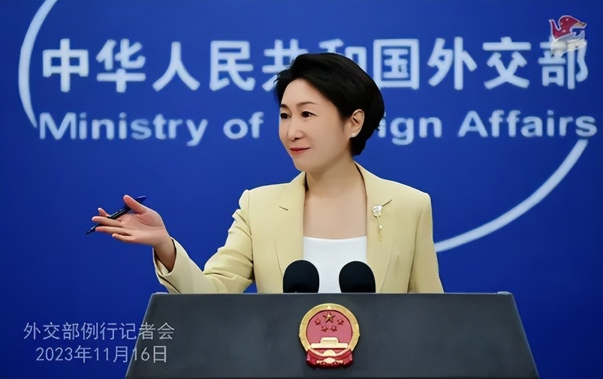
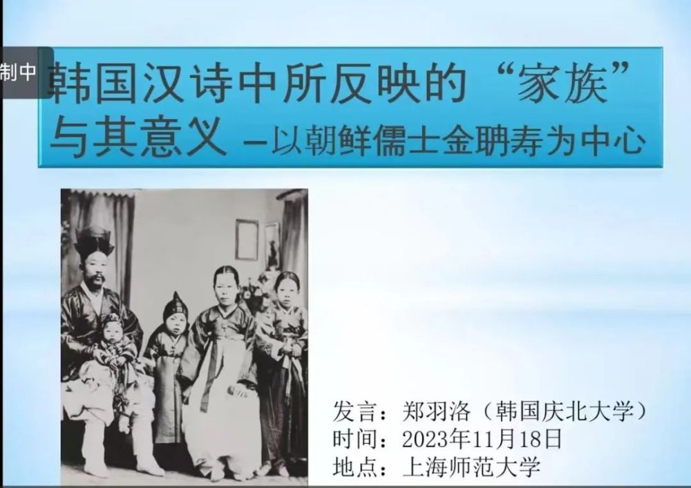

# “日本紧跟美国步伐，对华关系出现急转弯”，韩国的反应似乎慢很多

天下大势，分久必合，合久必分，变，才是常道。

**文 | 海上客**

“日本对华关系出现急转弯”，这是今年亚太经合组织（APEC）第三十次领导人非正式会议期间，一些媒体所做判断。环球时报转引香港亚洲周刊的一篇文章中，甚至用了“岸田求变紧跟美国步伐”的标题。

_当地时间11月16日下午，国家主席习近平在旧金山会见日本首相岸田文雄 图：新华社_

**1**

值得一观的是，在中国最高领导人赴美举行中美元首会晤后，当地时间11月16日下午，中日领导人在APEC会议期间进行了一次双边会见。

其实，回看一下此前的外交部记者会实录，即可看出，直到北京时间11月16日下午，在回答日本广播协会记者相关提问时，外交部发言人毛宁还说，“我没有可以提供的信息”。

_毛宁主持11月16日外交部例行记者会 图：外交部网站_

**在中美元首会晤后，如今回看，日方终于实现在APEC会议期间，中日领导人会见。很大程度上，日本方面要松一口气。**

历史有时候惊人的相似。

1972年2月，美国尼克松总统访华。当年9月，日本就实现与中华人民共和国建交！日本甚至不顾美国在当时还没有实现与中国建交，就迅速达成日中建交事宜。

“春江水暖鸭先知”。日本的做法有时候看着挺有意思。中日建交之前，日本政界反华高调唱得山响。但一旦得知尼克松的“空军一号”到了北京，日本的变调节奏几乎如F1赛车开进了发卡弯。

如今的情况当然与当年不尽相同。但一旦发现中美领导人在斐洛里庄园漫步，日本方面马上跑着步跟进。

**2**

与日本不同，韩国的反应看上去似乎慢很多。

反正，在旧金山APEC会议期间，没有中韩领导人双边会晤的环节。但中韩最高领导人在当地时间11月16日，于APEC会议第一场讨论会时，进行了短暂交流。

**这是中韩最高领导人在去年于印尼举行的二十国集团（G20）领导人峰会后，时隔一年再见面交流。**

据报道，韩国方面对外披露，“尹锡悦可能借APEC之机与中国方面相约另行举行会谈，因此备受瞩目”。

_金星焕 图：资料_

当然，这“备受瞩目”主要是对韩国国内所言。

不妨看看APEC会议之前，澎湃新闻专访韩国前外交通商部长金星焕时，金星焕是怎么说的。

他说，“韩方正寻求在APEC峰会上同中方接触”。

当然，领导人在会议间隙时寒暄，也是一种接触，从这个角度看，韩国实现了目的。不过，总感觉韩国方面，哪怕是前外交通商部长所言，也透露出一种信息——其实韩国方面想要与中方有更深一步的接触的。

在旧金山，中美、中日都进行了双边会晤。且中美会晤的重要性显然超出了普通的APEC会议期间的双边会晤。这样的情况下，韩国显然有落后之感。

**3**

**在海叔看来，哪怕当下韩国仍在高唱诸如“经贸需要中国，安全依赖美国”的调调，也得看看两个方面——**

**其一，当下天下大势；**

**其二，过往前车之鉴。**

_韩国庆北大学郑羽洛教授与中国学者分享韩国汉诗中所反映的“家族”与其意义_

从当下和过往，能够看到未来！

所谓当下天下大势，其实从中美元首会晤后，日本的跟进动作就能看出端倪。而至于过往前车之鉴什么意思呢？

无非是说，中日韩都处于东亚文化圈。在过去上千年的历史中，东亚文脉相连。即便各方曾经有过纷争，但就大历史的层面去看，中日韩是永远跑不开的邻居。在11月18日于上海师大举行的“东亚汉诗史第二届国际学术研讨会”上，通过视频参会的韩国庆北大学郑羽洛教授首先用中文说了他的开场白，然后再用韩语阐述他的学术观点。

反正，郑羽洛说的是韩国汉诗中所反映的“家族”与其意义，特别举例了朝鲜儒士金聃寿的故事。

如果前瞻千年，如今的天下大势是不是会变？而东亚文化圈的共同财富，譬如儒学，是不是还存在？

海叔个人感觉，天下大势，分久必合，合久必分，变，才是常道。而学问，当然会延续，也会发展。就中日韩三国来说，以文化为背景，谈交流，谈合作，或许能够不再出现有些国家每每猛踩急刹车，又猛踩油门的情况。也会少见一些国家木知木觉，突然发现自己又慢了半拍这样的事。

当然，眼门前的事是——

日本跟了，那么，韩国呢？是不是该加快速度做些什么？

