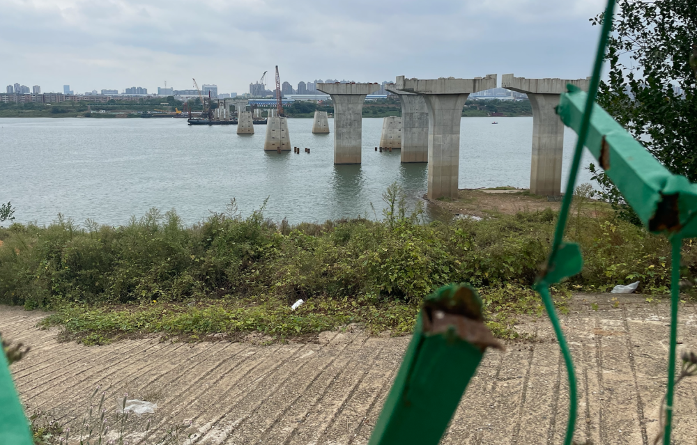
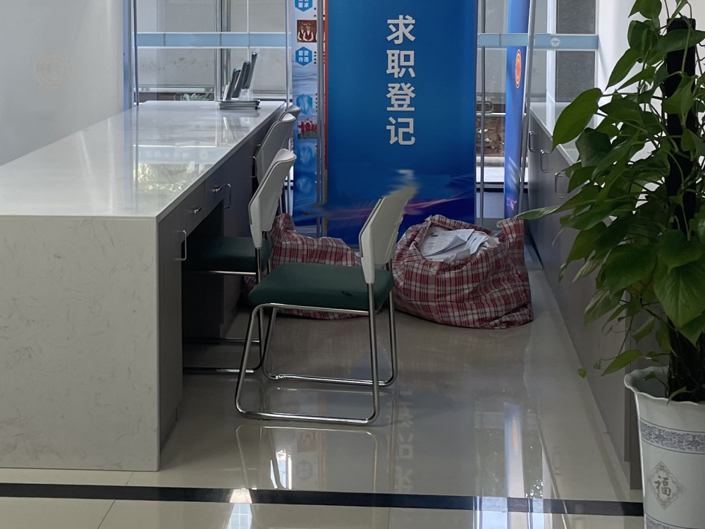

# 一座县城的“编外人员困局”：“把你清走了，部门谁来顶事儿”

本文来源：时代周报 作者：傅一波

“我在这干了十年。不会把我清走吧？”

“不会。你走了，部门谁来顶事儿。”

这样的对话发生在南方某地的县级机关单位里。提出问题的是接近40岁的领导，而回答的是26岁单位新人的徐奕。

今年4月初，清退编外用工的消息在内部传开，流传的版本是将清退500名编外人员。

大多数人并不意外——清退编外人员的举动，已在多地陆续进行。

2023年3月，《党和国家机构改革方案》明确，中央和地方都要进行编制精简。此后，多地开始清理编外人员，黑龙江省哈尔滨市、湖北省十堰市、云南省楚雄州、湖南省株洲市等地陆续出台清理编外人员的方案。

不止是今年。绍兴、道县等多地在数年前对编外人员进行清理和规范。

内部消息传开后的半个月，也就是4月底，徐奕和她的领导从具体消息里看到，多个部门要出台清退计划，比如医疗卫生系统、教育系统需各清退500人，在2023年年底到位。

气氛变了。

徐奕的领导紧张起来。她冲击编制十年未果，一直以编外的身份担任部门副主任，算是部门的顶梁柱。但她心里没底，合同将在明年初到期，是去是留，或许都身不由己。

其实，徐奕自己也是。

县里缺钱了

在这个南方某省的县城，了解清退方案制定的人少之又少，这让不明就里的人开始无限猜想。

实际上，清退编外人员的工作从今年3月开始。参与清退编外工作的刘涛说，清退的主因是当地的经济发展遇阻，计划清退的人员不是500人，而是1500人以上。

年轻的徐奕对清退并不在意。她所在的部门，半数皆是编外。

况且，作为一个未满30岁的年轻人，她还有不少可能性，回到县城是求个安稳。

偶尔提早下班，徐奕可以在江边茶馆坐一下午。若是觉得孤单，她一个电话就能招呼来小时候的玩伴。

县里节奏比不到50公里的省城惬意不少，即便她曾经想成就一番事业，但回来久了，她习惯了和大部分人一样，“不卷了”。

徐奕有着戏谑的体验，表现在最近几年她和闺蜜的微信群名上：

2021年，刚回县城的徐奕将一个5人小群命名为，“赚钱不积极，思想有问题”。

2022年，“人间喜剧”。

2023年，“吃饱就行”。

徐奕所在的县城坐落于长江中游，区域面积超过2000平方公里，比深圳略大，但人口只有深圳的5%，至于财政收入，更是遥不可及。

县城北面临江，南边串起了23个乡镇。县城方圆4公里的面积里，汇聚了医院、商圈，以及学校，再往远走，就进了国道，路边的景色由散落在山丘中的田野和低矮民居占领。

在不少当地人眼里，县城缺乏支柱产业，“难发展”是代名词。但其实，这座县城一度想大兴基建。

_未完工的大桥 图源：时代周报记者 傅一波_

比如多年前，县里计划再盖一座跨江大桥，刚打完地基，工程就因财政问题而停工。直到2023年，才重启修建工作。当地人甚至记不起动工的时间，只是笑称，“一座未完工的大桥，成了遗址”。

在县城里土生土长的出租车司机李艳的印象里，中心区域的商业街关了一批店铺，原本5000—6000元的租金减至4000元左右。饶是如此，每隔10几米就有临街店面贴着转租告示，即便租金低于2000元依旧无人问津。

_县城街景 图源：时代周报记者 傅一波_

李艳时常听到在企业上班的朋友抱怨工资低，工作忙，但换工作却没什么去处，只能“熬”生活。

这也是徐奕成为编外人员的原因之一。相比于普通私企的员工，编外人员工作安定，薪资也能维持在4000—5000元的水平线上。

个人在“熬”，县里苦于没有大型支柱产业，财政也是在“熬”。

据当地财政局公布的数据显示，2022年全县一般性公共预算收入为60亿元左右，这其中还包括上级补助性收入大约34亿元，也就是说当地自己的年预算收入只有26亿元左右。

而在这样的背景下，当地产生了巨额地方债务。

中央党校（国家行政学院）教授汪玉凯表示，各地启动编外人员的清退除了响应“精兵简政”的号召之外，与地方财政困难有一定关系，“在财政遇到困难的时候，减人或者降薪都是方案之一”。

刘涛也说，编外人员的离开虽不能解决根本问题（经济），但至少能在短时间内节约钱。

如果按月薪4000元来算，以清退1500人计算，这一次至少能节约政府一年开支7200万元。

走不出的小县城

对34岁的张蔚来说，“铁饭碗”丢得猝不及防。

五月初，他就被叫到行政办公室。5分钟的谈话，张蔚是模糊的，只记得一句：“主任觉得你不太合适。”

合同条款里明晃晃写着：用工单位因体制改革按法定程序裁减人员的情况，可以解除合同（N＋1或提前一个月通知）。

张蔚没有任何可周旋的余地。

他说自己怎么也没想到，清退会落到自己头上。他之前在市里一家国营单位上班，因为父母年老，便拖家带口回到县城老家图个安稳。

他还记得当初面试，主任特意问了接下来的考编安排。

结果被命运开了个玩笑。

张蔚是徐奕的同事，他走了以后，徐奕总能听见不少传闻，某某部门、某某人被清走了。她回忆，机关单位的清退编外的工作大约在9月前后基本完成。不过，在卫生与教育系统内，清退编外造成的不确定仍在持续。

25岁的陈佳在卫健系统熬了一年，2021年从实习生转入编外。

她和编内护士做的工作大同小异，薪资差距在300—500元上下。唯一不同的是，编内护士交的是五险一金，而陈佳只有四险一金。

她没觉得有什么问题，年纪小，攒实操经验是当下最重要的事。一旦有机会能往更好的地方去，她说自己肯定毫不犹豫地离开。

不过，今年9月份开始，陈佳感到莫名的惶恐。

陈佳回忆，自己直到10月底都没收到5、6月份应发的奖金。除此之外，医院的部分科室遭遇合并，还需要应对新的考核制度。

考核分为笔试和实操两部分。笔试还好应付，陈佳像是回到了高考，每到考前三天就拼命刷题。

但实操部分是最无奈的。按照规范，止血带需要扎在静脉上方6厘米处，操作中都以目测为准，但一考试就严格按照规定，差一点都要扣分。

她觉得这是在“找茬”，想用这样的方式来清退一部分人。医院里的老护士也觉得是如此。不过，老护士宽慰陈佳，医院是为了维持人员的更新换代，要走的肯定是年纪大的。

按刘涛的说法，过去几年卫生系统人手紧缺，进了大批编外人员负责基层的医疗保障和行政工作，给当地财政带来负担。到了2023年，卫生系统也亟待清理编外人员。

上海某三甲医院负责行政工作的主任说，医疗系统内的启用编外护士是个常见现象，尤其是急诊科。为保证工作效能，医院一般会在3-5年的周期内进行人员轮换，保证年轻护士在医院内的占比。

30岁以上的编外人员是紧张的。他们到了人生关隘处，不像年轻人一般进退自如，只能提前准备。

33岁的编外老师张紫娟就打算好要换工作，从公立学校转去工资待遇稍好的私立中学。10月，到了新学校的张紫娟看着到手的5000多元工资，觉得自己做了正确的决定。

私下里，她还和朋友讨论着清退。今年4、5月份学校本来提到过可以提供转录窗口，让非编教师转进编制，结果没她的份。

张紫娟觉得，自己就是没有编制命，不如早点放弃。“反正也不会出去（县城）了，总得有个地方待着。”

更符合实际的做法

这个小县城不是第一次遭遇清退编外人员，张紫娟对清退的印象是“翻烧饼”。她说最近三年大环境不好，清退在县里时有发生。

张紫娟的说法在数据中表现得直接。

比如2021年当地机关单位的工资福利支出为8.56亿元，到了2022年，这个数字变成了3.6亿元。

华南理工大学公共管理学院教授郑方辉对时代周报记者表示，政府在应对一些突发事件，比如疫情防控需要的情况下，现有的人员不能满足需求，便会启用编外人员来组织应对。

而在响应上级“精兵简政”的要求之时，相比于编内人员辞退的繁琐，先从编外人员着手更符合实际。

但他也觉得，编外人员存在有其必要性，短时间内无法舍弃，就会导致清退行为只是能是以“运动式”、“常态化”方式来进行。

回溯历史，不论是编内或是编外的清退之举都与机构改革相互伴随。

此前八轮国务院机构改革中，有两次编制缩减：

一次是1982年，当时中国国务院有100多个部门，人员超过5万，缩减后变为41个机构、人员3万多；

另一次在1998年，也是缩减力度最大的一年，行政编制从3.23万锐减至1.67万。

徐奕父亲对此深有体会，他原是国企的科长，因90年代的编制改革而下岗失业，就此走上了创业路。她记得小时候，父亲时常忙到深夜，每周都要折返于不同的城市，找货源谈价格。

即便经历了下岗潮，徐奕父亲仍旧觉得机关单位是“铁饭碗”，踏进去的敲门砖，便是编制。

有天吃饭的时候，徐奕向父亲提到张蔚。这让父亲想起了那段下岗创业的回忆，他害怕女儿跟自己一样，过上那些劳碌的生活。他开始翻旧账，埋怨她明明有机会签3年的合同，为什么只签一年。

她没接话，忙顾着闷头吃饭。后来，她从母亲那边知道，当天晚上父亲根本没睡踏实，隔天一早翻出了老早的通讯本，找老同事问清退编外的情况。

在绝大多数的小县城，熟人社会，或者说“脸熟”往往是立足的关键。几个月后，徐奕续约合同下来了。

_在编公务员与编外人数对比 图源：国元证券研究报告_

国元证券的报告《公务员和事业单位的招录会反弹吗？》中，根据人力资源部和社会保障部、《中国统计年鉴》给出的数据显示，2015年中国的事业单位与公务员总数为1637.8万人，编外人员的数量高达921.1万人。

中国经济体制改革研究会一位不愿具名的研究人员表示，编制内人员的管理是与机构编制管理紧密结合在一起，中央编委办会以“定职能、定机构、定编制”的“三定”原则来配置与设置机构。

如需增加相应的编制内人员，就会牵涉到顶层的制度建设。在此背景下，各地部门只能在不增加人员编制的情况下，启用编外人员。

医院内，和陈佳同期以编外身份进入医院的护士约为30名左右，他们经历了2年的工作后分散在各个科室，成为生力军。

“我们走了，其他人的活就多了。”陈佳这么想。

小县喧嚣

今年的清退工作已近尾声。

张蔚的离开似乎没给部门带来大变化。徐奕说，领导把他的工作安排给了另一位编内的同事，部门运转如常。

对当地政府而言，清退工作付出了不少善后代价。

刘涛记得，清退编外人员首先会给予经济补偿，以当地最低工资标准1740元乘以工作年限发放。其次，针对大龄（35岁以上）的编外人员提供了一批公益性就业岗位。最后，就业培训和推荐就业相并行。

清退编外的一个深层逻辑是地方财政欠佳，而地方财政又与大的经济发展紧密相连。

在刘涛的这个县里，财政问题是引发清理编外人员的最大诱因。

华中科技大学社会学院暨中国乡村治理研究中心教授吴毅在其作品《小镇喧嚣》中曾提及一个可循环的公式：

财政（投入）＝名声（招商）＝影响（持续）＝市场（收入）＝效益（税收）＝政绩（升迁）

吴毅认为，当在衡量一个乡镇治理能力之时，财政能力是首要的指标，也是实现其他能力的基础。而徐奕所在的县城，如果仅凭清退这一举措，显然无法走出财政困境。

前述不愿具名的中国经济体制改革研究会研究人员说，县城财政问题应该以开放更多的县域自主权来解决。该研究人员表示，有了自主权的县城便会用尽各种方法来创收，比如卖地和更大尺度的扶持政策来招商引资。

更为重要的是，如果编外人员在县城内的存在有其必要性，如何从制度上保证编外人员的有效利用，也成为亟待解决的问题。

汪玉凯认为，首先应当合法、合规、合理的聘用编外人员。其次，明确编外人员的角色定位。同时，编外人员也需要有相应的发展体系，以及考核标准，提供转录窗口或建立起一套与民营企业相同的制度，提高相应部门的行政效率。

有学者曾提出过编外人员的另一种解决之道——劳务外包。即将事权委托给相应的企业，通过市场化的逻辑来节约当地财政。

2023年10月上旬，清退编外的工作还没有结束，当地发布了2023年度医疗卫生事业单位的招聘公告，公开向社会招聘医师、护士共计251名。

陈佳报了名，她觉得反正试试不吃亏。“如果能考上最好，不行就继续在编外干着。”

2023年10月21日，当地人才市场的就业招聘会如期举行，招聘会提供就业岗位861个。

已经退休的徐阿姨满心欢喜地来到现场帮孩子求职，那天上午，人才市场空空荡荡，总人数不足10人。

_人才市场内景 图源：时代周报记者 傅一波_

而大厅左侧一角，两个红色的编织袋塞满了简历，随手掏出一沓：XXX 本科 建筑行业 XXX学位认证证书……

10个求职者和两袋编织袋的简历，徐阿姨不知道哪个才是真实的，11点半左右，她一无所获的离开了。

（文中徐奕、李艳、陈佳、张紫娟、张蔚、刘涛均为化名）

