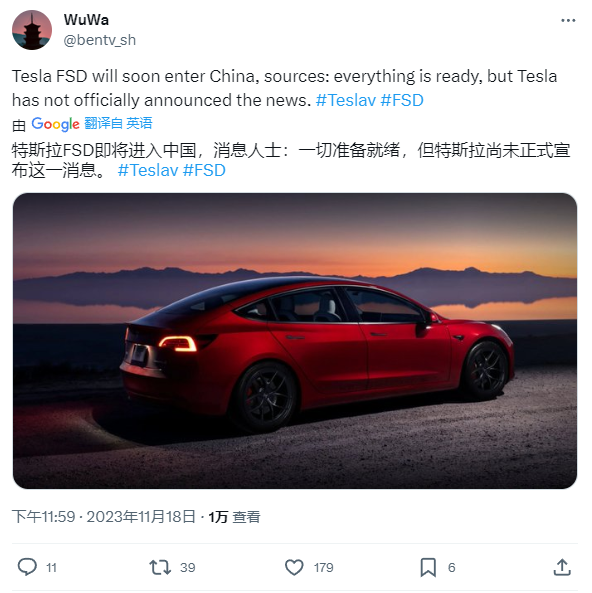
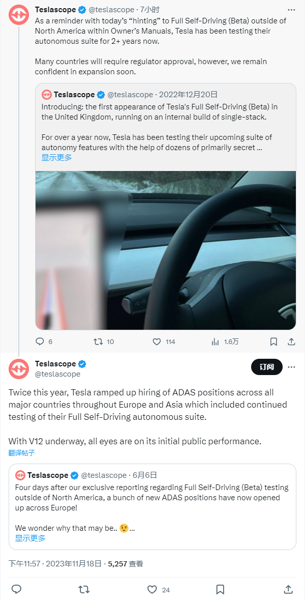
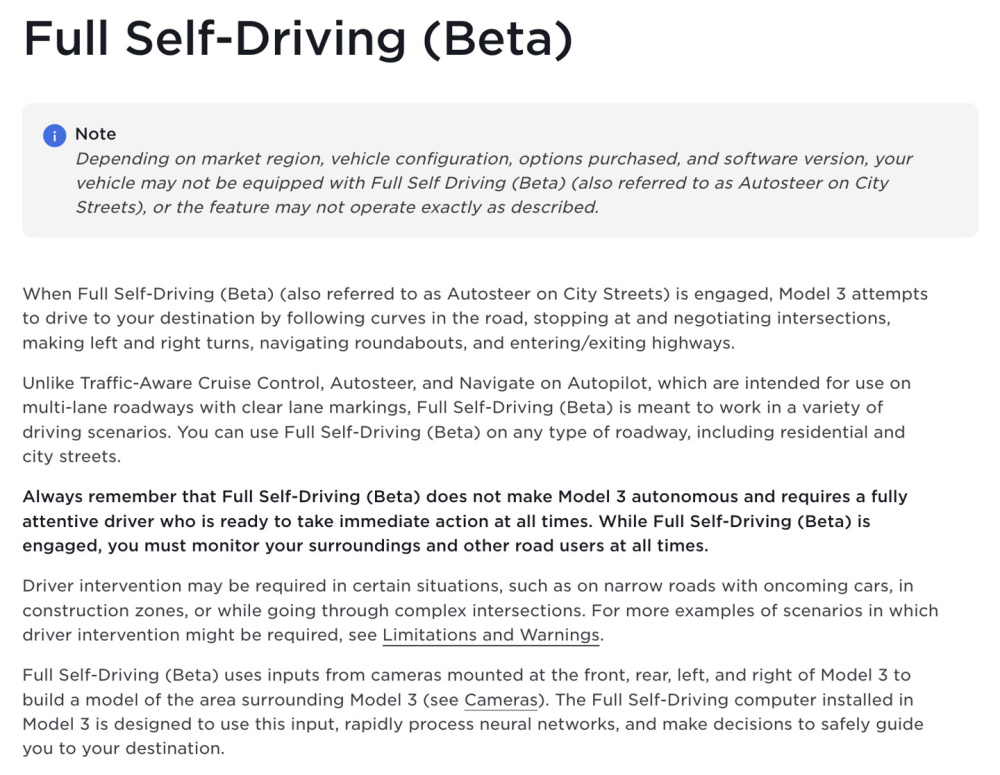
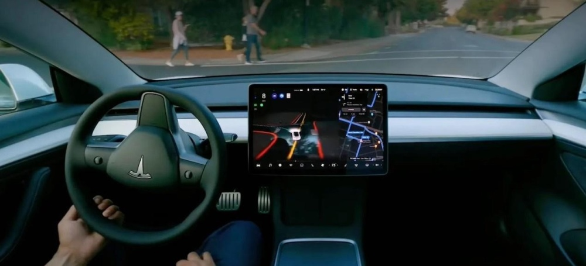

# 传特斯拉FSD完全自动驾驶即将进入中国，消息人士：一切准备就绪

IT之家 11 月 19 日消息，特斯拉FSD 在北美地区已经趋于完善，有望在即将到来的 V12
版本告别“Beta”比国内开始向更大范围的消费者群体渗透。马斯克本周早些时候也透露，FSD V12 将于“约 2 周”内上线试用。

根据航拍博主 @WuWa 的说法，FSD 已经在中国市场“一切准备就绪”，但特斯拉尚未正式宣布这一消息。

同时，@Teslascope 发现，特斯拉已开始为欧洲、中国和澳大利亚新车主提供包含 FSD
测试版信息的用户手册，这表明该特斯拉可能正准备逐步在北美以外地区推出该系统。

特斯拉在车主手册中指出：“根据地区、车辆配置、购买的选项和软件版本不同，您的车辆可能没有配备 FSD
Beta（也称为城市街道自动驾驶），或者该功能可能不会如描述那样精确运行。”

随着 FSD Beta 部署的扩大，特斯拉将逐步向美国和加拿大以外选定国家地区符合条件的客户提供该功能。

该公司还指出，FSD Beta 是一个“需要您时刻关注道路的功能”，而不是提供更高级别的自动驾驶功能让司机在道路上为所欲为。

由于每个国家都有独特的基础设施、驾驶行为和交通模式，FSD Beta 需要随着时间的推移进行适应，因此对于在新符合条件的国家地区使用 FSD Beta
的驾驶员来说，格外专注和过度谨慎是至关重要的。您必须随时准备安全接管。

上个月，特斯拉的 FSD Beta 计划累计行驶了 5 亿英里，超过了公司即将在北美发布的该系统的第 12
版，据首席执行官埃隆・马斯克称，该系统将不再处于测试阶段。目前尚不清楚具体何时发布，但预计将很快推出。

上周，马斯克似乎以一个带有自我认知的笑话的口吻说，客户可能可以在“大约两周内”尝试 FSD 第 12
版。这似乎是对特斯拉未能遵守推出截止日期以及他之前多次声称软件将在仅仅两周内发布的失败的一种自嘲。

今年早些时候，有部分用户发现特斯拉正在澳大利亚和欧洲进行 FSD Beta 小范围试点。

此外，今年以来，特斯拉中国一直在加大这方面的招聘力度，这一切都表明特斯拉正在为 FSD 系统上线海外市场做准备。

尽管特斯拉多年来一直在北美以外地区进行测试，但 Teslascope 指出，FSD Beta 仍然需要在许多国家获得监管批准。

特斯拉 FSD，在特斯拉官网的名称为“完全自动驾驶能力”。在前不久举行的股东大会上，FSD 再次成为大家讨论的焦点。截至目前，特斯拉 FSD Beta
版用户已累计行驶超过 5 亿英里，FSD Beta 的发展非常迅速，未来其安全性将远远超过人类驾驶员，达到 10 倍的安全性水平。

特斯拉自动驾驶产品可分为 3 个类别，包括 AP、EAP 和 FSD。其中，AP 为最基础版本，EAP 为增强辅助驾驶，增加了智能机召唤、自动泊车、NOA
等功能，目前这两大类别产品可以在中国地区使用，前者免费，后者为 3.2 万元。

最高级别的 FSD
在官网上的释义为“完全自动驾驶能力”，主要功能包括导航辅助驾驶（NOA）、自动变道、自动泊车、智能召唤、交通信号识别、（基于导航路线的）城市道路自动转向等。

FSD Beta 版目前仅在北美地区提供，美国为 1.5 万美元（IT之家备注：当前约 10.8 万元人民币），加拿大 1.75 万美元（当前约 12.6
万元人民币），但用户可以申请一个月的试用权。

由于政策和监管的不同，FSD 暂未进入中国市场。中国市场目前是特斯拉仅次于美国的第二大市场，特斯拉已在中国交付了数十万辆可以升级到 FSD Beta
的汽车，若 FSD Beta 在中国正式发布将大幅提升特斯拉的营收。

今年 5 月 12
日，上海市经信委智能制造推进处副处长陈可乐介绍，下阶段，上海将进一步深化与特斯拉的合作，推动自动驾驶、机器人等功能板块在沪布局，共同打造具备核心技术优势、面向全球市场的科技产业集群。

