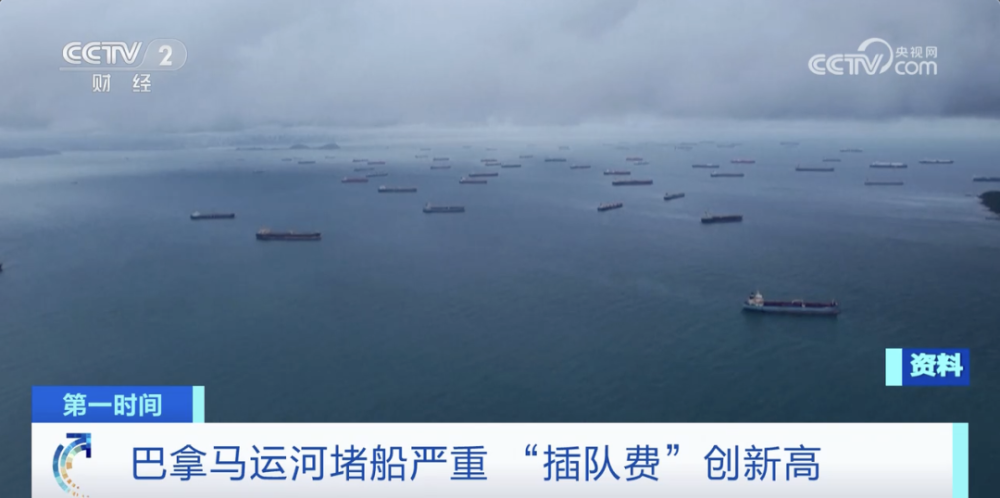
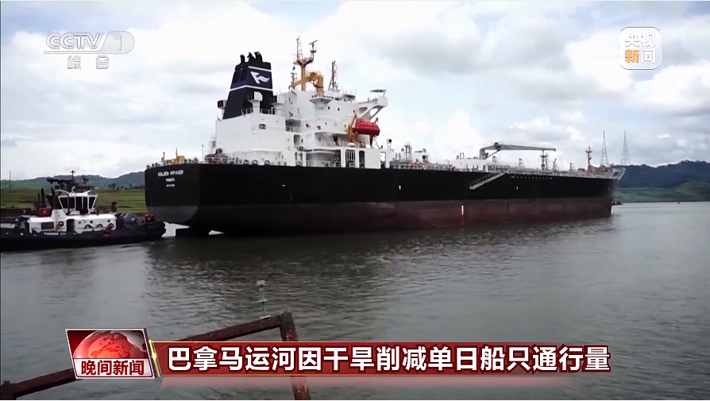
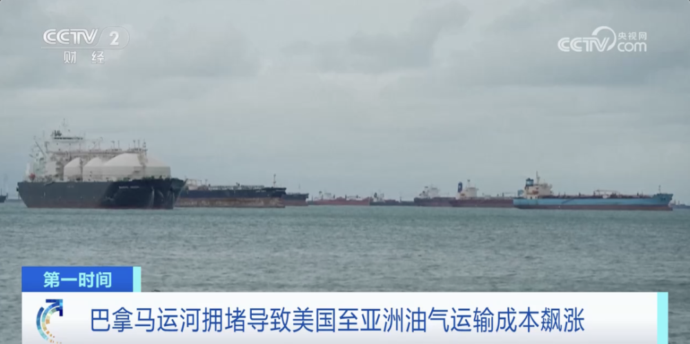
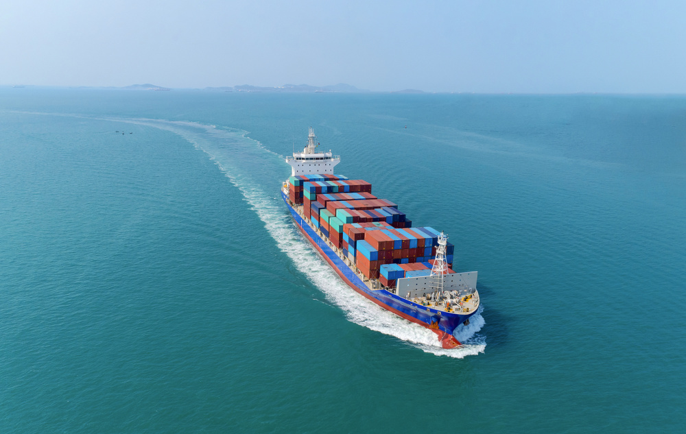

# 全球航运“大动脉”告急！124艘货船被堵，“插队费”高达3000万

每经编辑：毕陆名

一场罕见干旱突袭全球“大动脉”。

据参考消息网11月18日援引德国《法兰克福汇报》网站11月15日报道，目前有124艘货船堵在巴拿马运河上，等待通行。由于巴拿马船闸系统的运营商不得不节约淡水，这条世界贸易最重要航线之一的交通已经停滞。大约5%的全球船运贸易量通过巴拿马运河完成。另据央视财经14日报道，
**最新的一次船舶优先通过权拍卖价，也就是“插队费”更是创下了近400万美元（约合人民币2900万元）的纪录，大幅抬高了过境货物运输成本。**

据央视新闻11月2日报道，自今年年初以来，厄尔尼诺现象造成的干旱持续影响巴拿马运河水库系统，导致船闸运行所需的淡水供应减少，巴拿马运河管理局已经多次减少单日通行船只数量。

_图片来源：视频截图_

除减少单日通行船只数量外，巴拿马运河管理局还下调了船舶吃水深度，这迫使通过运河船闸的船只需要减少自重或载重，不仅增加了国际物流成本，还进一步导致运河收入下降。巴拿马运河管理局表示，2024年收入预计将减少2亿美元（约合14.6亿元人民币）。

巴拿马运河是一条连接太平洋与大西洋的黄金水道，与苏伊士运河齐名，为世界贸易和经济发展起到了至关重要的作用。据巴拿马运河管理局数据，巴拿马运河目前提供约180条海上航线，可连接约170个国家和地区，到达全球约1920个港口。

大堵船！“插队费”3000万

据参考消息网11月18日援引德国《法兰克福汇报》网站11月15日报道，目前有124艘货船堵在巴拿马运河上，等待通行。造成这一严峻局面的原因显然是全球变暖和厄尔尼诺现象。它们导致巴拿马的降雨量大大低于往年，并且雨季开始推迟。
**国际货币基金组织(IMF)正在监测这一严峻形势，并称这是143年来最严重的干旱。**
巴拿马运河管理局最近报告说，今年10月，是有记录的73年来最干旱的10月。现在船舶等待通行的时间为5天到6天。

_图片来源：视频截图_

通常情况下，巴拿马运河每天可安排34艘至36艘货轮过闸。由于干旱，运河管理局已将这一数字减少到25艘，从明年2月起将减少到18艘。IMF报告说，干旱将在可预见的未来影响贸易。“港口观察”平台认为，巴拿马运河对拉美港口的影响尤为严重。巴拿马、尼加拉瓜、厄瓜多尔、秘鲁、萨尔瓦多和牙买加的港口受到的冲击尤为严重。这些国家10%至25%的对外贸易受到延误的影响。

据央视财经11月14日报道，为了应对船舶积压，巴拿马运河管理局为希望尽快通过的船东组织了“插队”拍卖会，让他们通过竞拍的方式获取提前通过运河资格。在11月最新的一次拍卖中，为了拿到优先通过巴拿马运河的资格，
**日本一家能源企业为一艘液化石油气运输船付出了397.5万美元（约合人民币2900万元）的“插队费”，再加上数十万美元的常规运输费，总体成本可能已超过3000万元人民币。在付出巨额成本后，这艘船将于15日通过巴拿马运河。**

_图片来源：视频截图_

公开信息显示，巴拿马运河每年约有26%的运输业务涉及液化石油气、液化天然气等大宗商品。巴拿马运河管理局表示，拍卖中出价最高的通常是液化石油气或液化天然气运输船。

船舶经纪人预测，即将到来的拍卖会拍价可能会创下新纪录。而液化天然气又是美国向世界各地，尤其是亚洲出口的重要能源商品。因为通行费用昂贵，通过时间遥遥无期，越来越多的美国液化天然气托运人已选择多航行两周、航行近6000海里绕行苏伊士运河或好望角到亚洲，而这也导致市场运力不足、运价飙涨。

过往船只或被征收淡水费

据此前央视新闻报道，由于面临持续干旱，巴拿马运河管理局推出更多限行措施，包括暂时限制新预约通行的申请数量。

巴拿马运河全长81.3公里，连接大西洋和太平洋，是一条水闸式运河，要利用水闸升高或降低水位，才能使船只在位于巴拿马中央山脉间的河道上通行。每次需要将大约2亿升淡水排入海洋中。而这些淡水的重要来源之一是加通湖，每次船闸升降船只，都要从加通湖抽取大量淡水。而这个人工湖主要靠降水补充水源。

今年以来，由于厄尔尼诺现象造成的持续干旱，巴拿马运河管理局从今年年初就开始限制通行船只的最大吃水深度及其数量上限，以缓解供水压力。最新的一次调整来自今年7月份，巴拿马运河管理局要求，每日船只通行不超过32艘，船只吃水深度不超过44英尺（约13.41米），这也意味着大型货轮不得不削减载货量，才能顺利通过运河。

为争夺每天32个通行名额，船公司们想出了各种办法。该运河管理局也提出，船东可预约过闸船位，这一方式促使“拍卖”船位的模式形成。

今年2月15日起，通过巴拿马运河的船舶还被征收“淡水费”，如果船舶长度超过125英尺，费用为1万美元。同时，根据船舶过境时巴拿马加通湖的水位，巴拿马运河管理局还会收取1%–10%的可变费用。国际航运公会（ICS）预计，此举将使通过巴拿马运河的船舶的成本增加多达15%。

_图片来源：视觉中国_

据海外网7月援引《华尔街日报》的一篇报道称，巴拿马运河运力下降将损害南北半球间的农产品贸易。来自厄瓜多尔的香蕉、巴西的肉类、智利的葡萄酒等原本都要通过巴拿马运河运往各地。

另据北京商报14日报道，一位航运货代从业人士表示，巴拿马运河主要是亚洲与美国墨西哥湾和东海岸港口的贸易通道，也有替代方式，比如走苏伊士运河，但是会慢一些，不过现在巴拿马运河因水位下降开始征收额外淡水附加费，也可能会成为一笔不菲费用，因此到底要怎么走货最经济合适，的确需要个案分析。

近年来巴拿马运河多次因缺水限行，中美洲各国修建替代路线的想法愈加强烈。尼加拉瓜交通和基础设施部长奥斯卡·莫希卡6月对当地媒体表示，尼加拉瓜计划修筑一条铁路，连接该国在太平洋海岸和加勒比海沿岸的两大港口。此外，萨尔瓦多表示，希望与洪都拉斯合作修筑跨洋铁路，与巴拿马运河争夺交通枢纽地位。

阿戈特认为，目前还缺乏有足够竞争力的替代路线，“修筑平行路线从生态成本、经济成本来看都不划算”。他说，巴拿马政府应通过加强硬件设施建设、完善供水系统管理等措施，保证运河在国际物流领域的长期竞争力。

不过，在中国国际经济交流中心咨询研究部副部长王军看来，目前来说，海运还是无法被陆上通道替代的，全球大宗的货品运输，海运还是最高效的方法。但王军表示，现在的堵塞也许能通过绕远路暂缓，长期来看，全球变暖导致冰川融化的话，北极航道的开辟也不是不可能。

每日经济新闻综合参考消息网、央视新闻、央视财经、海外网、北京商报

每日经济新闻

