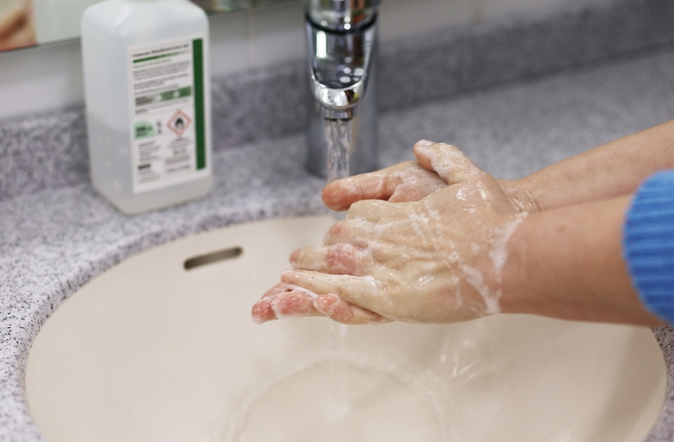
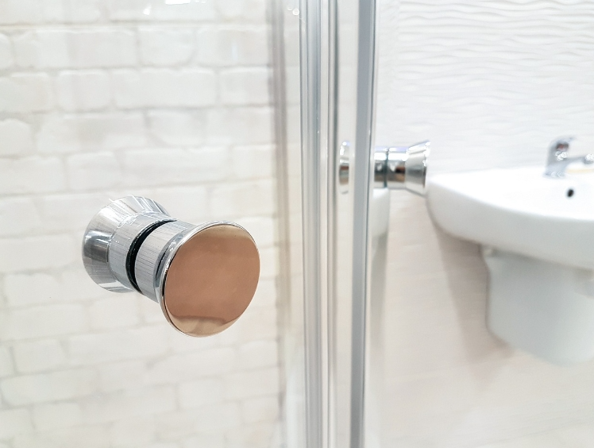

# 公厕里4样东西细菌多到不敢想象，其中洗手液细菌超标600倍

俗话说人有三急，出门在外，上厕所这件事最拖不得。这时候，公共厕所就是我们不得不去的地方。

但再着急，笔者劝你最好别碰公共厕所里的4样东西，因为它们的细菌多到你不敢想象！

另外，上厕所也有许多讲究，例如如厕中途该不该冲水？蹲厕和马桶坐便到底选哪个更卫生？今天是世界厕所日，我们来一起了解这些知识。

**这4样东西，细菌多到不敢想象**

**1、公共厕所里的洗手液**

很多人在上完公共厕所之后，会使用洗手台上的洗手液洗手，但他们不知道，公共洗手台上的洗手液可能细菌超标非常严重，央视财经《是真的吗》栏目曾做过一次“公共场所洗手液调查”，该调查显示：包括首都机场在内的一些公共场所，
**洗手液细菌超标 600 倍！**

用这种洗手液来洗手，不仅越洗越脏，还会增加使用者感染细菌的风险，尤其是对于那些免疫系统较弱的人群，如儿童、老年人和患有其他疾病的人，以及手上有创伤口的人，可能会增加脓感染、败血症、菌毒血症的风险，严重时甚至会危及生命。

_图片来源：pixabay_

为什么公共厕所的洗手液会细菌严重超标？原因是多方面的。

一是，有很多洗手液都是后期灌装进去的，装洗手液的容器本身可能很少得到清洁和消毒，灌装洗手液的过程中又会带进去一些微生物，加上一些洗手液久用不完，过期了，消毒和杀菌效果都会降低，这些情况都会致使微生物在洗手液内大肆滋生。

二是，洗手液本身含有大量的营养物质，放置久了之后，会出现起泡、油水分离等现象，加速微生物繁殖的速度。如果遇到的是掺水的洗手液，微生物在被稀释的洗手液中更容易繁殖。

三是，有些公共厕所的卫生条件不够理想，比如空气中细菌超标，洗手液以及装洗手液的容器在使用过程中也会遭到污染，这又给微生物的滋生提供了环境。

**建议：**
在使用洗手液之前，大家可以先观察，避免使用看上去不对劲、有异味的洗手液。也建议大家尽量不使用公共厕所的洗手液，直接用流动的清水多冲洗手部即可。也可以随身携带几片独立包装的含75%酒精的消毒湿巾，用它来代替洗手液。

**2、公共厕所里的烘干机**

烘干机也是我们在公共厕所里常用的东西，它通常也比较脏。

**烘干机会“吸入”公共厕所空间内的细菌和病毒，**
包括耐药性金黄色葡萄球菌、诺如病毒、大肠杆菌、链球菌等，这些细菌和病毒主要来自于粪便、尿液和呕吐物，它们被“吸入”烘干机后，再通过气流喷射到刚洗净的手上以及口、鼻、眼等处，以及随着气流的扩散，进入到整个环境中，变成扩散致病微生物的罪魁祸首。

**建议：尽量不要使用公共厕所的烘干机，**
平时可以随身携带几片独立包装的干纸巾，洗净手之后用它擦手，或者洗净手迅速离开公共厕所，去相对干净环境中晾干手，以减少感染致病微生物的风险。

**3、公共卫生间的门把手和冲厕按钮**

公共厕所既有大门，每一个卫生小隔间也都装了小门，隔间内也有冲厕按钮，这些门把手和冲厕按钮也都是被细菌污染和传播细菌的重地。

原因也有两个方面：首先是小隔间的门把手和冲厕按钮离马桶和蹲坑非常近，如厕后冲厕时被喷溅到空气中的水雾，常常含有大肠杆菌、金黄色葡萄球菌等致病细菌，“近水楼台先得月”，于是隔间内的门把手和冲厕按钮肯定会沾染上不少。

其次，每一个人进隔间前后，都要摸门把手；上完厕所之后，还要按冲厕按钮。人的手上可能也沾染了包括大肠杆菌、金黄色葡萄球菌等致病细菌。一个人摸完之后，另一个人再摸，这样一来，门把手和冲厕按钮也成了传播细菌的中转站。

_图片来源：pixabay_

**建议：** 不要直接用手摸门把手和冲厕按钮，可以在手上垫一张纸，再间接地接触它们；或者先用
75%酒精的消毒湿巾将它们擦拭干净，再用手进行接触，保证其干净卫生。

**公厕蹲坑和马桶哪个更卫生？坐马桶是否会传染疾病？**

现在，酒店和商场里的公共厕所大多采用的是马桶。但不少人认为，采用蹲厕会比采用马桶更加干净卫生。他们觉得，蹲厕便器不会直接接触到自己的屁股和大腿处皮肤。而马桶圈被很多人坐过，一是不干净，二是担心会传染性病。

当不得不使用马桶坐便时，大家也会使出各种绝招来应对。

有人会在马桶的垫圈上铺好公共厕所提供的一次性垫纸；有人一把扯下六张卫生纸，在垫圈的左右两边各铺两张，前面铺一张，水里再扔一张（往马桶的水里扔一张卫生纸，可以有效防止水花溅起）；还有人趁机挑战“半蹲神功”，撅着屁股上厕所；更有甚者，干脆双脚踩在马桶上，把马桶活生生当成蹲坑来使用。

那么，公共厕所的蹲坑和马桶哪个细菌更多？马桶真的会传染性病吗？

**蹲坑是比马桶坐便更卫生的如厕方式**

首先可以肯定的是，如果仅仅从卫生角度考虑， **蹲坑肯定是比马桶更卫生**
的如厕方式。因为公共厕所里的很多马桶垫圈看上去都脏兮兮的，卫生状况堪忧，而蹲坑时便器不会接触到皮肤，所以相对安全一些。但当考虑到年龄、身体等其他因素时，一些人群如小孩、老人、身有残疾或身体比较虚弱的人，有时是不太适合使用蹲坑的。

**建议：** 如果必须使用马桶的话，笔者建议最好先用
75%酒精的消毒纸巾擦干净马桶圈，或者在马桶坐圈上铺一次性垫纸或卫生纸（最好是自带独立包装的一次性垫纸或卫生纸，而不是采用公共厕所提供的，因为后者在吸收了空气中带有病原体的水雾之后，也可能会变成一个天然的细菌培养皿），这些都是不错的方法。

总之 **尽量不要让裸露的皮肤直接坐在马桶圈上。**
当然更不要踩在马桶圈上，不仅是因为踩脏了马桶圈，会给后来者带来更不好的使用感受，更是因为这个姿势难度太大，有摔倒的风险，也有踩坏马桶的风险。

_图片来源：pixabay_

**使用公用马桶一般也不会传播性病**

至于大家都关心的，公共厕所的马桶是否会传播性病的问题，答案是基本上不会。性病（淋病、梅毒、尖锐湿疣等）之所以叫性病，就是因为它是一类必须通过性交行为或血液或母婴才能传播的疾病。

**到目前为止，没有任何可靠的证据证明性病能够以公共厕所的马桶为中介进行人际间的传播，**
这是因为引起性病的绝大部分致病病原体都无法脱离人体而独立存活，它们来到空气中后，基本上瞬间就会死掉。

即使是生存能力最强的引发尖锐湿疣和宫颈癌的 HPV
病毒，要想通过公用马桶的垫圈传播，需要满足三个条件：首先，病原体要足够多，一个人坐的马桶刚刚被一个尖锐湿疣患者坐过；其次，这个人的皮肤要在同一位置出现破损，病毒才能钻进去；同时，此人抵抗力要足够低下，比如患有一些重大疾病，或者长期服用抑制免疫系统的药物。可以说，同时满足这三个条件的难度十分巨大。

当然，也不是说马桶圈上没有任何细菌，只是这些细菌都是常见的皮肤微生物。人的皮肤是天然的保护屏障，在公共厕所里的微生物很难因为直接接触屁股和大腿上的皮肤而感染我们。除非你的手摸了这些微生物，又把手塞进口、鼻、眼、阴道、肛门等地方。

**公厕如厕小贴士**

**1、尽量不要中途冲厕所。**
因为各类致病病原体可能会随着冲马桶时溅起的水雾，扩散到空气中，再经由口、鼻、眼进入体内。我们建议在如厕完毕、整理好衣服之后，盖上马桶盖，再冲水，这是比较安全的做法。

**2、便后一定要洗干净手。**
洗手是预防各类消化道传染病的最好的方法，而且最好在自来水龙头之下，用流动的水冲洗干净。如果没有自备洗手液，那就用清水冲洗。洗手一定要洗够 60
秒时间，因为时间过短的话，细菌和病毒还会残留在手上。洗完之后，建议用自备的干净纸巾擦干双手。

**策划制作**

作者丨曾心月 科普作者

审核丨张宇 中国疾病预防控制中心研究员

策划丨钟艳平

责编丨钟艳平

