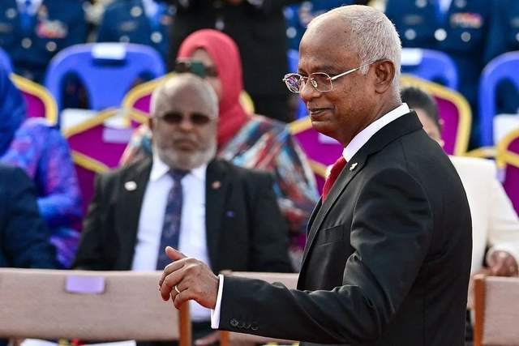

# 就任马尔代夫总统第二天，他为何立即要求印度撤军？媒体解读

11月18日，穆伊兹就任马尔代夫第八任总统的第二天，正式向印度政府提出“撤军”要求。这指向的不仅是常驻马尔代夫军港的75人印度小部队，更是1988年以来印度在马尔代夫持续驻军的历史。但是，这是否真的意味着马尔代夫和印度的长期特殊关系会走向终结？

_11月17日，马尔代夫当选总统穆伊兹宣读就职誓言。图/视觉中国_

2008年，执政30年的马尔代夫总统加尧姆在选举中落败，马尔代夫政治进入政党轮替的新时代。此后，马尔代夫与印度的关系，就成为政坛两大阵营对决的关键议程。1988年印度为帮助加尧姆平息政变开始的驻军历史，更是焦点。

2013年到2018年期间执政的总统亚明，曾要求印度减少在马尔代夫的驻军，并通过加入“一带一路”倡议等方式，积极拓展和其他世界主要国家的经贸关系。而2018年到2023年担任马尔代夫总统的萨利赫，则以“印度优先”（India
first）为基本国策，试图“修复”被亚明“破坏”的马尔代夫-印度关系。

在萨利赫任内，印度不仅通过援助装备、建设军事设施等方式加强了在马尔代夫的军事存在，还和马尔代夫签署了从支持海上互联互通到投资信贷在内的多项双边协议，涉及援助及贷款总额超过10亿美元。在新冠疫情的影响下，自2020年开始，印度也超过中国和欧美，成为马尔代夫最大的游客来源国。考虑到旅游业收入占马尔代夫国内生产总值的四分之一，这意味着双方的关系已经全面深化到了“新阶段”。

从马尔代夫国内舆论看，马民众对于印度的经济援助意见不大，但对于萨利赫时期印度“军事存在”的加强深感担忧。到2023年选举前，印度已经同时承担了马尔代夫新军港、新造船厂、新国防部大楼、新训练基地和新警察学院的建设，一些民间传言认为这意味着印度将增加在马尔代夫的驻军。

在此背景下，前总统亚明的政治盟友、反对党领袖穆伊兹发起“印度撤军运动”，成功赢得选举，成为马尔代夫第八任总统。半岛电视台写道，这次选举其实就是一次对印度驻军问题的“公投”。而穆伊兹就职之后第一时间要求印度撤军，则是兑现自己的选举承诺。

但是，提出撤军容易，真正撤军不易。马尔代夫人口只有52万，拥有1200多个岛屿，超过90万平方公里的群岛海域和专属经济区的管辖权。无论是向偏远岛屿运送物资、进行医疗援助和应急救援、管理非法捕鱼，还是打击贩毒，马政府自身都缺乏能力。因此，长期以来，印度都是马尔代夫的主要安全伙伴。

以目前舆论聚焦的75人印军小队为例，他们的主要任务是帮助马尔代夫军警飞行和维护三架小型飞机及直升机。过去5年，这些飞机执行了500多次医疗援助任务。

穆伊兹在11月18日会见印度部长时也承认这一点。于是，在他提出撤军要求的同时，双方“同意将讨论通过这些平台继续合作的可行解决方案”。外媒报道称，所谓“可行方案”可能是由印度方面培训马尔代夫国防军人员，分阶段替换印度军人，也可能是印度飞行员及地勤人员以非军事的名义继续驻扎。

有分析认为，穆伊兹确有诚意推动“印度撤军”。他被称为马尔代夫的“基建狂人”，曾推动著名的中马友谊大桥等基础设施建设项目落地。因此，对于马尔代夫的经济发展，他有自己的一套见解，包括建设经济特区、吸引外国投资、使旅游业收入翻番等。实现这些目标需要更多世界主要国家的参与。

11月18日，穆伊兹在总统府会见出席总统就职仪式的习近平主席特使、国务委员谌贻琴时，就明确表示，马新政府坚定奉行一个中国原则，积极致力于同中方加强共建“一带一路”和各领域务实合作，期待同中方携手努力，开启马中关系新篇章。

但是，穆伊兹的“亲马尔代夫”（pro-
Maldives）新政能否顺利实施，还取决于他将如何保持和印度的距离。印度在马尔代夫的军事存在远不止于驻军。印度援助的国防建设项目是否还继续进行？军警培训是否还邀请印方？马尔代夫军队的沿海雷达系统由印度提供，未来是否仍需要印方维护？印度正在帮助马尔代夫进行大规模水文调查，该工作是否会由更多国家参与？这些问题都值得观察。

另一方面，印度政策界也在反思与马尔代夫的关系。马尔代夫政坛两翼，一方希望维持和印度的特殊关系，一方追求更独立和平衡的外交安全战略，但都支持与印度的伙伴关系。而长期以来，印度没有对马尔代夫军警进行飞机及直升机操作培训，以维持75人小部队存在的必要性。据马尔代夫智库测算，印度政府去年承诺的5亿美元援助目前只有1700万到位。在穆伊兹改变对印政策后，印度仅派出地球科学部长而非以往的总理级官员出席穆伊兹的就职典礼。

有不愿具名的官员对媒体表示，“新德里不信任周边国家，因此总是试图施加压力，甚至进行‘微操’，这让当地人感到不安。”莫迪政府民族主义色彩日趋浓厚的政策，也影响了和伊斯兰教国家马尔代夫的关系。目前，印度和尼泊尔、斯里兰卡等国的关系也有紧张迹象。

“将每个小国作为独立的主权国家来尊重，而不是将它们视为‘印度联邦’中的一员，可能是印度和周边国家关系的答案。”《日本经济新闻》评论称。

记者：曹然

编辑：徐方清

